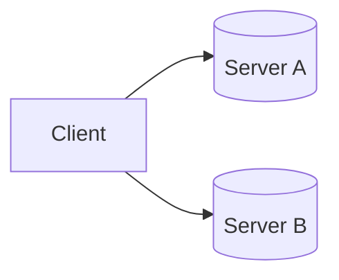
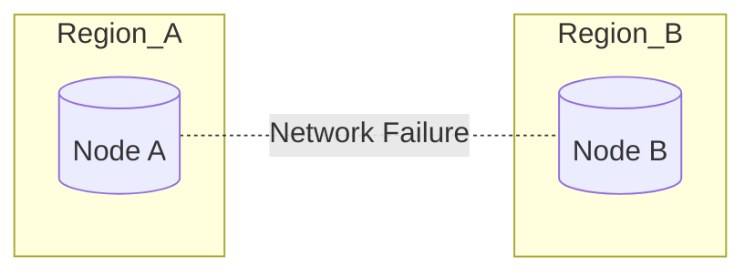

# CAP Theorem

> *"CAP Theorem is probably the most misunderstood concept in distributed systems. Most engineers can recite its definition, but very few understand why it exists, when it applies, and how it influences real production systems."*

---

# Table of Contents

1. Why CAP Theorem Exists
2. History
3. The Distributed Systems Problem
4. Single Machine vs Distributed System
5. What is a Network Partition?
6. The Three Properties
7. The CAP Triangle
8. Common Misconceptions
9. Real Production Examples
10. Summary

---

# Why This Chapter Matters

During almost every Principal Engineer interview, one of these questions eventually appears.

- Explain CAP Theorem.
- Why is Cassandra AP?
- Why is ZooKeeper CP?
- Why isn't PostgreSQL discussed using CAP?
- Does Google Spanner violate CAP?
- Can we build a CA system?
- What happens during a network partition?

Most candidates answer with a memorized sentence.

> "CAP says you can choose only two."

Unfortunately...

That sentence is wrong.

Understanding why it is wrong immediately differentiates a Principal Engineer from a Senior Engineer.

---

# Learning Objectives

After completing this chapter you should be able to:

- Explain why CAP exists.
- Explain network partitions.
- Understand why CAP only applies during partitions.
- Classify databases correctly.
- Explain business trade-offs.
- Answer advanced interview follow-up questions.

---

# History

CAP was introduced by **Eric Brewer** in 2000 during the ACM Symposium on Principles of Distributed Computing (PODC).

Brewer observed that distributed systems inevitably face a difficult choice when communication between machines fails.

In 2002, **Gilbert and Lynch** formally proved Brewer's observation mathematically.

Therefore,

Strictly speaking,

Brewer proposed it.

Gilbert & Lynch proved it.

Interviewers love this distinction.

---

# Before Understanding CAP...

Forget databases.

Forget Kafka.

Forget Redis.

Forget Cassandra.

Let's imagine something much simpler.

---

# A Single Machine

Suppose we have one server.

```text
+------------------+
|     Server       |
|                  |
|  CPU             |
|  Memory          |
|  Disk            |
+------------------+
```

Client writes

```
Balance = ₹1000
```

Client reads

```
Balance

↓

₹1000
```

Simple.

There is no ambiguity.

No replication.

No synchronization.

No distributed consensus.

Life is easy.

---

# Adding a Second Machine

Now suppose the business grows.

One server is no longer sufficient.

We introduce another server.



Now we have a distributed system.

Immediately new questions appear.

---

# Problem 1

User writes

```
₹1000

↓

Server A
```

But reads from

```
Server B
```

What if

Server B

still has

```
₹900 ?
```

Which value should be returned?

---

# Problem 2

Suppose Server A crashes.

Can Server B continue serving requests?

Hopefully yes.

But...

Is its data completely up-to-date?

---

# Problem 3

Suppose both servers are healthy...

But...

The network cable between them breaks.

```
Server A

X

Server B
```

Now neither server can communicate.

What should happen?

This single question gives birth to CAP Theorem.

---

# The Real Problem

CAP is **not** about databases.

It is **not** about SQL vs NoSQL.

It is **not** about distributed caches.

It is about one unavoidable fact:

> Machines communicate over unreliable networks.

Networks fail.

Packets drop.

Switches fail.

Routers fail.

DNS fails.

Availability Zones become isolated.

Regions become disconnected.

Every distributed system must decide what to do when communication breaks.

---

# Understanding a Network Partition

A network partition means:

Two or more nodes are alive,

but they cannot communicate with each other.



Notice carefully:

Both nodes are healthy.

Only the network failed.

This distinction is extremely important.

---

# Why Network Partitions Are Inevitable

Many engineers assume network partitions are rare.

Reality says otherwise.

Examples:

- Switch failure
- Router failure
- DNS outage
- Fiber cut
- Cloud Availability Zone isolation
- Firewall misconfiguration
- Network congestion
- BGP routing failure

Large companies experience network issues regularly.

Therefore,

CAP is not a theoretical concept.

It is a practical engineering reality.

---

# Introducing the Three Properties

Now we can define the three properties.

## Consistency (C)

Every successful read returns the latest successfully written value.

Example

```
Write

↓

100

↓

Read

↓

100
```

Never

```
Write

↓

100

↓

Read

↓

90
```

---

## Availability (A)

Every request receives a response.

The response may or may not contain the latest data.

The important point is:

The system never hangs indefinitely.

---

## Partition Tolerance (P)

The system continues operating even when network communication between nodes fails.

Notice something important.

Modern distributed systems cannot simply disable partition tolerance.

Cloud environments assume network failures will happen.

Therefore,

Partition tolerance is effectively mandatory.

---

# The CAP Triangle

```text
           Consistency
                ▲
               / \
              /   \
             /     \
            /       \
 Availability ----- Partition
```

One of the three properties becomes constrained during a partition.

The important phrase is:

**during a partition.**

This is where most interview candidates make mistakes.

---

# Biggest Interview Myth

You will often hear:

> CAP means choose any two.

This is incorrect.

The correct statement is:

> When a network partition occurs, a distributed system must choose between consistency and availability.

Partition tolerance is not optional for real distributed systems.

---

# Key Takeaways

- CAP only applies to distributed systems.
- CAP only becomes relevant when communication between nodes fails.
- Network partitions are inevitable.
- Modern cloud systems must tolerate partitions.
- During a partition, systems must choose between consistency and availability.
- "Choose any two" is an oversimplification and often leads to incorrect reasoning.

---
