# CAP Theorem

> *"CAP Theorem is probably the most misunderstood concept in distributed systems. Most engineers can recite its definition, but very few understand why it exists, when it applies, and how it influences real production systems."*

---

# Table of Contents

1. Why CAP Theorem Exists
2. History
3. The Distributed Systems Problem
4. Single Machine vs Distributed System
5. What is a Network Partition?
6. The Three Properties
7. The CAP Triangle
8. Common Misconceptions
9. Real Production Examples
10. Summary

---

# Why This Chapter Matters

During almost every Principal Engineer interview, one of these questions eventually appears.

- Explain CAP Theorem.
- Why is Cassandra AP?
- Why is ZooKeeper CP?
- Why isn't PostgreSQL discussed using CAP?
- Does Google Spanner violate CAP?
- Can we build a CA system?
- What happens during a network partition?

Most candidates answer with a memorized sentence.

> "CAP says you can choose only two."

Unfortunately...

That sentence is wrong.

Understanding why it is wrong immediately differentiates a Principal Engineer from a Senior Engineer.

---

# Learning Objectives

After completing this chapter you should be able to:

- Explain why CAP exists.
- Explain network partitions.
- Understand why CAP only applies during partitions.
- Classify databases correctly.
- Explain business trade-offs.
- Answer advanced interview follow-up questions.

---

# History

CAP was introduced by **Eric Brewer** in 2000 during the ACM Symposium on Principles of Distributed Computing (PODC).

Brewer observed that distributed systems inevitably face a difficult choice when communication between machines fails.

In 2002, **Gilbert and Lynch** formally proved Brewer's observation mathematically.

Therefore,

Strictly speaking,

Brewer proposed it.

Gilbert & Lynch proved it.

Interviewers love this distinction.

---

# Before Understanding CAP...

Forget databases.

Forget Kafka.

Forget Redis.

Forget Cassandra.

Let's imagine something much simpler.

---

# A Single Machine

Suppose we have one server.

```text
+------------------+
|     Server       |
|                  |
|  CPU             |
|  Memory          |
|  Disk            |
+------------------+
```

Client writes

```
Balance = ₹1000
```

Client reads

```
Balance

↓

₹1000
```

Simple.

There is no ambiguity.

No replication.

No synchronization.

No distributed consensus.

Life is easy.

---

# Adding a Second Machine

Now suppose the business grows.

One server is no longer sufficient.

We introduce another server.

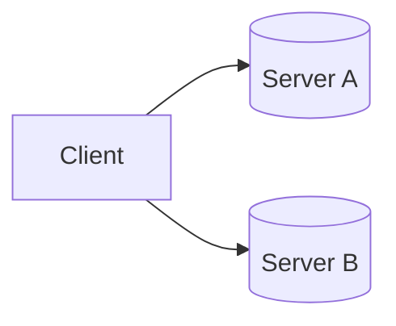

Now we have a distributed system.

Immediately new questions appear.

---

# Problem 1

User writes

```
₹1000

↓

Server A
```

But reads from

```
Server B
```

What if

Server B

still has

```
₹900 ?
```

Which value should be returned?

---

# Problem 2

Suppose Server A crashes.

Can Server B continue serving requests?

Hopefully yes.

But...

Is its data completely up-to-date?

---

# Problem 3

Suppose both servers are healthy...

But...

The network cable between them breaks.

```
Server A

X

Server B
```

Now neither server can communicate.

What should happen?

This single question gives birth to CAP Theorem.

---

# The Real Problem

CAP is **not** about databases.

It is **not** about SQL vs NoSQL.

It is **not** about distributed caches.

It is about one unavoidable fact:

> Machines communicate over unreliable networks.

Networks fail.

Packets drop.

Switches fail.

Routers fail.

DNS fails.

Availability Zones become isolated.

Regions become disconnected.

Every distributed system must decide what to do when communication breaks.

---

# Understanding a Network Partition

A network partition means:

Two or more nodes are alive,

but they cannot communicate with each other.

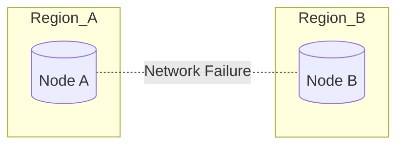

Notice carefully:

Both nodes are healthy.

Only the network failed.

This distinction is extremely important.

---

# Why Network Partitions Are Inevitable

Many engineers assume network partitions are rare.

Reality says otherwise.

Examples:

- Switch failure
- Router failure
- DNS outage
- Fiber cut
- Cloud Availability Zone isolation
- Firewall misconfiguration
- Network congestion
- BGP routing failure

Large companies experience network issues regularly.

Therefore,

CAP is not a theoretical concept.

It is a practical engineering reality.

---

# Introducing the Three Properties

Now we can define the three properties.

## Consistency (C)

Every successful read returns the latest successfully written value.

Example

```
Write

↓

100

↓

Read

↓

100
```

Never

```
Write

↓

100

↓

Read

↓

90
```

---

## Availability (A)

Every request receives a response.

The response may or may not contain the latest data.

The important point is:

The system never hangs indefinitely.

---

## Partition Tolerance (P)

The system continues operating even when network communication between nodes fails.

Notice something important.

Modern distributed systems cannot simply disable partition tolerance.

Cloud environments assume network failures will happen.

Therefore,

Partition tolerance is effectively mandatory.

---

# The CAP Triangle

```text
           Consistency
                ▲
               / \
              /   \
             /     \
            /       \
 Availability ----- Partition
```

One of the three properties becomes constrained during a partition.

The important phrase is:

**during a partition.**

This is where most interview candidates make mistakes.

---

# Biggest Interview Myth

You will often hear:

> CAP means choose any two.

This is incorrect.

The correct statement is:

> When a network partition occurs, a distributed system must choose between consistency and availability.

Partition tolerance is not optional for real distributed systems.

---

# Key Takeaways

- CAP only applies to distributed systems.
- CAP only becomes relevant when communication between nodes fails.
- Network partitions are inevitable.
- Modern cloud systems must tolerate partitions.
- During a partition, systems must choose between consistency and availability.
- "Choose any two" is an oversimplification and often leads to incorrect reasoning.

---


---

# Deep Dive into the Three Properties

Now that we understand why CAP exists, let's study each property in depth.

Remember:

CAP is **not** about choosing technologies.

It is about deciding **how the system behaves during a network partition**.

---

# Consistency (C)

Consistency means:

> Every read returns the **most recent successful write**, regardless of which replica serves the request.

Imagine two replicas.

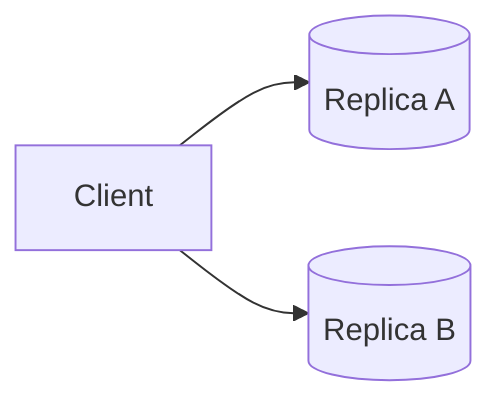

Current value

```
Balance = ₹1000
```

User updates

```
₹1500
```

Write reaches

```
Replica A

Replica B
```

Both replicas now store

```
₹1500
```

Later,

the client reads from **either** replica.

Expected result

```
₹1500
```

Never

```
₹1000
```

That is consistency.

---

## Why Consistency Is Important

Some systems simply cannot tolerate stale data.

Examples:

### Banking

```
Transfer

↓

Balance Updated

↓

Customer Refreshes

↓

Old Balance?
```

Impossible.

---

### Stock Trading

Imagine buying shares.

```
100 shares

↓

Order Executed

↓

Portfolio Shows

0 shares
```

Completely unacceptable.

---

### Airline Seat Booking

```
Seat 12A

↓

Booked

↓

Another passenger also books Seat 12A
```

Strong consistency prevents this.

---

# Availability (A)

Availability means:

Every request receives a response.

Notice something important.

Availability **does not** guarantee correctness.

It guarantees **a response**.

Example

```
Client

↓

Read Balance

↓

Response

↓

₹900
```

Even if

```
Latest Value

=

₹1000
```

the system is still considered available because it responded.

---

## Why Availability Matters

Imagine Instagram.

One data center becomes isolated.

Users would rather see

```
999 Likes
```

instead of

```
Error 500
```

Availability is more valuable than perfectly accurate counts.

---

Examples where availability is critical

- Social Media
- DNS
- Search
- Product Catalog
- Video Streaming

---

# Partition Tolerance (P)

This is the property most candidates misunderstand.

Partition tolerance means:

The system continues operating even when communication between replicas fails.

Suppose

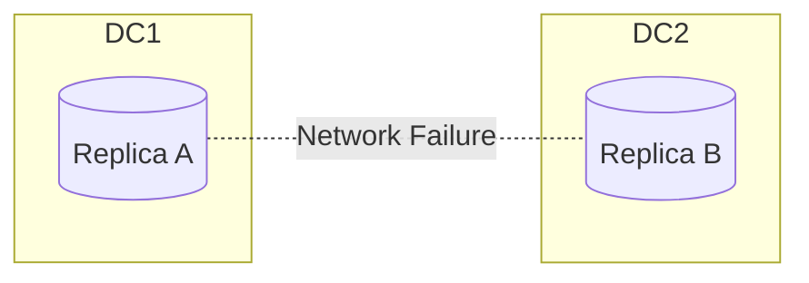

Both replicas are alive.

The network is not.

What now?

---

Option 1

Stop processing requests.

Users receive errors.

System remains consistent.

---

Option 2

Continue processing independently.

Users receive responses.

Some replicas may temporarily disagree.

---

That decision defines whether the system behaves as CP or AP.

---

# Why Partition Tolerance Is Mandatory

Many interview candidates ask:

> Why don't we simply choose CA?

Because in real distributed systems,

you **cannot disable network failures**.

Cloud providers experience:

- Fiber cuts
- Router failures
- BGP issues
- AZ outages
- Packet loss
- Congestion
- Firewall mistakes

Ignoring partitions doesn't eliminate them.

Therefore,

modern distributed systems always assume partitions will happen.

---

# Interactive Example

Suppose we have two replicas.

```
Replica A

₹1000
```

```
Replica B

₹1000
```

A client writes

```
₹1500
```

Immediately afterward,

the network cable breaks.

```
Replica A

X

Replica B
```

Now another client sends

```
Read Balance
```

to Replica B.

Replica B still contains

```
₹1000
```

What should Replica B do?

Option A

Return

```
₹1000
```

System remains available.

Data is stale.

---

Option B

Reject the request.

Wait until communication is restored.

System remains consistent.

Availability is reduced.

This is the essence of CAP.

---

# Mental Model

Think of two bank employees working in different branches.

Normally,

they constantly synchronize customer balances.

Now the phone connection between branches is lost.

Customer arrives at Branch B asking for the latest balance.

Branch B has two choices.

Choice 1

Answer using its local information.

Fast.

Possibly stale.

---

Choice 2

Refuse the request until communication is restored.

Accurate.

Unavailable.

Exactly the same dilemma exists in distributed databases.

---

# Common Misconceptions

## Misconception 1

> Consistency means ACID consistency.

Incorrect.

CAP consistency refers to **replica visibility**, not SQL transaction isolation.

---

## Misconception 2

> Availability means zero downtime.

Incorrect.

Availability simply means every request receives a response.

---

## Misconception 3

> Partition tolerance is optional.

Incorrect.

For distributed systems,

partition tolerance is assumed.

The real decision is:

```
Consistency

or

Availability

during the partition.
```

---

# Principal Engineer Interview Answer

Interviewer

Explain CAP theorem.

Weak Answer

> We can choose only two out of three.

Principal Engineer Answer

> CAP applies only to distributed systems and becomes relevant only during a network partition. Since network partitions are unavoidable in modern distributed environments, partition tolerance is effectively mandatory. The real engineering decision is whether the system should preserve consistency by rejecting requests or preserve availability by serving potentially stale data until the partition is resolved.

That answer immediately signals deep understanding.

---

# Key Takeaways

- Consistency means every successful read observes the latest successful write.
- Availability means every request receives a response.
- Partition tolerance means the system continues operating despite communication failures.
- During a partition, systems must choose between consistency and availability.
- CAP is about engineering trade-offs—not technology branding.

---

# CP vs AP Systems

> [!IMPORTANT]
> CAP is **not about normal operation**.
>
> It is about **how a distributed system behaves when a network partition occurs.**

---

# Mental Model

Suppose we have two replicas.

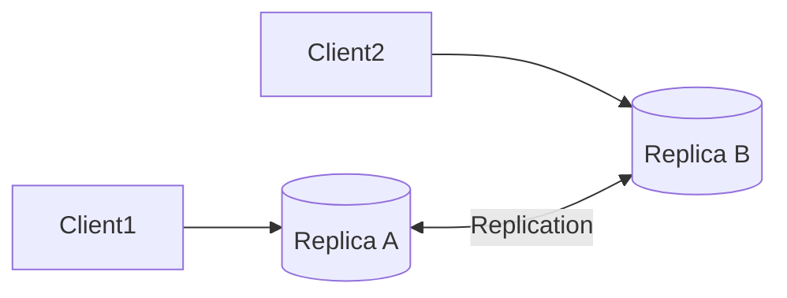

Normally everything works.

Both replicas synchronize continuously.

Now imagine the network cable breaks.

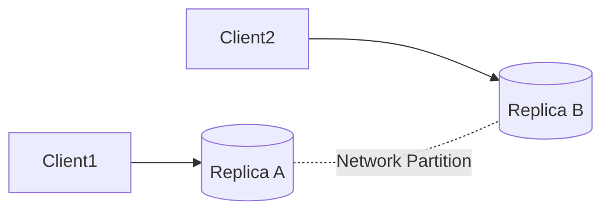

Both servers are alive.

Only communication is broken.

The system now faces a difficult decision.

---

# The Fundamental Question

Suppose the client writes

```
Balance = ₹5000
```

to Replica A.

Immediately afterwards,

another client reads from Replica B.

Replica B still has

```
Balance = ₹4000
```

Should Replica B

```
Return ₹4000?

or

Reject the request?
```

This decision separates CP from AP systems.

---

# CP Systems

CP stands for

```
Consistency

+

Partition Tolerance
```

During a partition,

the system sacrifices

```
Availability
```

to preserve

```
Consistency.
```

---

## Behavior

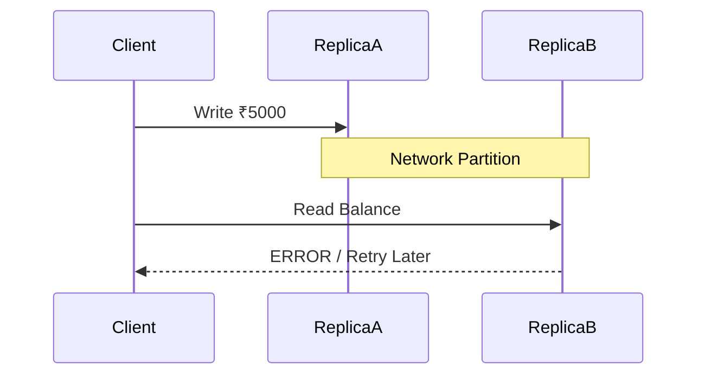

Replica B refuses to answer.

Why?

Because it cannot guarantee the latest value.

---

> [!TIP]
> A CP system would rather return **no answer** than return the **wrong answer**.

---

# Real Example

Imagine an ATM.

You transfer

```
₹10,000
```

Immediately afterwards

another ATM asks

```
Current Balance?
```

Suppose communication with the primary database is lost.

Would you rather

Option A

```
Show an old balance.
```

or

Option B

```
Temporarily reject the request.
```

Banks choose

Option B.

Correctness is more important than availability.

---

# Characteristics of CP Systems

Advantages

- Strong consistency
- No stale reads
- Easier reasoning
- Better transactional guarantees

Disadvantages

- Requests may fail during partitions
- Reduced availability
- Higher latency

---

## Examples

| System | Why CP? |
|----------|----------|
| ZooKeeper | Leader-based coordination |
| etcd | Raft consensus |
| HBase | Strong consistency |
| Google Chubby | Distributed lock service |

---

# AP Systems

AP stands for

```
Availability

+

Partition Tolerance
```

During a partition,

the system sacrifices

```
Immediate Consistency
```

to remain

```
Available.
```

---

## Behavior

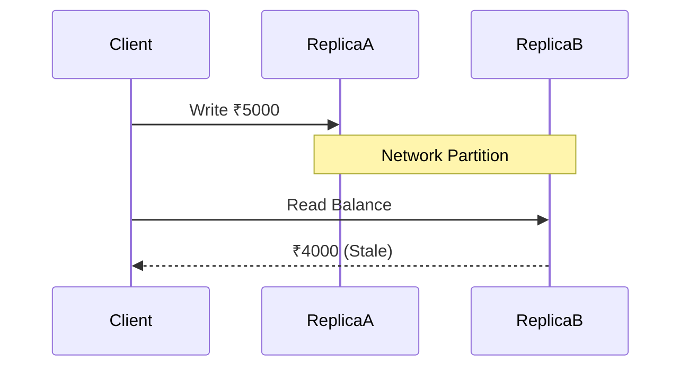

Replica B responds immediately,

even though its data is outdated.

---

> [!TIP]
> An AP system would rather return **stale data** than **no data**.

---

# Real Example

Instagram Likes

User A

likes a photo.

Replica A updates immediately.

Replica B hasn't received the update.

Another user refreshes.

```
Likes

999

instead of

1000
```

Is this acceptable?

Yes.

Users prefer seeing

```
999 Likes
```

instead of

```
500 Internal Server Error.
```

Availability wins.

---

# Characteristics of AP Systems

Advantages

- High availability
- Low latency
- Better fault tolerance
- Excellent scalability

Disadvantages

- Stale reads
- Conflict resolution
- Eventual consistency

---

## Examples

| System | Why AP? |
|----------|----------|
| Cassandra | Tunable consistency, prioritizes availability |
| DynamoDB | High availability during partitions |
| Riak | Eventually consistent key-value store |
| CouchDB | Multi-master replication |

---

# Side-by-Side Comparison

| Property | CP | AP |
|-----------|----|----|
| Returns Latest Data | ✅ | ❌ |
| Always Responds | ❌ | ✅ |
| Stale Reads | ❌ | ✅ |
| Suitable For | Banking | Social Media |
| Availability During Partition | Lower | Higher |

---

# Interactive Scenario

Imagine you're designing WhatsApp.

A user sends

```
Hello
```

Immediately after,

the network between two regions fails.

Should another user

receive

```
Nothing
```

or

receive the message

slightly later?

Messaging systems often choose

eventual consistency,

combined with retries,

to maximize availability.

---

# Can We Switch Between CP and AP?

Absolutely.

Many modern systems allow configuration.

Example

Cassandra

```
Consistency Level

ONE

QUORUM

ALL
```

Choosing

```
ONE
```

leans toward

Availability.

Choosing

```
ALL
```

leans toward

Consistency.

This is known as

**Tunable Consistency**.

---

> [!NOTE]
> CAP is often discussed as fixed categories (CP vs AP), but many modern databases allow different consistency levels for different operations.

---

# Principal Engineer Insight

> [!IMPORTANT]
> The choice between CP and AP is **not a database decision**.
>
> It is a **business decision**.
>
> Ask:
>
> - Can users tolerate stale data?
> - What is the cost of an incorrect answer?
> - Is temporary unavailability acceptable?
> - Which failure causes more business damage?

Technology follows those answers.

---

# Interview Conversation

**Interviewer**

Why is ZooKeeper considered CP?

**Weak Answer**

> Because it chooses consistency.

**Principal Engineer Answer**

> ZooKeeper uses leader-based consensus. During a network partition, replicas that cannot communicate with the leader refuse client requests rather than risk serving stale or conflicting data. This preserves consistency, but some requests become unavailable until the partition is resolved.

---

# Common Interview Mistakes

> [!WARNING]
> **Mistake #1**
>
> Thinking CP means the system is always consistent.
>
> CP only describes behavior **during a partition**.

---

> [!WARNING]
> **Mistake #2**
>
> Thinking AP databases are "incorrect."
>
> They are intentionally optimized for workloads where temporary inconsistency is acceptable.

---

> [!WARNING]
> **Mistake #3**
>
> Saying "Kafka is AP" or "Redis is CP."
>
> CAP applies to **distributed systems under partition**, not as a simple label for every technology.

---

# Key Takeaways

- CP systems reject requests rather than return stale data.
- AP systems return the best available answer, even if temporarily stale.
- Neither approach is universally better.
- The correct choice depends on business requirements.
- Strong engineers know the definitions.
- Principal Engineers justify the trade-offs.

---

# The Biggest Myth: "Choose Any Two"

> [!WARNING]
> The statement **"CAP means choose any two out of Consistency, Availability and Partition Tolerance"** is incorrect.

Unfortunately, this sentence appears in countless blogs, YouTube videos, and interview guides.

It is an oversimplification that leads to incorrect reasoning.

---

# The Correct Statement

CAP should be stated as follows:

> **If a network partition occurs, a distributed system must choose between Consistency and Availability.**

Notice the difference.

Partition Tolerance is **not** an optional feature in modern distributed systems.

It is assumed.

---

# Why?

Suppose you have two data centers.

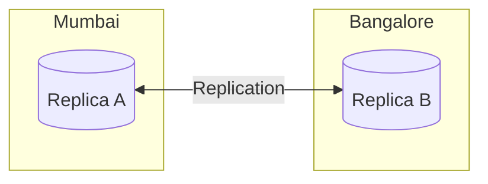

Everything works.

Now imagine the network link fails.

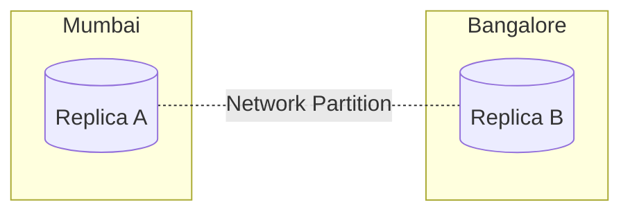

Can your software magically repair the fiber cable?

No.

Can your application force routers to work?

No.

Can your database eliminate packet loss?

No.

Therefore,

Partition Tolerance is **not a choice**.

The only remaining decision is

```
Consistency

or

Availability
```

---

# Why CA Systems Don't Really Exist

This is one of Google's favorite interview traps.

Many candidates answer

```
MySQL

PostgreSQL

Oracle

SQL Server

are CA systems.
```

This answer is incomplete.

---

# Understanding CA

CA means

```
Consistency

+

Availability

without

Partition Tolerance
```

Question

When is that possible?

Answer

Only when network partitions never happen.

---

# Single Machine

Suppose PostgreSQL runs on

one server.

```
Application

↓

PostgreSQL
```

There is no distributed network.

No replication.

No partition.

CAP does not even apply.

This is **not** a CA distributed system.

It is simply

```
Not Distributed.
```

---

# Distributed PostgreSQL

Now suppose

Primary

↓

Replica

```
Primary

↓

Replica
```

Network cable breaks.

What now?

Now CAP applies.

The database must choose

```
Consistency

or

Availability.
```

Therefore,

Distributed PostgreSQL

is no longer "CA."

---

# Important Interview Insight

> [!IMPORTANT]
> CAP only applies to **distributed systems**.
>
> If there is only one node,
> CAP is irrelevant.

This is one of the most misunderstood concepts.

---

# Is MySQL CA?

Interviewer

```
Is MySQL a CA database?
```

Weak Answer

```
Yes.
```

Principal Engineer Answer

```
Standalone MySQL is not a distributed system,
so CAP does not apply.

MySQL with replication becomes a distributed system,
and during a network partition it must make
CP/AP trade-offs depending on replication
configuration and failover strategy.
```

Excellent answer.

---

# Is PostgreSQL CA?

Exactly the same reasoning.

Standalone PostgreSQL

↓

CAP not applicable.

Distributed PostgreSQL

↓

CAP applies.

---

# Does Google Spanner Violate CAP?

One of the most common Google interview questions.

Answer

No.

Spanner does not violate CAP.

Instead,

Google invests enormous engineering effort to reduce the probability and impact of partitions.

Examples

- TrueTime
- GPS clocks
- Atomic clocks
- Paxos
- Synchronous replication

When a partition occurs,

Spanner still obeys CAP.

It may reject requests to preserve consistency.

CAP is never violated.

---

# Does Cassandra Break CAP?

No.

During a partition,

Cassandra prefers

Availability.

Some reads may be stale.

Eventually,

replicas converge.

CAP remains valid.

---

# Does ZooKeeper Break CAP?

No.

ZooKeeper chooses

Consistency.

Followers that cannot reach the leader

stop serving writes.

Availability decreases.

CAP still holds.

---

# Visual Comparison

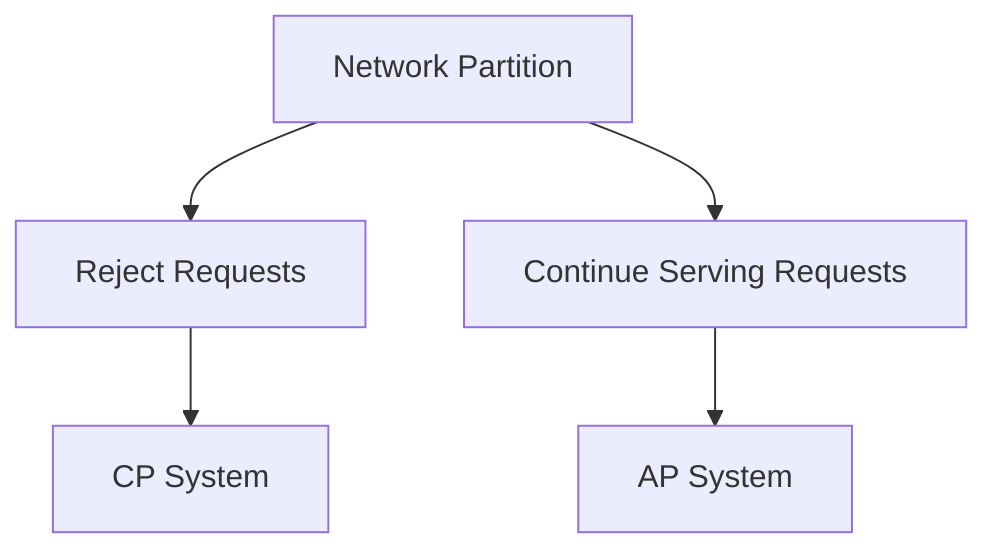

---

# Common Database Classification

| Database | Typical Behavior During Partition |
|-----------|-----------------------------------|
| ZooKeeper | CP |
| etcd | CP |
| Google Chubby | CP |
| HBase | CP |
| Cassandra | AP |
| DynamoDB | AP (configurable consistency) |
| Riak | AP |
| CouchDB | AP |
| Google Spanner | CP-leaning for strongly consistent operations |
| CockroachDB | CP |
| YugabyteDB | CP |

> [!NOTE]
> Some modern databases support multiple consistency levels. Their behavior can vary based on configuration and workload.

---

# Interview Trap #1

Interviewer

```
Can we build a CA distributed database?
```

Principal Engineer

```
No.

If partitions never occur,
the system behaves like CA.

But once a partition occurs,

every distributed database must choose
between consistency and availability.

Therefore,

true CA distributed systems
do not exist in real-world networks.
```

---

# Interview Trap #2

Interviewer

```
Why can't AWS simply eliminate partitions?
```

Principal Engineer

```
Because partitions are caused by physical realities:

- Router failures
- Fiber cuts
- Switch failures
- Packet loss
- BGP issues
- Availability Zone failures

Software cannot eliminate these failures.
It can only decide how to behave when they occur.
```

---

# Interview Trap #3

Interviewer

```
Does CAP matter every day?
```

Excellent Answer

```
No.

CAP becomes relevant only when communication
between distributed nodes is interrupted.

During normal operation,

a distributed database can often provide
both consistency and availability.
```

This distinction is extremely important.

---

# Principal Engineer Insight

> [!IMPORTANT]
> CAP is a **failure model**, not a performance model.

It answers

> "What should the system do when communication between nodes fails?"

It does **not** answer

- Which database is faster
- Which database scales better
- Which database has lower latency

Those are different questions.

---

# Common Mistakes

> [!WARNING]
> Saying "CAP always forces choosing two."

Incorrect.

---

> [!WARNING]
> Calling standalone PostgreSQL a CA distributed database.

Incorrect.

---

> [!WARNING]
> Saying Google Spanner violates CAP.

Incorrect.

---

> [!WARNING]
> Assuming AP means incorrect data.

Incorrect.

The data is temporarily inconsistent.

Eventually,

replicas converge.

---

# Chapter Summary

- CAP only applies to distributed systems.
- Standalone databases are outside CAP's scope.
- Network partitions are unavoidable.
- During a partition, systems must choose between consistency and availability.
- Google Spanner, Cassandra, ZooKeeper, CockroachDB—all obey CAP.
- "Choose any two" is an oversimplification.
- Principal Engineers explain **why** a system chooses CP or AP based on business requirements.

---

# Brewer's Conjecture vs Gilbert & Lynch Proof

One of the most overlooked interview topics is the history of CAP.

Understanding it demonstrates that you know **why** the theorem exists—not just its conclusion.

---

## Eric Brewer (2000)

In 2000, Eric Brewer presented an observation during the ACM Symposium on Principles of Distributed Computing (PODC).

His observation was:

> A distributed shared-data system cannot simultaneously guarantee consistency, availability, and partition tolerance during network failures.

At this stage, it was only an engineering conjecture.

---

## Gilbert & Lynch (2002)

Two years later,

Seth Gilbert and Nancy Lynch formally proved Brewer's conjecture mathematically.

This proof established CAP as a theorem.

---

> [!TIP]
> Interview Tip:
>
> Eric Brewer proposed CAP.
>
> Gilbert & Lynch proved CAP.

Interviewers occasionally ask this to distinguish candidates who have studied the original work.

---

# Why CAP Does NOT Matter During Normal Operation

This is another frequently misunderstood point.

Suppose there are no network failures.

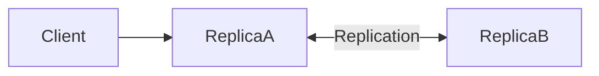

Everything works normally.

Reads are consistent.

Writes succeed.

Requests receive responses.

There is no conflict between consistency and availability.

CAP imposes no restriction.

---

Now suppose communication fails.

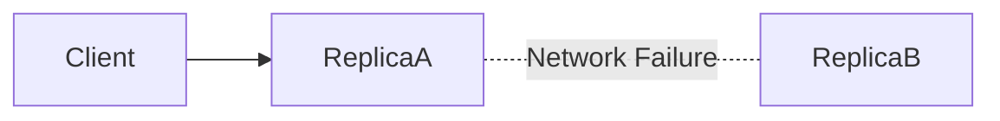

Now the system must decide:

- Reject requests (Consistency)
- Continue serving requests (Availability)

CAP becomes relevant only now.

---

# CAP vs Performance

Many engineers confuse CAP with performance.

They are unrelated.

| Concern | Example |
|----------|----------|
| CAP | Consistency vs Availability during partitions |
| Performance | Latency, throughput, CPU usage |
| Scalability | Handling increased load |
| Reliability | Recovering from failures |

CAP says nothing about:

- Query speed
- Database performance
- Cache hit ratio
- CPU utilization

---

# CAP Decision Tree

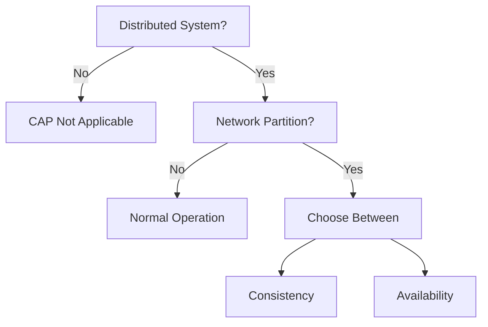

---

# Production Case Studies

## Banking System

Requirements

- No stale balances
- No double withdrawal
- Strong correctness

Decision

```
Consistency

>

Availability
```

Prefer CP.

---

## Social Media Feed

Requirements

- Low latency
- High availability
- Temporary stale data acceptable

Decision

```
Availability

>

Consistency
```

Prefer AP.

---

## DNS

Requirements

- Always respond
- Temporary stale entries acceptable

Decision

AP

---

## Product Catalog

Requirements

- High availability
- Eventual synchronization
- Read-heavy

Decision

AP

---

## Distributed Lock Service

Requirements

- Never grant the same lock twice
- Correctness more important than availability

Decision

CP

Examples

- ZooKeeper
- etcd
- Chubby

---

# CAP vs PACELC (Preview)

Many Principal Engineer interviews don't stop at CAP.

They immediately ask:

> "What are the limitations of CAP?"

Answer:

CAP only explains behavior during partitions.

But systems spend most of their lifetime without partitions.

PACELC extends CAP by asking:

```
Else

Latency

or

Consistency?
```

We'll cover PACELC in the next chapter.

---

# Principal Engineer Decision Framework

When discussing CAP, ask:

1. What happens during a partition?
2. Is stale data acceptable?
3. Can requests fail temporarily?
4. What is the business impact?
5. Which choice minimizes overall risk?

These questions should drive your decision—not technology preferences.

---

# Sample Interview Conversation

**Interviewer**

Design a distributed payment service.

**Candidate**

Before choosing technologies, I'd like to understand the business requirements.

If financial correctness is mandatory, I would prioritize consistency during partitions, even if some requests must fail temporarily.

If the business can tolerate temporary inconsistency—for example, a recommendation system—I would instead prioritize availability.

The architecture follows the business requirement.

---

# Java Simulation (Conceptual)

Imagine two replicas.

```java
class Replica {

    private int balance;

    public synchronized void update(int newBalance) {
        this.balance = newBalance;
    }

    public synchronized int read() {
        return balance;
    }
}
```

During a network partition:

```
Replica A

Balance = 5000
```

```
Replica B

Balance = 4000
```

A CP system rejects reads from Replica B.

An AP system serves the stale value from Replica B.

The Java code is simple.

The engineering decision is not.

---

# CAP Interview Questions

## Basic

- What is CAP Theorem?
- Why does CAP exist?
- What is a network partition?

---

## Intermediate

- Why isn't CAP relevant for a single-node database?
- Explain CP using ZooKeeper.
- Explain AP using Cassandra.
- Why is DNS considered AP?

---

## Advanced

- Does Google Spanner violate CAP?
- Why can't distributed databases be CA?
- Why does CAP only matter during partitions?
- Explain CAP using a banking example.
- Explain CAP using Instagram.

---

# One-Page Cheat Sheet

## CAP

```
Partition Occurs

↓

Choose

Consistency

or

Availability
```

---

## CP Examples

- ZooKeeper
- etcd
- Chubby
- CockroachDB
- HBase

---

## AP Examples

- Cassandra
- DynamoDB
- Riak
- CouchDB

---

## CAP Doesn't Apply

- Standalone PostgreSQL
- Standalone MySQL
- Standalone Oracle

---

## Common Misconceptions

❌ Choose any two.

✅ Choose between Consistency and Availability **when a partition occurs**.

---

❌ AP means incorrect data.

✅ AP means temporarily stale but eventually consistent data.

---

❌ CA distributed systems exist.

✅ Once partitions are possible, every distributed system must make CP/AP trade-offs.

---

# Related Chapters

Continue reading:

- 02-PACELC.md
- 03-Replication.md
- 04-Quorum-Reads-and-Writes.md
- 05-Leader-Election.md
- 06-Raft.md

These chapters build directly on the concepts introduced here.

---

# References

## Research Papers

- Eric Brewer, "Towards Robust Distributed Systems" (2000)
- Gilbert & Lynch, "Brewer's Conjecture and the Feasibility of Consistent, Available, Partition-Tolerant Web Services" (2002)

## Books

- Designing Data-Intensive Applications — Martin Kleppmann
- Designing Distributed Systems — Brendan Burns
- Database Internals — Alex Petrov

## Engineering Blogs

- Google Cloud Spanner
- Netflix Tech Blog
- Uber Engineering
- AWS Architecture Blog
- Cloudflare Blog

---

# Chapter Summary

CAP is one of the foundational concepts in distributed systems.

However, it is frequently oversimplified.

A Principal Engineer understands that:

- CAP applies only to distributed systems.
- CAP matters only during network partitions.
- Partition tolerance is assumed in modern cloud environments.
- The real decision is whether to prioritize consistency or availability.
- The correct choice depends on business requirements—not personal preference or technology trends.

Understanding CAP is not about memorizing definitions.

It is about making informed engineering decisions under failure.
