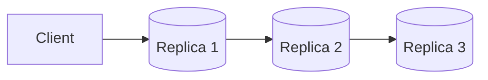
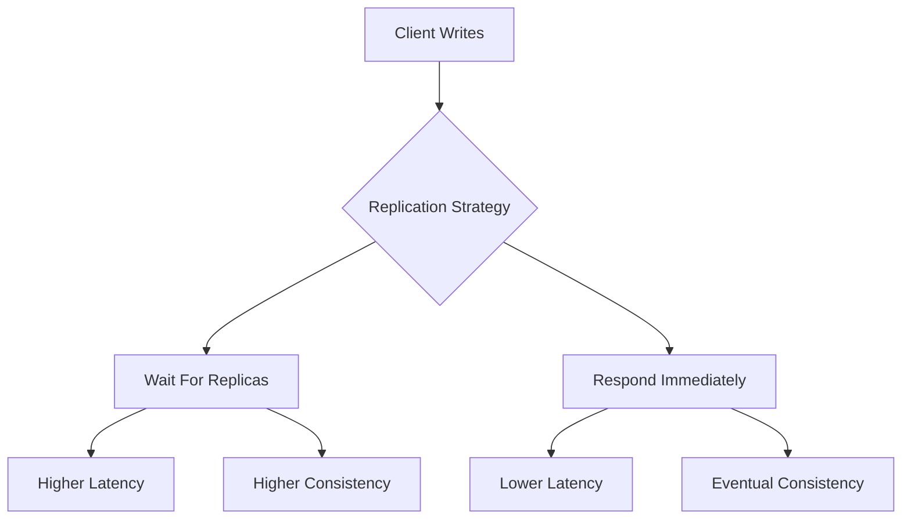
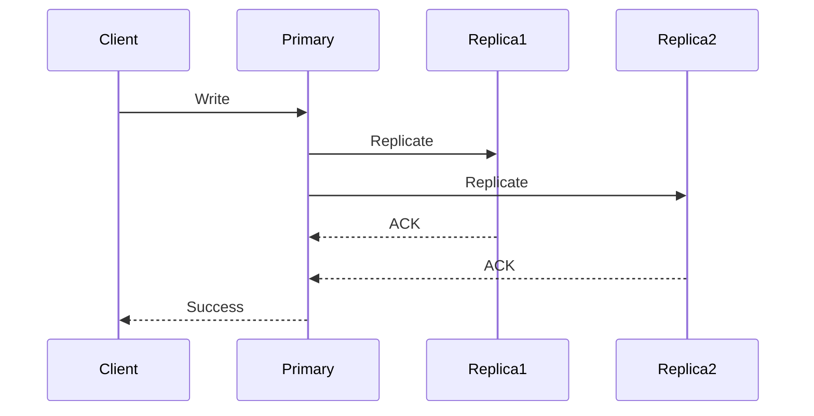
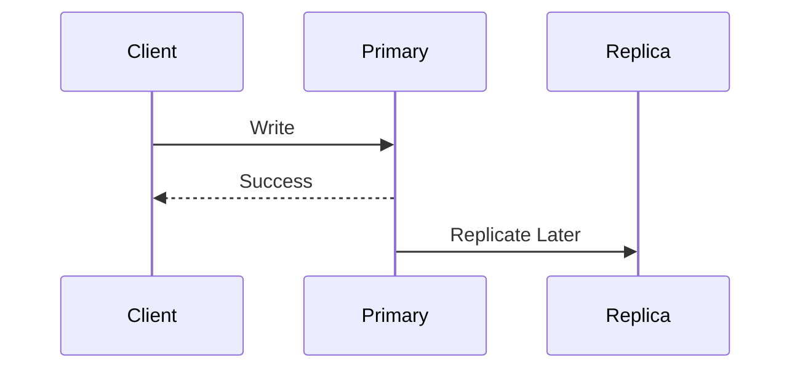
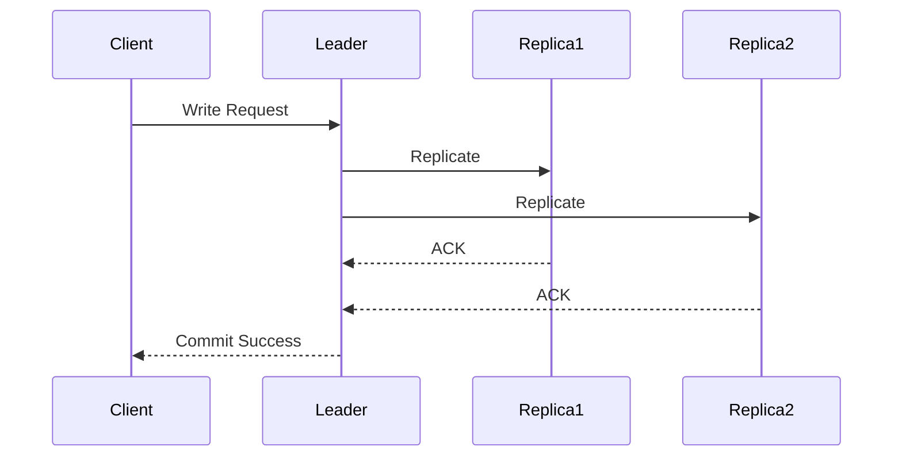
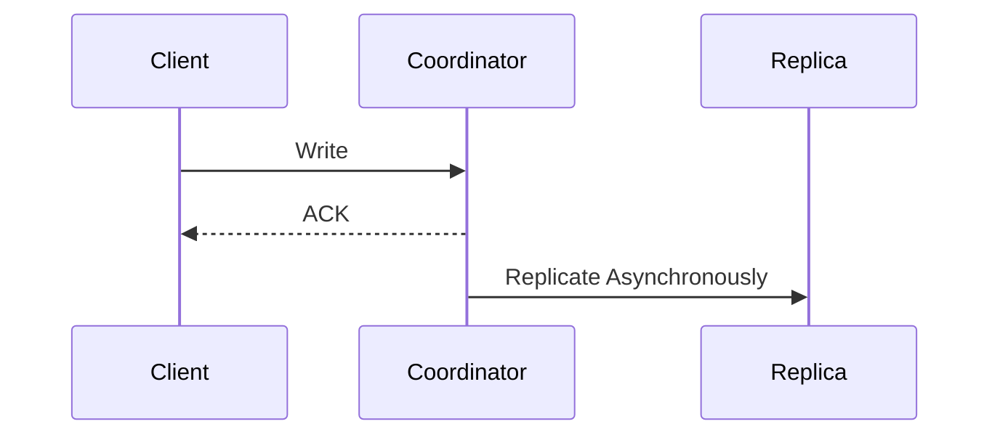
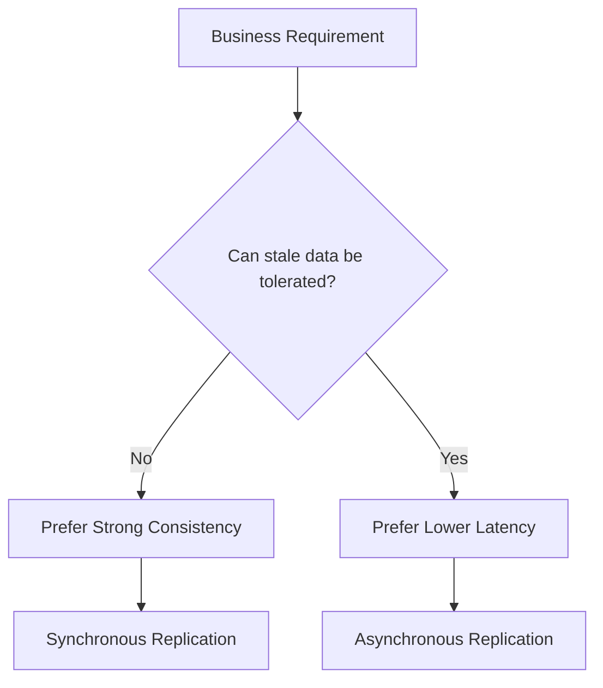

# PACELC Theorem

> *"CAP explains what happens when the network fails. PACELC explains what happens when the network is healthy."*

---

# Table of Contents

1. Why CAP Is Not Enough
2. History of PACELC
3. Understanding PACELC
4. CAP vs PACELC
5. Mental Model
6. Real-World Examples
7. Summary

---

# Learning Objectives

After completing this chapter you should be able to:

- Explain why PACELC was introduced.
- Differentiate CAP and PACELC.
- Understand latency vs consistency trade-offs.
- Explain database design decisions.
- Answer advanced Principal Engineer interview questions.

---

# Why This Chapter Matters

Suppose an interviewer asks:

> Explain CAP.

You answer correctly.

Then they ask:

> Great. What happens when there is **no partition?**

Most candidates stop here.

That's exactly why PACELC exists.

---

# Why CAP Is Incomplete

CAP only discusses one situation.

```
Network Partition

↓

Choose

Consistency

or

Availability
```

But here's the problem.

How often do network partitions happen?

Hopefully...

Very rarely.

What about the other **99.99%** of system lifetime?

CAP says nothing.

---

# The Missing Question

Suppose there is **no partition**.

Your replicas communicate normally.

Now the architect still has a decision.

```
Should I wait for all replicas?

or

Respond immediately?
```

This has nothing to do with partitions.

It is a

```
Latency

vs

Consistency

trade-off.
```

---

# History

In 2010,

Daniel J. Abadi proposed PACELC.

He observed:

> CAP only describes systems during failures.

Real systems spend almost all of their time without failures.

Therefore,

we also need to discuss

```
Latency

or

Consistency

during normal operation.
```

---

# The PACELC Formula

```
If there is a Partition

choose

Availability

or

Consistency

Else

choose

Latency

or

Consistency
```

Shortened as

```
PA/EL

PC/EC

etc.
```

---

# Expanding PACELC

```
P

Partition

A

Availability

C

Consistency

E

Else

L

Latency

C

Consistency
```

Notice

The second

```
C

```

is still

Consistency.

---

# Mental Model

Imagine a distributed database with three replicas.



Everything is healthy.

A client performs

```
Write

↓

₹1000
```

Question

Should the database

Option A

```
Wait

for all replicas

↓

Higher latency

↓

Strong consistency
```

or

Option B

```
Reply immediately

↓

Lower latency

↓

Replication continues asynchronously
```

This is the PACELC decision.

---

# Why This Matters

Suppose you're building:

### Banking

You happily wait

```
20 ms
```

if correctness improves.

Consistency wins.

---

Suppose you're building:

### Social Media Feed

Users prefer

```
20 ms

instead of

100 ms.
```

Latency wins.

---

> [!IMPORTANT]
> PACELC teaches that **engineering trade-offs exist even when the network is perfectly healthy.**

---

# CAP vs PACELC

| CAP | PACELC |
|------|---------|
| During Partition | During Partition |
| Consistency vs Availability | Consistency vs Availability |
| No discussion of normal operation | Adds Latency vs Consistency during normal operation |

PACELC extends CAP.

It does not replace it.

---

# Production Example

Imagine a global payment platform.

The client updates an account balance.

The primary replica receives the request.

Should it:

1. Wait for replicas in Europe, Asia, and North America to acknowledge the write?

or

2. Return immediately after the primary commits the transaction?

Waiting improves consistency.

Returning immediately reduces latency.

Both are valid.

The business decides.

---

# Principal Engineer Insight

> [!IMPORTANT]
> CAP helps you reason about failures.
>
> PACELC helps you reason about everyday system behavior.
>
> Modern distributed systems spend far more time operating without partitions than with them.
>
> Therefore, PACELC often has a greater impact on user experience than CAP.

---

# Common Misconceptions

> [!WARNING]
> PACELC replaces CAP.

Incorrect.

PACELC extends CAP.

---

> [!WARNING]
> Latency only matters for reads.

Incorrect.

Writes are also affected by replication and acknowledgement strategies.

---

> [!WARNING]
> Choosing lower latency always improves user experience.

Not necessarily.

Financial systems often value correctness more than speed.

---

# Key Takeaways

- CAP explains behavior during partitions.
- PACELC explains behavior during normal operation.
- Every distributed database makes latency vs consistency decisions.
- Business requirements determine the appropriate trade-off.

---

# PACELC in Practice

Now that we understand the PACELC theorem, let's see how real distributed databases make these trade-offs.

Remember:

```
IF Partition

↓

Availability or Consistency

ELSE

↓

Latency or Consistency
```

The first decision happens during failures.

The second decision happens every single day.

---

# Understanding PA/EL and PC/EC

Databases are often classified using PACELC notation.

```
PA / EL

or

PC / EC
```

Let's decode what these mean.

---

# PA / EL

```
P

↓

Availability

Else

↓

Latency
```

Interpretation

When a partition occurs,

the system prefers

Availability.

When there is no partition,

it prefers

Low Latency.

This combination is common in internet-scale systems.

---

## Example

Imagine Instagram.

User uploads a photo.

Another user refreshes immediately.

Seeing the photo

100 milliseconds later

is perfectly acceptable.

Returning a response quickly is usually more valuable than waiting for global consistency.

---

## Characteristics

Advantages

- Very low latency
- Excellent availability
- Better user experience
- Horizontal scalability

Trade-offs

- Eventual consistency
- Replica synchronization
- Conflict resolution

---

## Examples

- Cassandra
- DynamoDB (eventual reads)
- Riak

---

# PC / EC

```
Partition

↓

Consistency

Else

↓

Consistency
```

Notice something interesting.

Even when no partition exists,

the database still prioritizes consistency over latency.

Why?

Because every write waits for multiple replicas.

---

## Example

Global banking.

Client transfers

₹10000.

Database waits until replication completes.

Response

```
200 ms
```

instead of

```
20 ms
```

Latency increases.

Correctness improves.

---

## Characteristics

Advantages

- Strong consistency
- No stale reads
- Easier reasoning
- Better correctness

Trade-offs

- Higher latency
- Lower write throughput
- More coordination

---

## Examples

- Google Spanner
- CockroachDB
- YugabyteDB

---

# Visual Comparison



---

# Synchronous Replication

```
Client

↓

Primary

↓

Replica 1

↓

Replica 2

↓

ACK

↓

Client
```

The client waits until replicas acknowledge.

Advantages

- Strong consistency

Disadvantages

- Higher latency

---

## Mermaid Sequence Diagram



---

# Asynchronous Replication

```
Client

↓

Primary

↓

ACK

↓

Client

↓

Replicate Later
```

Client receives the response immediately.

Replication continues in the background.

---

## Mermaid Sequence Diagram



---

# Which One Is Faster?

Asynchronous replication.

Because the client doesn't wait.

---

# Which One Is More Consistent?

Synchronous replication.

Because all replicas acknowledge before the write completes.

---

# The Cost of Consistency

Imagine three regions.

```
Mumbai

London

Virginia
```

Every write requires

```
Mumbai

↓

London

↓

Virginia

↓

ACK
```

Global network latency becomes part of every write.

Consistency is expensive.

---

# The Cost of Latency

Suppose the client receives success immediately.

Unfortunately

one replica crashes before replication.

Now replicas disagree.

Eventually

they reconcile.

Latency improved.

Consistency temporarily decreased.

---

# Principal Engineer Insight

> [!IMPORTANT]
>
> Latency is not "free."
>
> Strong consistency requires coordination.
>
> Coordination requires communication.
>
> Communication requires time.
>
> Every millisecond of additional consistency has a cost.

---

# Real Production Example

## Google Spanner

Spanner chooses

- Strong consistency
- Global transactions

Trade-off

Higher write latency.

Why?

Google values correctness for many enterprise workloads.

---

## Cassandra

Cassandra chooses

- Fast writes
- Eventual consistency

Trade-off

Temporary stale reads.

Why?

Availability and write scalability are more important for many internet workloads.

---

## Amazon DynamoDB

DynamoDB allows both.

Default

Eventually consistent reads.

Optional

Strongly consistent reads.

Users choose based on workload.

This is an excellent interview discussion point.

---

# Decision Matrix

| Requirement | Better Choice |
|-------------|---------------|
| Banking | Synchronous Replication |
| Payments | Synchronous Replication |
| Inventory | Synchronous Replication |
| Social Feed | Asynchronous Replication |
| Analytics | Asynchronous Replication |
| Notifications | Asynchronous Replication |
| Logging | Asynchronous Replication |

---

# Interview Conversation

**Interviewer**

Why doesn't every database simply use synchronous replication?

**Weak Answer**

Because it's slower.

---

**Principal Engineer Answer**

Synchronous replication requires the primary to coordinate with replicas before acknowledging the client. This increases write latency and reduces throughput, especially across geographically distributed regions. Applications that prioritize correctness, such as banking, accept this cost. Read-heavy consumer applications often prefer asynchronous replication because users value responsiveness over immediate global consistency.

---

# Common Interview Mistakes

> [!WARNING]
> Thinking asynchronous replication is unreliable.

It is reliable.

The difference is *when* replicas become consistent.

---

> [!WARNING]
> Assuming synchronous replication means zero failures.

It improves consistency.

It cannot eliminate hardware or network failures.

---

> [!WARNING]
> Assuming lower latency is always better.

Business requirements determine whether latency or consistency should be optimized.

---

# Key Takeaways

- PACELC extends CAP.
- Modern systems spend most of their time making latency vs consistency decisions.
- Synchronous replication favors consistency.
- Asynchronous replication favors latency.
- There is no universally correct choice.
- Business requirements drive architecture decisions.

---

# PACELC in Real Databases

Understanding PACELC is not about memorizing theory.

It is about understanding **why databases make different architectural decisions.**

Every database optimizes for a different workload.

---

# Google Spanner

> [!NOTE]
> Workload:
>
> Financial systems, global transactions, enterprise applications.

Google Spanner chooses

```
PC / EC
```

Meaning

```
Partition

↓

Consistency

Else

↓

Consistency
```

Even during normal operation,

Spanner is willing to increase latency to guarantee strong consistency.

---

## How Spanner Achieves This

Google invested years building infrastructure to reduce uncertainty.

Key technologies include

- Paxos Consensus
- TrueTime API
- GPS Clocks
- Atomic Clocks
- Synchronous Replication

---

## Write Flow



Notice

The client waits.

Latency increases.

Consistency improves.

---

> [!IMPORTANT]
>
> Google did **not** eliminate CAP.
>
> Google reduced uncertainty using better clock synchronization.
>
> During a partition,
> Spanner still obeys CAP.

---

# Apache Cassandra

> [!NOTE]
> Workload:
>
> Social media, IoT, logging, time-series, recommendation systems.

Cassandra generally behaves as

```
PA / EL
```

Meaning

```
Partition

↓

Availability

Else

↓

Latency
```

---

## Write Flow



The client receives a response immediately.

Replication continues afterward.

---

Advantages

- Low latency
- High throughput
- Excellent scalability

Trade-offs

- Eventual consistency
- Read repair
- Anti-entropy synchronization

---

# Amazon DynamoDB

One of the best interview examples.

DynamoDB allows the client to choose.

### Eventually Consistent Read

```
Latency

↓

Low
```

Possible stale data.

---

### Strongly Consistent Read

```
Consistency

↓

High
```

Higher latency.

---

> [!TIP]
> During interviews, mention that DynamoDB supports both consistency models.
>
> It demonstrates understanding beyond simple AP/CP labels.

---

# Azure Cosmos DB

Cosmos DB is unique.

It provides **five** consistency levels.

| Consistency Level | Latency | Consistency |
|-------------------|----------|-------------|
| Strong | Highest | Strongest |
| Bounded Staleness | High | Very High |
| Session | Medium | User Session |
| Consistent Prefix | Lower | Ordered |
| Eventual | Lowest | Eventual |

---

## Why This Is Powerful

Different applications

can choose

different consistency guarantees

without changing databases.

---

# Decision Tree



---

# Quorum Writes

Modern databases often avoid the extremes.

Instead of

```
ONE

or

ALL
```

they choose

```
QUORUM
```

---

Suppose

```
3 Replicas
```

Write succeeds after

```
2 ACKs
```

Advantages

- Better availability
- Better consistency
- Lower latency than ALL

---

## Example

```
Replication Factor = 3

Consistency = QUORUM

Need

2 Successful ACKs
```

---

> [!IMPORTANT]
>
> Quorum is one of the most practical engineering compromises.
>
> It balances consistency, latency and availability.

---

# PACELC Decision Framework

Whenever you're designing a system, ask these questions.

## Question 1

How expensive is incorrect data?

Examples

- Banking → Very expensive
- Shopping Cart → Moderate
- Instagram Likes → Cheap

---

## Question 2

How expensive is latency?

Examples

- Live Gaming → Very expensive
- Search → Expensive
- Payroll → Less important

---

## Question 3

How frequently do writes occur?

Read-heavy systems

often tolerate stronger consistency.

Write-heavy systems

often optimize for latency.

---

# Production Case Study

## Uber Driver Location

Requirements

- Millions of updates per minute
- Low latency
- High availability

Temporary stale locations

are acceptable.

Decision

```
PA / EL
```

---

## Banking Ledger

Requirements

- No incorrect balances
- Strong correctness
- Auditability

Decision

```
PC / EC
```

---

## Product Search

Requirements

- Fast responses
- Eventual indexing
- High availability

Decision

```
PA / EL
```

---

## Inventory Management

Requirements

- Prevent overselling
- Strong consistency

Decision

```
PC / EC
```

---

# Principal Engineer Insight

> [!IMPORTANT]
>
> Do not begin by selecting a database.
>
> Begin by understanding:
>
> - Business impact of stale data
> - Latency expectations
> - Failure tolerance
> - Operational complexity
>
> Database selection is a consequence of those decisions.

---

# Interview Conversation

**Interviewer**

Why wouldn't you use Google Spanner for every application?

**Weak Answer**

It's expensive.

---

**Principal Engineer Answer**

Google Spanner provides globally consistent transactions, but that consistency requires coordination between replicas, increasing latency and operational complexity. Applications such as social feeds, notifications, and analytics rarely require global transactional consistency. For those workloads, the additional latency and infrastructure cost are unnecessary.

---

# Architecture Review Exercise

Review this statement.

> "Our application requires low latency, therefore we should always choose eventual consistency."

Questions

- Is low latency the only requirement?
- What is the business impact of stale data?
- Which operations require strong consistency?
- Can different APIs use different consistency levels?

---

# Common Mistakes

> [!WARNING]
> Assuming every request requires the same consistency level.

Many production systems use different consistency guarantees for different operations.

---

> [!WARNING]
> Choosing the most powerful database instead of the most appropriate one.

More features often mean more operational complexity.

---

> [!WARNING]
> Ignoring geographic latency.

Cross-region replication can add tens or hundreds of milliseconds to every write.

---

# Key Takeaways

- PACELC extends CAP by introducing latency vs consistency during normal operation.
- Google Spanner prioritizes consistency.
- Cassandra prioritizes latency and availability.
- DynamoDB and Cosmos DB provide configurable consistency levels.
- Quorum is a practical compromise used by many distributed databases.
- Principal Engineers begin with business requirements, not technology choices.

---

# CAP vs PACELC

One of the most common interview follow-up questions is:

> "If CAP already exists, why was PACELC introduced?"

The answer is simple.

CAP only explains what happens **during a network partition**.

PACELC explains both:

- During a partition
- During normal operation

---

## Comparison

| CAP | PACELC |
|------|---------|
| Introduced by Eric Brewer | Introduced by Daniel Abadi |
| Focuses on failures | Focuses on failures + normal operation |
| Consistency vs Availability | Consistency vs Availability + Latency vs Consistency |
| Applies during partition | Applies all the time |

---

## Mental Model

```
            Network Failure?

                 │

        ┌────────┴─────────┐

       Yes                No

        │                  │

        ▼                  ▼

CAP Decision         PACELC Decision

Consistency      Latency

      vs             vs

Availability    Consistency
```

---

# Choosing Between Latency and Consistency

A Principal Engineer starts with business requirements.

---

## Banking

Requirements

- No stale balances
- No double withdrawal
- Strong audit guarantees

Decision

```
Consistency

>

Latency
```

---

## Instagram Feed

Requirements

- Fast refresh
- Millions of requests/sec
- Slightly stale posts acceptable

Decision

```
Latency

>

Consistency
```

---

## Food Delivery

Requirements

Restaurant status

↓

Eventually consistent

Payment

↓

Strongly consistent

Notice

The same application

uses different consistency guarantees.

---

> [!IMPORTANT]
> Different APIs inside the same system may require different consistency guarantees.
>
> Never apply one consistency model to the entire application.

---

# Architecture Decision Matrix

| Workload | Latency | Consistency | Suggested Design |
|-----------|----------|-------------|------------------|
| Banking | Low Priority | Highest | Synchronous Replication |
| Payments | Medium | Highest | Quorum + Transactions |
| Inventory | Medium | High | Strong Consistency |
| Shopping Cart | High | Medium | Session Consistency |
| News Feed | Highest | Medium | Eventual Consistency |
| Notifications | Highest | Low | Async Replication |
| Logging | Highest | Low | Fire-and-Forget |
| Analytics | High | Low | Eventual Consistency |

---

# Failure Scenario

## Scenario

A customer places an order.

Primary database commits successfully.

Replication to another region is delayed.

Immediately afterwards,

the customer opens Order History.

Possible outcomes

### Option 1

Wait

↓

Latest Order Visible

↓

Higher Latency

---

### Option 2

Respond Immediately

↓

Order Missing

↓

Appears A Few Seconds Later

Which is correct?

Answer

It depends on business requirements.

---

# Principal Engineer Decision Process

Before selecting a consistency model ask:

1. What happens if data is stale?

2. How much latency can users tolerate?

3. Is correctness legally required?

4. What is the recovery strategy?

5. How will conflicts be resolved?

6. How will failures be monitored?

---

# Principal Engineer Interview Conversation

**Interviewer**

You're designing Amazon Checkout.

Would you choose low latency or strong consistency?

---

**Weak Answer**

Strong consistency.

---

**Better Answer**

Checkout consists of multiple operations.

Payment authorization and inventory reservation require strong consistency because incorrect results have direct financial impact.

Recommendation widgets and recently viewed products can tolerate eventual consistency and should optimize for latency.

Different workflows require different consistency guarantees.

---

# Senior Engineer Questions

### Q1

Why was PACELC introduced?

---

### Q2

How is PACELC different from CAP?

---

### Q3

What does EL mean?

---

### Q4

Why does synchronous replication increase latency?

---

### Q5

Explain eventual consistency.

---

### Q6

Give examples of applications where latency is more important than consistency.

---

### Q7

Why isn't every write synchronous?

---

### Q8

Explain quorum writes.

---

### Q9

How does replication affect latency?

---

### Q10

Does PACELC replace CAP?

---

# Staff Engineer Questions

### Q1

Design an inventory system using PACELC.

---

### Q2

Design a payment platform.

Where would you use strong consistency?

---

### Q3

Can different APIs choose different consistency levels?

---

### Q4

Explain Google's Spanner using PACELC.

---

### Q5

How would you reduce write latency without sacrificing correctness?

---

### Q6

How would you explain PACELC to a Product Manager?

---

### Q7

Should search results always be strongly consistent?

---

### Q8

How would you monitor replication lag?

---

### Q9

When would eventual consistency become unacceptable?

---

### Q10

How would PACELC influence multi-region architecture?

---

# Principal Engineer Questions

### Q1

Design a globally distributed banking platform.

Discuss every PACELC trade-off.

---

### Q2

Would you allow different microservices to use different consistency models?

Why?

---

### Q3

Suppose latency doubles after introducing synchronous replication.

How would you investigate?

---

### Q4

How would you evolve an eventually consistent architecture toward stronger consistency without downtime?

---

### Q5

Can PACELC decisions change as a company grows?

Give examples.

---

### Q6

How would you classify:

- Google Spanner
- CockroachDB
- Cassandra
- DynamoDB
- Cosmos DB

using PACELC?

---

### Q7

Suppose the CEO wants both zero latency and perfect consistency.

How would you explain the trade-off?

---

### Q8

How would you justify eventual consistency during a design review?

---

### Q9

Which metrics indicate that consistency is becoming a bottleneck?

---

### Q10

If you were reviewing another Principal Engineer's design, which PACELC mistakes would you look for first?

---

# Whiteboard Exercise

Design a globally distributed e-commerce platform.

Discuss

- Product Catalog
- Shopping Cart
- Checkout
- Payment
- Search
- Recommendations
- Notifications

For each service answer:

- Latency or Consistency?
- Why?
- Failure Scenario?
- Recovery Strategy?

---

# Common Wrong Answers

❌ PACELC replaces CAP.

---

❌ Strong consistency is always better.

---

❌ Eventual consistency means unreliable.

---

❌ Every API should use the same consistency model.

---

❌ Lower latency is always better.

---

# Principal Engineer Review Checklist

Can you explain:

- Why PACELC exists?
- Why CAP is insufficient?
- Latency vs consistency?
- Synchronous replication?
- Asynchronous replication?
- Quorum writes?
- Google Spanner?
- Cassandra?
- DynamoDB?
- Cosmos DB?
- Business-driven consistency decisions?

If yes,

you're ready for Staff/Principal interviews.

---

# One-Page Cheat Sheet

```
Network Partition?

↓

Yes

↓

CAP

Consistency

vs

Availability

-------------------------

No Partition

↓

PACELC

Latency

vs

Consistency
```

---

## Database Summary

| Database | Typical PACELC Classification |
|-----------|-------------------------------|
| Google Spanner | PC/EC |
| CockroachDB | PC/EC |
| YugabyteDB | PC/EC |
| Cassandra | PA/EL |
| Riak | PA/EL |
| DynamoDB | PA/EL (Configurable Reads) |
| Cosmos DB | Configurable |

---

# Related Chapters

Next:

- 03-Replication.md
- 04-Quorum-Reads-and-Writes.md
- 05-Leader-Election.md
- 06-Raft-Consensus.md

---

# References

## Books

- Designing Data-Intensive Applications — Martin Kleppmann
- Database Internals — Alex Petrov
- Designing Distributed Systems — Brendan Burns

## Papers

- Eric Brewer — Towards Robust Distributed Systems (2000)
- Daniel J. Abadi — Problems with CAP and Yahoo's Little Known NoSQL System (2010)
- Gilbert & Lynch — Brewer's Conjecture and the Feasibility of Consistent, Available, Partition-Tolerant Web Services (2002)

## Engineering Blogs

- Google Cloud Spanner
- Amazon DynamoDB
- Azure Cosmos DB
- Netflix Tech Blog

---

# Chapter Summary

A Senior Engineer knows CAP.

A Staff Engineer understands PACELC.

A Principal Engineer knows **when to prioritize latency, when to prioritize consistency, and how to justify that decision using business requirements, operational constraints, and user experience.**

Technology selection is the final step—not the first.
