# Replication

> *"Replication is the foundation of every highly available distributed system. Before discussing consensus, quorums, leader election, or distributed databases, we must first understand why replication exists and the engineering trade-offs it introduces."*

---

# Table of Contents

1. Why Replication Exists
2. Replication Goals
3. Replication Terminology
4. Leader and Followers
5. Why Replication is Hard
6. Replication Models
7. Real Production Examples
8. Summary

---

# Learning Objectives

After completing this chapter you should be able to:

- Explain why replication is necessary.
- Differentiate replication from backup.
- Understand leader-follower replication.
- Understand multi-leader and leaderless replication.
- Explain replication lag.
- Reason about consistency and availability trade-offs.
- Answer Principal Engineer interview questions confidently.

---

# Why This Chapter Matters

Imagine you're building Amazon.

Your entire customer database lives on one machine.

```
Orders

Users

Payments

Inventory
```

Everything works.

Until...

The server crashes.

Now every customer sees

```
500 Internal Server Error
```

Business stops.

This is why replication exists.

---

# The Problem with a Single Database

Suppose we have

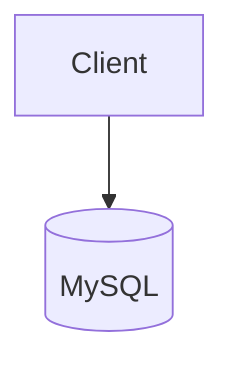

Advantages

- Simple
- Strong consistency
- Easy debugging

Disadvantages

- Single point of failure
- Cannot scale reads
- Maintenance requires downtime
- Disaster recovery is difficult

One machine is never enough for large-scale systems.

---

# First Attempt

Let's add another database.

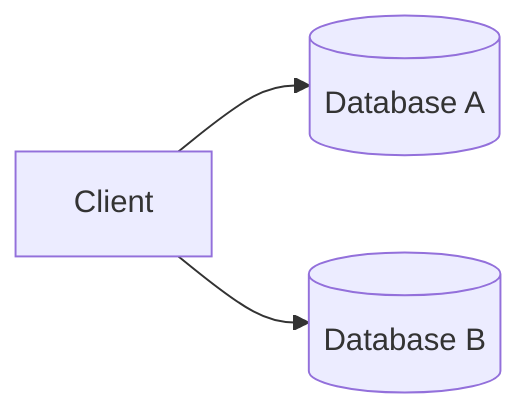

Problem solved?

No.

Immediately new questions appear.

---

# New Problems

Suppose a customer updates

```
Address

↓

Database A
```

Another customer service representative reads from

```
Database B
```

How does Database B receive the update?

How long does it take?

What if the update never arrives?

What if updates arrive out of order?

Replication is much harder than copying bytes.

---

# What is Replication?

Replication is the process of maintaining multiple copies of the same data across different machines.

Goal

```
Machine A

↓

Machine B

↓

Machine C

All contain

the same logical data.
```

Notice

Logical data.

Not necessarily

identical storage engines.

---

# Replication vs Backup

Many engineers confuse these.

They solve different problems.

| Replication | Backup |
|-------------|---------|
| Improves availability | Protects against data loss |
| Near real-time | Point-in-time snapshot |
| Used for serving traffic | Used for recovery |
| Multiple active copies | Offline copy |

---

## Example

A production database crashes.

Replication

↓

Traffic continues.

Backup

↓

Restore from yesterday.

Very different objectives.

---

# Why Companies Replicate Data

Replication solves multiple problems simultaneously.

## High Availability

If one server fails,

another server continues serving requests.

---

## Disaster Recovery

If an entire data center fails,

another region can take over.

---

## Read Scalability

Millions of users reading product data.

Instead of

```
1 Database
```

use

```
10 Read Replicas
```

Each replica shares the workload.

---

## Geographic Distribution

Users in

- India
- Europe
- America

should not all read from one continent.

Local replicas reduce latency.

---

# Replication Goals

An ideal replication system would provide:

- No data loss
- Zero replication lag
- Unlimited scalability
- Instant failover
- Low latency
- Low operational complexity

Unfortunately,

these goals conflict with each other.

Replication is a series of engineering trade-offs.

---

# Replication Terminology

Before discussing architectures, let's establish common terminology.

---

## Primary (Leader)

The node that accepts writes.

Examples

```
INSERT

UPDATE

DELETE
```

Usually routed to the primary.

---

## Replica (Follower)

A node that receives data from the leader.

Typically serves read requests.

```
SELECT
```

---

## Replication Lag

The delay between

```
Leader Updated

↓

Replica Updated
```

Lag may be

- milliseconds
- seconds
- minutes

depending on workload.

---

## Failover

If the leader fails,

one replica becomes the new leader.

---

## Promotion

The process of turning a replica into the primary.

---

# Mental Model

Imagine a classroom.

Teacher

↓

Explains lesson.

Students

↓

Copy notes.

Teacher

=

Leader

Students

=

Replicas

If one student misses part of the lecture,

their notes become stale.

This is replication lag.

---

# Real Production Example

Suppose you're browsing Amazon.

The product catalog is replicated worldwide.

When a seller changes the price,

the update first reaches the primary database.

It then propagates to replicas in different regions.

For a short period,

customers in different regions may observe different prices.

This is a natural consequence of distributed replication.

---

> [!IMPORTANT]
> Replication is not about keeping every machine perfectly synchronized at every instant.
>
> It is about keeping replicas sufficiently synchronized to satisfy business requirements.

---

# Principal Engineer Insight

A common mistake is asking:

> "How do I eliminate replication lag?"

The better question is:

> "How much replication lag can my business tolerate?"

That single question changes the entire architecture.

---

# Common Misconceptions

> [!WARNING]
> Replication is not a backup.

---

> [!WARNING]
> More replicas do not automatically improve write performance.

---

> [!WARNING]
> Zero replication lag is impossible in geographically distributed systems because information cannot travel faster than the speed of light.

---

# Key Takeaways

- Replication creates multiple copies of data.
- Replication improves availability and read scalability.
- Replication introduces consistency challenges.
- Replication lag is unavoidable.
- Every replication strategy is a trade-off between latency, consistency, availability, and operational complexity.

---
---

# Leader-Follower Replication

> [!IMPORTANT]
>
> Leader-Follower Replication is the most widely used replication model in distributed systems.
>
> Understanding this model makes MySQL, PostgreSQL, Kafka, MongoDB, Elasticsearch, and many cloud databases much easier to understand.

---

# Why Do We Need a Leader?

Suppose we have three databases.

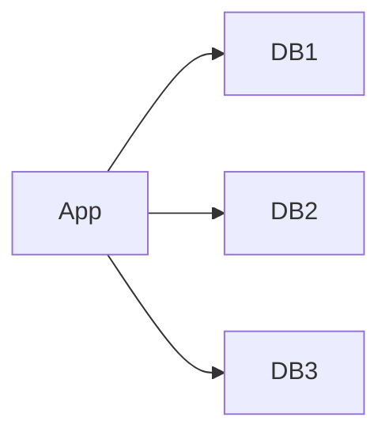

Now imagine two users update the same row simultaneously.

```
User A

↓

Balance = 500
```

```
User B

↓

Balance = 1000
```

Database 1 receives

```
500
```

Database 2 receives

```
1000
```

Which value is correct?

Who decides?

This problem is known as

**Write Conflict**.

---

# The Leader Solution

Instead of allowing every database to accept writes,

choose one database as the leader.


Now

Every write

must go through

the leader.

Followers never accept writes directly.

---

# Responsibilities

## Leader

Responsible for

- INSERT
- UPDATE
- DELETE
- Transaction Ordering
- Conflict Resolution
- Replication

---

## Followers

Responsible for

- SELECT
- Replication
- Backup
- Disaster Recovery
- Read Scaling

---

# Write Flow

Suppose a customer changes their address.

```
Client

↓

Leader

↓

Followers
```

Sequence

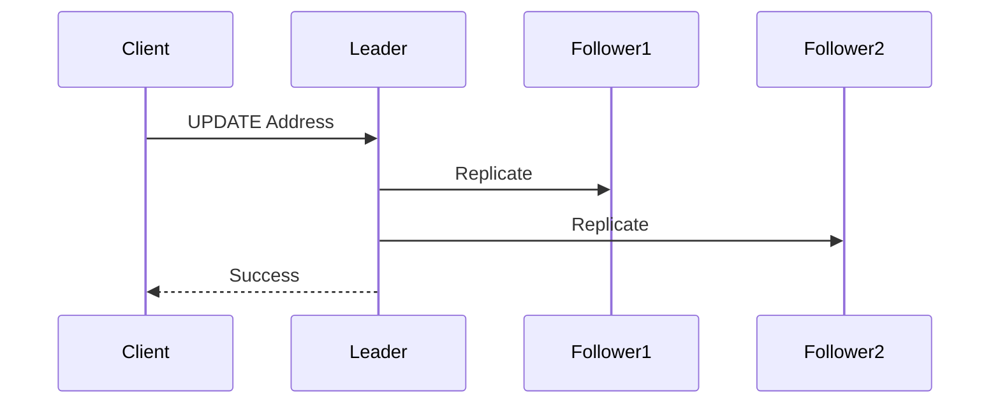

Notice

The client never talks directly to followers for writes.

---

# Read Flow

Reads can be distributed.

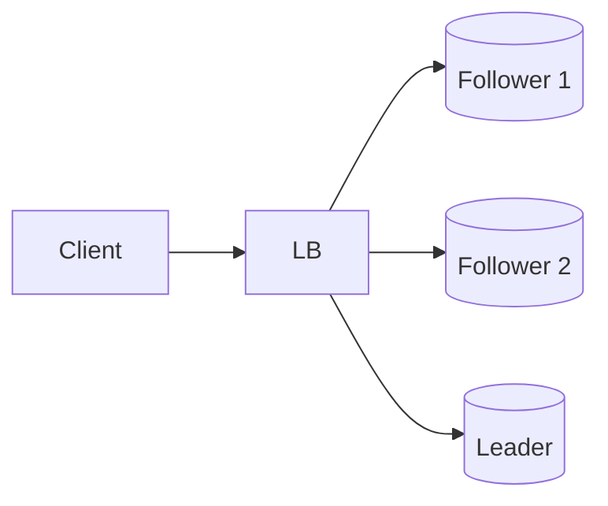

Advantages

- Better scalability
- Lower latency
- Reduced load on leader

---

# Example

Amazon receives

```
5 Million Reads/sec

50,000 Writes/sec
```

Instead of

```
1 Database
```

Amazon might deploy

```
1 Leader

20 Followers
```

Reads

↓

Followers

Writes

↓

Leader

---

# Why Writes Usually Go Through One Leader

Imagine

two leaders

accepting writes independently.

```
Leader A

↓

Price = ₹500
```

```
Leader B

↓

Price = ₹700
```

How should replicas resolve this conflict?

Leader-Follower avoids this entire problem.

---

# Replication Pipeline

The leader processes writes in order.

```
Write 1

↓

Write 2

↓

Write 3

↓

Followers Replay

1

2

3
```

Maintaining order is critical.

Otherwise

Followers could observe

```
3

↓

1

↓

2
```

leading to inconsistent state.

---

# What Exactly Gets Replicated?

Different databases replicate different things.

---

## MySQL

Replicates

```
Binary Log (Binlog)
```

Followers replay SQL changes.

---

## PostgreSQL

Replicates

```
Write Ahead Log (WAL)
```

Followers replay WAL records.

---

## Kafka

Replicates

```
Log Segments
```

Followers copy partition logs.

---

## MongoDB

Replicates

```
Oplog
```

Followers continuously tail the operation log.

---

> [!TIP]
> Every database uses different terminology.
>
> The underlying idea remains the same:
>
> **Capture writes → Send them to replicas → Replay them in order.**

---

# Read Scaling

Suppose

```
Reads

=

100,000/sec
```

One database becomes overloaded.

Solution

```mermaid
flowchart TD

Client

↓

Load Balancer

↓

Follower 1

Follower 2

Follower 3

Follower 4
```

Each follower handles part of the traffic.

---

# Advantages

✅ Excellent read scalability

✅ Simple architecture

✅ Easy operational model

✅ Easy backups

✅ Straightforward failover

---

# Disadvantages

❌ Leader becomes write bottleneck

❌ Replication lag

❌ Leader failure

❌ Cross-region latency

❌ Read-after-write inconsistency

---

# Read-After-Write Problem

Suppose

Customer updates

```
Phone Number
```

Leader

↓

Updated immediately.

Follower

↓

Still replicating.

Customer refreshes profile.

Load balancer sends request

↓

Follower.

Old phone number appears.

Customer thinks

"The update failed."

Actually

The update succeeded.

The follower was behind.

---

## Timeline

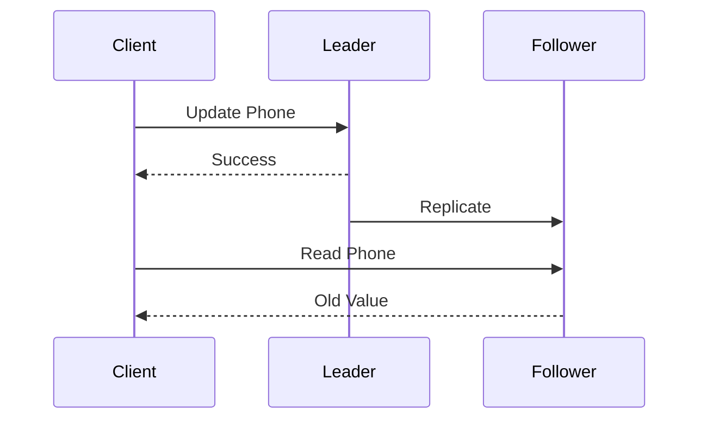

This is one of the most common production issues.

---

# Production Strategies

Large companies solve this in several ways.

## Strategy 1

Read Your Own Writes

Recent writes

↓

Always read from leader.

---

## Strategy 2

Sticky Session

User remains connected

to one replica

for a short period.

---

## Strategy 3

Wait for Replication

Delay read

until replicas catch up.

Higher latency.

Better consistency.

---

## Strategy 4

Session Token

The client sends the last observed version.

The load balancer routes the request

only to replicas that have reached that version.

---

# Failure Scenario

Suppose

Leader crashes.

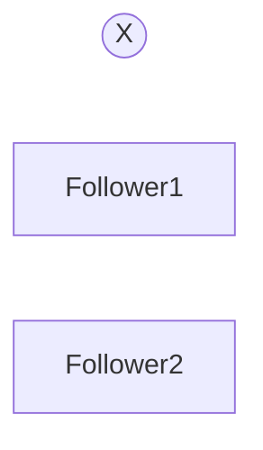

Questions immediately arise.

- Which follower becomes the new leader?
- How do applications discover the new leader?
- What if two followers both believe they are the leader?

These questions introduce:

- Leader Election
- Consensus
- Split Brain

We'll cover those in later chapters.

---

# Principal Engineer Insight

> [!IMPORTANT]
>
> Leader-Follower replication solves **write conflicts** by introducing a single authority for writes.
>
> However, it also creates a new challenge:
>
> **The leader becomes a bottleneck and a potential single point of failure.**
>
> Every distributed system must balance these competing concerns.

---

# Interview Conversation

**Interviewer**

Why don't followers accept writes?

**Weak Answer**

Because they are read replicas.

---

**Principal Engineer Answer**

Allowing multiple replicas to accept concurrent writes introduces conflict resolution problems. A leader serializes writes into a single ordered stream, simplifying replication and ensuring deterministic state across followers. The trade-off is that write throughput is limited by the leader, making leader capacity and failover critical design considerations.

---

# Common Interview Mistakes

> [!WARNING]
> Assuming followers always have the latest data.

---

> [!WARNING]
> Assuming adding followers improves write throughput.

Followers primarily improve **read throughput**.

---

> [!WARNING]
> Thinking leader failure is the hardest problem.

Leader replacement is relatively straightforward.

Preventing **split-brain** is much harder.

---

# Key Takeaways

- One leader accepts all writes.
- Followers replicate the leader's changes.
- Followers are typically used for read scaling.
- Replication lag is unavoidable.
- The leader simplifies ordering but becomes the write bottleneck.
- Leader failure leads to leader election, which requires consensus algorithms.

---

# Synchronous vs Asynchronous Replication

> [!IMPORTANT]
>
> The biggest difference between synchronous and asynchronous replication is **when the client receives a successful response**.
>
> Everything else is a consequence of that decision.

---

# The Fundamental Question

Imagine a user updates their profile.

```
PUT /users/123

Name = "Deepesh"
```

The leader receives the request.

Now it has a decision.

```
Should I immediately return

200 OK

?

OR

Should I first wait until replicas confirm the write?
```

This single decision defines the replication strategy.

---

# Mental Model

Imagine sending an important legal document.

Option 1

Drop it into the mailbox.

Immediately walk away.

---

Option 2

Wait until the recipient signs

"Received."

The first approach is

Fast.

The second is

Safer.

Exactly the same trade-off exists in distributed systems.

---

# Synchronous Replication

## Definition

The leader acknowledges the client **only after required replicas confirm the write.**

---

## Write Flow

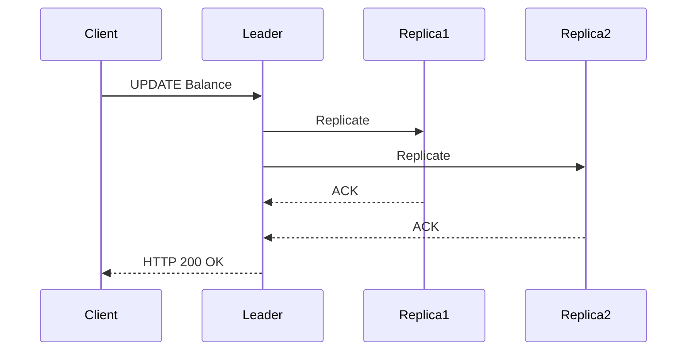

Notice carefully.

The client waits.

No response is sent until replication succeeds.

---

# Timeline

```
Client

↓

Leader

↓

Replica1

↓

Replica2

↓

ACK

↓

ACK

↓

Client receives Success
```

---

# Advantages

✅ Strong consistency

✅ Lower probability of data loss

✅ Easier failover

✅ Better durability

---

# Disadvantages

❌ Higher latency

❌ Lower throughput

❌ Slowest replica determines response time

❌ More sensitive to network latency

---

# Failure Scenario

Suppose

Replica 2

crashes.

```
Leader

↓

Replica 1

↓

Replica 2 (Down)
```

Question

Should the leader wait forever?

Obviously not.

Systems introduce

- Timeout
- Quorum
- Minimum ACK count

We'll discuss those shortly.

---

# Asynchronous Replication

Now let's consider another approach.

The leader immediately responds.

Replication happens later.

---

## Write Flow

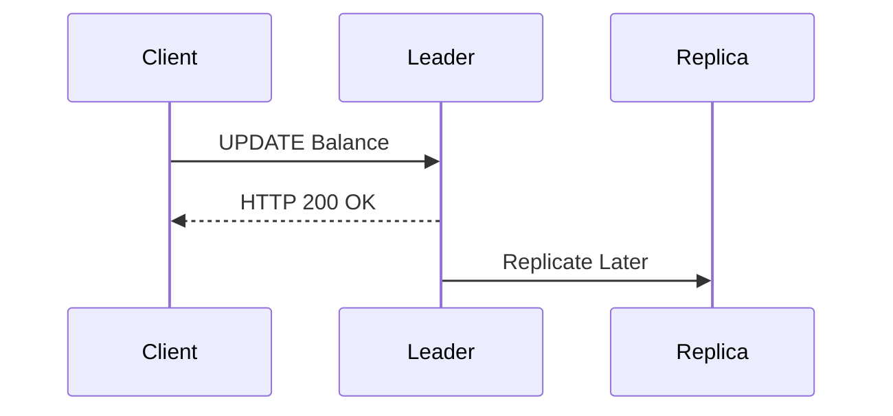

Notice something important.

The client receives success

before

replication completes.

---

# Timeline

```
Client

↓

Leader

↓

HTTP 200 OK

↓

Replica Updated Later
```

---

# Advantages

✅ Very low latency

✅ High throughput

✅ Excellent user experience

✅ Better write performance

---

# Disadvantages

❌ Possible data loss

❌ Replication lag

❌ Stale reads

❌ Harder failover

---

# Failure Scenario

This is one of the most common interview questions.

Suppose

```
Client

↓

Leader

↓

HTTP 200 OK
```

Immediately afterwards

the leader crashes.

Replication

never happened.

Follower

still contains

old data.

Question

Was the write successful?

The client thinks

Yes.

The database says

No.

The write is lost.

---

## Mermaid Diagram

```mermaid
sequenceDiagram

participant Client
participant Leader
participant Replica

Client->>Leader: Write

Leader-->>Client: Success

Note over Leader: Crash

Replica: Never received update
```

This is why asynchronous replication is faster but less durable.

---

# Principal Engineer Insight

> [!IMPORTANT]
>
> Every time you reduce latency,
> ask yourself:
>
> **"What happens if the leader crashes immediately afterwards?"**
>
> This question separates Senior Engineers from Principal Engineers.

---

# Semi-Synchronous Replication

Many production systems choose a compromise.

Instead of waiting for **all** replicas,

wait for

**at least one**.

```
Leader

↓

Replica A

ACK

↓

Client gets Success

↓

Replica B

↓

Replica C
```

This balances

- Latency
- Durability
- Availability

---

# MySQL Semi-Synchronous Replication

MySQL supports

Semi-Synchronous Replication.

Workflow

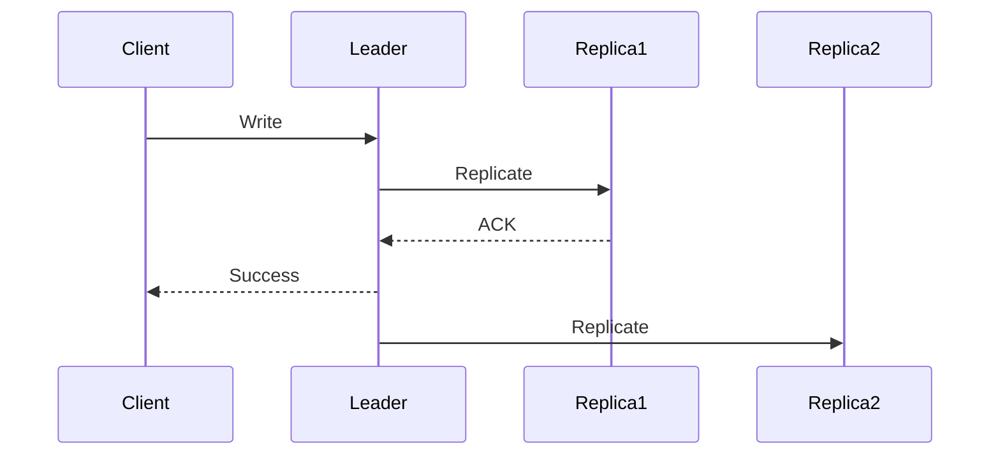

Notice

The leader waits for

only one

replica.

---

Advantages

- Better durability
- Lower latency than synchronous
- Less risk of data loss

---

# PostgreSQL

PostgreSQL allows configuring

```
synchronous_commit
```

Options include

- off
- local
- remote_write
- remote_apply
- on

Each option changes

when

the client receives success.

---

# MongoDB

MongoDB exposes this through

```
writeConcern
```

Examples

```
w:1

↓

Leader only
```

```
w:majority

↓

Majority ACK
```

```
w:0

↓

Fire and Forget
```

---

# Kafka

Kafka exposes the same idea.

Producer Configuration

```
acks=0

Fire and Forget
```

```
acks=1

Leader ACK
```

```
acks=all

ISR ACK
```

Exactly the same engineering trade-off.

Different terminology.

---

# Comparison Table

| Strategy | Client Waits? | Data Loss Risk | Latency | Throughput |
|-----------|---------------|----------------|----------|------------|
| Synchronous | Yes | Lowest | Highest | Lowest |
| Semi-Synchronous | Partial | Low | Medium | Medium |
| Asynchronous | No | Highest | Lowest | Highest |

---

# Production Decision Matrix

| Workload | Recommended Strategy |
|----------|----------------------|
| Banking | Synchronous |
| Payments | Synchronous |
| Inventory | Semi-Synchronous |
| Shopping Cart | Semi-Synchronous |
| Notifications | Asynchronous |
| Logging | Asynchronous |
| Analytics | Asynchronous |

---

# Interview Conversation

**Interviewer**

Why doesn't every company simply use synchronous replication?

---

**Weak Answer**

Because it's slower.

---

**Principal Engineer Answer**

Synchronous replication increases durability by ensuring replicas acknowledge writes before the client receives success. However, every acknowledgement adds network latency and limits throughput, particularly across regions. Applications with strict correctness requirements, such as banking, accept this trade-off. Consumer-facing systems like notifications or analytics often choose asynchronous replication because occasional data loss is less costly than increased latency.

---

# Common Interview Mistakes

> [!WARNING]
> Assuming asynchronous replication is unreliable.

It is reliable.

The question is **when** replicas become durable.

---

> [!WARNING]
> Thinking synchronous replication guarantees zero data loss.

Hardware failures, software bugs, and operator mistakes can still cause data loss.

---

> [!WARNING]
> Assuming every application requires synchronous replication.

Business requirements determine the replication strategy.

---

# Key Takeaways

- Replication strategies differ primarily in **when the client receives success**.
- Synchronous replication maximizes consistency and durability.
- Asynchronous replication minimizes latency.
- Semi-synchronous replication provides a practical compromise.
- MySQL, PostgreSQL, MongoDB, and Kafka all expose this trade-off using different terminology.
- A Principal Engineer always asks: **"What happens if the leader crashes immediately after acknowledging the client?"**

---

# How Replication Actually Works

> [!IMPORTANT]
>
> Replication is **not** implemented by copying the entire database after every write.
>
> That would be far too slow.
>
> Instead, databases replicate **changes**.

---

# The Core Idea

Imagine this table.

| ID | Name |
|----|------|
|1|Alice|

Now execute

```sql
UPDATE users
SET name='Bob'
WHERE id=1;

---

# How Replication Actually Works

> [!IMPORTANT]
> Replication is **not** implemented by copying the entire database after every write.
>
> That would be far too slow.
>
> Instead, databases replicate **changes**.

---

# The Core Idea

Imagine this table.

| ID | Name |
|----|------|
| 1 | Alice |

Now execute

```sql
UPDATE users
SET name = 'Bob'
WHERE id = 1;
```

Should the database send the **entire table** to every replica?

No.

Instead, it sends only the change (or an equivalent binary representation of that change).

This is significantly smaller and much faster.

---

# Replication Pipeline

Every database follows roughly the same pipeline.

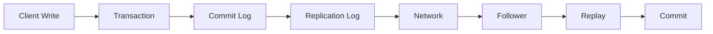

Different databases use different terminology, but the overall architecture is remarkably similar.

---

# Step 1 — Client Issues a Write

Example:

```text
UPDATE Balance

1000

↓

1500
```

The client sends the request to the leader.

---

# Step 2 — Leader Executes the Transaction

The leader performs several operations:

- Validates the SQL
- Acquires locks
- Updates memory
- Writes to the commit log

Only after durability is guaranteed does replication begin.

---

# Step 3 — Commit Log

Every serious database maintains an append-only log.

Think of it as the transaction history.

Example:

```text
LSN 101

INSERT User
```

```text
LSN 102

UPDATE Balance
```

```text
LSN 103

DELETE Order
```

Nothing is overwritten.

Everything is appended.

---

# Why Append-Only?

Appending is generally an O(1) operation.

Updating existing records requires random disk access.

Appending is much faster.

This is why nearly every modern distributed database is built around append-only logs.

---

# Step 4 — Followers Read the Log

Followers continuously ask:

```text
Any new entries?
```

Leader replies:

```text
LSN 104

↓

LSN 105

↓

LSN 106
```

Followers download only the missing entries.

---

## Replication Sequence

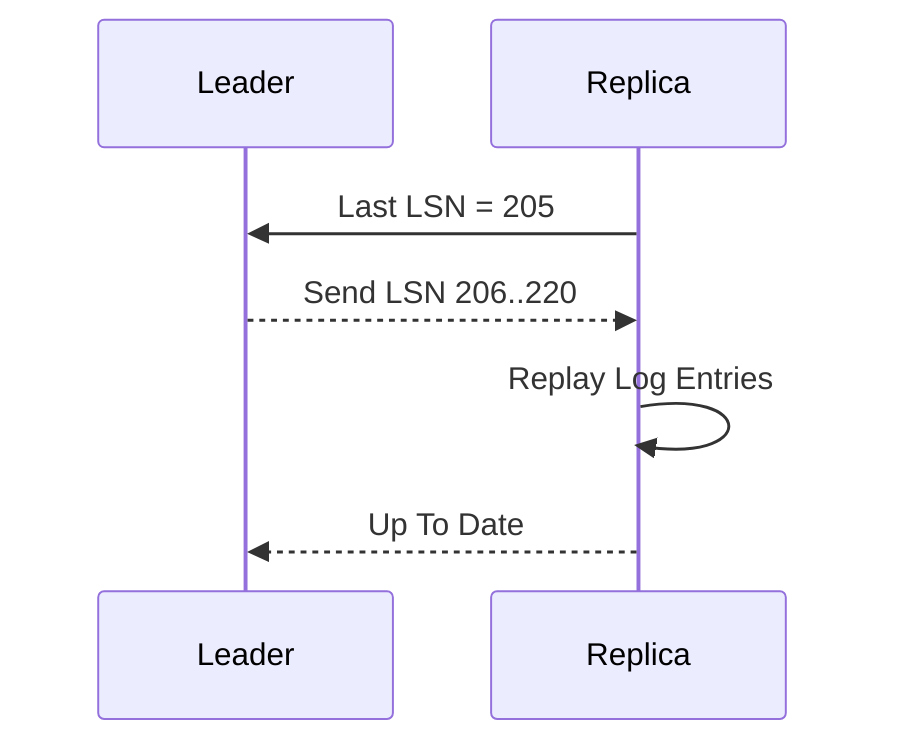

---

# Log Sequence Number (LSN)

Every committed change receives a monotonically increasing sequence number.

Example:

```text
100

101

102

103

104
```

Instead of asking

> Send me the entire database

the replica asks

> Send everything after LSN 104.

This makes replication extremely efficient.

---

# Recovery After Failure

Suppose a replica crashes.

Meanwhile, the leader continues processing writes.

Leader reaches:

```text
LSN = 500
```

Replica restarts remembering:

```text
Last Processed LSN = 420
```

The replica requests:

```text
421

↓

500
```

Only the missing changes are transferred.

---

# Production Example

Suppose a replica is offline for five minutes.

During that time, the leader processes:

```text
20,000 Transactions
```

Instead of copying an entire 1 TB database,

the leader sends only those 20,000 log records.

Recovery becomes dramatically faster.

---

# Snapshot vs Log Replay

Eventually the transaction log becomes too large.

How should a brand-new replica join?

## Option 1

Replay every log ever written.

```text
10 Years of Logs
```

Clearly impractical.

---

## Option 2

Take a database snapshot.

```text
Snapshot

↓

Transfer

↓

Replay Recent Logs
```

This is how most production databases initialize replicas.

---

## Replica Bootstrap

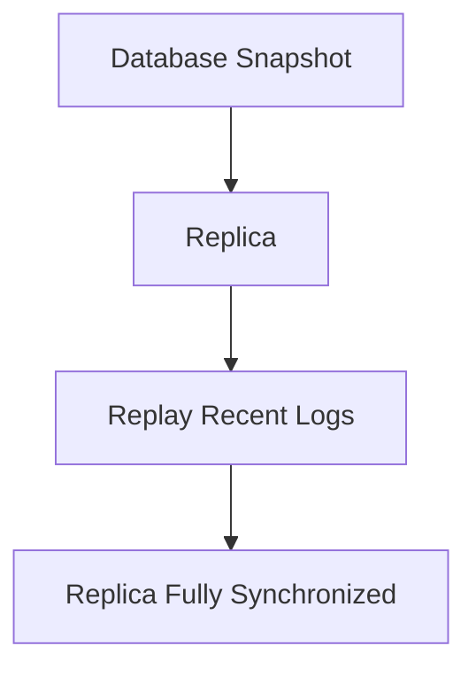

---

# Incremental Synchronization

Most of the time replicas need only recent changes.

Example:

Leader:

```text
LSN = 800
```

Replica:

```text
LSN = 799
```

Leader sends only:

```text
LSN 800
```

No unnecessary data transfer.

---

# Full Synchronization

Suppose a replica remains offline for three months.

Meanwhile, the leader deletes old logs.

The replica can no longer catch up using log replay alone.

The recovery process becomes:

```text
Fresh Snapshot

↓

Transfer Snapshot

↓

Replay Recent Logs
```

---

# How Popular Databases Implement Replication

| Database | Replication Source |
|------------|--------------------|
| MySQL | Binary Log (Binlog) |
| PostgreSQL | Write Ahead Log (WAL) |
| MongoDB | Oplog |
| Kafka | Partition Log |
| Cassandra | Commit Log + SSTables |
| Google Spanner | Paxos Log |
| CockroachDB | Raft Log |

Different names.

Same engineering principle.

---

# MySQL Replication

```text
Client

↓

Leader

↓

Binary Log

↓

Replica IO Thread

↓

Relay Log

↓

SQL Thread

↓

Database
```

The leader writes to the Binary Log.

Replica IO Thread downloads it.

Replica SQL Thread replays it.

---

# PostgreSQL Replication

```text
Client

↓

Primary

↓

Write Ahead Log (WAL)

↓

Streaming Replication

↓

Standby

↓

Replay WAL
```

Instead of replaying SQL statements,

PostgreSQL replays WAL records.

This is faster and more reliable.

---

# MongoDB Replication

MongoDB stores every operation inside the **Oplog**.

Followers continuously tail the oplog, similar to:

```bash
tail -f logfile
```

Every new operation is immediately replicated.

---

# Kafka Replication

Kafka itself is built around replication.

```text
Producer

↓

Leader Partition

↓

Follower Partitions

↓

Consumers
```

Followers continuously copy the leader's log segments.

---

# Principal Engineer Insight

> [!IMPORTANT]
> Nearly every modern distributed storage system is fundamentally a **replicated append-only log**.
>
> Databases differ primarily in:
>
> - How they store the log
> - How they replicate the log
> - How they elect leaders
> - How they resolve conflicts
>
> The core principle remains remarkably similar.

---

# Interview Conversation

**Interviewer**

How does a replica know what data it is missing?

**Weak Answer**

It asks the leader.

**Principal Engineer Answer**

Each committed transaction receives a monotonically increasing sequence number (LSN, offset, term/index, etc.). The replica remembers the highest processed sequence number and requests only entries beyond that point. This enables efficient incremental synchronization instead of transferring the full dataset.

---

# Common Interview Mistakes

> [!WARNING]
> Thinking replication copies the entire database after every write.

---

> [!WARNING]
> Confusing snapshots with replication.

Snapshots initialize replicas.

Replication keeps replicas synchronized afterward.

---

> [!WARNING]
> Assuming logs grow forever.

Production databases periodically create snapshots and safely remove obsolete log segments.

---

# Key Takeaways

- Replication is log-based.
- Followers replay committed changes.
- Sequence numbers (LSN, offsets, etc.) enable incremental synchronization.
- Snapshots bootstrap new replicas.
- Log replay keeps replicas synchronized.
- Nearly every modern distributed database is fundamentally built around an append-only log.
