# Replication

> *"Replication is the foundation of every highly available distributed system. Before discussing consensus, quorums, leader election, or distributed databases, we must first understand why replication exists and the engineering trade-offs it introduces."*

---

# Table of Contents

1. Why Replication Exists
2. Replication Goals
3. Replication Terminology
4. Leader and Followers
5. Why Replication is Hard
6. Replication Models
7. Real Production Examples
8. Summary

---

# Learning Objectives

After completing this chapter you should be able to:

- Explain why replication is necessary.
- Differentiate replication from backup.
- Understand leader-follower replication.
- Understand multi-leader and leaderless replication.
- Explain replication lag.
- Reason about consistency and availability trade-offs.
- Answer Principal Engineer interview questions confidently.

---

# Why This Chapter Matters

Imagine you're building Amazon.

Your entire customer database lives on one machine.

```
Orders

Users

Payments

Inventory
```

Everything works.

Until...

The server crashes.

Now every customer sees

```
500 Internal Server Error
```

Business stops.

This is why replication exists.

---

# The Problem with a Single Database

Suppose we have

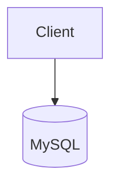

Advantages

- Simple
- Strong consistency
- Easy debugging

Disadvantages

- Single point of failure
- Cannot scale reads
- Maintenance requires downtime
- Disaster recovery is difficult

One machine is never enough for large-scale systems.

---

# First Attempt

Let's add another database.

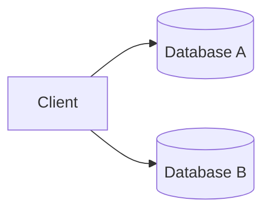

Problem solved?

No.

Immediately new questions appear.

---

# New Problems

Suppose a customer updates

```
Address

↓

Database A
```

Another customer service representative reads from

```
Database B
```

How does Database B receive the update?

How long does it take?

What if the update never arrives?

What if updates arrive out of order?

Replication is much harder than copying bytes.

---

# What is Replication?

Replication is the process of maintaining multiple copies of the same data across different machines.

Goal

```
Machine A

↓

Machine B

↓

Machine C

All contain

the same logical data.
```

Notice

Logical data.

Not necessarily

identical storage engines.

---

# Replication vs Backup

Many engineers confuse these.

They solve different problems.

| Replication | Backup |
|-------------|---------|
| Improves availability | Protects against data loss |
| Near real-time | Point-in-time snapshot |
| Used for serving traffic | Used for recovery |
| Multiple active copies | Offline copy |

---

## Example

A production database crashes.

Replication

↓

Traffic continues.

Backup

↓

Restore from yesterday.

Very different objectives.

---

# Why Companies Replicate Data

Replication solves multiple problems simultaneously.

## High Availability

If one server fails,

another server continues serving requests.

---

## Disaster Recovery

If an entire data center fails,

another region can take over.

---

## Read Scalability

Millions of users reading product data.

Instead of

```
1 Database
```

use

```
10 Read Replicas
```

Each replica shares the workload.

---

## Geographic Distribution

Users in

- India
- Europe
- America

should not all read from one continent.

Local replicas reduce latency.

---

# Replication Goals

An ideal replication system would provide:

- No data loss
- Zero replication lag
- Unlimited scalability
- Instant failover
- Low latency
- Low operational complexity

Unfortunately,

these goals conflict with each other.

Replication is a series of engineering trade-offs.

---

# Replication Terminology

Before discussing architectures, let's establish common terminology.

---

## Primary (Leader)

The node that accepts writes.

Examples

```
INSERT

UPDATE

DELETE
```

Usually routed to the primary.

---

## Replica (Follower)

A node that receives data from the leader.

Typically serves read requests.

```
SELECT
```

---

## Replication Lag

The delay between

```
Leader Updated

↓

Replica Updated
```

Lag may be

- milliseconds
- seconds
- minutes

depending on workload.

---

## Failover

If the leader fails,

one replica becomes the new leader.

---

## Promotion

The process of turning a replica into the primary.

---

# Mental Model

Imagine a classroom.

Teacher

↓

Explains lesson.

Students

↓

Copy notes.

Teacher

=

Leader

Students

=

Replicas

If one student misses part of the lecture,

their notes become stale.

This is replication lag.

---

# Real Production Example

Suppose you're browsing Amazon.

The product catalog is replicated worldwide.

When a seller changes the price,

the update first reaches the primary database.

It then propagates to replicas in different regions.

For a short period,

customers in different regions may observe different prices.

This is a natural consequence of distributed replication.

---

> [!IMPORTANT]
> Replication is not about keeping every machine perfectly synchronized at every instant.
>
> It is about keeping replicas sufficiently synchronized to satisfy business requirements.

---

# Principal Engineer Insight

A common mistake is asking:

> "How do I eliminate replication lag?"

The better question is:

> "How much replication lag can my business tolerate?"

That single question changes the entire architecture.

---

# Common Misconceptions

> [!WARNING]
> Replication is not a backup.

---

> [!WARNING]
> More replicas do not automatically improve write performance.

---

> [!WARNING]
> Zero replication lag is impossible in geographically distributed systems because information cannot travel faster than the speed of light.

---

# Key Takeaways

- Replication creates multiple copies of data.
- Replication improves availability and read scalability.
- Replication introduces consistency challenges.
- Replication lag is unavoidable.
- Every replication strategy is a trade-off between latency, consistency, availability, and operational complexity.

---
---

# Leader-Follower Replication

> [!IMPORTANT]
>
> Leader-Follower Replication is the most widely used replication model in distributed systems.
>
> Understanding this model makes MySQL, PostgreSQL, Kafka, MongoDB, Elasticsearch, and many cloud databases much easier to understand.

---

# Why Do We Need a Leader?

Suppose we have three databases.

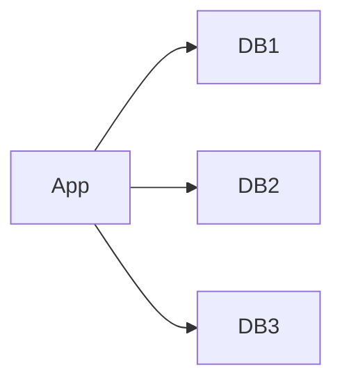

Now imagine two users update the same row simultaneously.

```
User A

↓

Balance = 500
```

```
User B

↓

Balance = 1000
```

Database 1 receives

```
500
```

Database 2 receives

```
1000
```

Which value is correct?

Who decides?

This problem is known as

**Write Conflict**.

---

# The Leader Solution

Instead of allowing every database to accept writes,

choose one database as the leader.


Now

Every write

must go through

the leader.

Followers never accept writes directly.

---

# Responsibilities

## Leader

Responsible for

- INSERT
- UPDATE
- DELETE
- Transaction Ordering
- Conflict Resolution
- Replication

---

## Followers

Responsible for

- SELECT
- Replication
- Backup
- Disaster Recovery
- Read Scaling

---

# Write Flow

Suppose a customer changes their address.

```
Client

↓

Leader

↓

Followers
```

Sequence

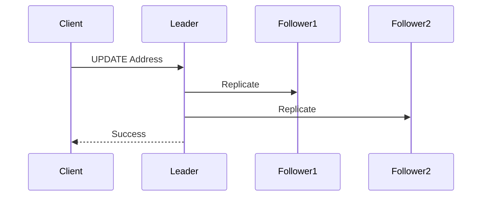

Notice

The client never talks directly to followers for writes.

---

# Read Flow

Reads can be distributed.

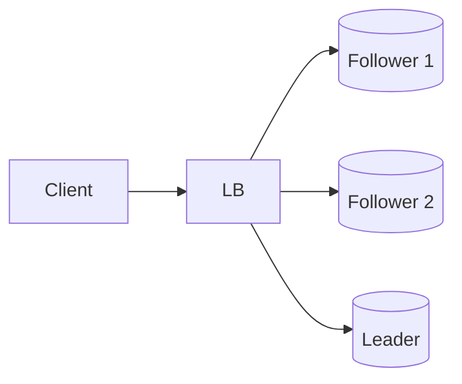

Advantages

- Better scalability
- Lower latency
- Reduced load on leader

---

# Example

Amazon receives

```
5 Million Reads/sec

50,000 Writes/sec
```

Instead of

```
1 Database
```

Amazon might deploy

```
1 Leader

20 Followers
```

Reads

↓

Followers

Writes

↓

Leader

---

# Why Writes Usually Go Through One Leader

Imagine

two leaders

accepting writes independently.

```
Leader A

↓

Price = ₹500
```

```
Leader B

↓

Price = ₹700
```

How should replicas resolve this conflict?

Leader-Follower avoids this entire problem.

---

# Replication Pipeline

The leader processes writes in order.

```
Write 1

↓

Write 2

↓

Write 3

↓

Followers Replay

1

2

3
```

Maintaining order is critical.

Otherwise

Followers could observe

```
3

↓

1

↓

2
```

leading to inconsistent state.

---

# What Exactly Gets Replicated?

Different databases replicate different things.

---

## MySQL

Replicates

```
Binary Log (Binlog)
```

Followers replay SQL changes.

---

## PostgreSQL

Replicates

```
Write Ahead Log (WAL)
```

Followers replay WAL records.

---

## Kafka

Replicates

```
Log Segments
```

Followers copy partition logs.

---

## MongoDB

Replicates

```
Oplog
```

Followers continuously tail the operation log.

---

> [!TIP]
> Every database uses different terminology.
>
> The underlying idea remains the same:
>
> **Capture writes → Send them to replicas → Replay them in order.**

---

# Read Scaling

Suppose

```
Reads

=

100,000/sec
```

One database becomes overloaded.

Solution

```mermaid
flowchart TD

Client

↓

Load Balancer

↓

Follower 1

Follower 2

Follower 3

Follower 4
```

Each follower handles part of the traffic.

---

# Advantages

✅ Excellent read scalability

✅ Simple architecture

✅ Easy operational model

✅ Easy backups

✅ Straightforward failover

---

# Disadvantages

❌ Leader becomes write bottleneck

❌ Replication lag

❌ Leader failure

❌ Cross-region latency

❌ Read-after-write inconsistency

---

# Read-After-Write Problem

Suppose

Customer updates

```
Phone Number
```

Leader

↓

Updated immediately.

Follower

↓

Still replicating.

Customer refreshes profile.

Load balancer sends request

↓

Follower.

Old phone number appears.

Customer thinks

"The update failed."

Actually

The update succeeded.

The follower was behind.

---

## Timeline

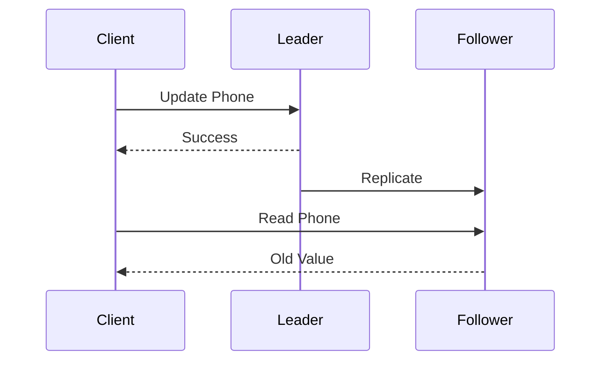

This is one of the most common production issues.

---

# Production Strategies

Large companies solve this in several ways.

## Strategy 1

Read Your Own Writes

Recent writes

↓

Always read from leader.

---

## Strategy 2

Sticky Session

User remains connected

to one replica

for a short period.

---

## Strategy 3

Wait for Replication

Delay read

until replicas catch up.

Higher latency.

Better consistency.

---

## Strategy 4

Session Token

The client sends the last observed version.

The load balancer routes the request

only to replicas that have reached that version.

---

# Failure Scenario

Suppose

Leader crashes.

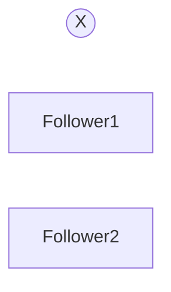

Questions immediately arise.

- Which follower becomes the new leader?
- How do applications discover the new leader?
- What if two followers both believe they are the leader?

These questions introduce:

- Leader Election
- Consensus
- Split Brain

We'll cover those in later chapters.

---

# Principal Engineer Insight

> [!IMPORTANT]
>
> Leader-Follower replication solves **write conflicts** by introducing a single authority for writes.
>
> However, it also creates a new challenge:
>
> **The leader becomes a bottleneck and a potential single point of failure.**
>
> Every distributed system must balance these competing concerns.

---

# Interview Conversation

**Interviewer**

Why don't followers accept writes?

**Weak Answer**

Because they are read replicas.

---

**Principal Engineer Answer**

Allowing multiple replicas to accept concurrent writes introduces conflict resolution problems. A leader serializes writes into a single ordered stream, simplifying replication and ensuring deterministic state across followers. The trade-off is that write throughput is limited by the leader, making leader capacity and failover critical design considerations.

---

# Common Interview Mistakes

> [!WARNING]
> Assuming followers always have the latest data.

---

> [!WARNING]
> Assuming adding followers improves write throughput.

Followers primarily improve **read throughput**.

---

> [!WARNING]
> Thinking leader failure is the hardest problem.

Leader replacement is relatively straightforward.

Preventing **split-brain** is much harder.

---

# Key Takeaways

- One leader accepts all writes.
- Followers replicate the leader's changes.
- Followers are typically used for read scaling.
- Replication lag is unavoidable.
- The leader simplifies ordering but becomes the write bottleneck.
- Leader failure leads to leader election, which requires consensus algorithms.

---

# Synchronous vs Asynchronous Replication

> [!IMPORTANT]
>
> The biggest difference between synchronous and asynchronous replication is **when the client receives a successful response**.
>
> Everything else is a consequence of that decision.

---

# The Fundamental Question

Imagine a user updates their profile.

```
PUT /users/123

Name = "Deepesh"
```

The leader receives the request.

Now it has a decision.

```
Should I immediately return

200 OK

?

OR

Should I first wait until replicas confirm the write?
```

This single decision defines the replication strategy.

---

# Mental Model

Imagine sending an important legal document.

Option 1

Drop it into the mailbox.

Immediately walk away.

---

Option 2

Wait until the recipient signs

"Received."

The first approach is

Fast.

The second is

Safer.

Exactly the same trade-off exists in distributed systems.

---

# Synchronous Replication

## Definition

The leader acknowledges the client **only after required replicas confirm the write.**

---

## Write Flow

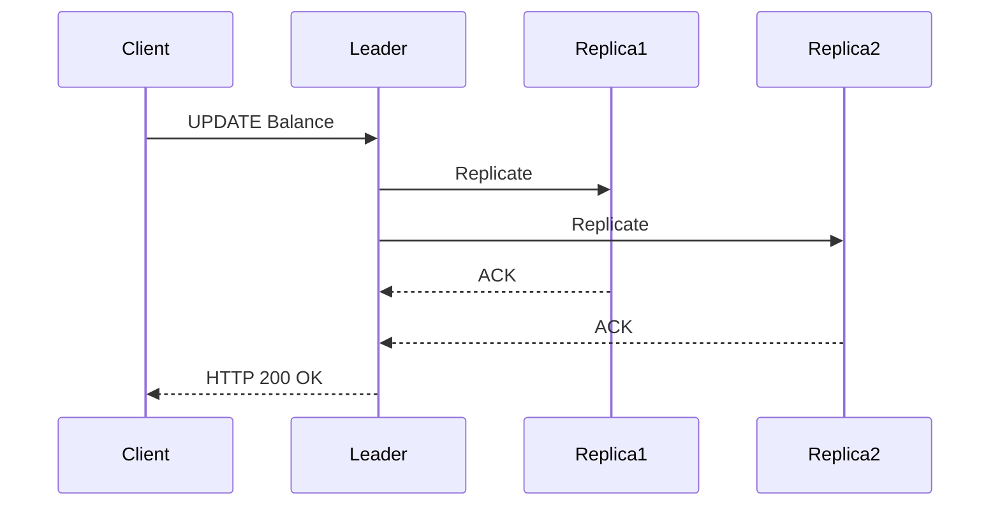

Notice carefully.

The client waits.

No response is sent until replication succeeds.

---

# Timeline

```
Client

↓

Leader

↓

Replica1

↓

Replica2

↓

ACK

↓

ACK

↓

Client receives Success
```

---

# Advantages

✅ Strong consistency

✅ Lower probability of data loss

✅ Easier failover

✅ Better durability

---

# Disadvantages

❌ Higher latency

❌ Lower throughput

❌ Slowest replica determines response time

❌ More sensitive to network latency

---

# Failure Scenario

Suppose

Replica 2

crashes.

```
Leader

↓

Replica 1

↓

Replica 2 (Down)
```

Question

Should the leader wait forever?

Obviously not.

Systems introduce

- Timeout
- Quorum
- Minimum ACK count

We'll discuss those shortly.

---

# Asynchronous Replication

Now let's consider another approach.

The leader immediately responds.

Replication happens later.

---

## Write Flow

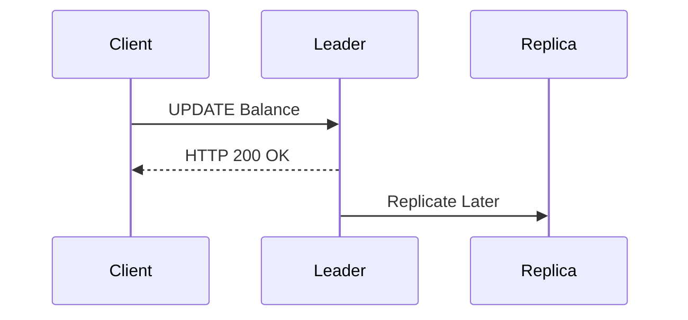

Notice something important.

The client receives success

before

replication completes.

---

# Timeline

```
Client

↓

Leader

↓

HTTP 200 OK

↓

Replica Updated Later
```

---

# Advantages

✅ Very low latency

✅ High throughput

✅ Excellent user experience

✅ Better write performance

---

# Disadvantages

❌ Possible data loss

❌ Replication lag

❌ Stale reads

❌ Harder failover

---

# Failure Scenario

This is one of the most common interview questions.

Suppose

```
Client

↓

Leader

↓

HTTP 200 OK
```

Immediately afterwards

the leader crashes.

Replication

never happened.

Follower

still contains

old data.

Question

Was the write successful?

The client thinks

Yes.

The database says

No.

The write is lost.

---

## Mermaid Diagram

```mermaid
sequenceDiagram

participant Client
participant Leader
participant Replica

Client->>Leader: Write

Leader-->>Client: Success

Note over Leader: Crash

Replica: Never received update
```

This is why asynchronous replication is faster but less durable.

---

# Principal Engineer Insight

> [!IMPORTANT]
>
> Every time you reduce latency,
> ask yourself:
>
> **"What happens if the leader crashes immediately afterwards?"**
>
> This question separates Senior Engineers from Principal Engineers.

---

# Semi-Synchronous Replication

Many production systems choose a compromise.

Instead of waiting for **all** replicas,

wait for

**at least one**.

```
Leader

↓

Replica A

ACK

↓

Client gets Success

↓

Replica B

↓

Replica C
```

This balances

- Latency
- Durability
- Availability

---

# MySQL Semi-Synchronous Replication

MySQL supports

Semi-Synchronous Replication.

Workflow

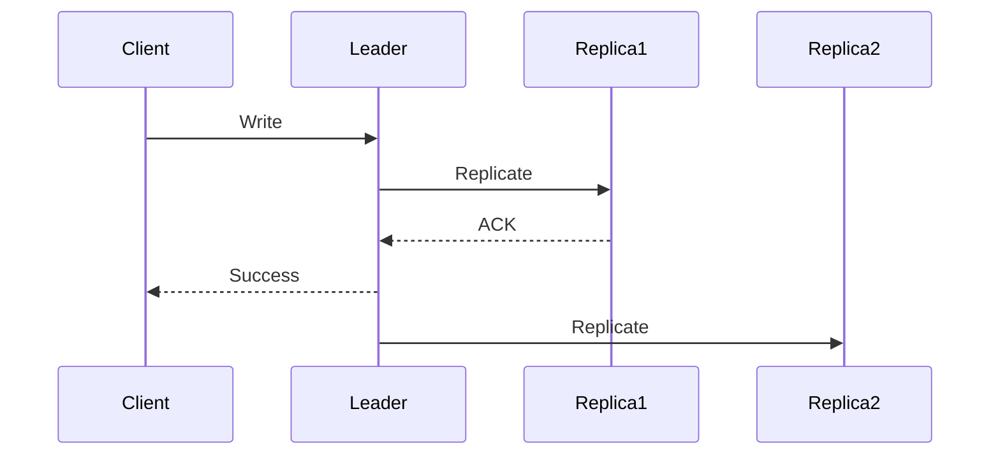

Notice

The leader waits for

only one

replica.

---

Advantages

- Better durability
- Lower latency than synchronous
- Less risk of data loss

---

# PostgreSQL

PostgreSQL allows configuring

```
synchronous_commit
```

Options include

- off
- local
- remote_write
- remote_apply
- on

Each option changes

when

the client receives success.

---

# MongoDB

MongoDB exposes this through

```
writeConcern
```

Examples

```
w:1

↓

Leader only
```

```
w:majority

↓

Majority ACK
```

```
w:0

↓

Fire and Forget
```

---

# Kafka

Kafka exposes the same idea.

Producer Configuration

```
acks=0

Fire and Forget
```

```
acks=1

Leader ACK
```

```
acks=all

ISR ACK
```

Exactly the same engineering trade-off.

Different terminology.

---

# Comparison Table

| Strategy | Client Waits? | Data Loss Risk | Latency | Throughput |
|-----------|---------------|----------------|----------|------------|
| Synchronous | Yes | Lowest | Highest | Lowest |
| Semi-Synchronous | Partial | Low | Medium | Medium |
| Asynchronous | No | Highest | Lowest | Highest |

---

# Production Decision Matrix

| Workload | Recommended Strategy |
|----------|----------------------|
| Banking | Synchronous |
| Payments | Synchronous |
| Inventory | Semi-Synchronous |
| Shopping Cart | Semi-Synchronous |
| Notifications | Asynchronous |
| Logging | Asynchronous |
| Analytics | Asynchronous |

---

# Interview Conversation

**Interviewer**

Why doesn't every company simply use synchronous replication?

---

**Weak Answer**

Because it's slower.

---

**Principal Engineer Answer**

Synchronous replication increases durability by ensuring replicas acknowledge writes before the client receives success. However, every acknowledgement adds network latency and limits throughput, particularly across regions. Applications with strict correctness requirements, such as banking, accept this trade-off. Consumer-facing systems like notifications or analytics often choose asynchronous replication because occasional data loss is less costly than increased latency.

---

# Common Interview Mistakes

> [!WARNING]
> Assuming asynchronous replication is unreliable.

It is reliable.

The question is **when** replicas become durable.

---

> [!WARNING]
> Thinking synchronous replication guarantees zero data loss.

Hardware failures, software bugs, and operator mistakes can still cause data loss.

---

> [!WARNING]
> Assuming every application requires synchronous replication.

Business requirements determine the replication strategy.

---

# Key Takeaways

- Replication strategies differ primarily in **when the client receives success**.
- Synchronous replication maximizes consistency and durability.
- Asynchronous replication minimizes latency.
- Semi-synchronous replication provides a practical compromise.
- MySQL, PostgreSQL, MongoDB, and Kafka all expose this trade-off using different terminology.
- A Principal Engineer always asks: **"What happens if the leader crashes immediately after acknowledging the client?"**

---

# How Replication Actually Works

> [!IMPORTANT]
>
> Replication is **not** implemented by copying the entire database after every write.
>
> That would be far too slow.
>
> Instead, databases replicate **changes**.

---

# The Core Idea

Imagine this table.

| ID | Name |
|----|------|
|1|Alice|

Now execute

```sql
UPDATE users
SET name='Bob'
WHERE id=1;

---

# How Replication Actually Works

> [!IMPORTANT]
> Replication is **not** implemented by copying the entire database after every write.
>
> That would be far too slow.
>
> Instead, databases replicate **changes**.

---

# The Core Idea

Imagine this table.

| ID | Name |
|----|------|
| 1 | Alice |

Now execute

```sql
UPDATE users
SET name = 'Bob'
WHERE id = 1;
```

Should the database send the **entire table** to every replica?

No.

Instead, it sends only the change (or an equivalent binary representation of that change).

This is significantly smaller and much faster.

---

# Replication Pipeline

Every database follows roughly the same pipeline.

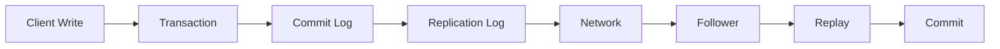

Different databases use different terminology, but the overall architecture is remarkably similar.

---

# Step 1 — Client Issues a Write

Example:

```text
UPDATE Balance

1000

↓

1500
```

The client sends the request to the leader.

---

# Step 2 — Leader Executes the Transaction

The leader performs several operations:

- Validates the SQL
- Acquires locks
- Updates memory
- Writes to the commit log

Only after durability is guaranteed does replication begin.

---

# Step 3 — Commit Log

Every serious database maintains an append-only log.

Think of it as the transaction history.

Example:

```text
LSN 101

INSERT User
```

```text
LSN 102

UPDATE Balance
```

```text
LSN 103

DELETE Order
```

Nothing is overwritten.

Everything is appended.

---

# Why Append-Only?

Appending is generally an O(1) operation.

Updating existing records requires random disk access.

Appending is much faster.

This is why nearly every modern distributed database is built around append-only logs.

---

# Step 4 — Followers Read the Log

Followers continuously ask:

```text
Any new entries?
```

Leader replies:

```text
LSN 104

↓

LSN 105

↓

LSN 106
```

Followers download only the missing entries.

---

## Replication Sequence

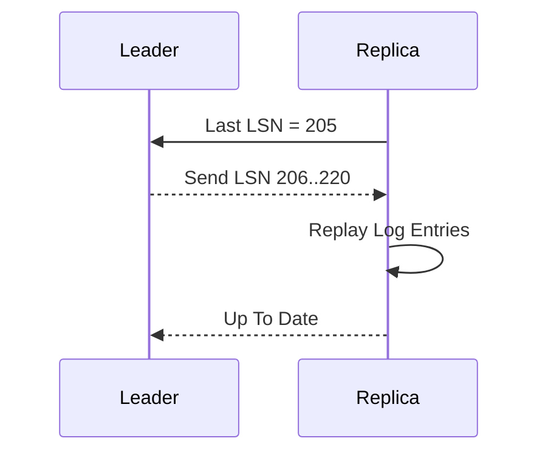

---

# Log Sequence Number (LSN)

Every committed change receives a monotonically increasing sequence number.

Example:

```text
100

101

102

103

104
```

Instead of asking

> Send me the entire database

the replica asks

> Send everything after LSN 104.

This makes replication extremely efficient.

---

# Recovery After Failure

Suppose a replica crashes.

Meanwhile, the leader continues processing writes.

Leader reaches:

```text
LSN = 500
```

Replica restarts remembering:

```text
Last Processed LSN = 420
```

The replica requests:

```text
421

↓

500
```

Only the missing changes are transferred.

---

# Production Example

Suppose a replica is offline for five minutes.

During that time, the leader processes:

```text
20,000 Transactions
```

Instead of copying an entire 1 TB database,

the leader sends only those 20,000 log records.

Recovery becomes dramatically faster.

---

# Snapshot vs Log Replay

Eventually the transaction log becomes too large.

How should a brand-new replica join?

## Option 1

Replay every log ever written.

```text
10 Years of Logs
```

Clearly impractical.

---

## Option 2

Take a database snapshot.

```text
Snapshot

↓

Transfer

↓

Replay Recent Logs
```

This is how most production databases initialize replicas.

---

## Replica Bootstrap

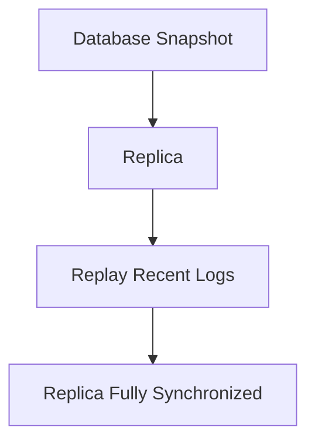

---

# Incremental Synchronization

Most of the time replicas need only recent changes.

Example:

Leader:

```text
LSN = 800
```

Replica:

```text
LSN = 799
```

Leader sends only:

```text
LSN 800
```

No unnecessary data transfer.

---

# Full Synchronization

Suppose a replica remains offline for three months.

Meanwhile, the leader deletes old logs.

The replica can no longer catch up using log replay alone.

The recovery process becomes:

```text
Fresh Snapshot

↓

Transfer Snapshot

↓

Replay Recent Logs
```

---

# How Popular Databases Implement Replication

| Database | Replication Source |
|------------|--------------------|
| MySQL | Binary Log (Binlog) |
| PostgreSQL | Write Ahead Log (WAL) |
| MongoDB | Oplog |
| Kafka | Partition Log |
| Cassandra | Commit Log + SSTables |
| Google Spanner | Paxos Log |
| CockroachDB | Raft Log |

Different names.

Same engineering principle.

---

# MySQL Replication

```text
Client

↓

Leader

↓

Binary Log

↓

Replica IO Thread

↓

Relay Log

↓

SQL Thread

↓

Database
```

The leader writes to the Binary Log.

Replica IO Thread downloads it.

Replica SQL Thread replays it.

---

# PostgreSQL Replication

```text
Client

↓

Primary

↓

Write Ahead Log (WAL)

↓

Streaming Replication

↓

Standby

↓

Replay WAL
```

Instead of replaying SQL statements,

PostgreSQL replays WAL records.

This is faster and more reliable.

---

# MongoDB Replication

MongoDB stores every operation inside the **Oplog**.

Followers continuously tail the oplog, similar to:

```bash
tail -f logfile
```

Every new operation is immediately replicated.

---

# Kafka Replication

Kafka itself is built around replication.

```text
Producer

↓

Leader Partition

↓

Follower Partitions

↓

Consumers
```

Followers continuously copy the leader's log segments.

---

# Principal Engineer Insight

> [!IMPORTANT]
> Nearly every modern distributed storage system is fundamentally a **replicated append-only log**.
>
> Databases differ primarily in:
>
> - How they store the log
> - How they replicate the log
> - How they elect leaders
> - How they resolve conflicts
>
> The core principle remains remarkably similar.

---

# Interview Conversation

**Interviewer**

How does a replica know what data it is missing?

**Weak Answer**

It asks the leader.

**Principal Engineer Answer**

Each committed transaction receives a monotonically increasing sequence number (LSN, offset, term/index, etc.). The replica remembers the highest processed sequence number and requests only entries beyond that point. This enables efficient incremental synchronization instead of transferring the full dataset.

---

# Common Interview Mistakes

> [!WARNING]
> Thinking replication copies the entire database after every write.

---

> [!WARNING]
> Confusing snapshots with replication.

Snapshots initialize replicas.

Replication keeps replicas synchronized afterward.

---

> [!WARNING]
> Assuming logs grow forever.

Production databases periodically create snapshots and safely remove obsolete log segments.

---

# Key Takeaways

- Replication is log-based.
- Followers replay committed changes.
- Sequence numbers (LSN, offsets, etc.) enable incremental synchronization.
- Snapshots bootstrap new replicas.
- Log replay keeps replicas synchronized.
- Nearly every modern distributed database is fundamentally built around an append-only log.

---

# Multi-Leader Replication (Active-Active Replication)

> [!IMPORTANT]
> Multi-Leader Replication allows multiple nodes to accept write requests simultaneously.
>
> This improves availability and geographic locality but introduces one of the hardest problems in distributed systems:
>
> **Conflicting writes.**

---

# Why Single Leader Is Sometimes Not Enough

Suppose your application is deployed globally.

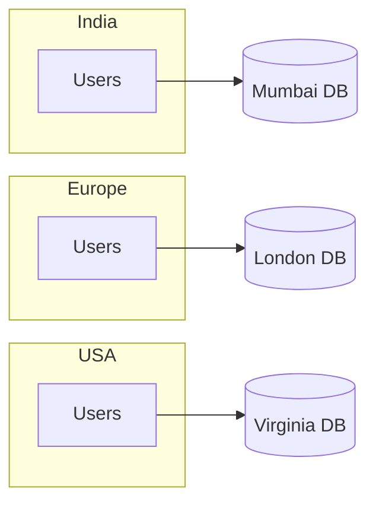

If Mumbai is the only leader,

every write from Europe and America must travel to India.

Problems:

- High latency
- Poor user experience
- Cross-region dependency
- Increased network cost

---

# The Idea Behind Multi-Leader

Instead of having one leader,

allow every region to accept writes.

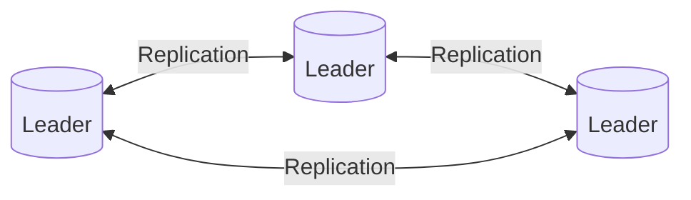

Each region accepts local writes.

Replication synchronizes data between leaders.

---

# Benefits

Users write to the nearest region.

Example:

```
Indian User

↓

Mumbai

10 ms
```

instead of

```
Indian User

↓

Virginia

250 ms
```

Latency improves dramatically.

---

# The Problem

Suppose two users edit the same profile.

```
Mumbai

Name = Alice
```

At the same time

```
London

Name = Alicia
```

Both writes succeed.

Later replication begins.

Question:

Which value should survive?

---

# Write Conflict

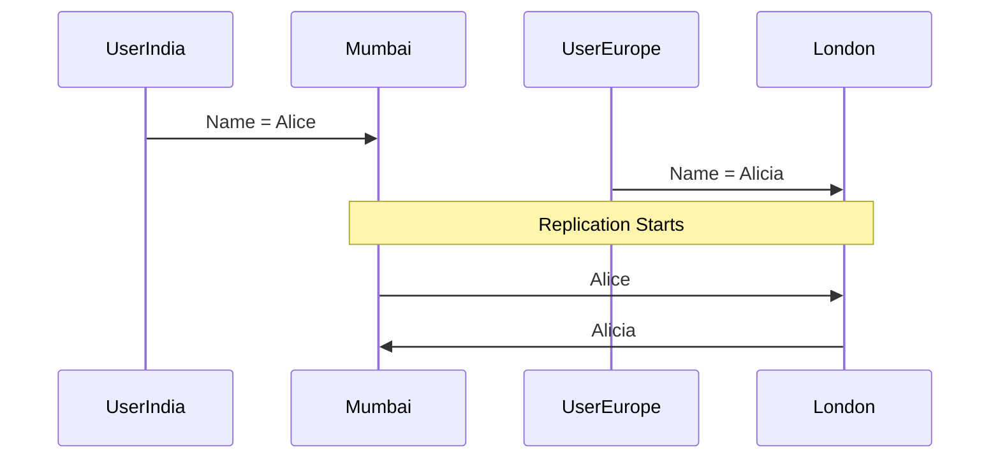

Now both leaders disagree.

This is called a

**Write Conflict.**

---

# Why Leader-Follower Doesn't Have This Problem

Leader-Follower

```
One Writer

↓

One Order

↓

No Conflict
```

Multi-Leader

```
Many Writers

↓

Many Orders

↓

Conflicts
```

Conflict resolution becomes mandatory.

---

# Conflict Resolution Strategies

There is no universally correct strategy.

Different applications choose different approaches.

---

# Strategy 1 — Last Write Wins (LWW)

Every write contains a timestamp.

Example:

| Timestamp | Value |
|-----------|-------|
|10:00:01|Alice|
|10:00:05|Alicia|

Latest timestamp wins.

Result:

```
Alicia
```

---

## Advantages

- Simple
- Fast
- Easy to implement

---

## Disadvantages

Updates can disappear.

Example

```
Alice

↓

Bob

↓

Charlie
```

Only Charlie survives.

Previous updates are lost.

---

> [!WARNING]
> Last Write Wins is simple but may silently discard user data.

---

# Strategy 2 — Manual Resolution

Git uses this idea.

Developer sees

```
Conflict Detected
```

Developer decides

which version to keep.

Suitable when human review is acceptable.

---

# Strategy 3 — Merge Changes

Instead of choosing one value,

combine them.

Example

Shopping Cart

Region A

```
Apple
```

Region B

```
Banana
```

Merged Result

```
Apple

Banana
```

No information lost.

---

# Strategy 4 — Domain-Specific Rules

Business rules determine the winner.

Example

Inventory

Lowest quantity wins.

Example

User Profile

Latest phone number wins.

Example

Bank Account

Never merge automatically.

Require transaction reconciliation.

---

# Conflict Detection

How does a database know a conflict exists?

Suppose

Replica A

Version 15

Replica B

Version 15

Both independently update.

Now

Replica A

Version 16

Replica B

Version 16

Same version.

Different values.

Conflict detected.

---

# Version Vectors (Preview)

Modern databases often attach metadata.

Instead of storing only

```
Version = 16
```

they store

```
Replica A

↓

16

Replica B

↓

15
```

This allows databases to understand

which updates happened independently.

We'll study Vector Clocks in detail later.

---

# Where Multi-Leader Is Used

Suitable for:

- Multi-region applications
- Offline-first mobile apps
- Collaborative editing
- Distributed caches
- Shopping carts
- Document synchronization

---

# Where It Is Dangerous

Avoid Multi-Leader for:

- Banking
- Payment processing
- Stock trading
- Financial ledgers
- Inventory reservation

Conflicts are too expensive.

---

# Production Examples

| System | Multi-Leader Support |
|----------|---------------------|
| CouchDB | Yes |
| Azure Cosmos DB | Yes (Configurable) |
| Redis Enterprise Active-Active | Yes |
| Oracle GoldenGate | Yes |
| PostgreSQL BDR | Yes |
| MySQL Group Replication | Yes (Certification-based) |

---

# Principal Engineer Insight

> [!IMPORTANT]
> Multi-Leader Replication is rarely chosen because it is faster.
>
> It is chosen because business requirements demand local writes in multiple regions.
>
> Every gain in availability introduces additional complexity in conflict detection, conflict resolution, operational tooling, and testing.

---

# Interview Conversation

**Interviewer**

Why doesn't every distributed database use Multi-Leader Replication?

**Weak Answer**

Because it's complicated.

**Principal Engineer Answer**

Multi-Leader Replication eliminates the single write bottleneck and enables low-latency regional writes. However, once multiple leaders accept concurrent updates, the system must detect and resolve conflicting writes. Conflict resolution is often domain-specific and significantly increases operational complexity. Unless local writes across multiple regions are a business requirement, Leader-Follower Replication remains the simpler and safer architecture.

---

# Common Interview Mistakes

> [!WARNING]
> Assuming Multi-Leader is always faster.

Replication and conflict resolution introduce additional overhead.

---

> [!WARNING]
> Assuming timestamps alone solve all conflicts.

Clock skew can make timestamps unreliable.

---

> [!WARNING]
> Assuming conflicts are rare.

In globally distributed systems, concurrent updates are expected.

---

# Key Takeaways

- Multi-Leader Replication allows multiple writable nodes.
- It improves regional latency and availability.
- Concurrent writes introduce conflicts.
- Conflict resolution is application-specific.
- Last Write Wins is simple but can lose data.
- Multi-Leader Replication should be chosen only when business requirements justify its complexity.

---

# Leaderless Replication (Amazon Dynamo & Apache Cassandra)

> [!IMPORTANT]
> Leaderless Replication eliminates the single leader entirely.
>
> Every replica can accept reads and writes.
>
> This dramatically improves availability but requires sophisticated algorithms to keep replicas consistent.

---

# Why Move Beyond Leader-Follower?

Leader-Follower has one major limitation.

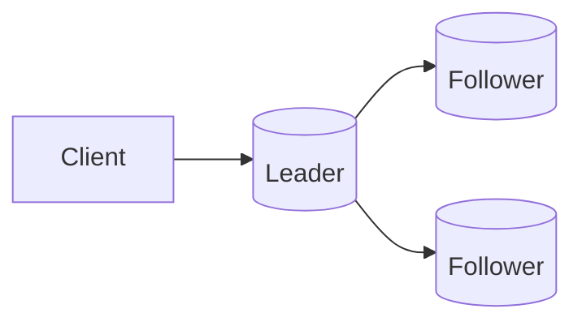

Every write must pass through the leader.

Problems:

- Leader becomes the write bottleneck
- Leader failure requires leader election
- Cross-region writes become expensive
- Horizontal write scalability is limited

Amazon engineers faced exactly these challenges while building their shopping cart service.

---

# Amazon's Problem

Around 2006, Amazon observed:

- Millions of customers
- Global deployments
- Frequent server failures
- Continuous hardware replacements

Most importantly,

they had one strict business requirement:

> **The shopping cart should never become unavailable.**

Even if several servers fail.

This led to the Dynamo paper.

---

# The Leaderless Idea

Instead of electing one leader,

every replica accepts writes.

```mermaid
flowchart LR

Client

Client --> A[(Replica A)]

Client --> B[(Replica B)]

Client --> C[(Replica C)]
```

No leader.

No followers.

Every node is equal.

---

# First Question

If every replica accepts writes...

Who orders writes?

Answer

Nobody.

That's why quorum protocols become necessary.

---

# Replication Factor (N)

Leaderless systems replicate every object multiple times.

Suppose

```
Replication Factor (N) = 3
```

Three replicas contain the same data.

```mermaid
flowchart LR

Client

Client --> A[(Replica A)]

Client --> B[(Replica B)]

Client --> C[(Replica C)]
```

---

# Writing Data

Suppose

```
Balance = ₹1000
```

Client sends the write.

Coordinator forwards it.

```mermaid
sequenceDiagram

participant Client
participant Coordinator
participant A
participant B
participant C

Client->>Coordinator: Write ₹1000

Coordinator->>A: Write

Coordinator->>B: Write

Coordinator->>C: Write
```

Now comes the interesting question.

Should the coordinator wait for:

- One replica?
- Two replicas?
- All replicas?

---

# Write Quorum (W)

The coordinator waits for **W acknowledgements** before replying.

Example

```
Replication Factor (N) = 3

Write Quorum (W) = 2
```

Meaning

```
Replica A

ACK

Replica B

ACK

↓

Client receives Success

Replica C

Can finish later.
```

---

# Read Quorum (R)

Reading follows the same idea.

Suppose

```
Read Quorum (R) = 2
```

Coordinator asks

two replicas.

```
Replica A

↓

₹1000

Replica B

↓

₹1000
```

Return result.

---

# The Famous Formula

One of the most common interview questions.

```
R + W > N
```

Where

```
R = Read Quorum

W = Write Quorum

N = Replication Factor
```

---

# Why Does This Work?

Suppose

```
N = 3

W = 2

R = 2
```

Notice

```
2 + 2 > 3
```

At least

one replica

must overlap.

```mermaid
flowchart TD

WriteSet[Write Quorum]

ReadSet[Read Quorum]

WriteSet --> Shared[(At Least One Shared Replica)]

ReadSet --> Shared
```

This overlapping replica ensures that the read has a high probability of seeing the latest committed value.

---

# Example

Replication Factor

```
3
```

Write reaches

```
A

B
```

Later

Read asks

```
B

C
```

Replica B belongs to both quorums.

Latest value is observed.

---

# What If R + W ≤ N?

Example

```
N = 3

W = 1

R = 1
```

Now

```
1 + 1

≤

3
```

Write

↓

Replica A

Read

↓

Replica C

Replica C may never have received the latest update.

Stale reads become much more likely.

---

> [!IMPORTANT]
> The quorum formula does **not** guarantee perfect consistency.
>
> It guarantees that read and write quorums overlap **assuming successful replication and no conflicting concurrent writes**.
>
> Real systems still need mechanisms to handle failures, concurrent updates, and replica divergence.

---

# Availability vs Consistency

Suppose one replica fails.

```
A

Healthy

B

Healthy

C

Down
```

Can writes continue?

Yes.

Because

```
W = 2
```

Two acknowledgements are sufficient.

This is one reason leaderless systems achieve high availability.

---

# Failure Scenario

Suppose

Replica C

is offline.

Write succeeds on

```
A

B
```

Hours later,

Replica C returns.

Question

How does Replica C catch up?

Several mechanisms exist:

- Read Repair
- Anti-Entropy
- Hinted Handoff

We'll discuss each shortly.

---

# Coordinator Node

Leaderless does **not** mean "no coordination."

One node acts as a temporary **coordinator** for each request.

Responsibilities:

- Route writes
- Collect acknowledgements
- Detect timeouts
- Merge responses
- Return results

The coordinator changes from request to request.

It is **not** a permanent leader.

---

# Production Example

## Shopping Cart

Requirements

- Never reject writes
- Temporary inconsistency acceptable
- Eventually converge

Leaderless replication is an excellent fit.

---

## Banking Ledger

Requirements

- Strong ordering
- No conflicting writes
- Strict correctness

Leaderless replication is usually a poor fit.

Leader-based consensus systems are preferred.

---

# Principal Engineer Insight

> [!IMPORTANT]
> Leaderless Replication removes the leader bottleneck but transfers complexity into quorum protocols, conflict resolution, replica repair, and reconciliation.
>
> You are not eliminating complexity—you are moving it.

---

# Interview Conversation

**Interviewer**

Why does Cassandra not need a leader?

**Weak Answer**

Because every node accepts writes.

**Principal Engineer Answer**

Cassandra distributes writes across replicas using a coordinator node for each request. Instead of relying on a permanent leader, it uses configurable read and write quorums. Consistency emerges from quorum overlap (`R + W > N`) and background repair mechanisms rather than from a single authoritative writer.

---

# Common Interview Mistakes

> [!WARNING]
> Thinking leaderless means there is no coordinator.

Each request still has a coordinator.

---

> [!WARNING]
> Assuming `R + W > N` guarantees linearizability.

It improves consistency but does not automatically provide linearizable semantics under all failure scenarios.

---

> [!WARNING]
> Assuming every replica always has identical data.

Temporary divergence is expected.

Repair mechanisms reconcile replicas over time.

---

# Key Takeaways

- Leaderless Replication removes the permanent leader.
- Every replica can participate in reads and writes.
- Quorum protocols coordinate consistency.
- `R + W > N` increases the probability of reading the latest value.
- Coordinator nodes are temporary request routers, not leaders.
- Background repair mechanisms are essential to maintain convergence.

---

# Healing Replica Divergence

> [!IMPORTANT]
> In leaderless systems, replicas are expected to diverge temporarily.
>
> The real challenge is **how they become consistent again.**

---

# Why Do Replicas Diverge?

Suppose we have three replicas.

```mermaid
flowchart LR

Client --> Coordinator

Coordinator --> A[(Replica A)]
Coordinator --> B[(Replica B)]
Coordinator --> C[(Replica C)]
```

Replication Factor

```
N = 3
```

Now imagine Replica C crashes.

The client writes

```
Balance = ₹5000
```

Only

```
Replica A

Replica B
```

receive the update.

Replica C still stores

```
Balance = ₹4000
```

Now replicas disagree.

This is called **Replica Divergence**.

---

# The Goal

Eventually every replica should contain

```
Balance = ₹5000
```

Question

How?

Distributed databases use several complementary techniques.

---

# Read Repair

One of the simplest repair mechanisms.

Suppose

```
Replica A

₹5000
```

```
Replica B

₹5000
```

```
Replica C

₹4000
```

Client performs a read.

Coordinator queries multiple replicas.

```mermaid
sequenceDiagram

participant Client
participant Coordinator
participant A
participant B
participant C

Client->>Coordinator: Read Balance

Coordinator->>A: Read

Coordinator->>B: Read

Coordinator->>C: Read

A-->>Coordinator: ₹5000

B-->>Coordinator: ₹5000

C-->>Coordinator: ₹4000
```

Coordinator detects inconsistency.

Replica C is stale.

Coordinator sends

```
Update

↓

Replica C

↓

₹5000
```

Now all replicas agree.

---

# Blocking Read Repair

Client waits

until repair completes.

Advantages

- Stronger consistency

Disadvantages

- Higher read latency

---

# Background Read Repair

Coordinator immediately responds

using the latest value.

Replica repair happens later.

Advantages

- Lower latency

Trade-off

- Replica remains stale for a short period.

---

# Hinted Handoff

Suppose Replica C is completely offline.

```
A

Healthy

B

Healthy

C

Down
```

Question

Should the write fail?

No.

Instead,

Coordinator temporarily stores

a **Hint**.

```
Hint

↓

Replica C

↓

Balance = ₹5000
```

When Replica C comes back,

Coordinator replays the stored hint.

```mermaid
flowchart LR

Write --> Coordinator

Coordinator --> Hint[(Hint Storage)]

ReplicaC[(Replica C Offline)]

Hint --> ReplicaC
```

---

# Advantages

- Higher availability
- Faster recovery
- No client retry required

---

# Limitation

Hints are temporary.

If Replica C stays offline for days,

the hint may expire.

Another repair mechanism becomes necessary.

---

# Anti-Entropy Repair

Eventually every replica must be compared.

Question

Should we compare

every row

of

every table?

Suppose database size

```
50 TB
```

Impossible.

Instead,

databases compare

summaries.

---

# Merkle Trees

A Merkle Tree is a hash tree.

Instead of comparing every record,

compare hashes.

```text
                Root Hash
               /         \
          Hash A         Hash B
         /     \        /      \
      H1       H2     H3       H4
```

If

```
Root Hash

matches
```

Entire subtree matches.

No further work required.

If

```
Hash B

differs
```

Only that branch is examined.

Huge performance improvement.

---

# Merkle Tree Repair

```mermaid
flowchart TD

ReplicaA --> Compare[Compare Root Hash]

ReplicaB --> Compare

Compare --> Same[Hashes Equal]

Compare --> Different[Hashes Different]

Different --> Repair[Transfer Missing Data]
```

Only changed ranges are synchronized.

---

# Why Merkle Trees Matter

Imagine

```
100 Million Rows
```

Without Merkle Trees

compare

100 Million rows.

With Merkle Trees

compare

a few hundred hashes.

Massive efficiency gain.

---

# Sloppy Quorum

Normal quorum

writes only to

the correct replicas.

Suppose

Replica B

is unavailable.

Instead of failing,

write temporarily goes to

Replica D.

```mermaid
flowchart LR

Coordinator --> A

Coordinator --> D

B[(Replica B Down)]
```

Later,

Replica D forwards data

to Replica B.

Availability improves.

---

# Gossip Protocol

Question

How do nodes know

which replicas are alive?

Answer

They continuously gossip.

Every node periodically exchanges metadata.

```
Node A

↓

Node B

↓

Node C

↓

Node D
```

Eventually

every node knows

cluster membership.

---

## Gossip Example

```mermaid
flowchart LR

A --> B

B --> C

C --> D

D --> A
```

Information spreads

like rumors

through a social network.

---

# Failure Detection

Knowing that a node hasn't responded

does not necessarily mean

it has failed.

Maybe

- Network congestion
- GC pause
- Temporary overload

Modern systems use

**Phi Accrual Failure Detector**

instead of fixed timeouts.

Instead of saying

```
Alive

or

Dead
```

Phi estimates

the probability

that a node has failed.

Much more robust.

---

# Putting It All Together

Suppose Replica C fails.

```
Write

↓

Replica A

Replica B
```

Replica C recovers.

System performs

1. Hinted Handoff
2. Read Repair
3. Anti-Entropy Repair
4. Merkle Tree Comparison

Eventually

all replicas converge.

---

# Production Example

Apache Cassandra uses

- Gossip Protocol
- Hinted Handoff
- Read Repair
- Anti-Entropy Repair
- Merkle Trees

to maintain eventual consistency.

No permanent leader is required.

---

# Principal Engineer Insight

> [!IMPORTANT]
> Eventual consistency is **not** "hope that replicas become consistent."
>
> It is a carefully engineered process consisting of:
>
> - Quorum protocols
> - Failure detection
> - Replica repair
> - Background synchronization
> - Conflict resolution
>
> Without these mechanisms, eventual consistency would never converge.

---

# Interview Conversation

**Interviewer**

Replica C has been offline for six hours.

How does Cassandra recover?

---

**Weak Answer**

It syncs the data.

---

**Principal Engineer Answer**

Recovery depends on the outage duration. If hints are still available, Hinted Handoff quickly replays the missed writes. Otherwise, Anti-Entropy Repair compares Merkle Trees to identify divergent token ranges and transfers only the missing data. Read Repair may also update stale replicas during client reads. These mechanisms work together to restore eventual consistency efficiently.

---

# Common Interview Mistakes

> [!WARNING]
> Thinking Read Repair alone guarantees consistency.

Read Repair only repairs data that is read.

---

> [!WARNING]
> Assuming Hinted Handoff stores data forever.

Hints expire.

Long outages require Anti-Entropy Repair.

---

> [!WARNING]
> Thinking Merkle Trees store user data.

Merkle Trees store hashes used for comparison.

---

> [!WARNING]
> Assuming Gossip Protocol replicates application data.

Gossip exchanges cluster metadata, not user records.

---

# Key Takeaways

- Replica divergence is expected in leaderless systems.
- Read Repair fixes inconsistencies during reads.
- Hinted Handoff stores temporary writes for unavailable replicas.
- Anti-Entropy Repair performs full background synchronization.
- Merkle Trees make large-scale repair efficient.
- Gossip Protocol spreads cluster membership information.
- Failure detectors estimate node health probabilistically.
- Eventual consistency is achieved through multiple coordinated mechanisms.

---

# Replication in Real Production Systems

Understanding replication theory is important.

Understanding how production databases implement replication is what differentiates a Principal Engineer.

This section compares the replication architectures used by the world's most popular distributed databases.

---

# Replication Strategy Comparison

| Database | Replication Model | Ordering Mechanism | Consistency | Typical Workload |
|-----------|-------------------|-------------------|-------------|------------------|
| MySQL | Leader-Follower | Binlog Position / GTID | Strong | OLTP |
| PostgreSQL | Leader-Follower | WAL LSN | Strong | OLTP |
| MongoDB | Leader-Follower | Oplog Timestamp | Tunable | Document Store |
| Kafka | Leader-Follower | Partition Offset | Configurable | Event Streaming |
| Cassandra | Leaderless | Timestamp + Repair | Eventual | Massive Scale |
| Dynamo | Leaderless | Vector Clocks | Eventual | Shopping Cart |
| CockroachDB | Consensus (Raft) | Log Index | Strong | Distributed SQL |
| Google Spanner | Consensus (Paxos) | Paxos Log | Strong | Global SQL |

---

# Replication Log Comparison

Although implementations differ, every modern distributed database maintains an ordered log of committed operations.

| Database | Internal Log |
|-----------|--------------|
| MySQL | Binary Log (Binlog) |
| PostgreSQL | Write Ahead Log (WAL) |
| MongoDB | Oplog |
| Kafka | Partition Log |
| Cassandra | Commit Log |
| CockroachDB | Raft Log |
| Spanner | Paxos Log |

The names differ.

The underlying idea is remarkably similar.

Every committed operation is appended to a durable log before replicas process it.

---

# MySQL Replication

## Architecture

```mermaid
flowchart LR

Client

-->

Primary

-->

Binlog

-->

Replica IO Thread

-->

Relay Log

-->

Replica SQL Thread

-->

Replica Database
```

---

## Write Flow

1. Client sends SQL statement.
2. Primary executes the transaction.
3. Transaction commits.
4. Primary writes the change into the Binary Log.
5. Replica IO Thread downloads Binlog entries.
6. Replica stores them inside the Relay Log.
7. Replica SQL Thread replays the changes.

---

## Advantages

- Mature
- Easy to understand
- Excellent tooling
- Large ecosystem

---

## Limitations

- Single write leader
- Replication lag
- Leader bottleneck
- Failover required

---

# PostgreSQL Streaming Replication

PostgreSQL does **not** replicate SQL statements.

Instead,

it replicates

Write Ahead Log (WAL)

records.

---

## Architecture

```mermaid
flowchart LR

Client

-->

Primary

-->

WAL

-->

Streaming Replication

-->

Standby

-->

Replay WAL
```

---

## Why WAL Instead of SQL?

Suppose

```sql
UPDATE accounts
SET balance = balance + 100
WHERE id = 10;
```

Different execution plans

could produce different internal operations.

Instead,

PostgreSQL replicates the exact storage-level modifications.

Advantages

- Faster
- Deterministic
- More reliable

---

# MongoDB Replica Set

MongoDB uses

Replica Sets.

One node becomes

Primary.

Others become

Secondaries.

---

## Architecture

```mermaid
flowchart LR

Client

-->

Primary

-->

Oplog

-->

Secondary A

Primary

-->

Secondary B
```

Every write

is appended

to the Oplog.

Secondaries continuously replay it.

---

# Kafka Replication

Kafka itself is built on replication.

Each partition has

- One Leader
- Multiple Followers

---

## Architecture

```mermaid
flowchart LR

Producer

-->

Leader Partition

-->

Follower 1

Leader Partition

-->

Follower 2

Follower 1

-->

Consumer

Leader Partition

-->

Consumer
```

---

## Important Difference

Kafka replicates

messages

instead of

database rows.

Everything else

is conceptually similar.

---

# Cassandra Replication

Cassandra removes the leader entirely.

Every node

can coordinate requests.

Replication uses

- Commit Log
- MemTable
- SSTables
- Gossip
- Hinted Handoff
- Read Repair

Unlike relational databases,

replication is decentralized.

---

# CockroachDB

CockroachDB stores data inside

Raft Groups.

Each range

maintains its own replicated Raft Log.

```mermaid
flowchart LR

Client

-->

Range Leader

-->

Follower A

Range Leader

-->

Follower B
```

Unlike MySQL,

every range has

its own leader.

There is no single leader

for the entire database.

---

# Google Spanner

Spanner also uses replicated logs,

but instead of Raft,

Google chose

Paxos.

Combined with

TrueTime,

Spanner provides globally consistent transactions.

---

# Production Trade-offs

| System | Strength | Weakness |
|----------|----------|----------|
| MySQL | Simplicity | Single Leader |
| PostgreSQL | Strong Durability | Cross-region latency |
| MongoDB | Flexible Documents | Replica elections |
| Kafka | Massive Throughput | Partition ordering only |
| Cassandra | Extreme Availability | Eventual consistency |
| CockroachDB | Global SQL | Higher latency |
| Spanner | Global Consistency | Operational complexity |

---

# Change Data Capture (CDC)

Replication logs have another important use.

Instead of only feeding replicas,

they can publish events.

This is called

Change Data Capture (CDC).

---

# Why CDC Exists

Suppose an order is created.

Without CDC

```
Order Service

↓

Database

↓

Notification Service polls

↓

Analytics polls

↓

Search polls
```

Every service repeatedly queries the database.

This wastes resources.

---

With CDC

```
Order Service

↓

Database

↓

Replication Log

↓

CDC Engine

↓

Kafka

↓

Consumers
```

Every service receives events automatically.

---

# CDC Architecture

```mermaid
flowchart LR

Application

-->

MySQL

-->

Binlog

-->

Debezium

-->

Kafka

Kafka

-->

Search

Kafka

-->

Analytics

Kafka

-->

Notification

Kafka

-->

Recommendation
```

---

# Why Debezium Is Popular

Debezium never queries database tables.

Instead,

it continuously reads

database replication logs.

Examples

| Database | Source |
|-----------|---------|
| MySQL | Binlog |
| PostgreSQL | WAL |
| MongoDB | Oplog |
| SQL Server | Transaction Log |

Advantages

- Near real-time
- Minimal database load
- Reliable ordering
- Easy integration with Kafka

---

# Split Brain

One of the most dangerous failures in distributed systems is **Split Brain**.

Split Brain occurs when multiple nodes simultaneously believe they are the leader and begin accepting writes independently.

---

## Example

Suppose we have a leader and two replicas.

```mermaid
flowchart LR

Leader[(Leader)]

Replica1[(Replica 1)]

Replica2[(Replica 2)]

Leader --> Replica1

Leader --> Replica2
```

Now a network partition occurs.

```mermaid
flowchart LR

subgraph Partition A

Leader[(Leader)]

Replica1[(Replica 1)]

end

subgraph Partition B

Replica2[(Replica 2)]

end

Leader -. Network Partition .- Replica2
```

Replica2 cannot communicate with the leader.

If Replica2 incorrectly elects itself as a leader while the original leader is still accepting writes, two leaders now exist.

This is Split Brain.

---

# Why Split Brain Is Dangerous

Imagine a banking application.

Leader A processes

```
Transfer ₹10,000
```

Leader B processes

```
Transfer ₹20,000
```

Both transactions are considered successful.

Later the partition heals.

Which transaction is correct?

Without consensus,

there is no correct answer.

Data corruption becomes possible.

---

# How Modern Systems Prevent Split Brain

Distributed databases never rely on simple heartbeat checks alone.

Instead they use

- Raft
- Paxos
- ZooKeeper
- etcd
- Majority voting

A node becomes leader only after receiving votes from a majority of replicas.

This guarantees that at most one leader can exist at a time.

---

# Real Production Example

Suppose a Kubernetes cluster stores its state inside etcd.

If a node becomes isolated,

it cannot simply declare itself leader.

It must first obtain votes from a majority.

Without majority,

it refuses to accept writes.

Availability decreases,

but correctness is preserved.

---

# Replication Metrics

A Principal Engineer should always know which metrics to monitor.

---

## Replication Lag

Time difference between

Leader

and

Replica.

Example

```
Leader

12:00:00.000

Replica

12:00:00.120
```

Lag

```
120 ms
```

---

## Apply Lag

Replication has two phases.

1. Receive log
2. Apply log

A replica may receive logs quickly

but apply them slowly because of

- CPU saturation
- Disk contention
- Lock contention

Monitoring only network lag is insufficient.

---

## Replication Queue Length

Suppose

```
Leader

↓

10,000 pending log entries
```

Replica has not yet replayed them.

This queue should be monitored.

Growing queues usually indicate

- Slow disks
- Slow CPU
- Network bottlenecks

---

## Replica Health

Monitor

- Alive
- Offline
- Recovering
- Synchronizing

Applications should avoid routing reads to unhealthy replicas.

---

## Failover Time

If the leader crashes,

measure

```
Failure

↓

Leader Election

↓

Client Recovery
```

Typical production targets

- < 5 seconds
- < 30 seconds

depending on workload.

---

## Recovery Time

Suppose an entire region fails.

How long until

every replica

is fully synchronized?

Measure

Recovery Time Objective (RTO).

---

## Recovery Point Objective (RPO)

How much committed data can be lost?

Examples

```
RPO = 0
```

No data loss acceptable.

Example

Banking.

---

```
RPO = 5 minutes
```

Five minutes of data loss acceptable.

Example

Analytics.

---

# Principal Engineer Decision Framework

Before selecting a replication strategy,

answer these questions.

---

## Question 1

What is the write rate?

```
100 writes/sec

or

2 million writes/sec?
```

---

## Question 2

How many reads occur?

Read-heavy systems

benefit greatly from replication.

---

## Question 3

Can stale data be tolerated?

Examples

Instagram Likes

Yes.

Account Balance

No.

---

## Question 4

How expensive is downtime?

Example

Shopping Cart

High availability required.

Example

Payroll System

Temporary downtime may be acceptable.

---

## Question 5

How many regions?

Single Region

↓

Leader-Follower is often sufficient.

Global

↓

Multi-Leader or Consensus may become necessary.

---

# Failure Scenario Walkthrough

Suppose

Leader crashes immediately after acknowledging the client.

Questions to ask

- Was replication synchronous?
- Was replication asynchronous?
- Did replicas receive the write?
- Was the transaction durable?
- Can failover occur safely?

These questions determine whether data is lost.

---

# Architecture Review Example

Suppose a design review contains this statement.

> "We'll deploy five replicas to improve write performance."

Questions a Principal Engineer should ask.

- Why will write performance improve?
- Does every replica accept writes?
- Is replication synchronous?
- What is the write bottleneck?
- Is the leader still the only writer?
- Have replication costs been measured?

Good architecture reviews challenge assumptions rather than accepting them.

---

# Replication Patterns Used by Large Companies

| Company | Typical Pattern |
|----------|----------------|
| Amazon | Leaderless (Dynamo) |
| Netflix | Leader-Follower + CDC |
| Google | Paxos Replication |
| Meta | TAO + MySQL Replication |
| Uber | MySQL + CDC + Kafka |
| LinkedIn | Espresso + Kafka |
| GitHub | MySQL Replication |
| Stripe | Strong Consistency + Multi-Region Replication |

Notice that no single replication strategy fits every workload.

Business requirements always drive the architecture.

---

# Principal Engineer Insight

> [!IMPORTANT]
> Replication is never the goal.
>
> Replication is a tool for achieving business objectives such as:
>
> - High Availability
> - Disaster Recovery
> - Read Scalability
> - Geographic Distribution
> - Fault Tolerance
>
> Every additional replica increases operational complexity.
>
> The job of a Principal Engineer is to determine whether the business value justifies that complexity.

---

# Interview Conversation

**Interviewer**

Your replicas are consistently five seconds behind the leader.

How would you investigate?

**Weak Answer**

I'd restart the replica.

**Principal Engineer Answer**

First I'd determine where the delay occurs.

Is the replica receiving replication logs late, or is it receiving them promptly but replaying them slowly?

I'd examine:

- Network throughput
- Replication queue length
- WAL/Binlog generation rate
- Replica apply rate
- Disk I/O latency
- CPU utilization
- Lock contention
- Long-running transactions

Only after identifying the bottleneck would I propose remediation.

This avoids treating symptoms instead of the underlying cause.

---

# Common Production Mistakes

> [!WARNING]
> Routing all reads to replicas without considering read-after-write consistency.

---

> [!WARNING]
> Assuming more replicas always improve performance.

---

> [!WARNING]
> Ignoring replication lag dashboards.

---

> [!WARNING]
> Performing failover without verifying replica freshness.

---

> [!WARNING]
> Using asynchronous replication for workloads requiring zero data loss.

---

# Senior Engineer Interview Questions

These questions test your understanding of replication fundamentals.

---

## Q1

What is replication?

---

## Q2

Why is replication necessary?

---

## Q3

Explain the difference between replication and backup.

---

## Q4

What is replication lag?

---

## Q5

Explain Leader-Follower Replication.

---

## Q6

What is synchronous replication?

---

## Q7

What is asynchronous replication?

---

## Q8

What happens if the leader crashes?

---

## Q9

Why are followers typically used for reads?

---

## Q10

What is a replication log?

---

# Staff Engineer Interview Questions

These questions focus on architecture decisions and engineering trade-offs.

---

## Q1

Explain Multi-Leader Replication.

When would you use it?

---

## Q2

What problems does Multi-Leader Replication introduce?

---

## Q3

Explain Last Write Wins.

When is it acceptable?

---

## Q4

Explain quorum.

---

## Q5

Why does the formula

```
R + W > N
```

improve consistency?

---

## Q6

Explain Read Repair.

---

## Q7

Explain Hinted Handoff.

---

## Q8

Explain Anti-Entropy Repair.

---

## Q9

How do Merkle Trees reduce synchronization cost?

---

## Q10

Explain Gossip Protocol.

---

# Principal Engineer Interview Questions

These questions evaluate system thinking, operational experience and engineering judgement.

---

## Q1

Design the replication architecture for a globally distributed payment platform.

Discuss

- Replication model
- Consistency
- Failover
- Disaster recovery
- Monitoring

---

## Q2

Suppose your company expands from one region to six regions.

How should replication architecture evolve?

---

## Q3

Replication lag suddenly increases from

```
50 ms

↓

5 seconds
```

Walk through your investigation process.

Discuss

- Network
- Disk
- CPU
- WAL/Binlog generation
- Replica replay
- Lock contention
- Long-running transactions

---

## Q4

How would you migrate from Leader-Follower to Multi-Leader with minimal downtime?

---

## Q5

How would you detect Split Brain?

---

## Q6

Which replication metrics would you monitor?

Expected discussion

- Replication Lag
- Apply Lag
- Queue Length
- Replica Health
- Replication Throughput
- Recovery Time
- Failover Time

---

## Q7

Would you ever choose asynchronous replication for banking?

Why?

---

## Q8

How would you validate replication before a production release?

---

## Q9

How would you explain Kafka replication using concepts learned in this chapter?

---

## Q10

Suppose another Principal Engineer proposes a replication architecture.

What questions would you ask before approving it?

---

# Whiteboard Exercise

Design replication for a global e-commerce platform.

Requirements

- 50 million daily users
- Multi-region deployment
- Financial correctness
- High availability
- Disaster recovery
- Read-heavy traffic

Your discussion should include

- Replication model
- Consistency model
- Failover strategy
- Recovery strategy
- Cross-region replication
- Monitoring
- Capacity planning

---

# Architecture Review Exercise

Review the following proposal.

> "We'll deploy Cassandra because it's horizontally scalable."

Questions

- Why Cassandra instead of PostgreSQL?
- Is eventual consistency acceptable?
- What happens during network partitions?
- How will conflicts be resolved?
- Would Leader-Follower satisfy the requirements with less operational complexity?

Remember

Choosing technology without understanding workload characteristics is a design smell.

---

# Common Wrong Answers

❌ Replication is the same as backup.

---

❌ Adding more replicas always improves performance.

---

❌ Asynchronous replication is unreliable.

---

❌ Leaderless replication has no coordinator.

---

❌ Quorum guarantees perfect consistency.

---

❌ Replication lag can be eliminated.

---

❌ Every application should use Multi-Leader Replication.

---

# Principal Engineer Review Checklist

Before leaving an interview, verify that you can confidently explain

- Why replication exists
- Replication vs backup
- Leader-Follower Replication
- Synchronous Replication
- Asynchronous Replication
- Semi-Synchronous Replication
- Multi-Leader Replication
- Leaderless Replication
- Quorum
- Read Repair
- Hinted Handoff
- Anti-Entropy Repair
- Merkle Trees
- Gossip Protocol
- CDC
- Split Brain
- Replication monitoring
- Disaster recovery
- Operational trade-offs

If you can explain each topic clearly with real production examples, you have a strong foundation for Staff and Principal Engineer interviews.

---

# One-Page Cheat Sheet

## Replication Models

| Model | Writes | Reads | Example Systems |
|--------|--------|-------|-----------------|
| Leader-Follower | Leader | Followers | MySQL, PostgreSQL, MongoDB |
| Multi-Leader | Multiple Leaders | Any Replica | CouchDB, PostgreSQL BDR |
| Leaderless | Any Replica | Any Replica | Cassandra, Dynamo |

---

## Replication Strategies

| Strategy | Latency | Durability | Throughput |
|----------|----------|------------|------------|
| Synchronous | High | Highest | Lowest |
| Semi-Synchronous | Medium | High | Medium |
| Asynchronous | Low | Lower | Highest |

---

## Quorum Formula

```
R + W > N
```

Where

- R = Read Quorum
- W = Write Quorum
- N = Replication Factor

---

## Replica Repair

| Mechanism | Purpose |
|------------|---------|
| Read Repair | Repairs stale replicas during reads |
| Hinted Handoff | Stores writes for temporarily unavailable replicas |
| Anti-Entropy Repair | Background synchronization |
| Merkle Trees | Efficient replica comparison |
| Gossip Protocol | Cluster membership and node discovery |
| Phi Accrual Failure Detector | Probabilistic failure detection |

---

## Replication Logs

| Database | Log Type |
|-----------|----------|
| MySQL | Binary Log |
| PostgreSQL | WAL |
| MongoDB | Oplog |
| Kafka | Partition Log |
| Cassandra | Commit Log |
| CockroachDB | Raft Log |
| Spanner | Paxos Log |

---

# Related Chapters

Continue with

- 04-Quorum-Reads-and-Writes.md
- 05-Leader-Election.md
- 06-Raft-Consensus.md
- 07-Paxos.md
- 08-Vector-Clocks.md
- 09-CRDT.md

Each chapter builds directly upon the replication concepts introduced here.

---

# References

## Books

- Designing Data-Intensive Applications — Martin Kleppmann
- Database Internals — Alex Petrov
- Designing Distributed Systems — Brendan Burns

## Research Papers

- Dynamo: Amazon's Highly Available Key-value Store
- Bigtable: A Distributed Storage System for Structured Data
- Spanner: Google's Globally Distributed Database
- In Search of an Understandable Consensus Algorithm (Raft)

## Engineering Blogs

- Netflix Tech Blog
- Uber Engineering
- Cloudflare Engineering
- Cockroach Labs Blog
- Yugabyte Engineering
- Confluent Blog

---

# Chapter Summary

Replication is one of the foundational building blocks of distributed systems.

Every modern distributed database, message broker and consensus algorithm depends on replication.

As a Principal Engineer, your responsibility is not simply to explain how replication works.

You must be able to justify:

- Why a particular replication model was selected
- Which business requirements drove that decision
- What failures were considered
- Which trade-offs were accepted
- How the system will evolve as traffic and geographical distribution increase

Replication is not about making copies of data.

It is about balancing:

- Consistency
- Availability
- Latency
- Durability
- Scalability
- Fault Tolerance
- Operational Complexity

There is no universally correct replication strategy.

The best architecture is the one that satisfies business requirements while remaining simple enough to operate, monitor and evolve.

---

> **Principal Engineer Takeaway**
>
> A Senior Engineer explains *how replication works*.
>
> A Staff Engineer explains *why a particular replication model was chosen*.
>
> A Principal Engineer explains *how that replication strategy supports business goals, handles failures gracefully, scales over time, and minimizes long-term operational risk*.
