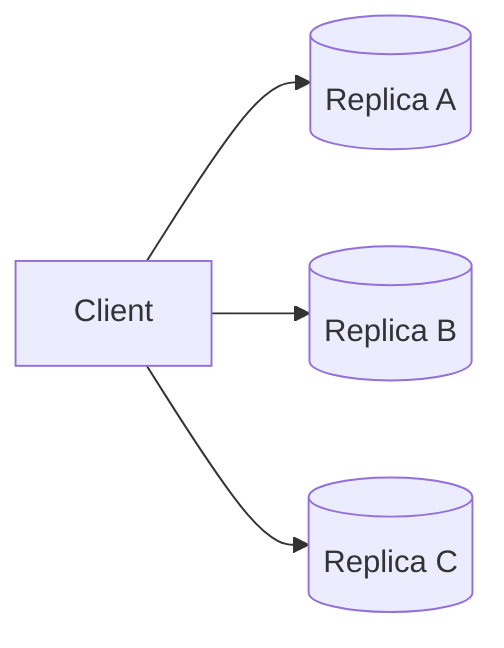
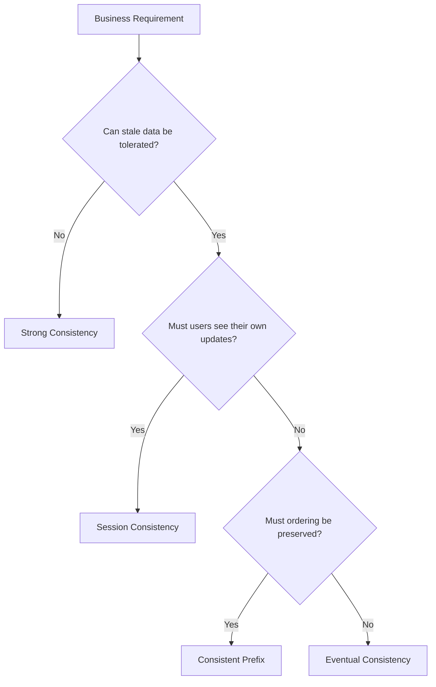
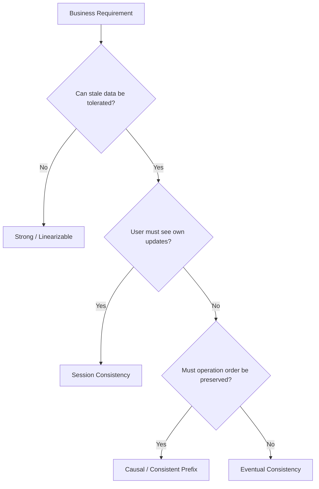

# Consistency Models

> *"Consistency is not a binary property. Modern distributed systems offer multiple consistency guarantees, each balancing correctness, latency, availability, and scalability differently."*

---

# Table of Contents

1. Why Consistency Models Exist
2. What Does "Consistent" Actually Mean?
3. Strong Consistency
4. Eventual Consistency
5. Session Consistency
6. Mental Models
7. Production Examples

---

# Learning Objectives

After completing this chapter you should be able to:

- Explain the major consistency models.
- Select an appropriate consistency model for a workload.
- Explain why cloud databases expose multiple consistency levels.
- Answer Staff and Principal interview questions confidently.

---

# Why This Chapter Matters

One of the most common interview mistakes is saying

> Cassandra is eventually consistent.

or

> Spanner is strongly consistent.

These statements are incomplete.

A better question is

> Which operations require which consistency guarantees?

Modern applications rarely use a single consistency model.

Different APIs often require different guarantees.

---

# What Does Consistency Mean?

Suppose

Alice updates her profile.

```
Name

↓

Alice Smith
```

Immediately afterwards,

Bob opens Alice's profile.

Question

Should Bob always see

```
Alice Smith
```

?

Different systems answer this differently.

That answer defines

the consistency model.

---

# Strong Consistency

Definition

After a successful write,

every subsequent read returns

the latest committed value.

---

## Example

Timeline

```
10:00

Write

↓

Balance = ₹1000
```

```
10:00:01

Read

↓

₹1000
```

The reader never observes stale data.

---

## Mental Model

Imagine a shared whiteboard.

The teacher writes

```
42
```

Every student immediately sees

```
42
```

Nobody sees the previous value.

---

## Advantages

- Easy reasoning
- No stale reads
- Correct financial transactions
- Predictable behavior

---

## Trade-offs

- Higher latency
- More coordination
- Lower availability during failures

---

# Eventual Consistency

Definition

After writes stop,

all replicas eventually converge to the same value.

The key word is

**eventually**.

No guarantee exists

about exactly when.

---

## Example

```
Replica A

↓

₹1000
```

```
Replica B

↓

₹900
```

Five seconds later

```
Replica B

↓

₹1000
```

Eventually

both agree.

---

## Mental Model

Imagine WhatsApp.

You send

```
Hello
```

Your friend's phone is offline.

Later,

their phone reconnects.

The message appears.

The system was temporarily inconsistent.

Eventually,

it converged.

---

## Advantages

- Very high availability
- Low latency
- Excellent scalability

---

## Trade-offs

- Stale reads
- Replica divergence
- Conflict resolution

---

# Why Multiple Models Exist

Suppose you're designing Amazon.

Payment

↓

Must never be stale.

Recommendation Engine

↓

Can tolerate stale data.

Notifications

↓

Eventually consistent.

Search

↓

Eventually consistent.

Inventory

↓

Strong consistency.

The same application

uses multiple consistency models.

---

# Production Examples

| Workload | Typical Consistency |
|----------|---------------------|
| Banking | Strong |
| Payments | Strong |
| Inventory Reservation | Strong |
| Product Catalog | Eventual |
| Search | Eventual |
| Analytics | Eventual |
| Notifications | Eventual |
| Recommendation Engine | Eventual |

---

# Principal Engineer Insight

> [!IMPORTANT]
> Never ask
>
> "Which consistency model is best?"
>
> Ask
>
> "Which consistency model best matches the business requirement?"
>
> Correct architecture begins with business requirements, not technology.

---

# Common Misconceptions

> [!WARNING]
> Eventual consistency does **not** mean random behavior.
>
> It guarantees convergence.

---

> [!WARNING]
> Strong consistency does **not** mean higher performance.

---

> [!WARNING]
> Every API inside the same application does **not** need the same consistency guarantee.

---

# Key Takeaways

- Consistency models define visibility guarantees.
- Strong consistency guarantees latest reads.
- Eventual consistency guarantees convergence.
- Modern applications combine multiple consistency models.
- Business requirements determine the correct consistency model.

---

# Sequential Consistency

Strong consistency is expensive.

Can we relax the guarantees slightly while still providing predictable behavior?

This leads us to **Sequential Consistency**.

---

## Definition

A system is sequentially consistent if:

1. Every operation appears to execute in a single global order.
2. Every client observes that same order.
3. The global order does **not** need to match real-world time.

---

## Example

Two users perform operations.

```
User A

Write X = 1
```

```
User B

Read X
```

Possible execution

```
Write

↓

Read
```

Every client observes the same order.

---

## Important Observation

Sequential consistency guarantees

```
Same Order
```

It does **not** guarantee

```
Real-Time Order
```

This is the key difference from Linearizability.

---

## Mental Model

Imagine every operation is written into a notebook.

Everyone reads

the same notebook.

The notebook may be updated a few milliseconds later,

but once recorded,

everyone agrees on the order.

---

# Linearizability

Linearizability is stronger than Sequential Consistency.

It preserves both

- Global ordering
- Real-time ordering

---

## Definition

If operation A completes before operation B begins,

then every client must observe

A before B.

Real-world time matters.

---

## Example

Timeline

```
10:00:00

Write Balance = ₹1000

↓

Completed
```

```
10:00:01

Read Balance
```

The read

must return

```
₹1000
```

Returning an older value would violate linearizability.

---

## Visual Timeline

```text
Time →

Write Completed

↓

Read Begins

↓

Latest Value Must Be Visible
```

---

# Sequential vs Linearizable

Suppose

```
Client A

Write X = 5
```

completes.

Immediately afterwards

```
Client B

Read X
```

Sequential Consistency

```
May still return

Old Value

if ordering remains valid.
```

Linearizability

```
Must return

5.
```

---

# Comparison

| Property | Sequential | Linearizable |
|----------|------------|--------------|
| Single Global Order | ✅ | ✅ |
| Respects Real-Time | ❌ | ✅ |
| Stronger Guarantee | No | Yes |
| Latency | Lower | Higher |

---

# Why Linearizability Is Expensive

Suppose replicas exist in

- Mumbai
- London
- Virginia

Client writes

```
₹500
```

Before another client reads,

the system must ensure

every read observes

the latest committed value.

This requires

- Coordination
- Network communication
- Waiting

Latency increases.

---

# Production Examples

Typically Linearizable

- Google Spanner
- etcd
- ZooKeeper
- Consul
- FoundationDB

Typically Sequential

- Some shared-memory systems
- Certain distributed caches

---

# Causal Consistency

Most applications don't need Linearizability.

Instead,

they need something weaker but more intuitive.

This is

**Causal Consistency.**

---

# What Is Causality?

Suppose

Alice sends

```
Hello
```

Bob replies

```
Hi
```

Question

Should another user ever see

```
Hi
```

before

```
Hello
```

Obviously not.

The second message depends on the first.

This is a

causal relationship.

---

# Definition

If one operation

causes

another,

every client must observe them

in the same order.

Independent operations

may appear

in different orders.

---

# Example

Alice

```
Post

↓

Vacation Photo
```

Bob

```
Comment

↓

Beautiful!
```

Every client must see

```
Photo

↓

Comment
```

Seeing

```
Comment

↓

Photo
```

would violate causality.

---

# Independent Operations

Suppose

Alice updates her profile.

Bob changes his password.

These operations are unrelated.

Different replicas

may observe them

in different orders.

This is perfectly acceptable.

---

# Mental Model

Think of a conversation.

Question

↓

Answer

Everyone should hear

the question

before

the answer.

Two unrelated conversations

may happen in any order.

---

# Production Examples

Causal consistency is common in

- Social Networks
- Collaborative Editing
- Messaging Applications
- Comment Systems
- Shared Documents

---

# Comparison

| Model | Global Order | Real-Time | Preserves Causality |
|--------|--------------|-----------|---------------------|
| Eventual | ❌ | ❌ | ❌ |
| Causal | ❌ | ❌ | ✅ |
| Sequential | ✅ | ❌ | ✅ |
| Linearizable | ✅ | ✅ | ✅ |

---

# Choosing the Right Model

| Application | Typical Choice |
|-------------|----------------|
| Banking | Linearizable |
| Distributed Lock | Linearizable |
| DNS | Eventual |
| WhatsApp | Causal |
| Facebook Comments | Causal |
| Google Docs | Causal + CRDT |
| Product Search | Eventual |

---

# Principal Engineer Insight

> [!IMPORTANT]
> Stronger consistency is not always better.
>
> Every stronger guarantee increases coordination,
> network traffic,
> latency,
> and operational complexity.
>
> Principal Engineers choose the weakest consistency model that still satisfies the business requirements.

---

# Interview Conversation

**Interviewer**

Why wouldn't you use Linearizability everywhere?

**Weak Answer**

Because it's slower.

**Principal Engineer Answer**

Linearizability requires every completed write to become immediately visible to all subsequent reads according to real-time ordering. Achieving this guarantee requires coordination between replicas, which increases latency and reduces availability during failures. Many applications, such as social feeds and messaging systems, do not require this guarantee. Using a weaker consistency model improves performance while still satisfying business requirements.

---

# Common Interview Mistakes

> [!WARNING]
> Thinking Sequential Consistency respects wall-clock time.

---

> [!WARNING]
> Assuming Eventual Consistency preserves causality.

---

> [!WARNING]
> Assuming Linearizability means zero replication lag.

---

> [!WARNING]
> Choosing the strongest consistency model without understanding business requirements.

---

# Key Takeaways

- Sequential Consistency guarantees a single global order.
- Linearizability adds real-time ordering.
- Causal Consistency preserves cause-and-effect relationships.
- Stronger consistency requires more coordination.
- Business requirements determine the appropriate consistency model.

---

# Client-Centric Consistency Models

Distributed systems often use eventual consistency internally.

However,

users expect predictable behavior.

Example

You update your profile picture.

Immediately afterwards,

you refresh the page.

Would you expect to see

your old profile picture?

Of course not.

This is where client-centric consistency models become important.

---

# Why Client-Centric Consistency Exists

Imagine three replicas.



Replication takes

```
200 ms
```

During those

200 milliseconds,

different replicas may contain different values.

Client-centric consistency defines

what guarantees

an individual user receives.

---

# Read Your Own Writes (RYOW)

Definition

Once a client successfully performs a write,

all subsequent reads by that same client

must return

the updated value.

---

# Example

Timeline

```
User

↓

Update Name

↓

Deepesh
```

Immediately afterwards

```
Refresh Profile
```

Correct result

```
Deepesh
```

Incorrect result

```
Old Name
```

The second case violates

Read Your Own Writes.

---

# Mental Model

Suppose you edit a Google Doc.

After clicking

Save,

you immediately reopen the document.

You expect to see

your own changes.

---

# Production Solutions

Several techniques are commonly used.

---

## Option 1

Read From Leader

Recent writes

↓

Leader

↓

Guaranteed latest value

Trade-off

Higher latency.

---

## Option 2

Sticky Sessions

Client continues talking

to the same replica

for a short period.

```mermaid
flowchart LR

Client

-->

Replica A

-->

Replica A

-->

Replica A
```

The client avoids stale replicas.

---

## Option 3

Session Token

After every write,

the server returns

a session version.

Example

```
Session Version

=

105
```

Future reads include

```
Version = 105
```

Replica serves the request

only after

it reaches

Version 105.

Azure Cosmos DB uses this approach.

---

# Monotonic Reads

Definition

Once a client observes a value,

future reads

must never return

an older value.

---

# Example

Timeline

```
Read

↓

Version 10
```

Later

```
Read

↓

Version 9
```

Incorrect.

Version numbers should never move backwards.

---

# Production Example

Instagram

User scrolls

Feed Page 1

↓

Latest Posts

Refresh

↓

Older Feed

This creates

a confusing user experience.

Monotonic Reads prevent this.

---

# Monotonic Writes

Definition

Writes from the same client

must be applied

in the order

they were issued.

---

# Example

Client performs

```
Write A

↓

Write B
```

Replicas must never observe

```
Write B

↓

Write A
```

---

# Why This Matters

Suppose

Password Update

↓

Email Update

If replicas process

Email first

Password second,

application state

may become inconsistent.

---

# Writes Follow Reads

Definition

Suppose

Client reads

Version 50.

Future writes

should never be applied

to

Version 45.

The client should continue

from

the latest version

it has observed.

---

# Example

Collaborative Editing

User downloads

Document Version 20.

User edits

Version 20.

The write

must apply

after

Version 20,

not before it.

---

# Comparison

| Model | Guarantee |
|--------|-----------|
| Read Your Own Writes | Users immediately observe their own updates |
| Monotonic Reads | Version numbers never move backwards |
| Monotonic Writes | Client writes preserve order |
| Writes Follow Reads | Future writes build upon observed versions |

---

# Session Consistency

Many cloud databases

combine

all four guarantees

into one model.

This is called

Session Consistency.

Guarantees

- Read Your Own Writes
- Monotonic Reads
- Monotonic Writes
- Writes Follow Reads

Within one client session.

Different users

may still observe

eventual consistency.

---

# Azure Cosmos DB

Cosmos DB provides

Session Consistency

as its default consistency level.

Why?

Because

most applications

care about

their own updates,

not necessarily

everyone else's.

This provides

an excellent balance between

latency

and

user experience.

---

# Production Examples

| Application | Typical Client Guarantee |
|-------------|--------------------------|
| Amazon Shopping Cart | Read Your Own Writes |
| Google Docs | Writes Follow Reads |
| Facebook Timeline | Monotonic Reads |
| WhatsApp | Read Your Own Writes |
| Azure Cosmos DB | Session Consistency |
| Gmail | Read Your Own Writes |

---

# Principal Engineer Insight

> [!IMPORTANT]
> Users rarely complain that a system is "eventually consistent."
>
> They complain when they cannot see **their own changes**.
>
> Client-centric consistency models solve user experience problems without requiring globally strong consistency.

---

# Interview Conversation

**Interviewer**

Why doesn't Amazon simply use Strong Consistency everywhere?

---

**Weak Answer**

Because it's slower.

---

**Principal Engineer Answer**

Most Amazon workflows do not require globally strong consistency. What users expect is to immediately observe their own actions—for example, seeing an item appear in their shopping cart after adding it. Read Your Own Writes and Session Consistency provide this guarantee with significantly lower coordination costs than globally linearizable reads.

---

# Common Interview Mistakes

> [!WARNING]
> Thinking Session Consistency means all users observe the same data.

---

> [!WARNING]
> Assuming Sticky Sessions eliminate replication lag.

They only reduce the probability of stale reads.

---

> [!WARNING]
> Confusing Read Your Own Writes with Strong Consistency.

RYOW applies only to the client that performed the write.

Other clients may still observe stale data.

---

# Key Takeaways

- Client-centric consistency focuses on user experience.
- Read Your Own Writes ensures users immediately observe their own updates.
- Monotonic Reads prevent version rollback.
- Monotonic Writes preserve write ordering.
- Writes Follow Reads preserve causal evolution.
- Session Consistency combines multiple client-centric guarantees.
- These guarantees improve usability without requiring global strong consistency.

---

# Advanced Consistency Models

So far we have studied

- Strong Consistency
- Eventual Consistency
- Sequential Consistency
- Linearizability
- Causal Consistency
- Client-Centric Consistency

Modern cloud databases expose additional consistency models that balance

- Latency
- Availability
- Throughput
- User Experience

These models exist because there is no single consistency guarantee that fits every workload.

---

# Bounded Staleness

Eventual consistency tells us

> Replicas will eventually converge.

Question

How long is "eventually"?

```
1 second?

1 minute?

1 hour?
```

No guarantee exists.

Bounded Staleness improves this.

---

## Definition

A replica may return stale data,

but only within a predefined limit.

The limit can be based on

- Time

or

- Number of versions

---

## Example (Time-Based)

Suppose

Maximum Staleness

```
5 Seconds
```

Write occurs

```
10:00:00
```

Every replica must observe

that write

before

```
10:00:05
```

The application knows

the maximum possible delay.

---

## Example (Version-Based)

Maximum Staleness

```
100 Versions
```

Replica may lag behind,

but never by more than

100 committed updates.

---

## Production Use Cases

Suitable for

- Product Catalogs
- Inventory Browsing
- Search Indexes
- Analytics Dashboards

Users tolerate slightly stale information,

but not unlimited staleness.

---

# Consistent Prefix

Definition

Clients never observe writes

out of order.

Some recent writes may be missing,

but the order is always preserved.

---

## Example

Suppose the write history is

```
A

↓

B

↓

C

↓

D
```

Allowed

```
A

↓

B
```

Allowed

```
A

↓

B

↓

C
```

Not Allowed

```
A

↓

C
```

Operation

```
B
```

cannot disappear.

---

## Why It Matters

Imagine a messaging application.

Alice sends

```
Hello
```

Then

```
How are you?
```

A user should never see

```
How are you?
```

before

```
Hello
```

---

## Production Examples

Commonly used for

- Messaging Systems
- Event Streams
- Kafka Consumers
- Audit Logs

---

# Timeline Consistency

Timeline Consistency guarantees that replicas converge while preserving update order.

Unlike Strong Consistency,

replicas are allowed to lag.

However,

they eventually reach the same ordered history.

---

## Example

Leader

```
Version 100
```

Replica

```
Version 95
```

Eventually

Replica

```
Version 100
```

No committed updates are skipped.

---

# Tunable Consistency

Some databases allow applications

to choose

their consistency level

for each request.

Instead of selecting one consistency model

for the entire database,

developers choose

per operation.

---

## Cassandra

Examples

```
ONE
```

Lowest latency.

Lowest consistency.

---

```
QUORUM
```

Balanced.

---

```
ALL
```

Highest consistency.

Highest latency.

---

## DynamoDB

Two read modes

Eventually Consistent

↓

Lower latency

Lower cost

---

Strongly Consistent

↓

Higher latency

Higher cost

---

Applications choose

based on workload.

---

# Azure Cosmos DB

Azure Cosmos DB is unique.

It provides

five consistency levels.

| Consistency Level | Characteristics |
|-------------------|-----------------|
| Strong | Latest committed value |
| Bounded Staleness | Predictably stale |
| Session | Client-centric guarantees |
| Consistent Prefix | Ordered but possibly stale |
| Eventual | Eventually converges |

This allows different applications

to optimize

latency

and

consistency

without changing databases.

---

# Comparing Popular Databases

| Database | Consistency Model |
|-----------|-------------------|
| Google Spanner | Linearizable / Strong |
| CockroachDB | Linearizable |
| FoundationDB | Strong |
| PostgreSQL | Strong |
| MySQL | Strong |
| Cassandra | Tunable |
| DynamoDB | Tunable |
| Cosmos DB | Five Levels |
| Kafka | Ordered Per Partition |
| Redis | Strong (Single Primary) |

---

# Decision Matrix

| Requirement | Suggested Consistency |
|-------------|----------------------|
| Banking | Strong / Linearizable |
| Payments | Strong |
| Distributed Lock | Linearizable |
| Shopping Cart | Session |
| Social Feed | Eventual |
| Product Catalog | Bounded Staleness |
| Search | Eventual |
| Messaging | Consistent Prefix |
| Notifications | Eventual |
| Analytics | Eventual |

---

# Choosing the Right Model



---

# Production Examples

## Banking

Requirements

- No stale balances
- No stale transactions

Choice

Strong Consistency

---

## Shopping Cart

Requirements

- User immediately sees their own updates
- Other users may observe eventual consistency

Choice

Session Consistency

---

## Product Search

Requirements

- Low latency
- High throughput
- Minor staleness acceptable

Choice

Eventual Consistency

---

## Chat Application

Requirements

- Preserve message order
- Slight delay acceptable

Choice

Consistent Prefix

---

## Inventory Browsing

Requirements

- Product stock should not be hours old
- Small delay acceptable

Choice

Bounded Staleness

---

# Principal Engineer Insight

> [!IMPORTANT]
> Consistency is not a property of the database.
>
> It is a property of a business requirement.
>
> Different APIs inside the same application frequently require different consistency guarantees.
>
> Principal Engineers optimize consistency at the API level rather than forcing a single model across the entire system.

---

# Interview Conversation

**Interviewer**

Why does Azure Cosmos DB provide five consistency levels instead of only Strong and Eventual?

---

**Weak Answer**

To give developers more options.

---

**Principal Engineer Answer**

Different workloads require different trade-offs. A shopping cart benefits from Session Consistency, messaging systems benefit from Consistent Prefix, product catalogs often use Bounded Staleness, and financial systems require Strong Consistency. By exposing multiple consistency levels, Cosmos DB allows applications to optimize latency, availability, and cost without changing databases.

---

# Common Interview Mistakes

> [!WARNING]
> Assuming Strong Consistency is always the correct choice.

---

> [!WARNING]
> Confusing Session Consistency with Strong Consistency.

---

> [!WARNING]
> Assuming Eventual Consistency means unordered updates.

---

> [!WARNING]
> Thinking every API requires the same consistency guarantee.

---

# Key Takeaways

- Bounded Staleness provides predictable limits on stale data.
- Consistent Prefix preserves write ordering.
- Timeline Consistency guarantees ordered convergence.
- Tunable Consistency allows applications to choose guarantees per request.
- Azure Cosmos DB provides five consistency levels.
- Different business requirements require different consistency models.

---

# Consistency Models Comparison

The following table summarizes every consistency model discussed in this chapter.

| Consistency Model | Preserves Global Order | Preserves Real-Time Order | Preserves Causality | Client-Centric | Typical Latency | Example Systems |
|-------------------|------------------------|---------------------------|---------------------|----------------|-----------------|-----------------|
| Strong | Yes | Yes | Yes | Yes | Highest | PostgreSQL, MySQL |
| Linearizable | Yes | Yes | Yes | Yes | Highest | Spanner, etcd, ZooKeeper |
| Sequential | Yes | No | Yes | No | High | Shared Memory Systems |
| Causal | No | No | Yes | Partial | Medium | Collaborative Applications |
| Session | No | No | Partial | Yes | Low | Cosmos DB |
| Bounded Staleness | No | No | Partial | Partial | Low | Cosmos DB |
| Consistent Prefix | Ordered Only | No | Partial | No | Very Low | Kafka Consumers |
| Eventual | No | No | No | No | Lowest | Cassandra, Dynamo |

---

# Choosing the Correct Consistency Model

A Principal Engineer never starts with the database.

The process starts with business requirements.

---

## Step 1

Ask

> Can stale data be tolerated?

If

No

↓

Strong Consistency

---

If

Yes

↓

Continue.

---

## Step 2

Ask

> Does the user need to immediately observe their own updates?

If

Yes

↓

Session Consistency

---

If

No

↓

Continue.

---

## Step 3

Ask

> Does the ordering of operations matter?

If

Yes

↓

Consistent Prefix

or

Causal Consistency

---

If

No

↓

Eventual Consistency

---

# Decision Flow



---

# Production Case Studies

## Banking

Requirements

- No stale balances
- No duplicate withdrawals
- Strict ordering
- Auditability

Choice

Strong / Linearizable Consistency

---

## Shopping Cart

Requirements

- User immediately sees added products
- Other users may observe eventual consistency

Choice

Session Consistency

---

## Search Engine

Requirements

- Extremely low latency
- Millions of reads
- Minor delay acceptable

Choice

Eventual Consistency

---

## Social Feed

Requirements

- Fast updates
- Global scalability
- Temporary staleness acceptable

Choice

Eventual Consistency

---

## Messaging

Requirements

- Preserve message order
- Avoid out-of-order delivery

Choice

Consistent Prefix

---

## Collaborative Editing

Requirements

- Preserve causal relationships
- Concurrent edits
- High availability

Choice

Causal Consistency

---

# Consistency in Popular Databases

| Database | Typical Default |
|-----------|-----------------|
| MySQL | Strong |
| PostgreSQL | Strong |
| Oracle | Strong |
| SQL Server | Strong |
| Google Spanner | Linearizable |
| CockroachDB | Linearizable |
| FoundationDB | Strong |
| Cassandra | Tunable |
| DynamoDB | Tunable |
| Azure Cosmos DB | Session |
| Kafka | Consistent Prefix (Per Partition) |
| Redis | Strong (Single Primary) |

---

# Senior Engineer Interview Questions

## Q1

What is consistency in distributed systems?

---

## Q2

What is Strong Consistency?

---

## Q3

What is Eventual Consistency?

---

## Q4

Why does Eventual Consistency exist?

---

## Q5

Explain Session Consistency.

---

## Q6

What is Read Your Own Writes?

---

## Q7

What is Monotonic Read?

---

## Q8

What is Monotonic Write?

---

## Q9

Explain Causal Consistency.

---

## Q10

What is Bounded Staleness?

---

# Staff Engineer Interview Questions

## Q1

Explain the difference between Sequential Consistency and Linearizability.

---

## Q2

When would you choose Eventual Consistency?

---

## Q3

Explain Consistent Prefix with an example.

---

## Q4

Design a globally distributed shopping cart.

Which consistency guarantees would you choose?

---

## Q5

Why does Cosmos DB expose multiple consistency levels?

---

## Q6

How does Session Consistency improve user experience?

---

## Q7

Can different APIs use different consistency models?

---

## Q8

How does consistency affect latency?

---

## Q9

How would you explain Causal Consistency to a Product Manager?

---

## Q10

Would you ever choose Strong Consistency for notifications?

Why?

---

# Principal Engineer Interview Questions

## Q1

Design consistency guarantees for an international payment platform.

Discuss

- Payments
- Refunds
- Transaction History
- Analytics
- Notifications

---

## Q2

Suppose your CEO wants

> Zero latency

and

> Perfect consistency

Explain why both cannot always be achieved simultaneously.

---

## Q3

How would you review another team's consistency decisions?

---

## Q4

Suppose users complain about stale search results.

Would you redesign the architecture or change consistency guarantees?

---

## Q5

How would consistency models evolve as a startup grows into a global company?

---

## Q6

Can different microservices choose different consistency models?

Explain.

---

## Q7

How would you explain Linearizability to a non-technical executive?

---

## Q8

Which metrics indicate that consistency is becoming an operational bottleneck?

---

## Q9

How would you validate consistency guarantees during production testing?

---

## Q10

Which consistency mistakes do you most frequently observe during architecture reviews?

---

# Whiteboard Exercise

Design a globally distributed e-commerce platform.

Services

- Product Catalog
- Search
- Checkout
- Payment
- Shopping Cart
- Recommendation
- Notification

For every service answer

- Required consistency model
- Business justification
- Failure scenario
- User impact
- Recovery strategy

---

# Architecture Review Exercise

Review the following proposal.

> "We'll use Strong Consistency everywhere because correctness is important."

Questions

- Is Strong Consistency required for analytics?
- Is Strong Consistency required for recommendations?
- What latency penalty will this introduce?
- Which APIs could safely use weaker consistency guarantees?
- Is operational complexity justified?

---

# Common Wrong Answers

❌ Eventual Consistency means random behavior.

---

❌ Linearizability and Strong Consistency are identical in every context.

---

❌ Session Consistency guarantees every user sees identical data.

---

❌ Strong Consistency is always the correct choice.

---

❌ Every service inside an application should use the same consistency model.

---

# Principal Engineer Review Checklist

Can you confidently explain

- Strong Consistency
- Eventual Consistency
- Sequential Consistency
- Linearizability
- Causal Consistency
- Session Consistency
- Read Your Own Writes
- Monotonic Reads
- Monotonic Writes
- Writes Follow Reads
- Bounded Staleness
- Consistent Prefix
- Tunable Consistency

Can you justify

- Which model should be selected?
- Why?
- Which business requirement drives the decision?
- Which trade-offs are accepted?

If yes,

you have mastered one of the most important topics in distributed systems.

---

# One-Page Cheat Sheet

## Strongest → Weakest

```text
Linearizable

↓

Strong

↓

Sequential

↓

Causal

↓

Session

↓

Bounded Staleness

↓

Consistent Prefix

↓

Eventual
```

---

## Client-Centric Models

| Model | Guarantee |
|--------|-----------|
| Read Your Own Writes | Users immediately observe their own writes |
| Monotonic Reads | Reads never move backwards |
| Monotonic Writes | Writes preserve client order |
| Writes Follow Reads | Writes build upon observed state |
| Session Consistency | Combines all client-centric guarantees |

---

## Decision Matrix

| Requirement | Recommended Model |
|-------------|-------------------|
| Banking | Strong / Linearizable |
| Payments | Strong |
| Shopping Cart | Session |
| Search | Eventual |
| Product Catalog | Bounded Staleness |
| Messaging | Consistent Prefix |
| Collaborative Editing | Causal |
| Analytics | Eventual |

---

# Related Chapters

Continue with

- 05-Quorum-Reads-and-Writes.md
- 06-Leader-Election.md
- 07-Raft.md
- 08-Paxos.md
- 09-Vector-Clocks.md
- 10-CRDT.md

Each subsequent chapter builds directly upon the consistency guarantees introduced here.

---

# References

## Books

- Designing Data-Intensive Applications — Martin Kleppmann
- Database Internals — Alex Petrov
- Designing Distributed Systems — Brendan Burns

## Research Papers

- Brewer's CAP Theorem
- Spanner: Google's Globally Distributed Database
- Dynamo: Amazon's Highly Available Key-value Store
- Cosmos DB Consistency Levels

## Engineering Blogs

- Google Cloud
- Azure Cosmos DB Engineering
- Cockroach Labs
- Uber Engineering
- Netflix Tech Blog

---

# Chapter Summary

Consistency defines **what guarantees clients receive when reading data in a distributed system**.

There is no universally "best" consistency model.

Every stronger guarantee increases coordination, latency and operational complexity.

A Principal Engineer begins with business requirements, then chooses the weakest consistency model that still satisfies correctness, user experience and operational goals.

Consistency is not a database feature.

It is an architectural decision.

---

> **Principal Engineer Takeaway**
>
> A Senior Engineer explains the different consistency models.
>
> A Staff Engineer selects the appropriate model for a given workload.
>
> A Principal Engineer designs systems where different services and APIs intentionally use different consistency guarantees to optimize correctness, latency, scalability and business value.

