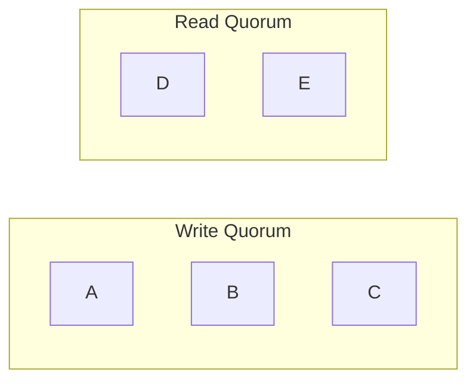

# Quorum Reads and Writes

> *"Quorum is the mathematical foundation that allows distributed systems to remain available while still providing strong consistency guarantees."*

---

# Table of Contents

1. Why Quorum Exists
2. The Problem with Replication
3. Understanding Quorum
4. Majority Voting
5. Read Quorum
6. Write Quorum
7. Why `R + W > N` Works
8. Production Examples

---

# Learning Objectives

After completing this chapter you should be able to:

- Explain why quorum exists.
- Derive quorum mathematically.
- Explain why `R + W > N` works.
- Understand majority voting.
- Explain quorum in Cassandra, DynamoDB, MongoDB, Kafka and Raft.
- Answer Staff and Principal Engineer interview questions.

---

# Why This Chapter Matters

Almost every distributed database uses quorum.

Examples

- Cassandra
- DynamoDB
- MongoDB
- ZooKeeper
- etcd
- CockroachDB
- YugabyteDB
- Raft
- Paxos

The implementation differs.

The underlying mathematics is identical.

---

# The Replication Problem

Suppose

```
Replication Factor

N = 3
```

We have

```mermaid
flowchart LR

Client

-->

Replica A

Client

-->

Replica B

Client

-->

Replica C
```

Client writes

```
Balance = ₹500
```

Question

When should we tell the client

```
Success
```

Immediately?

After one replica?

After two?

After all three?

There is no obvious answer.

---

# Option 1

Wait for

one replica.

```
Replica A

ACK

↓

Success
```

Advantages

- Lowest latency

Disadvantages

- Data loss risk
- Weak consistency

---

# Option 2

Wait for

all replicas.

```
A

↓

B

↓

C

↓

Success
```

Advantages

- Highest durability

Disadvantages

- High latency
- Low availability

One slow replica delays everyone.

---

# The Middle Ground

Instead of

```
One

or

All
```

Choose

```
Majority
```

This is called

**Quorum**.

---

# What Is Quorum?

Definition

A quorum is the minimum number of replicas that must participate in an operation before it is considered successful.

Examples

```
N = 3

Quorum = 2
```

```
N = 5

Quorum = 3
```

```
N = 7

Quorum = 4
```

General formula

```
Majority

=

⌊N / 2⌋ + 1
```

---

# Why Majority?

Suppose

```
5 Replicas
```

```
A

B

C

D

E
```

Majority

```
3
```

Question

Can two different majorities exist

without sharing

at least one replica?

Let's see.

Group 1

```
A

B

C
```

Group 2

```
C

D

E
```

Both share

```
Replica C
```

This property is the foundation of quorum systems.

---

# Quorum Intersection

The most important property of quorum.

Every two majorities

must intersect.



Both contain

```
Replica C
```

Therefore

the latest write

cannot disappear completely.

---

# Why This Matters

Suppose

Client writes

```
Balance = ₹1000
```

Write reaches

```
A

B

C
```

Later

another client reads

from

```
C

D

E
```

Replica C

belongs to

both quorums.

Therefore

the reader observes

the latest committed value.

---

# Majority Does Not Mean All

Many engineers incorrectly believe

quorum means

all replicas.

Incorrect.

Quorum means

enough replicas

to guarantee intersection.

---

# Mental Model

Imagine five managers

must approve

a financial transaction.

Rule

```
Need

3 Approvals
```

Later

another committee

also requires

3 approvals.

Because every majority overlaps,

at least one manager

knows the latest approved decision.

Exactly the same principle applies to distributed systems.

---

# Principal Engineer Insight

> [!IMPORTANT]
>
> Quorum is fundamentally an **intersection guarantee**.
>
> It is **not** about counting replicas.
>
> The goal is to ensure that every successful operation shares at least one replica with future operations.

---

# Common Interview Mistakes

> [!WARNING]
> Thinking quorum means "all replicas."

---

> [!WARNING]
> Assuming majority automatically guarantees zero data loss.

---

> [!WARNING]
> Believing quorum eliminates replication lag.

---

# Key Takeaways

- Quorum is a majority of replicas.
- Majority guarantees overlap.
- Overlap preserves visibility of committed writes.
- Quorum balances latency, consistency and availability.
- Quorum is the mathematical foundation of many distributed systems.
