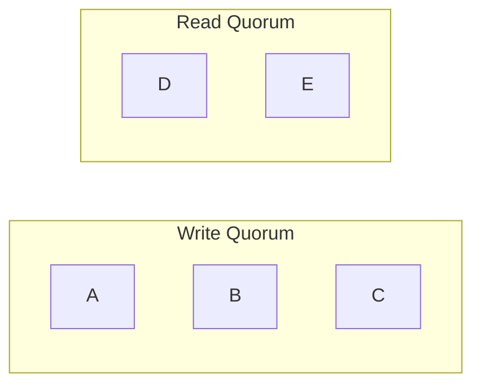
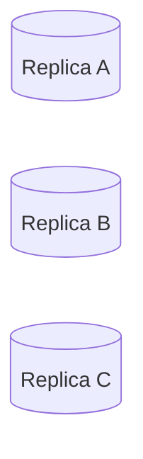

# Quorum Reads and Writes

> *"Quorum is the mathematical foundation that allows distributed systems to remain available while still providing strong consistency guarantees."*

---

# Table of Contents

1. Why Quorum Exists
2. The Problem with Replication
3. Understanding Quorum
4. Majority Voting
5. Read Quorum
6. Write Quorum
7. Why `R + W > N` Works
8. Production Examples

---

# Learning Objectives

After completing this chapter you should be able to:

- Explain why quorum exists.
- Derive quorum mathematically.
- Explain why `R + W > N` works.
- Understand majority voting.
- Explain quorum in Cassandra, DynamoDB, MongoDB, Kafka and Raft.
- Answer Staff and Principal Engineer interview questions.

---

# Why This Chapter Matters

Almost every distributed database uses quorum.

Examples

- Cassandra
- DynamoDB
- MongoDB
- ZooKeeper
- etcd
- CockroachDB
- YugabyteDB
- Raft
- Paxos

The implementation differs.

The underlying mathematics is identical.

---

# The Replication Problem

Suppose

```
Replication Factor

N = 3
```

We have

```mermaid
flowchart LR

Client

-->

Replica A

Client

-->

Replica B

Client

-->

Replica C
```

Client writes

```
Balance = ₹500
```

Question

When should we tell the client

```
Success
```

Immediately?

After one replica?

After two?

After all three?

There is no obvious answer.

---

# Option 1

Wait for

one replica.

```
Replica A

ACK

↓

Success
```

Advantages

- Lowest latency

Disadvantages

- Data loss risk
- Weak consistency

---

# Option 2

Wait for

all replicas.

```
A

↓

B

↓

C

↓

Success
```

Advantages

- Highest durability

Disadvantages

- High latency
- Low availability

One slow replica delays everyone.

---

# The Middle Ground

Instead of

```
One

or

All
```

Choose

```
Majority
```

This is called

**Quorum**.

---

# What Is Quorum?

Definition

A quorum is the minimum number of replicas that must participate in an operation before it is considered successful.

Examples

```
N = 3

Quorum = 2
```

```
N = 5

Quorum = 3
```

```
N = 7

Quorum = 4
```

General formula

```
Majority

=

⌊N / 2⌋ + 1
```

---

# Why Majority?

Suppose

```
5 Replicas
```

```
A

B

C

D

E
```

Majority

```
3
```

Question

Can two different majorities exist

without sharing

at least one replica?

Let's see.

Group 1

```
A

B

C
```

Group 2

```
C

D

E
```

Both share

```
Replica C
```

This property is the foundation of quorum systems.

---

# Quorum Intersection

The most important property of quorum.

Every two majorities

must intersect.



Both contain

```
Replica C
```

Therefore

the latest write

cannot disappear completely.

---

# Why This Matters

Suppose

Client writes

```
Balance = ₹1000
```

Write reaches

```
A

B

C
```

Later

another client reads

from

```
C

D

E
```

Replica C

belongs to

both quorums.

Therefore

the reader observes

the latest committed value.

---

# Majority Does Not Mean All

Many engineers incorrectly believe

quorum means

all replicas.

Incorrect.

Quorum means

enough replicas

to guarantee intersection.

---

# Mental Model

Imagine five managers

must approve

a financial transaction.

Rule

```
Need

3 Approvals
```

Later

another committee

also requires

3 approvals.

Because every majority overlaps,

at least one manager

knows the latest approved decision.

Exactly the same principle applies to distributed systems.

---

# Principal Engineer Insight

> [!IMPORTANT]
>
> Quorum is fundamentally an **intersection guarantee**.
>
> It is **not** about counting replicas.
>
> The goal is to ensure that every successful operation shares at least one replica with future operations.

---

# Common Interview Mistakes

> [!WARNING]
> Thinking quorum means "all replicas."

---

> [!WARNING]
> Assuming majority automatically guarantees zero data loss.

---

> [!WARNING]
> Believing quorum eliminates replication lag.

---

# Key Takeaways

- Quorum is a majority of replicas.
- Majority guarantees overlap.
- Overlap preserves visibility of committed writes.
- Quorum balances latency, consistency and availability.
- Quorum is the mathematical foundation of many distributed systems.

---

# Deriving the Quorum Formula

One of the most common interview questions is:

> Why does

```
R + W > N
```

provide better consistency?

Instead of memorizing the formula,

let's derive it.

---

# Definitions

Before we begin,

let's define the variables.

```
N

↓

Replication Factor
```

Number of replicas storing the data.

---

```
W

↓

Write Quorum
```

Minimum number of replicas that must acknowledge a write.

---

```
R

↓

Read Quorum
```

Minimum number of replicas that participate in a read.

---

# Example

Suppose

```
N = 3
```

We have



---

# Write Example

Suppose

```
W = 2
```

Client performs

```
Balance = ₹5000
```

Coordinator sends the write to all replicas.

Only

```
Replica A

Replica B
```

acknowledge.

Write succeeds.

Replica C may still be updating.

---

# Read Example

Now suppose

```
R = 2
```

Coordinator reads from

```
Replica B

Replica C
```

Replica B

contains

the latest value.

Replica C

may be stale.

Coordinator compares both responses

and returns

the newest version.

---

# Why Does This Work?

Let's draw the sets.

Write Quorum

```text
A

B
```

Read Quorum

```text
B

C
```

Notice

Both contain

```
Replica B
```

At least one replica

belongs to

both operations.

This shared replica

is called

the

**Intersection**.

---

# The Core Principle

If

every successful write

shares

at least one replica

with

every future read,

then

the read

has access

to

the latest committed value.

Everything else

follows from this observation.

---

# Mathematical Proof

Suppose

```
R + W

≤

N
```

Example

```
N = 5

W = 2

R = 2
```

Notice

```
2 + 2 = 4

≤

5
```

Can the read

and write quorums

be completely different?

Yes.

Example

Write

```text
A

B
```

Read

```text
C

D
```

Shared replica

```
None
```

The read

may never observe

the latest write.

Consistency breaks.

---

# Now Consider

```
N = 5

W = 3

R = 3
```

Notice

```
3 + 3 = 6

>

5
```

Can two sets

of size

3

exist

without sharing

at least one replica?

No.

Let's try.

Write

```text
A

B

C
```

Read

```text
D

E

?
```

Only

two replicas remain.

A third replica

must come from

the write quorum.

Intersection

is unavoidable.

---

# General Proof

Suppose

```
Write Set Size

=

W
```

Read Set Size

```
=

R
```

Total replicas

```
=

N
```

If

```
R + W

>

N
```

then

the two sets

cannot be disjoint.

By the Pigeonhole Principle,

they must overlap.

That overlap guarantees

that at least one replica

contains

the latest committed write.

---

# Visual Explanation


Replica

```
C
```

belongs to

both sets.

---

# Does Quorum Guarantee Strong Consistency?

Not always.

Quorum guarantees

intersection.

It does not automatically guarantee

linearizability.

Why?

Several reasons exist.

- Concurrent writes
- Clock skew
- Replica failures
- Delayed replication
- Network partitions

Additional mechanisms

such as

Raft

or

Paxos

are required

for strict linearizability.

---

# Different Quorum Configurations

## Example 1

```
N = 3

W = 2

R = 2
```

```
2 + 2 = 4

>

3
```

Good.

---

## Example 2

```
N = 5

W = 3

R = 3
```

```
3 + 3 = 6

>

5
```

Good.

---

## Example 3

```
N = 5

W = 2

R = 2
```

```
2 + 2 = 4

≤

5
```

Intersection

is not guaranteed.

---

## Example 4

```
N = 7

W = 4

R = 4
```

```
4 + 4 = 8

>

7
```

Intersection guaranteed.

---

# Trade-offs

Increasing

```
W
```

Advantages

- Better durability
- Better consistency

Disadvantages

- Higher write latency
- Lower availability

---

Increasing

```
R
```

Advantages

- Better read freshness

Disadvantages

- Higher read latency

---

Increasing

```
N
```

Advantages

- Better fault tolerance

Disadvantages

- More storage
- More network traffic
- More operational complexity

---

# Principal Engineer Insight

> [!IMPORTANT]
> The quorum formula is not magic.
>
> It is a mathematical consequence of **set intersection**.
>
> A successful write must leave evidence on at least one replica that every successful read is guaranteed to contact.
>
> This is why quorum works.

---

# Interview Conversation

**Interviewer**

Why does

```
R + W > N
```

work?

---

**Weak Answer**

Because that's the quorum formula.

---

**Principal Engineer Answer**

The formula guarantees that every successful read quorum intersects every successful write quorum. Since at least one replica belongs to both operations, the read has access to a replica that has already acknowledged the latest committed write. The guarantee comes from set intersection, not from the specific numbers themselves.

---

# Common Interview Mistakes

> [!WARNING]
> Thinking quorum guarantees zero stale reads.

---

> [!WARNING]
> Assuming quorum alone guarantees linearizability.

---

> [!WARNING]
> Believing every read contacts every replica.

---

> [!WARNING]
> Memorizing the formula without understanding the intersection proof.

---

# Key Takeaways

- `R` is the Read Quorum.
- `W` is the Write Quorum.
- `N` is the Replication Factor.
- `R + W > N` guarantees quorum intersection.
- Quorum intersection increases the probability of observing the latest committed write.
- Quorum alone is not sufficient for linearizability.
