# Quorum Reads and Writes

> *"Quorum is the mathematical foundation that allows distributed systems to remain available while still providing strong consistency guarantees."*

---

# Table of Contents

1. Why Quorum Exists
2. The Problem with Replication
3. Understanding Quorum
4. Majority Voting
5. Read Quorum
6. Write Quorum
7. Why `R + W > N` Works
8. Production Examples

---

# Learning Objectives

After completing this chapter you should be able to:

- Explain why quorum exists.
- Derive quorum mathematically.
- Explain why `R + W > N` works.
- Understand majority voting.
- Explain quorum in Cassandra, DynamoDB, MongoDB, Kafka and Raft.
- Answer Staff and Principal Engineer interview questions.

---

# Why This Chapter Matters

Almost every distributed database uses quorum.

Examples

- Cassandra
- DynamoDB
- MongoDB
- ZooKeeper
- etcd
- CockroachDB
- YugabyteDB
- Raft
- Paxos

The implementation differs.

The underlying mathematics is identical.

---

# The Replication Problem

Suppose

```
Replication Factor

N = 3
```

We have

```mermaid
flowchart LR

Client

-->

Replica A

Client

-->

Replica B

Client

-->

Replica C
```

Client writes

```
Balance = ₹500
```

Question

When should we tell the client

```
Success
```

Immediately?

After one replica?

After two?

After all three?

There is no obvious answer.

---

# Option 1

Wait for

one replica.

```
Replica A

ACK

↓

Success
```

Advantages

- Lowest latency

Disadvantages

- Data loss risk
- Weak consistency

---

# Option 2

Wait for

all replicas.

```
A

↓

B

↓

C

↓

Success
```

Advantages

- Highest durability

Disadvantages

- High latency
- Low availability

One slow replica delays everyone.

---

# The Middle Ground

Instead of

```
One

or

All
```

Choose

```
Majority
```

This is called

**Quorum**.

---

# What Is Quorum?

Definition

A quorum is the minimum number of replicas that must participate in an operation before it is considered successful.

Examples

```
N = 3

Quorum = 2
```

```
N = 5

Quorum = 3
```

```
N = 7

Quorum = 4
```

General formula

```
Majority

=

⌊N / 2⌋ + 1
```

---

# Why Majority?

Suppose

```
5 Replicas
```

```
A

B

C

D

E
```

Majority

```
3
```

Question

Can two different majorities exist

without sharing

at least one replica?

Let's see.

Group 1

```
A

B

C
```

Group 2

```
C

D

E
```

Both share

```
Replica C
```

This property is the foundation of quorum systems.

---

# Quorum Intersection

The most important property of quorum.

Every two majorities

must intersect.

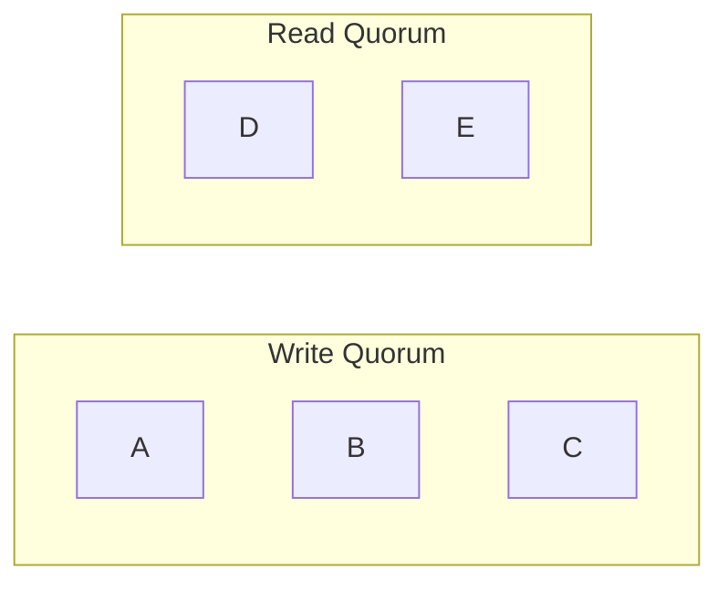

Both contain

```
Replica C
```

Therefore

the latest write

cannot disappear completely.

---

# Why This Matters

Suppose

Client writes

```
Balance = ₹1000
```

Write reaches

```
A

B

C
```

Later

another client reads

from

```
C

D

E
```

Replica C

belongs to

both quorums.

Therefore

the reader observes

the latest committed value.

---

# Majority Does Not Mean All

Many engineers incorrectly believe

quorum means

all replicas.

Incorrect.

Quorum means

enough replicas

to guarantee intersection.

---

# Mental Model

Imagine five managers

must approve

a financial transaction.

Rule

```
Need

3 Approvals
```

Later

another committee

also requires

3 approvals.

Because every majority overlaps,

at least one manager

knows the latest approved decision.

Exactly the same principle applies to distributed systems.

---

# Principal Engineer Insight

> [!IMPORTANT]
>
> Quorum is fundamentally an **intersection guarantee**.
>
> It is **not** about counting replicas.
>
> The goal is to ensure that every successful operation shares at least one replica with future operations.

---

# Common Interview Mistakes

> [!WARNING]
> Thinking quorum means "all replicas."

---

> [!WARNING]
> Assuming majority automatically guarantees zero data loss.

---

> [!WARNING]
> Believing quorum eliminates replication lag.

---

# Key Takeaways

- Quorum is a majority of replicas.
- Majority guarantees overlap.
- Overlap preserves visibility of committed writes.
- Quorum balances latency, consistency and availability.
- Quorum is the mathematical foundation of many distributed systems.

---

# Deriving the Quorum Formula

One of the most common interview questions is:

> Why does

```
R + W > N
```

provide better consistency?

Instead of memorizing the formula,

let's derive it.

---

# Definitions

Before we begin,

let's define the variables.

```
N

↓

Replication Factor
```

Number of replicas storing the data.

---

```
W

↓

Write Quorum
```

Minimum number of replicas that must acknowledge a write.

---

```
R

↓

Read Quorum
```

Minimum number of replicas that participate in a read.

---

# Example

Suppose

```
N = 3
```

We have

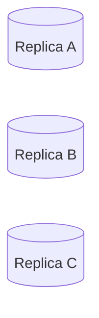

---

# Write Example

Suppose

```
W = 2
```

Client performs

```
Balance = ₹5000
```

Coordinator sends the write to all replicas.

Only

```
Replica A

Replica B
```

acknowledge.

Write succeeds.

Replica C may still be updating.

---

# Read Example

Now suppose

```
R = 2
```

Coordinator reads from

```
Replica B

Replica C
```

Replica B

contains

the latest value.

Replica C

may be stale.

Coordinator compares both responses

and returns

the newest version.

---

# Why Does This Work?

Let's draw the sets.

Write Quorum

```text
A

B
```

Read Quorum

```text
B

C
```

Notice

Both contain

```
Replica B
```

At least one replica

belongs to

both operations.

This shared replica

is called

the

**Intersection**.

---

# The Core Principle

If

every successful write

shares

at least one replica

with

every future read,

then

the read

has access

to

the latest committed value.

Everything else

follows from this observation.

---

# Mathematical Proof

Suppose

```
R + W

≤

N
```

Example

```
N = 5

W = 2

R = 2
```

Notice

```
2 + 2 = 4

≤

5
```

Can the read

and write quorums

be completely different?

Yes.

Example

Write

```text
A

B
```

Read

```text
C

D
```

Shared replica

```
None
```

The read

may never observe

the latest write.

Consistency breaks.

---

# Now Consider

```
N = 5

W = 3

R = 3
```

Notice

```
3 + 3 = 6

>

5
```

Can two sets

of size

3

exist

without sharing

at least one replica?

No.

Let's try.

Write

```text
A

B

C
```

Read

```text
D

E

?
```

Only

two replicas remain.

A third replica

must come from

the write quorum.

Intersection

is unavoidable.

---

# General Proof

Suppose

```
Write Set Size

=

W
```

Read Set Size

```
=

R
```

Total replicas

```
=

N
```

If

```
R + W

>

N
```

then

the two sets

cannot be disjoint.

By the Pigeonhole Principle,

they must overlap.

That overlap guarantees

that at least one replica

contains

the latest committed write.

---

# Visual Explanation


Replica

```
C
```

belongs to

both sets.

---

# Does Quorum Guarantee Strong Consistency?

Not always.

Quorum guarantees

intersection.

It does not automatically guarantee

linearizability.

Why?

Several reasons exist.

- Concurrent writes
- Clock skew
- Replica failures
- Delayed replication
- Network partitions

Additional mechanisms

such as

Raft

or

Paxos

are required

for strict linearizability.

---

# Different Quorum Configurations

## Example 1

```
N = 3

W = 2

R = 2
```

```
2 + 2 = 4

>

3
```

Good.

---

## Example 2

```
N = 5

W = 3

R = 3
```

```
3 + 3 = 6

>

5
```

Good.

---

## Example 3

```
N = 5

W = 2

R = 2
```

```
2 + 2 = 4

≤

5
```

Intersection

is not guaranteed.

---

## Example 4

```
N = 7

W = 4

R = 4
```

```
4 + 4 = 8

>

7
```

Intersection guaranteed.

---

# Trade-offs

Increasing

```
W
```

Advantages

- Better durability
- Better consistency

Disadvantages

- Higher write latency
- Lower availability

---

Increasing

```
R
```

Advantages

- Better read freshness

Disadvantages

- Higher read latency

---

Increasing

```
N
```

Advantages

- Better fault tolerance

Disadvantages

- More storage
- More network traffic
- More operational complexity

---

# Principal Engineer Insight

> [!IMPORTANT]
> The quorum formula is not magic.
>
> It is a mathematical consequence of **set intersection**.
>
> A successful write must leave evidence on at least one replica that every successful read is guaranteed to contact.
>
> This is why quorum works.

---

# Interview Conversation

**Interviewer**

Why does

```
R + W > N
```

work?

---

**Weak Answer**

Because that's the quorum formula.

---

**Principal Engineer Answer**

The formula guarantees that every successful read quorum intersects every successful write quorum. Since at least one replica belongs to both operations, the read has access to a replica that has already acknowledged the latest committed write. The guarantee comes from set intersection, not from the specific numbers themselves.

---

# Common Interview Mistakes

> [!WARNING]
> Thinking quorum guarantees zero stale reads.

---

> [!WARNING]
> Assuming quorum alone guarantees linearizability.

---

> [!WARNING]
> Believing every read contacts every replica.

---

> [!WARNING]
> Memorizing the formula without understanding the intersection proof.

---

# Key Takeaways

- `R` is the Read Quorum.
- `W` is the Write Quorum.
- `N` is the Replication Factor.
- `R + W > N` guarantees quorum intersection.
- Quorum intersection increases the probability of observing the latest committed write.
- Quorum alone is not sufficient for linearizability.

---

# Quorum in Real Distributed Databases

Every distributed database implements quorum differently.

Some expose quorum directly.

Others hide it behind higher-level APIs.

The underlying idea remains the same.

> Ensure that enough replicas participate in an operation so that data remains available and sufficiently consistent.

---

# Apache Cassandra

Cassandra gives developers explicit control over consistency.

Instead of selecting one consistency level for the entire cluster,

every read and write request can specify its own consistency level.

---

# Replication Example

Suppose

```
Replication Factor (N) = 3
```

Three replicas store the same partition.

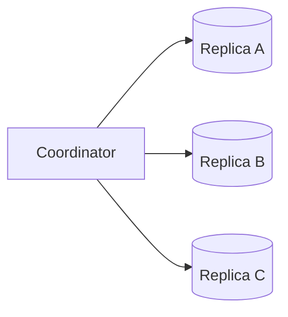

---

# Consistency Level: ONE

```
Write

↓

One Replica ACK

↓

Success
```

Advantages

- Lowest latency
- Highest availability

Trade-offs

- Higher probability of stale reads
- Greater risk of data loss before replication completes

---

## Typical Workloads

- Logging
- Metrics
- Analytics
- User Activity Streams

---

# Consistency Level: TWO

```
Need

2 ACKs
```

Balanced approach.

Better durability than ONE.

Still relatively low latency.

---

# Consistency Level: THREE

```
Need

3 ACKs
```

With

```
Replication Factor = 3
```

all replicas must acknowledge.

Equivalent to

ALL.

---

# Consistency Level: QUORUM

Formula

```
floor(N / 2) + 1
```

Examples

| Replication Factor | QUORUM |
|-------------------|---------|
| 3 | 2 |
| 5 | 3 |
| 7 | 4 |

This is Cassandra's most commonly used consistency level.

---

# Why QUORUM?

Suppose

```
N = 3
```

Write

```
QUORUM

↓

2 ACKs
```

Read

```
QUORUM

↓

2 Reads
```

```
2 + 2 > 3
```

Read and write quorums intersect.

Consistency improves.

---

# Consistency Level: ALL

Every replica

must acknowledge.

```
Replica A

ACK

Replica B

ACK

Replica C

ACK

↓

Success
```

Advantages

- Highest durability
- Strongest consistency

Trade-offs

- Highest latency
- Lowest availability

If even one replica is unavailable,

the operation fails.

---

# Consistency Level: ANY

One of Cassandra's most misunderstood consistency levels.

ANY does **not** require any replica to persist the write immediately.

If all replicas are unavailable,

the coordinator stores a **Hint**.

Later,

the hint is replayed to the replicas.

Advantages

- Maximum availability

Trade-offs

- Weakest durability guarantees

---

# LOCAL_QUORUM

Imagine two regions.

```text
India

Replica A

Replica B

Replica C

-------------------

Europe

Replica D

Replica E

Replica F
```

Client located in India.

LOCAL_QUORUM

requires

only the majority

of replicas

inside India.

Advantages

- Lower latency
- Avoids cross-region round trips
- Better regional performance

Trade-offs

Remote regions may observe updates slightly later.

---

# EACH_QUORUM

Now suppose

every region

must acknowledge independently.

```
India

↓

Majority

AND

Europe

↓

Majority
```

This provides stronger cross-region guarantees.

Trade-offs

Higher latency.

Lower availability.

---

# Cassandra Consistency Summary

| Level | Required ACKs | Latency | Consistency |
|--------|---------------|----------|-------------|
| ANY | Hint or Replica | Lowest | Lowest |
| ONE | 1 | Very Low | Low |
| TWO | 2 | Low | Medium |
| THREE | 3 | Medium | High |
| QUORUM | Majority | Medium | High |
| LOCAL_QUORUM | Regional Majority | Medium | High |
| EACH_QUORUM | Majority per Region | High | Very High |
| ALL | Every Replica | Highest | Highest |

---

# MongoDB

MongoDB exposes quorum using

**Write Concern**.

---

## w:1

Primary acknowledges immediately.

Fast.

Lower durability.

---

## w:majority

The primary waits until

a majority

of voting replicas

acknowledge.

This greatly reduces

the chance of losing acknowledged writes during failover.

---

## Example

Five-node Replica Set

```
Primary

Secondary A

Secondary B

Secondary C

Secondary D
```

```
Majority

=

3
```

Client receives success

after

three nodes

acknowledge.

---

# Read Concern

MongoDB also lets applications choose

read guarantees.

Examples

- local
- majority
- linearizable

Applications can balance

latency

and

consistency

per request.

---

# Amazon DynamoDB

DynamoDB does not expose

quorum terminology directly.

Instead,

applications choose

between

Eventually Consistent Reads

and

Strongly Consistent Reads.

Internally,

quorum-style replication is used,

but AWS intentionally hides those implementation details.

---

# Kafka

Kafka uses a concept

very similar to quorum.

Instead of

Read Quorum

and

Write Quorum,

Kafka uses

**In-Sync Replicas (ISR).**

---

## Producer ACK Settings

### acks=0

Producer does not wait.

Lowest latency.

Highest risk.

---

### acks=1

Leader acknowledges.

Followers replicate later.

Balanced performance.

---

### acks=all

Leader waits until

every replica

inside the ISR

acknowledges.

This is conceptually similar

to a quorum write,

although Kafka defines durability in terms of the ISR rather than a fixed replication factor.

---

# Comparing Databases

| Database | Consistency Control |
|-----------|--------------------|
| Cassandra | ONE, QUORUM, ALL, LOCAL_QUORUM |
| MongoDB | Write Concern, Read Concern |
| DynamoDB | Strong vs Eventual Reads |
| Kafka | Producer ACKs + ISR |
| CockroachDB | Raft Majority |
| Spanner | Paxos Majority |

Although the APIs differ,

the engineering principles remain remarkably similar.

---

# Choosing the Right Consistency Level

| Workload | Suggested Level |
|-----------|-----------------|
| Banking | QUORUM / Majority |
| Payments | Majority |
| Shopping Cart | QUORUM |
| Product Catalog | ONE |
| Logging | ONE |
| Analytics | ONE |
| Notifications | ONE |
| Search | ONE or QUORUM |

Always start from the business requirement.

---

# Principal Engineer Insight

> [!IMPORTANT]
> Quorum is not a database feature.
>
> It is a distributed systems pattern.
>
> Cassandra, MongoDB, Kafka, Spanner and CockroachDB all apply the same underlying principle:
>
> Ensure enough replicas acknowledge an operation so future operations can safely observe it.

---

# Interview Conversation

**Interviewer**

Why doesn't Cassandra simply use ALL for every request?

---

**Weak Answer**

Because it's slower.

---

**Principal Engineer Answer**

Using ALL maximizes consistency but significantly reduces availability. If any replica is unavailable or slow, the request fails or experiences higher latency. QUORUM provides a better balance because it guarantees quorum intersection while allowing some replicas to be temporarily unavailable.

---

# Common Interview Mistakes

> [!WARNING]
> Thinking QUORUM always means every replica.

---

> [!WARNING]
> Assuming Kafka ISR is identical to Cassandra quorum.

The goals are similar, but Kafka defines durability using the current In-Sync Replica set rather than configurable read/write quorums.

---

> [!WARNING]
> Assuming DynamoDB exposes quorum settings directly.

AWS intentionally abstracts these implementation details.

---

# Key Takeaways

- Cassandra exposes multiple consistency levels.
- QUORUM is the most commonly used balance between consistency and availability.
- MongoDB uses Majority Write Concern.
- Kafka uses ISR acknowledgements.
- Different databases expose different APIs while applying the same quorum principles.
- Business requirements should determine the chosen consistency level.

---

# Advanced Quorum Concepts

So far we have learned

- Majority Quorums
- Read Quorums
- Write Quorums
- Why `R + W > N` works

Unfortunately,

real distributed systems are more complicated.

Network failures,

slow replicas,

concurrent writes,

and clock skew

introduce situations where quorum alone is not sufficient.

---

# Quorum Is Necessary

Quorum provides

```
Intersection
```

This is required.

However,

intersection alone does **not**

guarantee

```
Latest Value
```

Additional mechanisms

are still required.

---

# Failure Scenario 1

Suppose

```
Replication Factor

N = 3
```

Write Quorum

```
W = 2
```

Read Quorum

```
R = 2
```

Everything appears correct.

---

## Write Begins

Coordinator sends

```
Balance = ₹1000
```

to

```
Replica A

Replica B

Replica C
```

---

## Replica Responses

```
Replica A

ACK
```

```
Replica B

ACK
```

```
Replica C

Slow
```

Client receives

```
Success
```

because

```
W = 2
```

---

# Failure Occurs

Immediately afterwards

Replica A crashes.

Replica B becomes isolated

due to a network partition.

Replica C

still has

the old value.

Question

Can a read return stale data?

Yes.

Even though

```
R + W > N
```

was satisfied.

---

# Why?

Quorum guarantees

intersection

only among

successful operations.

Failures occurring

after acknowledgements

can temporarily expose

older replicas.

Distributed systems

must recover

from these situations.

---

# Failure Scenario 2

Concurrent Writes

Suppose

Client A

writes

```
Balance = ₹1000
```

At exactly the same time

Client B

writes

```
Balance = ₹1200
```

Both operations

reach different replicas first.

Now

different replicas

contain

different latest values.

Question

Which value is correct?

Quorum

cannot answer

this question.

Conflict resolution

becomes necessary.

---

# How Databases Resolve This

Different databases

choose different strategies.

| Database | Conflict Resolution |
|-----------|--------------------|
| Cassandra | Timestamp |
| Dynamo | Vector Clocks |
| Cosmos DB | Last Write Wins (Configurable) |
| CRDT Systems | Merge Operations |
| Raft | Single Leader |
| Paxos | Consensus |

Quorum

is only

one part

of the solution.

---

# Sloppy Quorum

Normal Quorum

writes

only

to the replicas

responsible

for the partition.

Suppose

Replica B

is unavailable.

Instead of failing,

the coordinator

writes

to another healthy replica.

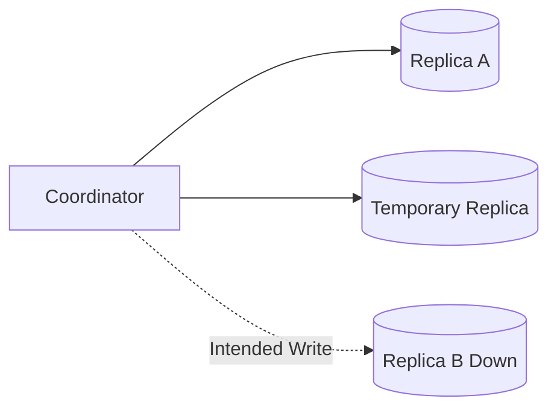

This is called

**Sloppy Quorum**.

---

# Why Sloppy Quorum Exists

Without Sloppy Quorum

```
Replica Down

↓

Write Fails
```

With Sloppy Quorum

```
Replica Down

↓

Write Stored Elsewhere

↓

Later Recovery
```

Availability improves significantly.

---

# Hinted Handoff

Temporary replicas

must eventually

return the data

to the correct replica.

This process

is called

**Hinted Handoff**.

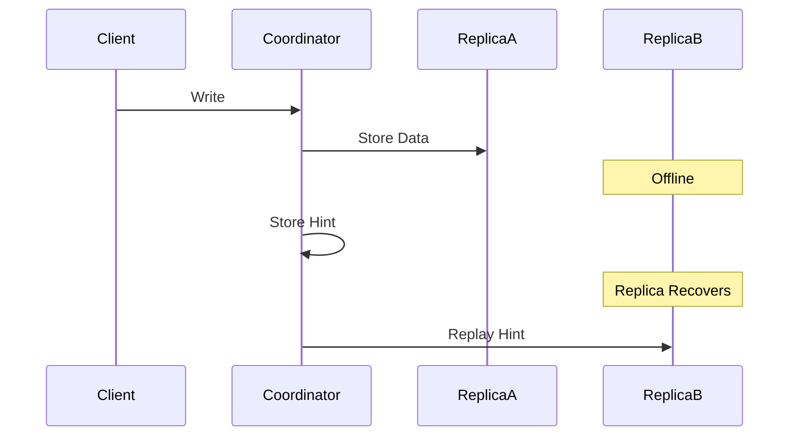

---

# Read Repair

Suppose

Replica C

missed several writes.

Client performs

a read.

Coordinator receives

```
Replica A

↓

Version 20
```

```
Replica B

↓

Version 20
```

```
Replica C

↓

Version 18
```

Coordinator

returns

Version 20

and simultaneously

updates

Replica C.

This is

Read Repair.

---

# Anti-Entropy Repair

Read Repair

repairs only

data that clients read.

Question

What about data

nobody reads?

Answer

Background synchronization.

Databases periodically

compare replicas

using

Merkle Trees.

Only

different ranges

are synchronized.

---

# Network Partition

Suppose

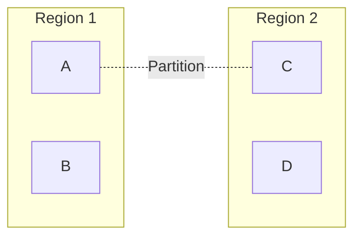

Question

Should

both partitions

continue

accepting writes?

Possible choices

1. Stop one side.
2. Continue both sides.

Choice

depends on

business requirements.

This is exactly

the trade-off

described by

CAP Theorem.

---

# Quorum Loss

Suppose

```
N = 5
```

Quorum

```
3
```

Now

three replicas

fail.

Remaining replicas

```
2
```

Question

Can writes continue?

No.

Majority

no longer exists.

The system

must either

become unavailable

or

accept weaker guarantees.

---

# Split Brain

Suppose

both partitions

believe

they own

the majority.

Both accept writes.

When the partition heals,

conflicting histories exist.

Consensus protocols

such as

Raft

and

Paxos

prevent this.

---

# Why Quorum Alone Is Not Enough

Quorum solves

one problem.

```
Replica Intersection
```

Consensus solves

another problem.

```
Single Ordered History
```

Modern databases

often combine

both.

---

# Principal Engineer Insight

> [!IMPORTANT]
>
> Quorum is a building block,
> not a complete distributed systems solution.
>
> Production systems combine:
>
> - Quorum
> - Leader Election
> - Consensus
> - Replica Repair
> - Conflict Resolution
> - Failure Detection
>
> Together these mechanisms provide correctness and availability.

---

# Interview Conversation

**Interviewer**

If

```
R + W > N
```

is satisfied,

can stale reads still occur?

---

**Weak Answer**

No.

---

**Principal Engineer Answer**

Yes. Quorum guarantees that read and write quorums intersect under normal operation, but it does not eliminate failures such as concurrent writes, delayed replication, replica crashes after acknowledgements, clock skew, or network partitions. Production systems therefore combine quorum with conflict resolution, replica repair, and consensus mechanisms when stronger guarantees are required.

---

# Common Interview Mistakes

> [!WARNING]
> Assuming quorum guarantees linearizability.

---

> [!WARNING]
> Thinking Sloppy Quorum permanently stores data.

Temporary replicas eventually transfer ownership back through Hinted Handoff.

---

> [!WARNING]
> Assuming Read Repair updates every stale replica.

Only replicas participating in the read are repaired immediately.

---

> [!WARNING]
> Believing quorum eliminates Split Brain.

Consensus protocols prevent Split Brain.

Quorum alone does not.

---

# Key Takeaways

- Quorum guarantees replica intersection.
- Intersection alone does not guarantee correctness.
- Sloppy Quorum improves availability during failures.
- Hinted Handoff restores temporarily misplaced writes.
- Read Repair fixes inconsistencies during reads.
- Anti-Entropy Repair synchronizes replicas in the background.
- Consensus protocols complement quorum by providing a single ordered history.

---

# Quorum in Consensus Algorithms

Until now we have studied quorum in databases.

Consensus algorithms also rely on quorum.

The terminology changes,

but the mathematical principle remains exactly the same.

---

# Raft Majority

Suppose we have

```
5 Nodes
```

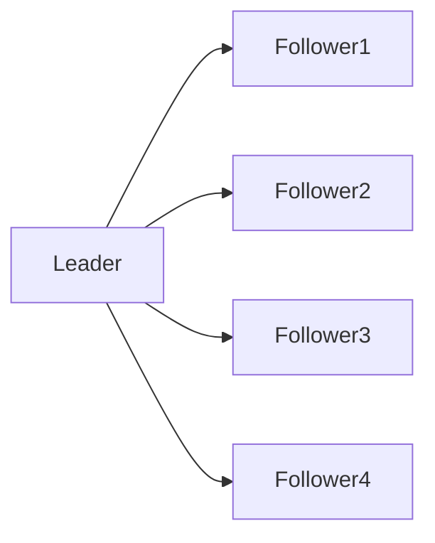

For a log entry to commit,

the leader must replicate it to a majority.

```
5 Nodes

↓

Majority = 3
```

Only after

three replicas

acknowledge

does the leader consider

the entry committed.

---

# Why Majority?

Suppose

Leader commits

Entry 100.

```
Leader

Follower1

Follower2
```

Three nodes contain

Entry 100.

Later

Leader crashes.

A new leader

must be elected.

Since every majority intersects,

the new leader

must contain

Entry 100.

Committed entries

cannot disappear.

This is the same quorum intersection principle.

---

# Paxos Majority

Paxos also requires

a majority

of acceptors.

Example

```
5 Acceptors
```

Proposal succeeds only if

```
3 Acceptors

Accept
```

Again,

quorum ensures

future leaders

cannot ignore

already accepted proposals.

---

# ZooKeeper

ZooKeeper stores metadata,

configuration,

and distributed locks.

Writes require

a quorum

of ZooKeeper servers.

Reads may come

from followers,

depending on consistency requirements.

---

# etcd

Kubernetes stores

cluster state

inside etcd.

Every update

to Kubernetes

must be committed

through a Raft majority.

Without quorum,

the cluster becomes

read-only.

---

# Kafka

Kafka also relies on

majority-like durability.

Suppose

```
Replication Factor = 3
```

Leader

```
Broker A
```

Followers

```
Broker B

Broker C
```

When

```
acks=all
```

is configured,

the leader waits until

every replica

inside the current ISR

acknowledges

before replying.

Although Kafka does not expose configurable read/write quorums,

its durability model follows the same engineering principle:

multiple replicas must acknowledge a write before it is considered safe.

---

# Quorum Across Technologies

| System | Quorum Purpose |
|----------|----------------|
| Cassandra | Read & Write Consistency |
| MongoDB | Majority Write Concern |
| DynamoDB | Internal Replication |
| Kafka | Durable Log Replication |
| ZooKeeper | Metadata Consistency |
| etcd | Cluster State |
| Raft | Log Commitment |
| Paxos | Proposal Acceptance |
| CockroachDB | Raft Majority |
| Spanner | Paxos Majority |

Different APIs.

Same mathematics.

---

# Quorum and CAP

Quorum does **not**

eliminate CAP.

Suppose

```
5 Replicas
```

Network Partition

```
3 Nodes

↓

2 Nodes
```

Only

the partition

containing

the majority

continues accepting writes.

The minority partition

rejects writes.

Availability decreases,

but consistency is preserved.

---

# Why Majority Is Always Chosen

Suppose

instead of majority,

we required

```
2 Nodes
```

out of

```
5
```

Question

Could two independent groups

both accept writes?

Yes.

Group A

```
Node1

Node2
```

Group B

```
Node3

Node4
```

No overlap.

Conflicting histories become possible.

Majority prevents this.

---

# Principal Engineer Design Checklist

Before selecting a quorum strategy,

answer the following questions.

---

## Availability

How many node failures

must the system tolerate?

---

## Latency

Can writes wait

for multiple acknowledgements?

---

## Durability

How much data loss

is acceptable?

---

## Consistency

Can clients tolerate

stale reads?

---

## Multi-Region

Should quorums span

multiple regions

or remain local?

---

## Cost

Every additional replica

increases

- Storage
- Network traffic
- Synchronization cost
- Operational complexity

---

# Production Trade-offs

| Choice | Benefit | Cost |
|---------|----------|------|
| Small Write Quorum | Fast Writes | Lower Durability |
| Large Write Quorum | Better Durability | Higher Latency |
| Small Read Quorum | Fast Reads | Higher Staleness |
| Large Read Quorum | Fresher Reads | Higher Latency |
| More Replicas | Better Fault Tolerance | Higher Cost |

---

# Whiteboard Exercise

Design a globally distributed payment service.

Requirements

- Three AWS Regions
- Zero data loss
- Automatic failover
- 100,000 TPS

Discuss

- Replication factor
- Read quorum
- Write quorum
- Leader election
- Cross-region latency
- Failure handling

---

# Architecture Review Exercise

Review the following proposal.

> "Let's configure Cassandra with Consistency Level ONE because it's the fastest."

Questions

- Is stale data acceptable?
- What happens if the coordinator crashes?
- What if a replica fails before replication completes?
- Is Read Your Own Writes required?
- Would QUORUM provide a better balance?

---

# Senior Engineer Interview Questions

1. What is quorum?
2. Why do distributed systems need quorum?
3. Explain majority voting.
4. What is a read quorum?
5. What is a write quorum?
6. Why is majority calculated as `floor(N/2)+1`?
7. Explain quorum using an example.
8. Does quorum improve availability?
9. Does quorum eliminate replication lag?
10. What is quorum intersection?

---

# Staff Engineer Interview Questions

1. Explain why `R + W > N` works.
2. What is Sloppy Quorum?
3. Explain Hinted Handoff.
4. Explain Read Repair.
5. Explain Anti-Entropy Repair.
6. Why isn't quorum sufficient for linearizability?
7. Compare Cassandra and MongoDB quorum.
8. Compare Kafka ISR with quorum.
9. Explain quorum loss.
10. Explain quorum during network partitions.

---

# Principal Engineer Interview Questions

## Q1

Design quorum for a globally distributed banking platform.

---

## Q2

Would you choose

```
N = 3

or

N = 5
```

Why?

---

## Q3

How would you reduce write latency

without compromising durability?

---

## Q4

Suppose

quorum acknowledgements

increase from

```
20 ms

↓

300 ms
```

How would you investigate?

Discuss

- Network latency
- Replica health
- Disk I/O
- CPU
- Backpressure
- Slow regions

---

## Q5

Can quorum guarantee correctness

without consensus?

Explain.

---

## Q6

How would quorum behave

during a regional outage?

---

## Q7

Explain quorum to a Product Manager.

---

## Q8

Would you ever reduce write quorum

during peak traffic?

Why or why not?

---

## Q9

How would you test quorum

before a production release?

---

## Q10

How would you review another team's quorum configuration?

---

# Common Interview Mistakes

❌ Quorum means every replica.

---

❌ `R + W > N` guarantees linearizability.

---

❌ Quorum removes the need for leader election.

---

❌ More replicas always improve performance.

---

❌ Read Repair repairs every replica immediately.

---

# One-Page Cheat Sheet

## Quorum Formula

```
R + W > N
```

Where

- `N` = Replication Factor
- `R` = Read Quorum
- `W` = Write Quorum

---

## Majority Formula

```
Majority = floor(N / 2) + 1
```

---

## Core Principle

```
Every successful read

must intersect

every successful write.
```

Intersection

↓

Latest committed value

---

## Related Technologies

| Technology | Uses Quorum |
|------------|-------------|
| Cassandra | ✅ |
| MongoDB | ✅ |
| DynamoDB | ✅ (Internal) |
| Kafka | ✅ (ISR-based durability) |
| ZooKeeper | ✅ |
| etcd | ✅ |
| Raft | ✅ |
| Paxos | ✅ |

---

# References

## Books

- Designing Data-Intensive Applications
- Database Internals

## Research Papers

- Dynamo
- Raft
- Paxos
- Spanner

---

# Chapter Summary

Quorum is one of the most fundamental concepts in distributed systems.

Its power comes from **set intersection**.

The idea is simple:

> Every successful read must overlap with every successful write.

This simple mathematical property enables databases and consensus algorithms to balance consistency, availability, latency and fault tolerance.

A Principal Engineer understands that quorum is **not merely a formula**.

It is a design pattern that appears repeatedly in distributed databases, consensus algorithms, messaging systems and cloud infrastructure.

---

> **Principal Engineer Takeaway**
>
> A Senior Engineer remembers the quorum formula.
>
> A Staff Engineer explains why quorum intersection works.
>
> A Principal Engineer designs systems where quorum settings evolve with business requirements, failure scenarios, regional topology and operational constraints while understanding where quorum alone is insufficient and consensus becomes necessary.


---

# Raft Leader Election

Raft is one of the most widely used consensus algorithms in modern distributed systems.

It was designed to be easier to understand than Paxos while providing the same safety guarantees.

Raft is built on three ideas:

- Leader Election
- Log Replication
- Safety

This section focuses on **Leader Election**.

---

# Why Raft Exists

Before Raft,

many systems used Paxos.

Although Paxos is mathematically elegant,

it is difficult to understand and implement correctly.

Raft was designed with a different goal.

> Build a consensus algorithm that engineers can understand and implement correctly.

Today,

Raft powers

- etcd
- Kubernetes
- CockroachDB
- TiKV
- Consul
- Nomad
- RKE2
- Dragonboat

---

# Raft Cluster

Suppose we have

```
5 Nodes
```

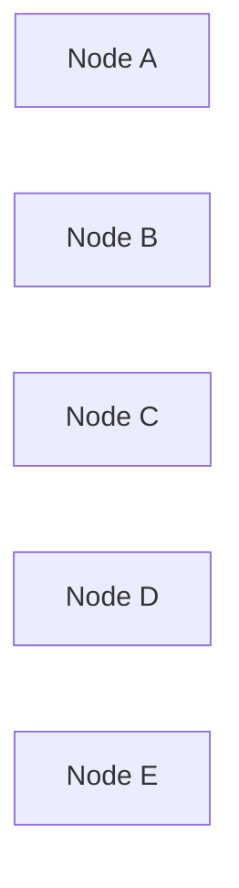

Only one node

acts as

Leader.

All remaining nodes

are Followers.

---

# Three Raft States

Every server is always in exactly one state.

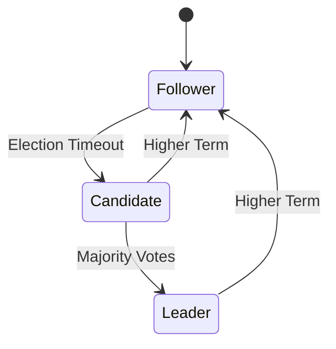

There are only three states.

- Follower
- Candidate
- Leader

Nothing else.

---

# Follower

Followers perform very little work.

Responsibilities

- Receive heartbeats
- Accept replicated logs
- Respond to vote requests
- Monitor leader health

Followers never initiate writes.

Followers remain passive until something goes wrong.

---

# Leader

Exactly one leader exists.

Responsibilities

- Accept client requests
- Append log entries
- Replicate logs
- Send heartbeats
- Commit transactions

Clients communicate only with the leader.

---

# Candidate

Candidate is a temporary state.

A follower becomes a candidate

only when

it believes

the leader has failed.

Candidate starts

an election.

If successful

↓

Leader.

Otherwise

↓

Follower.

---

# Normal Cluster

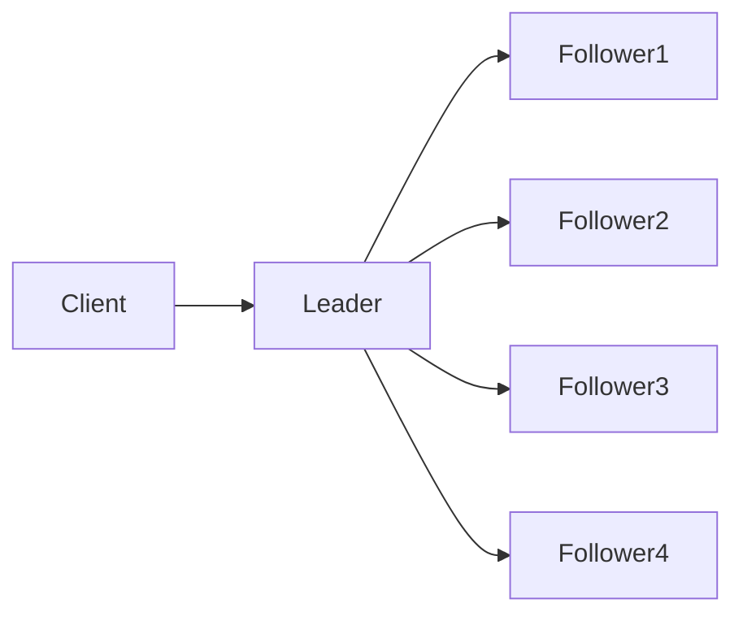

Everything works normally.

Followers continuously receive heartbeats.

---

# Heartbeats

Question

How do followers know

the leader

is still alive?

Answer

Heartbeats.

Leader periodically sends

```
AppendEntries
```

RPCs.

Even if

there are

no new log entries,

empty

AppendEntries

are still transmitted.

These are

Heartbeats.

---

# Heartbeat Timeline

```text
Leader

Heartbeat

↓

Heartbeat

↓

Heartbeat

↓

Heartbeat
```

Followers reset

their election timers

every time

they receive

a heartbeat.

---

# Election Timeout

Each follower

maintains

an Election Timer.

Suppose

Election Timeout

```
150 ms
```

If

no heartbeat

arrives

within

150 ms,

the follower

assumes

the leader

may have failed.

Election begins.

---

# Why "May Have Failed"?

Missing heartbeats

do not necessarily

mean

the leader crashed.

Possible reasons

- Network delay
- GC pause
- CPU starvation
- Packet loss
- Temporary congestion

Raft therefore treats

timeouts

as

suspected failures,

not confirmed failures.

---

# Randomized Election Timeout

This is one of Raft's most brilliant ideas.

Suppose

every follower

used exactly

```
200 ms
```

Leader crashes.

Every follower

starts an election

at exactly

200 ms.

Result

Everyone votes

for themselves.

Nobody wins.

This is called

```
Split Vote
```

---

# Solution

Randomize

Election Timeout.

Instead of

```
200 ms
```

every node chooses

a random timeout.

Example

```
Node A

175 ms
```

```
Node B

241 ms
```

```
Node C

198 ms
```

```
Node D

289 ms
```

```
Node E

164 ms
```

Now

Node E

times out first.

Only one node

starts the election.

Split votes

become extremely unlikely.

---

# Why Randomization Works

Imagine

five students

waiting

for a teacher.

If everyone

raises their hand

at exactly

the same time,

confusion occurs.

Instead,

each student

waits

a random amount of time.

Usually

only one student

speaks first.

Exactly the same idea

is used by Raft.

---

# Election Timeline

```text
Leader Crashes

↓

Follower Timeout

↓

Candidate

↓

Vote Requests

↓

Majority Votes

↓

Leader
```

Simple.

Predictable.

Reliable.

---

# Terms

Raft divides time

into

Terms.

A Term represents

one election period.

Example

```text
Term 1

↓

Term 2

↓

Term 3

↓

Term 4
```

Every election

creates

a new Term.

---

# Why Terms Exist

Suppose

Leader crashes.

Follower becomes

Candidate.

Election begins.

New leader wins.

Question

How do old leaders

know

they are obsolete?

Answer

Terms.

Every RPC

contains

the current Term.

Higher Term

always wins.

---

# Example

Leader

```
Term = 5
```

Follower

discovers

```
Term = 6
```

Leader immediately

steps down.

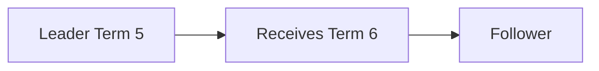

This prevents

old leaders

from continuing

to process writes.

---

# Leader Heartbeat Example

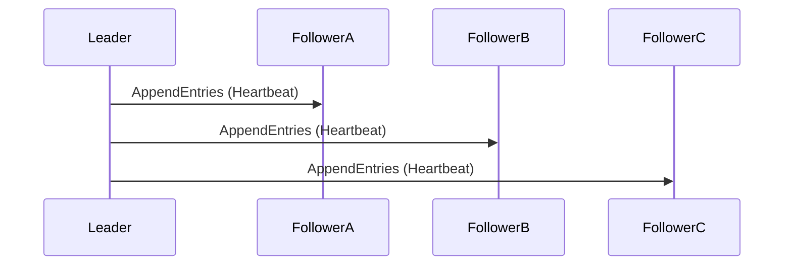

Followers respond

with

success.

Election timers

are reset.

---

# Failure Example

Suppose

Leader crashes.

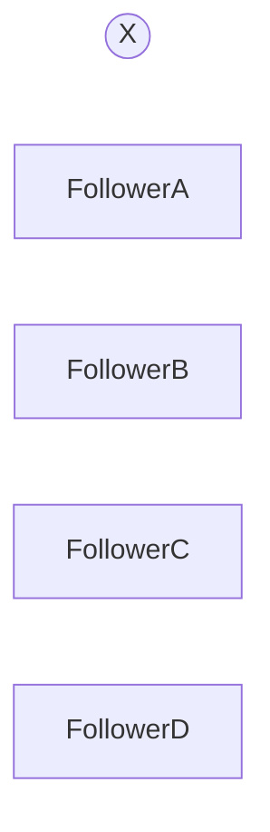

Heartbeats stop.

Election timers

continue counting.

One follower

times out first.

It becomes

Candidate.

Election begins.

---

# Why Followers Don't Elect Immediately

Suppose

heartbeat interval

```
50 ms
```

Election timeout

```
200–400 ms
```

Temporary network delay

of

```
80 ms
```

should

not

trigger

an election.

Election timeout

must always be

significantly larger

than

heartbeat interval.

---

# Production Defaults

Typical values

| Parameter | Typical Value |
|-----------|---------------|
| Heartbeat Interval | 50–100 ms |
| Election Timeout | 150–300 ms (Randomized) |

Exact values

depend on

network latency,

cluster size,

and workload.

---

# Principal Engineer Insight

> [!IMPORTANT]
>
> Randomized election timeout is one of the key innovations that makes Raft practical.
>
> Without randomization, simultaneous elections would occur frequently, causing repeated split votes and unstable leadership.
>
> A small amount of randomness dramatically improves cluster stability.

---

# Interview Conversation

**Interviewer**

Why doesn't every follower start an election immediately after missing one heartbeat?

---

**Weak Answer**

Because of timeout.

---

**Principal Engineer Answer**

Heartbeats can be delayed due to network congestion, GC pauses, CPU scheduling, or transient failures. Triggering an election after a single missed heartbeat would cause unnecessary leader changes. Raft therefore waits for a randomized election timeout that is significantly larger than the heartbeat interval before assuming leader failure.

---

# Common Interview Mistakes

> [!WARNING]
> Thinking every missed heartbeat means the leader crashed.

---

> [!WARNING]
> Using identical election timeouts on every node.

---

> [!WARNING]
> Confusing Terms with Log Indexes.

A Term identifies an election period.

A Log Index identifies a log entry.

---

> [!WARNING]
> Assuming followers can accept client writes.

Only the leader accepts writes.

---

# Key Takeaways

- Raft has exactly three states: Follower, Candidate and Leader.
- Leaders periodically send AppendEntries heartbeats.
- Followers start elections only after a randomized election timeout.
- Every election creates a new Term.
- Higher Terms always take precedence over lower Terms.
- Randomized timeouts greatly reduce split votes.
- Heartbeat intervals must be significantly smaller than election timeouts.

---

# RequestVote RPC

So far we have seen

```
Leader Crashes

↓

Follower Timeout

↓

Candidate
```

Question

How does the Candidate actually become the Leader?

Raft solves this using the

**RequestVote RPC**.

This is the most important RPC in Leader Election.

---

# Two Core RPCs in Raft

Raft has only two RPCs.

| RPC | Purpose |
|------|----------|
| RequestVote | Elect a Leader |
| AppendEntries | Replicate Logs + Heartbeats |

Everything in Raft is built on these two RPCs.

---

# Election Begins

Suppose

Leader crashes.

Follower B times out first.

Follower B becomes

Candidate.

Immediately,

it performs three actions.

1. Increment Current Term.
2. Vote for itself.
3. Send RequestVote RPCs to every other server.

---

# Step 1 — Increment Term

Suppose

Leader was in

```
Term = 8
```

Candidate starts election.

Current Term becomes

```
Term = 9
```

Every election

always starts

a new Term.

---

# Step 2 — Vote for Yourself

Every Candidate

automatically votes

for itself.

Example

```
Candidate B

Votes

↓

B
```

Current Vote Count

```
1
```

---

# Step 3 — Send Vote Requests

Candidate sends

RequestVote

to every other server.

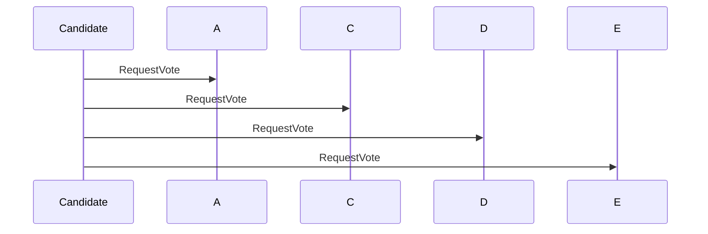

---

# What Does RequestVote Contain?

Every RequestVote RPC includes

| Field | Purpose |
|--------|----------|
| Term | Candidate's current term |
| Candidate ID | Candidate requesting votes |
| Last Log Index | Latest log entry index |
| Last Log Term | Term of latest log entry |

Notice

Raft does

not

vote based only on

Server ID.

Log freshness

also matters.

---

# Why Log Information Is Needed

Suppose

Server A

```
Last Log Index

150
```

Server B

```
Last Log Index

142
```

Question

Should

Server B

become leader?

No.

It is missing

eight committed log entries.

Electing it

could lose committed data.

---

# Vote Decision

Follower receives

RequestVote.

It performs

a sequence of checks.

```mermaid
flowchart TD

A[Receive RequestVote]

A --> B{Higher Term?}

B -->|No| Reject

B -->|Yes| C{Already Voted?}

C -->|Yes| Reject

C -->|No| D{Candidate Log Up-to-date?}

D -->|No| Reject

D -->|Yes| Grant Vote
```

Only if

every check succeeds

does the follower

grant its vote.

---

# Rule 1

Higher Term Wins.

Suppose

Follower

```
Term = 8
```

Candidate

```
Term = 9
```

Follower immediately updates

its own term

to

```
9
```

Older Terms

can never win.

---

# Rule 2

One Vote Per Term

Each server

may vote

only once

during a Term.

Example

```
Term 12

↓

Vote Given

↓

Cannot Vote Again
```

This prevents

multiple leaders

during the same Term.

---

# Rule 3

Candidate Must Have an Up-to-Date Log

This is

one of Raft's

most important safety rules.

Follower compares

its own log

with

the Candidate's log.

Candidate wins

only if

its log is

at least as up-to-date.

---

# Log Comparison

Suppose

Follower

```
Last Log Term

15

Last Index

320
```

Candidate

```
Last Log Term

14

Last Index

500
```

Question

Who wins?

Follower rejects.

Higher

Term

is always preferred.

---

# Another Example

Follower

```
Last Log Term

15

Index

300
```

Candidate

```
Last Log Term

15

Index

320
```

Terms equal.

Higher Index wins.

Candidate receives

the vote.

---

# Log Freshness Rule

Comparison order

```
Last Log Term

↓

Last Log Index
```

Term comparison

always happens first.

Only if

Terms are equal

do we compare

Indexes.

---

# Why This Rule Exists

Imagine

Leader committed

ten transactions.

Follower

never received them.

If

that follower

became Leader,

those committed transactions

could disappear.

Raft prevents this

using

Log Freshness Checks.

---

# Majority Votes

Suppose

```
5 Servers
```

Candidate already has

its own vote.

```
1
```

Receives votes from

Server C

and

Server D.

Total

```
3
```

Majority achieved.

Candidate becomes

Leader.

---

# Election Timeline

```text
Leader Crashes

↓

Follower Timeout

↓

Candidate

↓

Increment Term

↓

Vote For Self

↓

RequestVote RPC

↓

Majority Votes

↓

Leader
```

---

# What Happens to Losing Candidates?

Suppose

another Candidate

receives

only

two votes.

Majority

is not reached.

Eventually

that Candidate

receives

AppendEntries

from

the newly elected Leader.

Immediately

it becomes

Follower.

---

# Split Vote

Suppose

five nodes.

Leader crashes.

Two nodes

timeout

almost simultaneously.

Node A

votes for itself.

Node B

votes for itself.

Followers split

their votes.

Result

```
2 Votes

↓

2 Votes

↓

1 Vote
```

Nobody reaches

Majority.

No Leader exists.

---

# Recovery from Split Vote

Raft does

not

try to negotiate.

Instead,

every Candidate

starts

another randomized

Election Timeout.

Eventually

one Candidate

times out first.

That Candidate

wins.

Simple.

Reliable.

---

# Example Timeline

```text
Election 1

↓

Split Vote

↓

Random Timeout

↓

Election 2

↓

Leader Elected
```

Randomization

solves the problem.

---

# Network Partition Example

Suppose

five servers.

Partition occurs.

Group A

```
3 Servers
```

Group B

```
2 Servers
```

Only

Group A

can obtain

Majority.

Group B

can never

elect a Leader.

This prevents

Split Brain.

---

# Why Doesn't Raft Use Highest Server ID?

Earlier algorithms

such as

Bully

used

Highest ID.

Raft chooses

the server

with

the

most up-to-date log.

Correctness

is more important

than priority.

---

# Principal Engineer Insight

> [!IMPORTANT]
>
> Raft does not elect the fastest server.
>
> It elects the server that is least likely to lose committed data.
>
> The Log Freshness Check is one of the key safety mechanisms that distinguishes Raft from simpler leader election algorithms.

---

# Interview Conversation

**Interviewer**

Why does RequestVote include Last Log Term and Last Log Index?

---

**Weak Answer**

To compare logs.

---

**Principal Engineer Answer**

Raft must ensure that a newly elected leader contains all committed entries. A follower therefore grants its vote only if the candidate's log is at least as up-to-date as its own. The comparison first evaluates the Last Log Term and, if equal, compares the Last Log Index. This prevents an outdated node from becoming leader and preserves committed data.

---

# Common Interview Mistakes

> [!WARNING]
> Assuming every candidate automatically becomes leader.

---

> [!WARNING]
> Ignoring the Log Freshness Check.

---

> [!WARNING]
> Thinking Server ID determines leadership.

---

> [!WARNING]
> Assuming a server can vote multiple times in the same Term.

---

# Key Takeaways

- Candidates increment the Term before starting an election.
- Every Candidate votes for itself.
- RequestVote is sent to every other server.
- Followers vote at most once per Term.
- Log freshness is checked before granting a vote.
- Majority votes are required to become Leader.
- Randomized election timeouts recover naturally from split votes.
- Raft prioritizes log correctness over server priority.

---

# Raft Safety Guarantees

Leader Election is useful only if it is **safe**.

Electing a leader that loses committed data is worse than having no leader at all.

Raft therefore defines several formal safety properties.

These properties make Raft suitable for production systems.

---

# Why Safety Matters

Suppose

Leader commits

```
Transfer ₹10,000
```

Immediately afterwards,

the leader crashes.

If the newly elected leader

does not contain

that committed transaction,

the system has permanently lost money.

This must never happen.

---

# Raft Safety Properties

Raft defines several guarantees.

| Property | Purpose |
|-----------|----------|
| Election Safety | Only one leader per term |
| Leader Completeness | New leader contains committed entries |
| Log Matching | Same index + same term ⇒ identical history |
| State Machine Safety | Every node applies committed entries in the same order |

In this section,

we focus on the first two.

---

# Election Safety

Definition

> At most one leader can be elected in a given Term.

---

# Why Is This True?

Suppose

```
5 Servers
```

Majority

```
3
```

Candidate A

receives

```
3 Votes
```

Candidate B

also claims

```
3 Votes
```

Can this happen?

No.

---

# Mathematical Proof

Every server

votes only once

per Term.

Suppose

Candidate A

wins

with

```
A

B

C
```

Candidate B

wins

with

```
D

E

?
```

Only

two servers remain.

Candidate B

must obtain

one vote

from

A, B or C.

Impossible.

That server

already voted.

Therefore

two leaders

cannot exist

in the same Term.

---

# Visual Example

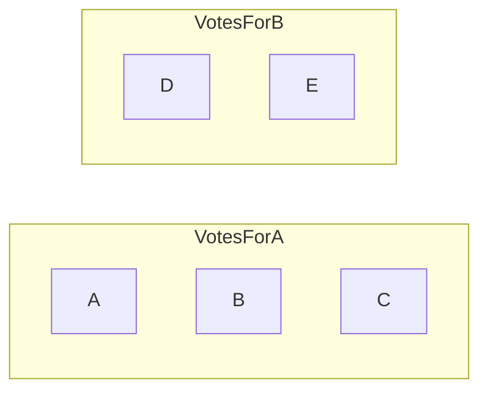

Candidate B

cannot reach

Majority.

Election Safety

is preserved.

---

# Leader Completeness Property

This is

one of

Raft's

strongest guarantees.

Definition

> If a log entry has been committed in a Term,
> every future leader will contain that entry.

Committed data

can never disappear.

---

# Example

Suppose

Leader

commits

```
Entry 250
```

Majority

contains

```
A

B

C
```

Leader crashes.

Election begins.

Who can become

the new Leader?

Only a server

whose log

contains

Entry 250.

Otherwise

followers

will reject

its RequestVote.

---

# Why Does This Work?

Remember

RequestVote

contains

```
Last Log Term

Last Log Index
```

Followers refuse

to vote

for candidates

with older logs.

Therefore

outdated servers

cannot become

Leader.

---

# Example

Server A

```
Last Index

500
```

Server B

```
Last Index

470
```

Server B

requests votes.

Followers compare logs.

Server B

is rejected.

Only

Server A

can become

Leader.

---

# Log Matching Property

Suppose

two logs

contain

```
Index = 120

Term = 8
```

Raft guarantees

everything

before

Index 120

is identical.

Example

```text
Server A

1

2

3

4

5

6

7

8

120
```

```text
Server B

1

2

3

4

5

6

7

8

120
```

History

before

120

must match exactly.

This greatly simplifies

replication.

---

# Why Is Log Matching Important?

Suppose

Follower

missed

five log entries.

Leader

sends

AppendEntries.

Follower compares

Previous Log Index

and

Previous Log Term.

If they match,

replication continues.

Otherwise,

Follower rejects

the request,

and the Leader backs up to find the last common point.

---

# State Machine Safety

Every server

eventually applies

the same committed entries

in exactly

the same order.

Example

```
Deposit ₹500

↓

Withdraw ₹100

↓

Transfer ₹300
```

Every replica

must execute

these operations

in this exact sequence.

Otherwise,

account balances

will diverge.

---

# Leader Completeness Example

Suppose

Leader

commits

```
Entry 100
```

Replication

```
Leader

↓

Follower A

↓

Follower B
```

Leader crashes.

Follower C

never received

Entry 100.

Can

Follower C

become Leader?

No.

Its log

is not sufficiently up-to-date.

---

# Higher Term Always Wins

Suppose

Leader

```
Term 12
```

Network delay occurs.

Meanwhile,

another election succeeds.

Cluster

moves to

```
Term 13
```

Old Leader

later reconnects.

It sends

AppendEntries

with

```
Term 12
```

Followers immediately reject.

Old Leader

observes

```
Higher Term = 13
```

Old Leader

steps down.

---

# Leadership Transfer

Normally,

leaders change

only after failures.

Sometimes,

operators

want

controlled leadership transfer.

Example

- Planned maintenance
- Rolling upgrade
- Draining a node

Instead of crashing the leader,

the current leader

hands leadership

to another healthy follower.

This minimizes

service disruption.

Many production Raft implementations,

including etcd,

support controlled leadership transfer.

---

# PreVote Optimization

Large distributed systems

sometimes experience

temporary network issues.

Without optimization,

an isolated follower

could repeatedly

increment the Term

and disrupt the cluster.

Raft implementations often add

**PreVote**.

---

# How PreVote Works

Instead of immediately

starting an election,

a follower first asks

other nodes

a simple question.

> "If I started an election,
> would you vote for me?"

If the answer is

No,

the follower

does not increase

its Term.

Cluster stability improves.

---

# Example

Suppose

Follower A

is temporarily isolated.

Without PreVote

```
Election

↓

Higher Term

↓

Current Leader Steps Down
```

Cluster experiences

unnecessary disruption.

With PreVote

Follower A

discovers

it cannot obtain

a majority.

Election

never starts.

---

# Leadership Timeline

```text
Leader

↓

Heartbeats

↓

Leader Failure

↓

Random Election Timeout

↓

Candidate

↓

RequestVote

↓

Majority

↓

Leader

↓

Log Synchronization

↓

Normal Operation
```

---

# Production Example

Kubernetes stores

cluster metadata

inside etcd.

Suppose

the current etcd leader

fails.

Followers detect

missing heartbeats.

Election begins.

Randomized timeouts

prevent split votes.

Majority elects

a new leader.

Clients continue

reading and writing

within a few hundred milliseconds.

---

# Why Raft Is Easier Than Paxos

Raft separates concerns.

| Component | Responsibility |
|-----------|----------------|
| Leader Election | Choose one Leader |
| Log Replication | Copy entries |
| Safety Rules | Prevent data loss |

Paxos combines

many of these concepts,

making it harder

to reason about.

Raft keeps them

independent.

---

# Principal Engineer Insight

> [!IMPORTANT]
>
> Raft's brilliance is not merely electing a leader.
>
> Its brilliance is ensuring that every future leader already contains all committed history.
>
> The combination of quorum voting, log freshness checks, terms and leader completeness prevents committed data from being lost during leader changes.

---

# Interview Conversation

**Interviewer**

Why does Raft compare log freshness before granting votes?

---

**Weak Answer**

To compare logs.

---

**Principal Engineer Answer**

Raft must preserve committed entries across leader changes. A follower therefore grants its vote only to a candidate whose log is at least as up-to-date as its own. This ensures that an outdated node cannot become leader and overwrite committed history. The combination of quorum voting and log freshness establishes the Leader Completeness Property.

---

# Common Interview Mistakes

> [!WARNING]
> Assuming a higher Term alone guarantees a safe leader.

---

> [!WARNING]
> Ignoring Log Freshness during elections.

---

> [!WARNING]
> Confusing committed entries with replicated entries.

An entry may be replicated but not yet committed.

---

> [!WARNING]
> Thinking PreVote is part of the original Raft paper.

PreVote is a widely adopted implementation enhancement, not part of the original Raft specification.

---

# Key Takeaways

- Election Safety guarantees at most one leader per Term.
- Leader Completeness ensures committed entries survive leader changes.
- Log Matching guarantees identical history before matching indexes.
- State Machine Safety ensures every replica executes committed operations in the same order.
- Higher Terms force stale leaders to step down.
- PreVote reduces unnecessary elections.
- Leadership Transfer enables graceful maintenance without disrupting the cluster.

---

# Real-World Raft Implementations

Understanding Raft theory is important.

Understanding how production systems use Raft is what distinguishes a Principal Engineer.

Let's examine several real systems.

---

# etcd

etcd is a distributed key-value store.

It is the source of truth for

- Kubernetes
- OpenShift
- RKE2
- K3s
- Many internal control planes

Everything inside etcd is replicated using Raft.

---

## Example

Suppose Kubernetes wants to create

```
Deployment
```

The API Server writes

```
Deployment Object
```

↓

etcd Leader

↓

Followers

↓

Majority Commit

↓

Success

Only after the majority acknowledges

does Kubernetes return

```
201 Created
```

---

# CockroachDB

CockroachDB stores data in

Ranges.

Each Range is replicated using Raft.

Example

```
Table

↓

Ranges

↓

Raft Group

↓

Leader

Followers
```

Every Range

has

its own Leader.

Thousands of independent Raft groups

may exist simultaneously.

---

# TiKV

TiKV uses

Raft

for every Region.

PD (Placement Driver)

decides

where Regions should live.

Raft guarantees

consistent replication

inside each Region.

---

# Consul

HashiCorp Consul

stores

- Service Discovery
- Configuration
- ACLs

All replicated

using Raft.

Leader handles

writes.

Followers serve

reads

depending on consistency mode.

---

# Nomad

HashiCorp Nomad

stores

cluster scheduling metadata

inside a Raft cluster.

Only

the Leader

schedules workloads.

Followers

replicate

cluster state.

---

# Why Kafka Replaced ZooKeeper

Historically

Kafka used

ZooKeeper

for

- Metadata
- Controller Election
- Broker Membership

Modern Kafka

uses

KRaft.

KRaft

implements

Raft directly.

Benefits

- Fewer moving parts
- Better scalability
- Easier operations
- No external ZooKeeper dependency

---

# Kubernetes Control Plane

Simplified architecture

```mermaid
flowchart TD

Client

-->

API Server

-->

etcd Leader

etcd Leader

-->

Follower A

etcd Leader

-->

Follower B
```

Everything

from

Pods

Deployments

Secrets

Nodes

ConfigMaps

is stored

through Raft.

---

# Raft During Leader Failure

Suppose

Leader crashes.

Timeline

```text
Leader Failure

↓

Heartbeats Stop

↓

Random Election Timeout

↓

Candidate

↓

RequestVote

↓

Majority

↓

New Leader

↓

Resume Writes
```

Clients

may briefly receive

```
Leader Not Available
```

Once

the new Leader

is elected,

writes continue.

---

# Leadership Transfer Example

Suppose

Node A

requires maintenance.

Without Leadership Transfer

```
Kill Node

↓

Election

↓

Temporary Downtime
```

With Leadership Transfer

```
Transfer Leadership

↓

Follower Becomes Leader

↓

Maintenance Begins
```

Applications experience

minimal disruption.

---

# Operational Metrics

Principal Engineers

monitor

Raft

continuously.

Important metrics

| Metric | Why It Matters |
|---------|----------------|
| Current Leader | Cluster health |
| Current Term | Election frequency |
| Commit Index | Replication progress |
| Applied Index | State machine progress |
| Election Count | Cluster stability |
| Leader Changes | Possible network issues |
| Replication Lag | Slow followers |
| Proposal Latency | Write performance |

---

# Warning Signs

Frequent elections

usually indicate

- Network instability
- CPU starvation
- Long GC pauses
- Slow disks
- Incorrect timeout configuration

Healthy clusters

rarely

change leaders.

---

# Common Production Problems

## Problem 1

Election Storm

Many nodes

start elections repeatedly.

Typical causes

- Election timeout too small
- High GC pause
- Network packet loss

---

## Problem 2

Slow Followers

Leader waits

for replication.

Follower disks

are overloaded.

Write latency increases.

---

## Problem 3

Clock Drift

Raft

does not depend

on synchronized clocks.

However,

extreme clock drift

can indirectly affect

timeouts

and operational behavior.

NTP

should always be enabled.

---

## Problem 4

Large Snapshot Transfer

Follower

falls far behind.

Instead of replaying

millions of log entries,

Leader sends

a Snapshot.

Follower catches up

quickly.

---

# Architecture Review Example

Suppose

another team proposes

```
Every node

can become leader

whenever

it detects

high CPU

on the current leader.
```

Questions

- How is correctness preserved?
- Who authorizes leadership changes?
- What prevents multiple leaders?
- How are committed logs protected?
- How are network partitions handled?

A Principal Engineer

reviews

correctness

before

performance.

---

# Whiteboard Exercise

Design

Leader Election

for

a globally distributed

payment platform.

Requirements

- Three AWS Regions
- Automatic Failover
- Zero committed transaction loss
- 99.99% Availability
- Leader failure detection
- Regional outage recovery

Discuss

- Heartbeat interval
- Election timeout
- Replication
- Majority quorum
- Leader transfer
- Monitoring
- Recovery

---

# Senior Engineer Interview Questions

1. Why does Raft need a Leader?
2. What are the three Raft states?
3. What is a Heartbeat?
4. Why is Election Timeout randomized?
5. What is a Term?
6. What is RequestVote?
7. Why does a Candidate vote for itself?
8. What happens after a Leader crashes?
9. Why are Followers passive?
10. What triggers an election?

---

# Staff Engineer Interview Questions

1. Explain Log Freshness.
2. Explain Leader Completeness.
3. Why does Raft prevent Split Brain?
4. Explain PreVote.
5. Explain Leadership Transfer.
6. Why can only one Leader exist?
7. Explain Election Safety.
8. Why compare Last Log Term before Last Log Index?
9. How does Raft recover from Split Votes?
10. Compare Raft Leader Election with ZooKeeper Leader Election.

---

# Principal Engineer Interview Questions

## Q1

Design Leader Election

for

10,000 database shards.

---

## Q2

How would you tune

Heartbeat Interval

and

Election Timeout

for

cross-region deployment?

---

## Q3

Suppose

Leader changes

every minute.

How would you investigate?

Discuss

- Network
- CPU
- Memory
- GC
- Disk
- Packet Loss
- Timeout configuration

---

## Q4

Would you ever

increase

Election Timeout?

Why?

---

## Q5

How would you perform

zero-downtime

cluster upgrades?

---

## Q6

Explain why

Raft uses

Terms

instead of timestamps.

---

## Q7

Design

Leader Election

for

1000 Kubernetes clusters.

---

## Q8

How would you test

Leader Election

before production?

---

## Q9

Compare

Raft

ZooKeeper

Paxos

Leader Election.

---

## Q10

Review another team's

Leader Election design.

Which questions would you ask?

---

# Common Interview Mistakes

❌ Assuming Heartbeats carry only health information.

Heartbeats are empty

AppendEntries RPCs.

---

❌ Assuming the fastest server should become Leader.

Correctness matters more than speed.

---

❌ Ignoring Log Freshness.

---

❌ Thinking Majority alone guarantees correctness.

Majority,

Terms,

Log Freshness,

and

Leader Completeness

work together.

---

❌ Assuming frequent Leader changes are normal.

Healthy clusters

maintain

stable leadership.

---

# Principal Engineer Review Checklist

Can you confidently explain

- Leader Election
- Heartbeats
- Election Timeout
- Randomized Timeout
- Terms
- RequestVote RPC
- AppendEntries RPC
- Log Freshness
- Election Safety
- Leader Completeness
- Leadership Transfer
- PreVote
- Split Vote Recovery
- Split Brain Prevention

Can you explain

why

each mechanism exists

instead of merely

how it works?

If yes,

you understand

Raft Leader Election

at a Principal Engineer level.

---

# One-Page Cheat Sheet

## Three States

```text
Follower

↓

Candidate

↓

Leader
```

---

## Election Flow

```text
Leader Failure

↓

Election Timeout

↓

Candidate

↓

Increment Term

↓

Vote For Self

↓

RequestVote

↓

Majority Votes

↓

Leader

↓

AppendEntries Heartbeats
```

---

## Safety Rules

| Rule | Purpose |
|------|----------|
| One Vote Per Term | Prevent multiple leaders |
| Majority Voting | Quorum intersection |
| Log Freshness | Prevent outdated leaders |
| Higher Term Wins | Remove stale leaders |
| Leader Completeness | Preserve committed entries |
| Log Matching | Ensure identical history |
| State Machine Safety | Execute committed operations consistently |

---

## Default Timing (Typical)

| Parameter | Typical Range |
|-----------|---------------|
| Heartbeat Interval | 50–100 ms |
| Election Timeout | 150–300 ms (Randomized) |

Always tune these values based on network latency and deployment topology.

---

# References

## Books

- Designing Data-Intensive Applications — Martin Kleppmann
- Database Internals — Alex Petrov

## Research Papers

- In Search of an Understandable Consensus Algorithm (Raft)
- Paxos Made Simple

## Engineering Blogs

- etcd Documentation
- Cockroach Labs Engineering
- TiKV Documentation
- HashiCorp Consul Engineering
- Kubernetes Documentation

---

# Chapter Summary

Leader Election ensures that exactly one node coordinates writes at any given time.

Raft combines

- Randomized Election Timeouts
- Majority Voting
- RequestVote RPC
- AppendEntries Heartbeats
- Terms
- Log Freshness
- Leader Completeness

to elect leaders safely while preserving committed history.

Unlike older algorithms,

Raft prioritizes correctness over simplicity or speed.

Its design has made it one of the most widely adopted consensus algorithms in modern distributed systems.

---

> **Principal Engineer Takeaway**
>
> A Senior Engineer can describe the Raft election process.
>
> A Staff Engineer can explain why randomized timeouts, quorum voting, and log freshness prevent split votes and outdated leaders.
>
> A Principal Engineer can tune Raft for production, diagnose unstable elections using operational metrics, design safe multi-region deployments, and reason formally about the safety guarantees that preserve committed data during failures.


