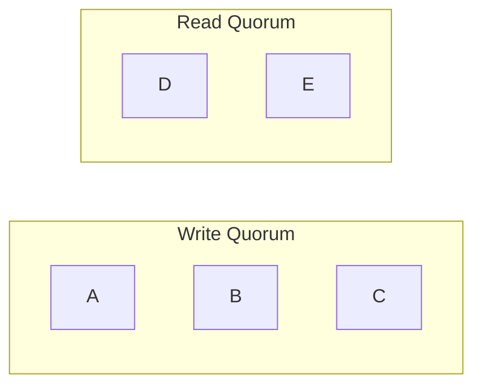
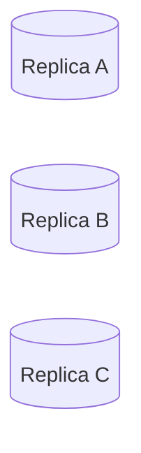
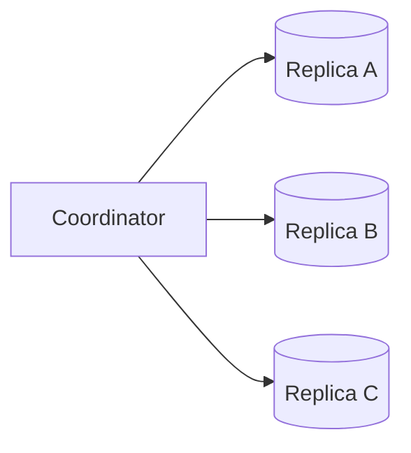
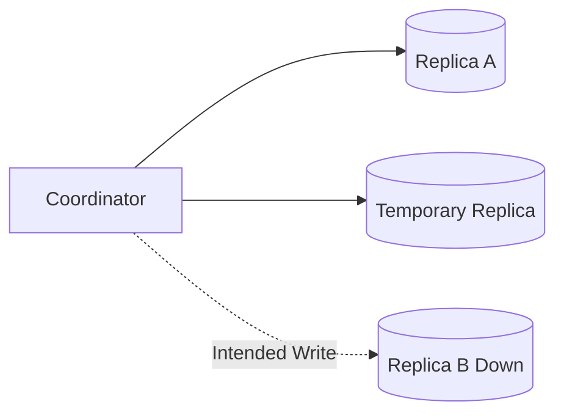
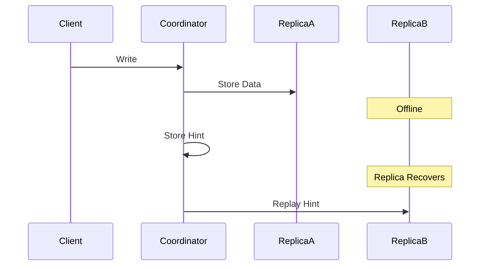
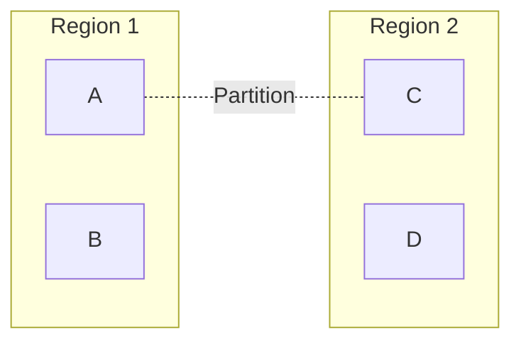
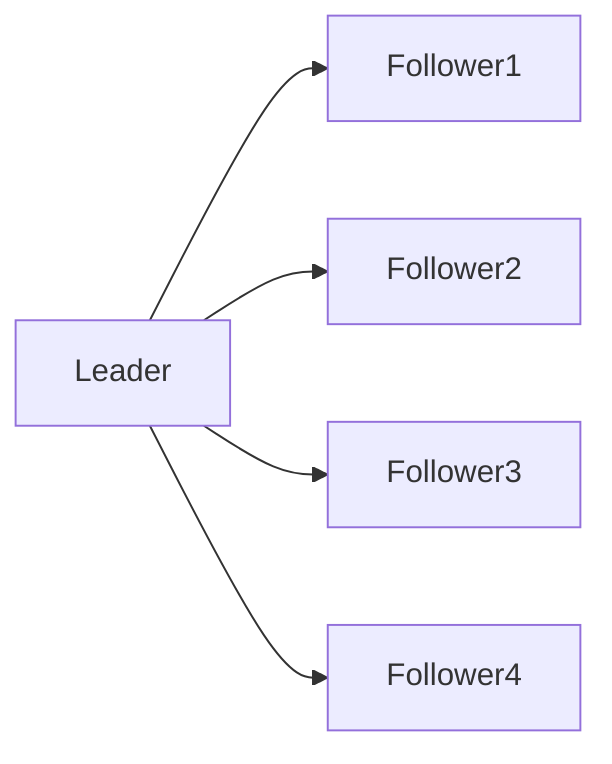

# Quorum Reads and Writes

> *"Quorum is the mathematical foundation that allows distributed systems to remain available while still providing strong consistency guarantees."*

---

# Table of Contents

1. Why Quorum Exists
2. The Problem with Replication
3. Understanding Quorum
4. Majority Voting
5. Read Quorum
6. Write Quorum
7. Why `R + W > N` Works
8. Production Examples

---

# Learning Objectives

After completing this chapter you should be able to:

- Explain why quorum exists.
- Derive quorum mathematically.
- Explain why `R + W > N` works.
- Understand majority voting.
- Explain quorum in Cassandra, DynamoDB, MongoDB, Kafka and Raft.
- Answer Staff and Principal Engineer interview questions.

---

# Why This Chapter Matters

Almost every distributed database uses quorum.

Examples

- Cassandra
- DynamoDB
- MongoDB
- ZooKeeper
- etcd
- CockroachDB
- YugabyteDB
- Raft
- Paxos

The implementation differs.

The underlying mathematics is identical.

---

# The Replication Problem

Suppose

```
Replication Factor

N = 3
```

We have

```mermaid
flowchart LR

Client

-->

Replica A

Client

-->

Replica B

Client

-->

Replica C
```

Client writes

```
Balance = ₹500
```

Question

When should we tell the client

```
Success
```

Immediately?

After one replica?

After two?

After all three?

There is no obvious answer.

---

# Option 1

Wait for

one replica.

```
Replica A

ACK

↓

Success
```

Advantages

- Lowest latency

Disadvantages

- Data loss risk
- Weak consistency

---

# Option 2

Wait for

all replicas.

```
A

↓

B

↓

C

↓

Success
```

Advantages

- Highest durability

Disadvantages

- High latency
- Low availability

One slow replica delays everyone.

---

# The Middle Ground

Instead of

```
One

or

All
```

Choose

```
Majority
```

This is called

**Quorum**.

---

# What Is Quorum?

Definition

A quorum is the minimum number of replicas that must participate in an operation before it is considered successful.

Examples

```
N = 3

Quorum = 2
```

```
N = 5

Quorum = 3
```

```
N = 7

Quorum = 4
```

General formula

```
Majority

=

⌊N / 2⌋ + 1
```

---

# Why Majority?

Suppose

```
5 Replicas
```

```
A

B

C

D

E
```

Majority

```
3
```

Question

Can two different majorities exist

without sharing

at least one replica?

Let's see.

Group 1

```
A

B

C
```

Group 2

```
C

D

E
```

Both share

```
Replica C
```

This property is the foundation of quorum systems.

---

# Quorum Intersection

The most important property of quorum.

Every two majorities

must intersect.



Both contain

```
Replica C
```

Therefore

the latest write

cannot disappear completely.

---

# Why This Matters

Suppose

Client writes

```
Balance = ₹1000
```

Write reaches

```
A

B

C
```

Later

another client reads

from

```
C

D

E
```

Replica C

belongs to

both quorums.

Therefore

the reader observes

the latest committed value.

---

# Majority Does Not Mean All

Many engineers incorrectly believe

quorum means

all replicas.

Incorrect.

Quorum means

enough replicas

to guarantee intersection.

---

# Mental Model

Imagine five managers

must approve

a financial transaction.

Rule

```
Need

3 Approvals
```

Later

another committee

also requires

3 approvals.

Because every majority overlaps,

at least one manager

knows the latest approved decision.

Exactly the same principle applies to distributed systems.

---

# Principal Engineer Insight

> [!IMPORTANT]
>
> Quorum is fundamentally an **intersection guarantee**.
>
> It is **not** about counting replicas.
>
> The goal is to ensure that every successful operation shares at least one replica with future operations.

---

# Common Interview Mistakes

> [!WARNING]
> Thinking quorum means "all replicas."

---

> [!WARNING]
> Assuming majority automatically guarantees zero data loss.

---

> [!WARNING]
> Believing quorum eliminates replication lag.

---

# Key Takeaways

- Quorum is a majority of replicas.
- Majority guarantees overlap.
- Overlap preserves visibility of committed writes.
- Quorum balances latency, consistency and availability.
- Quorum is the mathematical foundation of many distributed systems.

---

# Deriving the Quorum Formula

One of the most common interview questions is:

> Why does

```
R + W > N
```

provide better consistency?

Instead of memorizing the formula,

let's derive it.

---

# Definitions

Before we begin,

let's define the variables.

```
N

↓

Replication Factor
```

Number of replicas storing the data.

---

```
W

↓

Write Quorum
```

Minimum number of replicas that must acknowledge a write.

---

```
R

↓

Read Quorum
```

Minimum number of replicas that participate in a read.

---

# Example

Suppose

```
N = 3
```

We have



---

# Write Example

Suppose

```
W = 2
```

Client performs

```
Balance = ₹5000
```

Coordinator sends the write to all replicas.

Only

```
Replica A

Replica B
```

acknowledge.

Write succeeds.

Replica C may still be updating.

---

# Read Example

Now suppose

```
R = 2
```

Coordinator reads from

```
Replica B

Replica C
```

Replica B

contains

the latest value.

Replica C

may be stale.

Coordinator compares both responses

and returns

the newest version.

---

# Why Does This Work?

Let's draw the sets.

Write Quorum

```text
A

B
```

Read Quorum

```text
B

C
```

Notice

Both contain

```
Replica B
```

At least one replica

belongs to

both operations.

This shared replica

is called

the

**Intersection**.

---

# The Core Principle

If

every successful write

shares

at least one replica

with

every future read,

then

the read

has access

to

the latest committed value.

Everything else

follows from this observation.

---

# Mathematical Proof

Suppose

```
R + W

≤

N
```

Example

```
N = 5

W = 2

R = 2
```

Notice

```
2 + 2 = 4

≤

5
```

Can the read

and write quorums

be completely different?

Yes.

Example

Write

```text
A

B
```

Read

```text
C

D
```

Shared replica

```
None
```

The read

may never observe

the latest write.

Consistency breaks.

---

# Now Consider

```
N = 5

W = 3

R = 3
```

Notice

```
3 + 3 = 6

>

5
```

Can two sets

of size

3

exist

without sharing

at least one replica?

No.

Let's try.

Write

```text
A

B

C
```

Read

```text
D

E

?
```

Only

two replicas remain.

A third replica

must come from

the write quorum.

Intersection

is unavoidable.

---

# General Proof

Suppose

```
Write Set Size

=

W
```

Read Set Size

```
=

R
```

Total replicas

```
=

N
```

If

```
R + W

>

N
```

then

the two sets

cannot be disjoint.

By the Pigeonhole Principle,

they must overlap.

That overlap guarantees

that at least one replica

contains

the latest committed write.

---

# Visual Explanation


Replica

```
C
```

belongs to

both sets.

---

# Does Quorum Guarantee Strong Consistency?

Not always.

Quorum guarantees

intersection.

It does not automatically guarantee

linearizability.

Why?

Several reasons exist.

- Concurrent writes
- Clock skew
- Replica failures
- Delayed replication
- Network partitions

Additional mechanisms

such as

Raft

or

Paxos

are required

for strict linearizability.

---

# Different Quorum Configurations

## Example 1

```
N = 3

W = 2

R = 2
```

```
2 + 2 = 4

>

3
```

Good.

---

## Example 2

```
N = 5

W = 3

R = 3
```

```
3 + 3 = 6

>

5
```

Good.

---

## Example 3

```
N = 5

W = 2

R = 2
```

```
2 + 2 = 4

≤

5
```

Intersection

is not guaranteed.

---

## Example 4

```
N = 7

W = 4

R = 4
```

```
4 + 4 = 8

>

7
```

Intersection guaranteed.

---

# Trade-offs

Increasing

```
W
```

Advantages

- Better durability
- Better consistency

Disadvantages

- Higher write latency
- Lower availability

---

Increasing

```
R
```

Advantages

- Better read freshness

Disadvantages

- Higher read latency

---

Increasing

```
N
```

Advantages

- Better fault tolerance

Disadvantages

- More storage
- More network traffic
- More operational complexity

---

# Principal Engineer Insight

> [!IMPORTANT]
> The quorum formula is not magic.
>
> It is a mathematical consequence of **set intersection**.
>
> A successful write must leave evidence on at least one replica that every successful read is guaranteed to contact.
>
> This is why quorum works.

---

# Interview Conversation

**Interviewer**

Why does

```
R + W > N
```

work?

---

**Weak Answer**

Because that's the quorum formula.

---

**Principal Engineer Answer**

The formula guarantees that every successful read quorum intersects every successful write quorum. Since at least one replica belongs to both operations, the read has access to a replica that has already acknowledged the latest committed write. The guarantee comes from set intersection, not from the specific numbers themselves.

---

# Common Interview Mistakes

> [!WARNING]
> Thinking quorum guarantees zero stale reads.

---

> [!WARNING]
> Assuming quorum alone guarantees linearizability.

---

> [!WARNING]
> Believing every read contacts every replica.

---

> [!WARNING]
> Memorizing the formula without understanding the intersection proof.

---

# Key Takeaways

- `R` is the Read Quorum.
- `W` is the Write Quorum.
- `N` is the Replication Factor.
- `R + W > N` guarantees quorum intersection.
- Quorum intersection increases the probability of observing the latest committed write.
- Quorum alone is not sufficient for linearizability.

---

# Quorum in Real Distributed Databases

Every distributed database implements quorum differently.

Some expose quorum directly.

Others hide it behind higher-level APIs.

The underlying idea remains the same.

> Ensure that enough replicas participate in an operation so that data remains available and sufficiently consistent.

---

# Apache Cassandra

Cassandra gives developers explicit control over consistency.

Instead of selecting one consistency level for the entire cluster,

every read and write request can specify its own consistency level.

---

# Replication Example

Suppose

```
Replication Factor (N) = 3
```

Three replicas store the same partition.



---

# Consistency Level: ONE

```
Write

↓

One Replica ACK

↓

Success
```

Advantages

- Lowest latency
- Highest availability

Trade-offs

- Higher probability of stale reads
- Greater risk of data loss before replication completes

---

## Typical Workloads

- Logging
- Metrics
- Analytics
- User Activity Streams

---

# Consistency Level: TWO

```
Need

2 ACKs
```

Balanced approach.

Better durability than ONE.

Still relatively low latency.

---

# Consistency Level: THREE

```
Need

3 ACKs
```

With

```
Replication Factor = 3
```

all replicas must acknowledge.

Equivalent to

ALL.

---

# Consistency Level: QUORUM

Formula

```
floor(N / 2) + 1
```

Examples

| Replication Factor | QUORUM |
|-------------------|---------|
| 3 | 2 |
| 5 | 3 |
| 7 | 4 |

This is Cassandra's most commonly used consistency level.

---

# Why QUORUM?

Suppose

```
N = 3
```

Write

```
QUORUM

↓

2 ACKs
```

Read

```
QUORUM

↓

2 Reads
```

```
2 + 2 > 3
```

Read and write quorums intersect.

Consistency improves.

---

# Consistency Level: ALL

Every replica

must acknowledge.

```
Replica A

ACK

Replica B

ACK

Replica C

ACK

↓

Success
```

Advantages

- Highest durability
- Strongest consistency

Trade-offs

- Highest latency
- Lowest availability

If even one replica is unavailable,

the operation fails.

---

# Consistency Level: ANY

One of Cassandra's most misunderstood consistency levels.

ANY does **not** require any replica to persist the write immediately.

If all replicas are unavailable,

the coordinator stores a **Hint**.

Later,

the hint is replayed to the replicas.

Advantages

- Maximum availability

Trade-offs

- Weakest durability guarantees

---

# LOCAL_QUORUM

Imagine two regions.

```text
India

Replica A

Replica B

Replica C

-------------------

Europe

Replica D

Replica E

Replica F
```

Client located in India.

LOCAL_QUORUM

requires

only the majority

of replicas

inside India.

Advantages

- Lower latency
- Avoids cross-region round trips
- Better regional performance

Trade-offs

Remote regions may observe updates slightly later.

---

# EACH_QUORUM

Now suppose

every region

must acknowledge independently.

```
India

↓

Majority

AND

Europe

↓

Majority
```

This provides stronger cross-region guarantees.

Trade-offs

Higher latency.

Lower availability.

---

# Cassandra Consistency Summary

| Level | Required ACKs | Latency | Consistency |
|--------|---------------|----------|-------------|
| ANY | Hint or Replica | Lowest | Lowest |
| ONE | 1 | Very Low | Low |
| TWO | 2 | Low | Medium |
| THREE | 3 | Medium | High |
| QUORUM | Majority | Medium | High |
| LOCAL_QUORUM | Regional Majority | Medium | High |
| EACH_QUORUM | Majority per Region | High | Very High |
| ALL | Every Replica | Highest | Highest |

---

# MongoDB

MongoDB exposes quorum using

**Write Concern**.

---

## w:1

Primary acknowledges immediately.

Fast.

Lower durability.

---

## w:majority

The primary waits until

a majority

of voting replicas

acknowledge.

This greatly reduces

the chance of losing acknowledged writes during failover.

---

## Example

Five-node Replica Set

```
Primary

Secondary A

Secondary B

Secondary C

Secondary D
```

```
Majority

=

3
```

Client receives success

after

three nodes

acknowledge.

---

# Read Concern

MongoDB also lets applications choose

read guarantees.

Examples

- local
- majority
- linearizable

Applications can balance

latency

and

consistency

per request.

---

# Amazon DynamoDB

DynamoDB does not expose

quorum terminology directly.

Instead,

applications choose

between

Eventually Consistent Reads

and

Strongly Consistent Reads.

Internally,

quorum-style replication is used,

but AWS intentionally hides those implementation details.

---

# Kafka

Kafka uses a concept

very similar to quorum.

Instead of

Read Quorum

and

Write Quorum,

Kafka uses

**In-Sync Replicas (ISR).**

---

## Producer ACK Settings

### acks=0

Producer does not wait.

Lowest latency.

Highest risk.

---

### acks=1

Leader acknowledges.

Followers replicate later.

Balanced performance.

---

### acks=all

Leader waits until

every replica

inside the ISR

acknowledges.

This is conceptually similar

to a quorum write,

although Kafka defines durability in terms of the ISR rather than a fixed replication factor.

---

# Comparing Databases

| Database | Consistency Control |
|-----------|--------------------|
| Cassandra | ONE, QUORUM, ALL, LOCAL_QUORUM |
| MongoDB | Write Concern, Read Concern |
| DynamoDB | Strong vs Eventual Reads |
| Kafka | Producer ACKs + ISR |
| CockroachDB | Raft Majority |
| Spanner | Paxos Majority |

Although the APIs differ,

the engineering principles remain remarkably similar.

---

# Choosing the Right Consistency Level

| Workload | Suggested Level |
|-----------|-----------------|
| Banking | QUORUM / Majority |
| Payments | Majority |
| Shopping Cart | QUORUM |
| Product Catalog | ONE |
| Logging | ONE |
| Analytics | ONE |
| Notifications | ONE |
| Search | ONE or QUORUM |

Always start from the business requirement.

---

# Principal Engineer Insight

> [!IMPORTANT]
> Quorum is not a database feature.
>
> It is a distributed systems pattern.
>
> Cassandra, MongoDB, Kafka, Spanner and CockroachDB all apply the same underlying principle:
>
> Ensure enough replicas acknowledge an operation so future operations can safely observe it.

---

# Interview Conversation

**Interviewer**

Why doesn't Cassandra simply use ALL for every request?

---

**Weak Answer**

Because it's slower.

---

**Principal Engineer Answer**

Using ALL maximizes consistency but significantly reduces availability. If any replica is unavailable or slow, the request fails or experiences higher latency. QUORUM provides a better balance because it guarantees quorum intersection while allowing some replicas to be temporarily unavailable.

---

# Common Interview Mistakes

> [!WARNING]
> Thinking QUORUM always means every replica.

---

> [!WARNING]
> Assuming Kafka ISR is identical to Cassandra quorum.

The goals are similar, but Kafka defines durability using the current In-Sync Replica set rather than configurable read/write quorums.

---

> [!WARNING]
> Assuming DynamoDB exposes quorum settings directly.

AWS intentionally abstracts these implementation details.

---

# Key Takeaways

- Cassandra exposes multiple consistency levels.
- QUORUM is the most commonly used balance between consistency and availability.
- MongoDB uses Majority Write Concern.
- Kafka uses ISR acknowledgements.
- Different databases expose different APIs while applying the same quorum principles.
- Business requirements should determine the chosen consistency level.

---

# Advanced Quorum Concepts

So far we have learned

- Majority Quorums
- Read Quorums
- Write Quorums
- Why `R + W > N` works

Unfortunately,

real distributed systems are more complicated.

Network failures,

slow replicas,

concurrent writes,

and clock skew

introduce situations where quorum alone is not sufficient.

---

# Quorum Is Necessary

Quorum provides

```
Intersection
```

This is required.

However,

intersection alone does **not**

guarantee

```
Latest Value
```

Additional mechanisms

are still required.

---

# Failure Scenario 1

Suppose

```
Replication Factor

N = 3
```

Write Quorum

```
W = 2
```

Read Quorum

```
R = 2
```

Everything appears correct.

---

## Write Begins

Coordinator sends

```
Balance = ₹1000
```

to

```
Replica A

Replica B

Replica C
```

---

## Replica Responses

```
Replica A

ACK
```

```
Replica B

ACK
```

```
Replica C

Slow
```

Client receives

```
Success
```

because

```
W = 2
```

---

# Failure Occurs

Immediately afterwards

Replica A crashes.

Replica B becomes isolated

due to a network partition.

Replica C

still has

the old value.

Question

Can a read return stale data?

Yes.

Even though

```
R + W > N
```

was satisfied.

---

# Why?

Quorum guarantees

intersection

only among

successful operations.

Failures occurring

after acknowledgements

can temporarily expose

older replicas.

Distributed systems

must recover

from these situations.

---

# Failure Scenario 2

Concurrent Writes

Suppose

Client A

writes

```
Balance = ₹1000
```

At exactly the same time

Client B

writes

```
Balance = ₹1200
```

Both operations

reach different replicas first.

Now

different replicas

contain

different latest values.

Question

Which value is correct?

Quorum

cannot answer

this question.

Conflict resolution

becomes necessary.

---

# How Databases Resolve This

Different databases

choose different strategies.

| Database | Conflict Resolution |
|-----------|--------------------|
| Cassandra | Timestamp |
| Dynamo | Vector Clocks |
| Cosmos DB | Last Write Wins (Configurable) |
| CRDT Systems | Merge Operations |
| Raft | Single Leader |
| Paxos | Consensus |

Quorum

is only

one part

of the solution.

---

# Sloppy Quorum

Normal Quorum

writes

only

to the replicas

responsible

for the partition.

Suppose

Replica B

is unavailable.

Instead of failing,

the coordinator

writes

to another healthy replica.



This is called

**Sloppy Quorum**.

---

# Why Sloppy Quorum Exists

Without Sloppy Quorum

```
Replica Down

↓

Write Fails
```

With Sloppy Quorum

```
Replica Down

↓

Write Stored Elsewhere

↓

Later Recovery
```

Availability improves significantly.

---

# Hinted Handoff

Temporary replicas

must eventually

return the data

to the correct replica.

This process

is called

**Hinted Handoff**.



---

# Read Repair

Suppose

Replica C

missed several writes.

Client performs

a read.

Coordinator receives

```
Replica A

↓

Version 20
```

```
Replica B

↓

Version 20
```

```
Replica C

↓

Version 18
```

Coordinator

returns

Version 20

and simultaneously

updates

Replica C.

This is

Read Repair.

---

# Anti-Entropy Repair

Read Repair

repairs only

data that clients read.

Question

What about data

nobody reads?

Answer

Background synchronization.

Databases periodically

compare replicas

using

Merkle Trees.

Only

different ranges

are synchronized.

---

# Network Partition

Suppose



Question

Should

both partitions

continue

accepting writes?

Possible choices

1. Stop one side.
2. Continue both sides.

Choice

depends on

business requirements.

This is exactly

the trade-off

described by

CAP Theorem.

---

# Quorum Loss

Suppose

```
N = 5
```

Quorum

```
3
```

Now

three replicas

fail.

Remaining replicas

```
2
```

Question

Can writes continue?

No.

Majority

no longer exists.

The system

must either

become unavailable

or

accept weaker guarantees.

---

# Split Brain

Suppose

both partitions

believe

they own

the majority.

Both accept writes.

When the partition heals,

conflicting histories exist.

Consensus protocols

such as

Raft

and

Paxos

prevent this.

---

# Why Quorum Alone Is Not Enough

Quorum solves

one problem.

```
Replica Intersection
```

Consensus solves

another problem.

```
Single Ordered History
```

Modern databases

often combine

both.

---

# Principal Engineer Insight

> [!IMPORTANT]
>
> Quorum is a building block,
> not a complete distributed systems solution.
>
> Production systems combine:
>
> - Quorum
> - Leader Election
> - Consensus
> - Replica Repair
> - Conflict Resolution
> - Failure Detection
>
> Together these mechanisms provide correctness and availability.

---

# Interview Conversation

**Interviewer**

If

```
R + W > N
```

is satisfied,

can stale reads still occur?

---

**Weak Answer**

No.

---

**Principal Engineer Answer**

Yes. Quorum guarantees that read and write quorums intersect under normal operation, but it does not eliminate failures such as concurrent writes, delayed replication, replica crashes after acknowledgements, clock skew, or network partitions. Production systems therefore combine quorum with conflict resolution, replica repair, and consensus mechanisms when stronger guarantees are required.

---

# Common Interview Mistakes

> [!WARNING]
> Assuming quorum guarantees linearizability.

---

> [!WARNING]
> Thinking Sloppy Quorum permanently stores data.

Temporary replicas eventually transfer ownership back through Hinted Handoff.

---

> [!WARNING]
> Assuming Read Repair updates every stale replica.

Only replicas participating in the read are repaired immediately.

---

> [!WARNING]
> Believing quorum eliminates Split Brain.

Consensus protocols prevent Split Brain.

Quorum alone does not.

---

# Key Takeaways

- Quorum guarantees replica intersection.
- Intersection alone does not guarantee correctness.
- Sloppy Quorum improves availability during failures.
- Hinted Handoff restores temporarily misplaced writes.
- Read Repair fixes inconsistencies during reads.
- Anti-Entropy Repair synchronizes replicas in the background.
- Consensus protocols complement quorum by providing a single ordered history.

---

# Quorum in Consensus Algorithms

Until now we have studied quorum in databases.

Consensus algorithms also rely on quorum.

The terminology changes,

but the mathematical principle remains exactly the same.

---

# Raft Majority

Suppose we have

```
5 Nodes
```



For a log entry to commit,

the leader must replicate it to a majority.

```
5 Nodes

↓

Majority = 3
```

Only after

three replicas

acknowledge

does the leader consider

the entry committed.

---

# Why Majority?

Suppose

Leader commits

Entry 100.

```
Leader

Follower1

Follower2
```

Three nodes contain

Entry 100.

Later

Leader crashes.

A new leader

must be elected.

Since every majority intersects,

the new leader

must contain

Entry 100.

Committed entries

cannot disappear.

This is the same quorum intersection principle.

---

# Paxos Majority

Paxos also requires

a majority

of acceptors.

Example

```
5 Acceptors
```

Proposal succeeds only if

```
3 Acceptors

Accept
```

Again,

quorum ensures

future leaders

cannot ignore

already accepted proposals.

---

# ZooKeeper

ZooKeeper stores metadata,

configuration,

and distributed locks.

Writes require

a quorum

of ZooKeeper servers.

Reads may come

from followers,

depending on consistency requirements.

---

# etcd

Kubernetes stores

cluster state

inside etcd.

Every update

to Kubernetes

must be committed

through a Raft majority.

Without quorum,

the cluster becomes

read-only.

---

# Kafka

Kafka also relies on

majority-like durability.

Suppose

```
Replication Factor = 3
```

Leader

```
Broker A
```

Followers

```
Broker B

Broker C
```

When

```
acks=all
```

is configured,

the leader waits until

every replica

inside the current ISR

acknowledges

before replying.

Although Kafka does not expose configurable read/write quorums,

its durability model follows the same engineering principle:

multiple replicas must acknowledge a write before it is considered safe.

---

# Quorum Across Technologies

| System | Quorum Purpose |
|----------|----------------|
| Cassandra | Read & Write Consistency |
| MongoDB | Majority Write Concern |
| DynamoDB | Internal Replication |
| Kafka | Durable Log Replication |
| ZooKeeper | Metadata Consistency |
| etcd | Cluster State |
| Raft | Log Commitment |
| Paxos | Proposal Acceptance |
| CockroachDB | Raft Majority |
| Spanner | Paxos Majority |

Different APIs.

Same mathematics.

---

# Quorum and CAP

Quorum does **not**

eliminate CAP.

Suppose

```
5 Replicas
```

Network Partition

```
3 Nodes

↓

2 Nodes
```

Only

the partition

containing

the majority

continues accepting writes.

The minority partition

rejects writes.

Availability decreases,

but consistency is preserved.

---

# Why Majority Is Always Chosen

Suppose

instead of majority,

we required

```
2 Nodes
```

out of

```
5
```

Question

Could two independent groups

both accept writes?

Yes.

Group A

```
Node1

Node2
```

Group B

```
Node3

Node4
```

No overlap.

Conflicting histories become possible.

Majority prevents this.

---

# Principal Engineer Design Checklist

Before selecting a quorum strategy,

answer the following questions.

---

## Availability

How many node failures

must the system tolerate?

---

## Latency

Can writes wait

for multiple acknowledgements?

---

## Durability

How much data loss

is acceptable?

---

## Consistency

Can clients tolerate

stale reads?

---

## Multi-Region

Should quorums span

multiple regions

or remain local?

---

## Cost

Every additional replica

increases

- Storage
- Network traffic
- Synchronization cost
- Operational complexity

---

# Production Trade-offs

| Choice | Benefit | Cost |
|---------|----------|------|
| Small Write Quorum | Fast Writes | Lower Durability |
| Large Write Quorum | Better Durability | Higher Latency |
| Small Read Quorum | Fast Reads | Higher Staleness |
| Large Read Quorum | Fresher Reads | Higher Latency |
| More Replicas | Better Fault Tolerance | Higher Cost |

---

# Whiteboard Exercise

Design a globally distributed payment service.

Requirements

- Three AWS Regions
- Zero data loss
- Automatic failover
- 100,000 TPS

Discuss

- Replication factor
- Read quorum
- Write quorum
- Leader election
- Cross-region latency
- Failure handling

---

# Architecture Review Exercise

Review the following proposal.

> "Let's configure Cassandra with Consistency Level ONE because it's the fastest."

Questions

- Is stale data acceptable?
- What happens if the coordinator crashes?
- What if a replica fails before replication completes?
- Is Read Your Own Writes required?
- Would QUORUM provide a better balance?

---

# Senior Engineer Interview Questions

1. What is quorum?
2. Why do distributed systems need quorum?
3. Explain majority voting.
4. What is a read quorum?
5. What is a write quorum?
6. Why is majority calculated as `floor(N/2)+1`?
7. Explain quorum using an example.
8. Does quorum improve availability?
9. Does quorum eliminate replication lag?
10. What is quorum intersection?

---

# Staff Engineer Interview Questions

1. Explain why `R + W > N` works.
2. What is Sloppy Quorum?
3. Explain Hinted Handoff.
4. Explain Read Repair.
5. Explain Anti-Entropy Repair.
6. Why isn't quorum sufficient for linearizability?
7. Compare Cassandra and MongoDB quorum.
8. Compare Kafka ISR with quorum.
9. Explain quorum loss.
10. Explain quorum during network partitions.

---

# Principal Engineer Interview Questions

## Q1

Design quorum for a globally distributed banking platform.

---

## Q2

Would you choose

```
N = 3

or

N = 5
```

Why?

---

## Q3

How would you reduce write latency

without compromising durability?

---

## Q4

Suppose

quorum acknowledgements

increase from

```
20 ms

↓

300 ms
```

How would you investigate?

Discuss

- Network latency
- Replica health
- Disk I/O
- CPU
- Backpressure
- Slow regions

---

## Q5

Can quorum guarantee correctness

without consensus?

Explain.

---

## Q6

How would quorum behave

during a regional outage?

---

## Q7

Explain quorum to a Product Manager.

---

## Q8

Would you ever reduce write quorum

during peak traffic?

Why or why not?

---

## Q9

How would you test quorum

before a production release?

---

## Q10

How would you review another team's quorum configuration?

---

# Common Interview Mistakes

❌ Quorum means every replica.

---

❌ `R + W > N` guarantees linearizability.

---

❌ Quorum removes the need for leader election.

---

❌ More replicas always improve performance.

---

❌ Read Repair repairs every replica immediately.

---

# One-Page Cheat Sheet

## Quorum Formula

```
R + W > N
```

Where

- `N` = Replication Factor
- `R` = Read Quorum
- `W` = Write Quorum

---

## Majority Formula

```
Majority = floor(N / 2) + 1
```

---

## Core Principle

```
Every successful read

must intersect

every successful write.
```

Intersection

↓

Latest committed value

---

## Related Technologies

| Technology | Uses Quorum |
|------------|-------------|
| Cassandra | ✅ |
| MongoDB | ✅ |
| DynamoDB | ✅ (Internal) |
| Kafka | ✅ (ISR-based durability) |
| ZooKeeper | ✅ |
| etcd | ✅ |
| Raft | ✅ |
| Paxos | ✅ |

---

# References

## Books

- Designing Data-Intensive Applications
- Database Internals

## Research Papers

- Dynamo
- Raft
- Paxos
- Spanner

---

# Chapter Summary

Quorum is one of the most fundamental concepts in distributed systems.

Its power comes from **set intersection**.

The idea is simple:

> Every successful read must overlap with every successful write.

This simple mathematical property enables databases and consensus algorithms to balance consistency, availability, latency and fault tolerance.

A Principal Engineer understands that quorum is **not merely a formula**.

It is a design pattern that appears repeatedly in distributed databases, consensus algorithms, messaging systems and cloud infrastructure.

---

> **Principal Engineer Takeaway**
>
> A Senior Engineer remembers the quorum formula.
>
> A Staff Engineer explains why quorum intersection works.
>
> A Principal Engineer designs systems where quorum settings evolve with business requirements, failure scenarios, regional topology and operational constraints while understanding where quorum alone is insufficient and consensus becomes necessary.


