# Leader Election

> *"Leader Election is the process by which a distributed system chooses exactly one node to coordinate writes, make decisions, or manage shared state while preventing multiple leaders from existing simultaneously."*

---

# Table of Contents

1. Why Leader Election Exists
2. The Single Leader Problem
3. Leader Responsibilities
4. Failure Detection
5. Election Basics
6. Split Brain
7. Production Examples

---

# Learning Objectives

After completing this chapter you should be able to:

- Explain why leader election exists.
- Explain how distributed systems detect leader failure.
- Understand why multiple leaders are dangerous.
- Explain leader election in Raft, ZooKeeper, Kafka and Kubernetes.
- Answer Principal Engineer interview questions confidently.

---

# Why This Chapter Matters

Almost every distributed system elects a leader.

Examples

- Kafka
- ZooKeeper
- etcd
- Kubernetes
- CockroachDB
- MongoDB
- HDFS
- Elasticsearch

Without leader election,

distributed systems cannot safely coordinate writes.

---

# The Problem

Suppose three replicas exist.

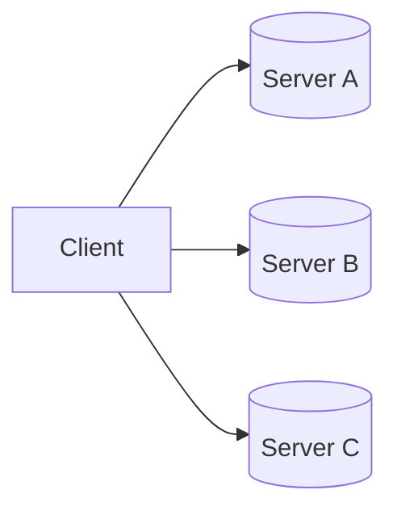

Question

Who should accept writes?

Possible answers

- Everyone
- One Server
- Random Server

Only one choice is correct.

---

# Why Not Everyone?

Suppose

Server A receives

```
Balance = ₹1000
```

At exactly the same time,

Server B receives

```
Balance = ₹500
```

Both accept the write.

Now

two different truths exist.

Which balance is correct?

No one knows.

---

# Single Leader

Instead,

one node becomes

Leader.

```mermaid
flowchart LR

Client

-->

Leader

Leader

-->

Follower A

Leader

-->

Follower B
```

Every write

flows through

the leader.

Followers replicate

the committed changes.

---

# Benefits

Having one leader provides

- Single ordering of writes
- Simpler conflict resolution
- Easier replication
- Predictable failover
- Simpler client routing

---

# Leader Responsibilities

The leader is responsible for

- Accepting writes
- Ordering operations
- Replicating changes
- Coordinating commits
- Serving clients
- Monitoring followers

Followers primarily

replicate data

and participate in elections.

---

# What Happens If the Leader Fails?

Suppose

```mermaid
flowchart LR

Leader

Follower A

Follower B

Leader -. Crash .- X((X))
```

Clients can no longer perform writes.

The cluster must elect

a new leader.

---

# Requirements for Leader Election

A good election algorithm should provide

- Exactly one leader
- Fast failover
- No data corruption
- Tolerance to node failures
- Automatic recovery

---

# Detecting Failure

How do followers know

the leader has failed?

The answer is

Heartbeats.

---

# Heartbeats

The leader periodically sends

```
I'm Alive
```

messages.

Example

Every

```
100 ms
```

Followers expect

continuous heartbeats.

---

# Failure Detection

Suppose

Follower A

has not received

heartbeats

for

```
1 second
```

Follower concludes

Leader

may have failed.

Election begins.

---

# Heartbeat Timeline

```text
Leader

Heartbeat

↓

Heartbeat

↓

Heartbeat

↓

(No Heartbeat)

↓

Election
```

---

# Election Trigger

Leader crashes.

Followers independently notice

heartbeat timeout.

They begin

Leader Election.

---

# Important Observation

Heartbeat timeout

does **not**

prove

the leader crashed.

Possible explanations

- Network congestion
- GC pause
- Temporary overload

This is why

timeouts must be chosen carefully.

---

# Split Brain

The most dangerous failure.

Suppose

network partition occurs.

```mermaid
flowchart LR

subgraph Partition 1

Leader

Follower A

end

subgraph Partition 2

Follower B

end

Leader -. Network Partition .- FollowerB
```

Follower B

incorrectly assumes

Leader failed.

Follower B

elects itself.

Now

two leaders exist.

This is

Split Brain.

---

# Why Split Brain Is Dangerous

Suppose

Leader A processes

```
Withdraw ₹1000
```

Leader B processes

```
Withdraw ₹2000
```

Both succeed.

Later

network heals.

Which transaction is correct?

Financial corruption becomes possible.

---

# Preventing Split Brain

Modern systems use

Majority Quorums.

A node

cannot become leader

unless

it receives votes

from

a majority

of the cluster.

This guarantees

that only one leader

can exist at a time.

---

# Mental Model

Imagine

five directors

must elect

a CEO.

Rule

```
Need

3 Votes
```

If two candidates

each receive

only two votes,

neither becomes CEO.

Exactly the same rule

is used by

Raft

and

Paxos.

---

# Production Examples

| System | Leader Election |
|----------|-----------------|
| Kafka | Controller Election |
| ZooKeeper | Zab Protocol |
| etcd | Raft |
| CockroachDB | Raft |
| Kubernetes | etcd Leader |
| MongoDB | Replica Set Election |
| Elasticsearch | Master Election |

---

# Principal Engineer Insight

> [!IMPORTANT]
>
> Leader Election is not about choosing the fastest server.
>
> It is about ensuring that **exactly one node** coordinates the system while preserving correctness during failures.

---

# Interview Conversation

**Interviewer**

Why can't every replica accept writes?

---

**Weak Answer**

Because conflicts happen.

---

**Principal Engineer Answer**

Allowing every replica to accept writes introduces concurrent updates that require complex conflict resolution. Electing a single leader establishes a total ordering of writes, simplifies replication, reduces coordination overhead, and prevents conflicting histories. Consensus protocols then ensure that leader changes occur safely without violating correctness.

---

# Common Interview Mistakes

> [!WARNING]
> Assuming missing heartbeats always indicate node failure.

---

> [!WARNING]
> Thinking leader election guarantees zero downtime.

---

> [!WARNING]
> Believing leader election alone prevents Split Brain.

Majority voting and quorum are equally important.

---

# Key Takeaways

- Leader election selects exactly one coordinator.
- Heartbeats detect potential failures.
- Elections begin after heartbeat timeouts.
- Majority voting prevents multiple leaders.
- Leader election simplifies replication and ordering.

---

# Classic Leader Election Algorithms

Before modern consensus algorithms like Raft and Paxos became popular,

distributed systems relied on simpler election algorithms.

The two most well-known are:

- Bully Algorithm
- Ring Election Algorithm

Although these algorithms are rarely used in production today,

they introduce the core ideas behind leader election.

---

# Why Do We Need an Election Algorithm?

Suppose we have four servers.

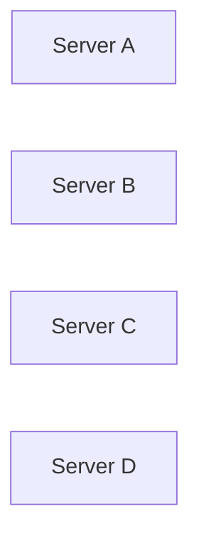

Initially,

Server D is the leader.

```
Leader

↓

Server D
```

Suddenly,

Server D crashes.

Question

Who becomes the next leader?

Without an election algorithm,

multiple servers may promote themselves,

creating multiple leaders.

---

# Bully Algorithm

The Bully Algorithm was proposed by Hector Garcia-Molina in 1982.

Its basic idea is simple.

> The server with the highest priority (usually the highest server ID) becomes the leader.

---

# Assumptions

The Bully Algorithm assumes:

- Every server has a unique ID.
- Every server knows about every other server.
- Higher ID means higher priority.
- Servers can communicate directly with one another.

Example

| Server | ID |
|---------|----|
| A | 1 |
| B | 2 |
| C | 3 |
| D | 4 |

Leader

```
Server D

(ID = 4)
```

---

# Normal Operation

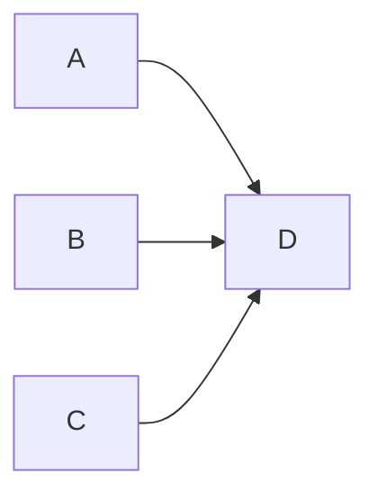

Everyone sends requests to

Server D.

---

# Leader Failure

Suppose

Server D crashes.

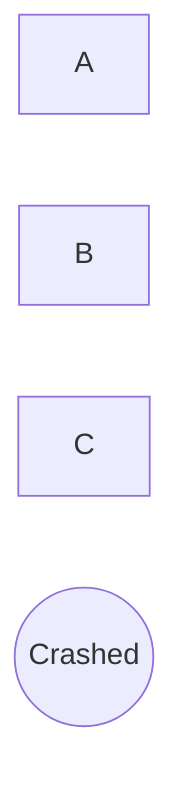

Server B notices

Leader timeout.

Election begins.

---

# Election Message

Server B sends

```
Election
```

to every server

with a higher ID.

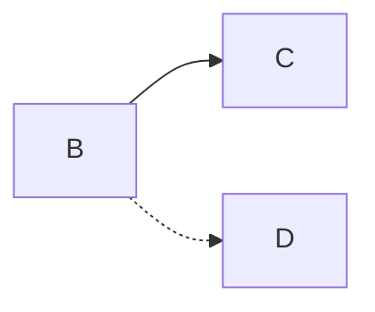

---

# Possible Outcomes

## Case 1

No higher server responds.

Server B

becomes

Leader.

---

## Case 2

Server C responds.

```
OK
```

Server B

withdraws

from the election.

Now

Server C

starts

its own election.

---

# Final Election

Server C

tries

higher IDs.

```
Server D

↓

No Response
```

Server C

wins.

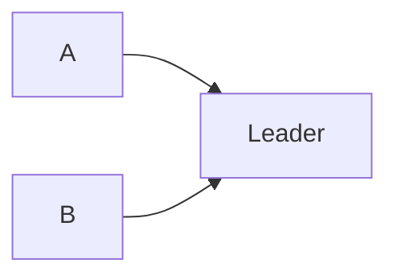

---

# Why Is It Called "Bully"?

Higher-ID servers

always defeat

lower-ID servers.

Lower-priority servers

never become leader

while a higher-priority server is alive.

The strongest node

"bullies"

the weaker nodes.

---

# Bully Algorithm Example

Servers

```
1

2

3

4

5
```

Leader

```
5
```

Server 5 crashes.

Server 2 detects failure.

Election flow

```
2

↓

3

↓

4

↓

5
```

Server 4 receives no reply from Server 5.

Server 4 becomes the new leader.

---

# Complexity

Suppose

```
N Servers
```

Worst-case

every server

starts an election.

Message complexity

```
O(N²)
```

Large clusters

generate many messages.

---

# Advantages

- Easy to understand
- Fast in small clusters
- Simple implementation

---

# Disadvantages

- Every server must know every other server.
- High message complexity.
- Not scalable.
- Assumes reliable communication.
- Network partitions can create multiple leaders.

Because of these limitations,

modern systems rarely use it.

---

# Ring Election Algorithm

Instead of every server

knowing

every other server,

servers form

a logical ring.

Example

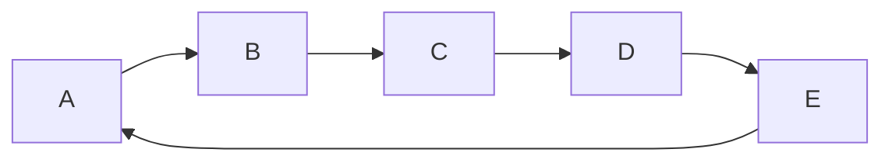

Messages travel

only

around the ring.

---

# Assumptions

- Every server has a unique ID.
- Servers know only their successor.
- Messages move in one direction.

---

# Leader Failure

Suppose

Server E

crashes.

Server B

detects failure.

Server B

starts an election.

---

# Election Message

Server B sends

```
Election(ID=2)
```

to Server C.

Server C compares IDs.

Current

```
2
```

Own

```
3
```

Server C forwards

```
Election(ID=3)
```

---

Server D receives

```
3
```

Own ID

```
4
```

Forwards

```
Election(ID=4)
```

---

Server A receives

```
4
```

Own ID

```
1
```

Keeps

```
4
```

Message eventually returns

to Server D.

Since

Server D

sees

its own ID,

it knows

it has won.

---

# Announcement Phase

Server D sends

```
Coordinator(ID=4)
```

around the ring.

Every server

updates

its leader.

---

# Ring Election Example

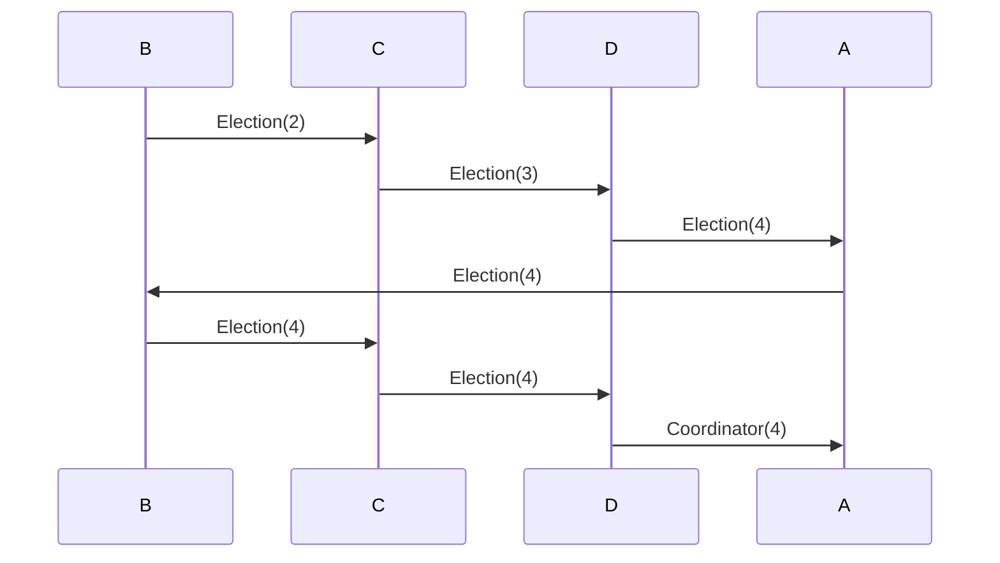

---

# Complexity

Election message

travels

once

around the ring.

Coordinator message

travels

once

around the ring.

Total complexity

```
O(N)
```

Better than

Bully Algorithm.

---

# Bully vs Ring

| Property | Bully | Ring |
|----------|--------|------|
| Network Topology | Fully Connected | Logical Ring |
| Highest ID Wins | Yes | Yes |
| Message Complexity | O(N²) | O(N) |
| Scalability | Poor | Better |
| Failure Detection | Timeout | Timeout |
| Production Usage | Rare | Rare |

---

# Why Modern Systems Don't Use Them

Both algorithms assume

a relatively stable cluster.

Modern cloud systems experience

- Node failures
- Network partitions
- Packet loss
- VM migrations
- Kubernetes rescheduling
- Elastic scaling

These environments require stronger guarantees.

Modern systems therefore use

- Raft
- Paxos
- Zab

instead.

---

# Principal Engineer Insight

> [!IMPORTANT]
>
> Bully and Ring algorithms teach **leader election**.
>
> Raft and Paxos teach **safe leader election**.
>
> The difference is not simply choosing a leader.
>
> It is ensuring that leader changes never violate correctness or lose committed data.

---

# Interview Conversation

**Interviewer**

Why don't Kubernetes or etcd use the Bully Algorithm?

---

**Weak Answer**

Because Raft is newer.

---

**Principal Engineer Answer**

The Bully Algorithm assumes every node knows every other node, requires reliable communication, and generates O(N²) election traffic in the worst case. It also lacks mechanisms to safely handle network partitions and log consistency. Modern systems require consensus algorithms such as Raft that combine leader election with replicated logs, quorum voting, and safety guarantees.

---

# Common Interview Mistakes

> [!WARNING]
> Assuming the highest-ID server is always the best leader.

---

> [!WARNING]
> Confusing leader election with consensus.

---

> [!WARNING]
> Believing Bully Algorithm prevents Split Brain.

---

> [!WARNING]
> Assuming Ring Election provides fault-tolerant consensus.

---

# Key Takeaways

- Bully Algorithm elects the highest-priority node.
- Ring Election reduces message complexity by forwarding election messages around a logical ring.
- Both algorithms rely on timeout-based failure detection.
- Neither algorithm provides the safety guarantees required by modern distributed databases.
- Raft, Paxos, and Zab build upon these ideas while adding quorum, replicated logs, and formal safety guarantees.


---

# ZooKeeper Leader Election and Zab Protocol

The Bully Algorithm and Ring Election are useful for understanding the fundamentals of leader election.

Production systems, however, require much stronger guarantees.

They must tolerate:

- Process crashes
- Network partitions
- Slow machines
- Duplicate messages
- Out-of-order packets
- Split Brain
- Recovery after failures

ZooKeeper solves these problems using the **Zab (ZooKeeper Atomic Broadcast)** protocol.

---

# What is ZooKeeper?

ZooKeeper is a distributed coordination service.

Applications use it for

- Leader Election
- Distributed Locks
- Configuration Management
- Service Discovery
- Metadata Storage
- Cluster Membership

ZooKeeper is **not** a database.

It stores small amounts of highly consistent metadata.

---

# ZooKeeper Cluster

Typical deployment

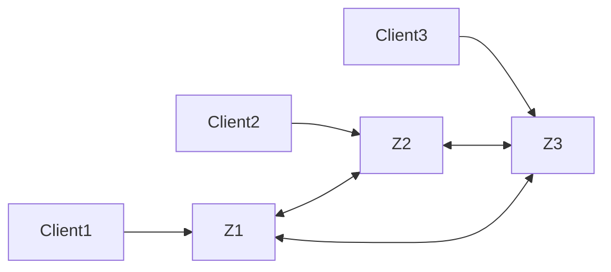

Suppose

```
3 Nodes
```

One node becomes

Leader.

Remaining nodes become

Followers.

---

# Why Does ZooKeeper Need a Leader?

Every write must have

one global order.

Without a leader

two followers might process

different writes simultaneously.

Example

Follower A

```
Create Lock
```

Follower B

```
Delete Lock
```

Which operation happened first?

Nobody knows.

Leader solves this problem.

---

# ZooKeeper Roles

Each server can be

| Role | Responsibility |
|------|----------------|
| Leader | Orders all writes |
| Follower | Replicates writes and serves reads |
| Observer | Read-only replica that does not vote |

Observers improve scalability because they do not participate in elections.

---

# Zab Protocol

ZooKeeper uses

**ZooKeeper Atomic Broadcast (Zab)**

to replicate writes.

The protocol guarantees

- Total ordering
- Reliable delivery
- Crash recovery
- Exactly one leader

---

# Zab Write Flow

Suppose

Client wants to create

```
/leader
```

The request flows like this.

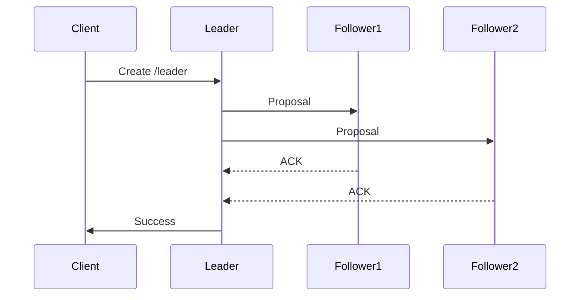

Notice

Leader waits for

a majority

before committing.

Exactly the same quorum principle

we learned earlier.

---

# Why Majority?

Suppose

```
5 ZooKeeper Servers
```

Majority

```
3
```

Leader proposes

Transaction

```
TX-100
```

Three servers

acknowledge.

Transaction becomes

Committed.

Later

Leader crashes.

Any future leader

must contain

Transaction

```
TX-100
```

Committed writes

cannot disappear.

---

# ZooKeeper Election Process

Suppose

Leader crashes.

Followers stop receiving heartbeats.

Each follower

enters

Election Mode.

Initially

every server

votes for itself.

Example

```
Server 1

Vote = 1
```

```
Server 2

Vote = 2
```

```
Server 3

Vote = 3
```

Servers exchange votes.

Eventually

one server

receives

a majority.

It becomes

Leader.

---

# What Does a Vote Contain?

A ZooKeeper vote is more than

just

Server ID.

Each vote contains

- Server ID
- Current Epoch
- Last Transaction ID (ZXID)

The

**ZXID**

is critical.

---

# What is ZXID?

ZXID means

```
ZooKeeper Transaction ID
```

Every committed transaction

receives

a monotonically increasing identifier.

Example

```
1

2

3

4

5
```

Higher ZXID

means

the server has observed

more committed transactions.

---

# Why ZXID Matters

Suppose

Server A

```
ZXID = 120
```

Server B

```
ZXID = 135
```

Which server

should become leader?

Server B.

Why?

Because it contains

more committed history.

Choosing Server A

could lose committed transactions.

---

# Election Rule

ZooKeeper prefers

1. Higher Epoch
2. Higher ZXID
3. Higher Server ID

This guarantees

the most up-to-date server

wins the election.

---

# Epoch

Epoch is similar to

Raft Term.

Every election

increments

the Epoch.

Example

```
Epoch 10

↓

Leader crashes

↓

Epoch 11

↓

New Leader
```

Old leaders

cannot continue

accepting writes.

---

# Synchronization Phase

Winning the election

is not enough.

Followers may still

have different logs.

Leader first synchronizes

all followers.

```mermaid
flowchart LR

Leader

-->

Follower A

Leader

-->

Follower B

Leader

-->

Follower C
```

Only after synchronization

does the leader

accept

new writes.

---

# Why Synchronization Matters?

Suppose

Follower A

missed

three transactions.

Without synchronization

Follower A

might return

stale metadata.

Synchronization ensures

all followers

share the same committed history.

---

# Ephemeral Nodes

One of ZooKeeper's most useful features.

Suppose

Application creates

```
/leader
```

as an

Ephemeral Node.

If the application crashes,

ZooKeeper

automatically deletes

the node.

No cleanup code required.

---

# Leader Election Using Ephemeral Sequential Nodes

This is the pattern used by many distributed applications.

Step 1

Every participant creates

an

Ephemeral Sequential Node.

Example

```
/election/node-0001

/election/node-0002

/election/node-0003
```

---

Step 2

The node with

the smallest sequence number

becomes leader.

```
node-0001

↓

Leader
```

---

Step 3

Suppose

Leader crashes.

ZooKeeper removes

```
node-0001
```

Automatically.

Remaining nodes

observe the change.

```
node-0002

↓

New Leader
```

No polling required.

---

# Watches

ZooKeeper clients

can register

Watches.

Example

```
Watch

/election
```

Whenever

the leader changes,

ZooKeeper

pushes

a notification.

Applications react immediately.

No continuous polling.

---

# Production Examples

Historically,

Kafka stored

its metadata

inside ZooKeeper.

Leader election

for partitions

used

Ephemeral Nodes.

Modern Kafka

replaced ZooKeeper

with

KRaft,

which embeds

Raft directly.

---

# Kubernetes

Kubernetes itself

does not use ZooKeeper.

Instead,

it stores cluster state

inside

etcd,

which performs

leader election

using

Raft.

Conceptually

the ideas remain similar.

---

# ZooKeeper vs Raft

| ZooKeeper (Zab) | Raft |
|-----------------|------|
| Epoch | Term |
| ZXID | Log Index |
| Leader | Leader |
| Followers | Followers |
| Majority Commit | Majority Commit |
| Atomic Broadcast | Log Replication |

Although the terminology differs,

the concepts are remarkably similar.

---

# Principal Engineer Insight

> [!IMPORTANT]
>
> ZooKeeper is fundamentally a distributed coordination system.
>
> It is optimized for correctness rather than throughput.
>
> Its job is not to store business data.
>
> Its job is to ensure that every node in the cluster agrees on critical metadata such as leadership, configuration and distributed locks.

---

# Interview Conversation

**Interviewer**

Why doesn't ZooKeeper simply elect the fastest server?

---

**Weak Answer**

Because it might fail.

---

**Principal Engineer Answer**

Leader election is based on correctness, not hardware performance. ZooKeeper elects the server with the most up-to-date committed history using Epoch and ZXID. Electing an older server could discard committed transactions and violate consistency. Performance is secondary to preserving a single, consistent history.

---

# Common Interview Mistakes

> [!WARNING]
> Thinking ZooKeeper is a distributed database.

---

> [!WARNING]
> Assuming followers can process writes independently.

---

> [!WARNING]
> Ignoring the importance of ZXID during elections.

---

> [!WARNING]
> Believing leader election completes immediately after voting.

The new leader must first synchronize followers before accepting new writes.

---

# Key Takeaways

- ZooKeeper is a distributed coordination service.
- Zab guarantees ordered replication.
- Leader election uses majority voting.
- Votes include Epoch and ZXID.
- The server with the most up-to-date committed history becomes leader.
- Ephemeral Sequential Nodes simplify distributed leader election.
- Watches eliminate unnecessary polling.
- ZooKeeper prioritizes correctness over throughput.


---

# Raft Leader Election

Raft is one of the most widely used consensus algorithms in modern distributed systems.

It was designed to be easier to understand than Paxos while providing the same safety guarantees.

Raft is built on three ideas:

- Leader Election
- Log Replication
- Safety

This section focuses on **Leader Election**.

---

# Why Raft Exists

Before Raft,

many systems used Paxos.

Although Paxos is mathematically elegant,

it is difficult to understand and implement correctly.

Raft was designed with a different goal.

> Build a consensus algorithm that engineers can understand and implement correctly.

Today,

Raft powers

- etcd
- Kubernetes
- CockroachDB
- TiKV
- Consul
- Nomad
- RKE2
- Dragonboat

---

# Raft Cluster

Suppose we have

```
5 Nodes
```

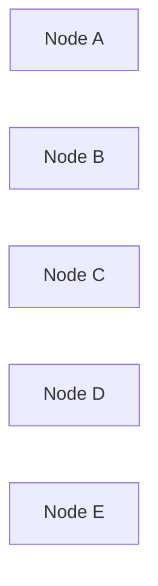

Only one node

acts as

Leader.

All remaining nodes

are Followers.

---

# Three Raft States

Every server is always in exactly one state.

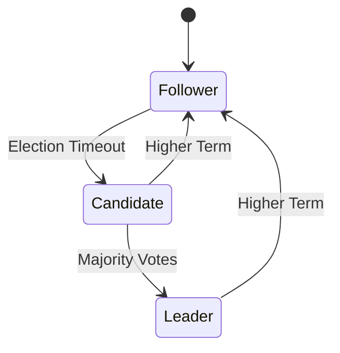

There are only three states.

- Follower
- Candidate
- Leader

Nothing else.

---

# Follower

Followers perform very little work.

Responsibilities

- Receive heartbeats
- Accept replicated logs
- Respond to vote requests
- Monitor leader health

Followers never initiate writes.

Followers remain passive until something goes wrong.

---

# Leader

Exactly one leader exists.

Responsibilities

- Accept client requests
- Append log entries
- Replicate logs
- Send heartbeats
- Commit transactions

Clients communicate only with the leader.

---

# Candidate

Candidate is a temporary state.

A follower becomes a candidate

only when

it believes

the leader has failed.

Candidate starts

an election.

If successful

↓

Leader.

Otherwise

↓

Follower.

---

# Normal Cluster

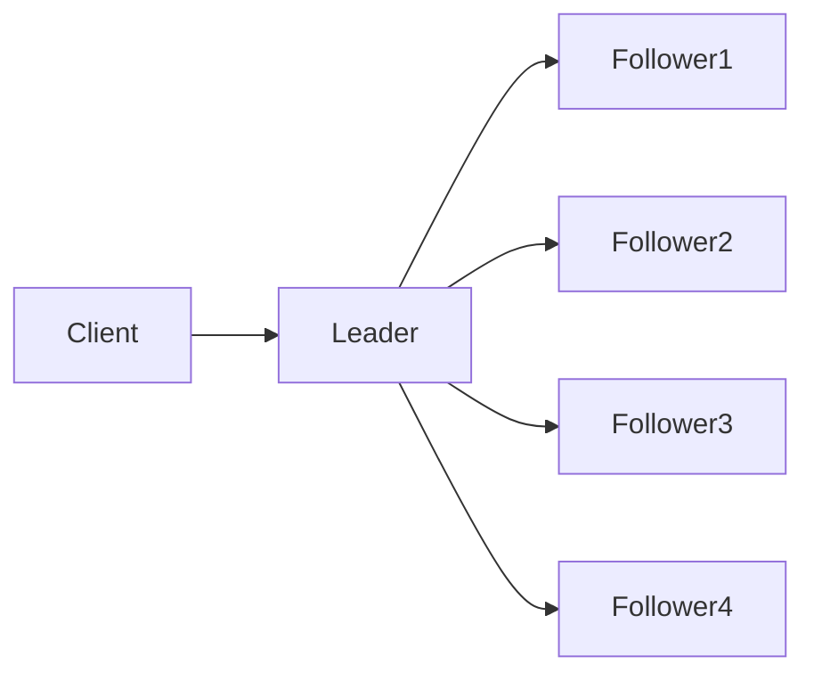

Everything works normally.

Followers continuously receive heartbeats.

---

# Heartbeats

Question

How do followers know

the leader

is still alive?

Answer

Heartbeats.

Leader periodically sends

```
AppendEntries
```

RPCs.

Even if

there are

no new log entries,

empty

AppendEntries

are still transmitted.

These are

Heartbeats.

---

# Heartbeat Timeline

```text
Leader

Heartbeat

↓

Heartbeat

↓

Heartbeat

↓

Heartbeat
```

Followers reset

their election timers

every time

they receive

a heartbeat.

---

# Election Timeout

Each follower

maintains

an Election Timer.

Suppose

Election Timeout

```
150 ms
```

If

no heartbeat

arrives

within

150 ms,

the follower

assumes

the leader

may have failed.

Election begins.

---

# Why "May Have Failed"?

Missing heartbeats

do not necessarily

mean

the leader crashed.

Possible reasons

- Network delay
- GC pause
- CPU starvation
- Packet loss
- Temporary congestion

Raft therefore treats

timeouts

as

suspected failures,

not confirmed failures.

---

# Randomized Election Timeout

This is one of Raft's most brilliant ideas.

Suppose

every follower

used exactly

```
200 ms
```

Leader crashes.

Every follower

starts an election

at exactly

200 ms.

Result

Everyone votes

for themselves.

Nobody wins.

This is called

```
Split Vote
```

---

# Solution

Randomize

Election Timeout.

Instead of

```
200 ms
```

every node chooses

a random timeout.

Example

```
Node A

175 ms
```

```
Node B

241 ms
```

```
Node C

198 ms
```

```
Node D

289 ms
```

```
Node E

164 ms
```

Now

Node E

times out first.

Only one node

starts the election.

Split votes

become extremely unlikely.

---

# Why Randomization Works

Imagine

five students

waiting

for a teacher.

If everyone

raises their hand

at exactly

the same time,

confusion occurs.

Instead,

each student

waits

a random amount of time.

Usually

only one student

speaks first.

Exactly the same idea

is used by Raft.

---

# Election Timeline

```text
Leader Crashes

↓

Follower Timeout

↓

Candidate

↓

Vote Requests

↓

Majority Votes

↓

Leader
```

Simple.

Predictable.

Reliable.

---

# Terms

Raft divides time

into

Terms.

A Term represents

one election period.

Example

```text
Term 1

↓

Term 2

↓

Term 3

↓

Term 4
```

Every election

creates

a new Term.

---

# Why Terms Exist

Suppose

Leader crashes.

Follower becomes

Candidate.

Election begins.

New leader wins.

Question

How do old leaders

know

they are obsolete?

Answer

Terms.

Every RPC

contains

the current Term.

Higher Term

always wins.

---

# Example

Leader

```
Term = 5
```

Follower

discovers

```
Term = 6
```

Leader immediately

steps down.

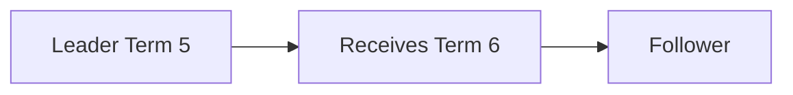

This prevents

old leaders

from continuing

to process writes.

---

# Leader Heartbeat Example

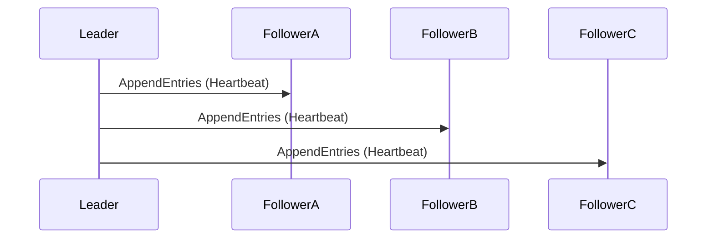

Followers respond

with

success.

Election timers

are reset.

---

# Failure Example

Suppose

Leader crashes.

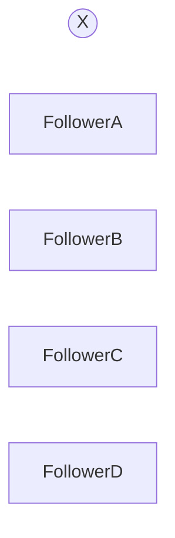

Heartbeats stop.

Election timers

continue counting.

One follower

times out first.

It becomes

Candidate.

Election begins.

---

# Why Followers Don't Elect Immediately

Suppose

heartbeat interval

```
50 ms
```

Election timeout

```
200–400 ms
```

Temporary network delay

of

```
80 ms
```

should

not

trigger

an election.

Election timeout

must always be

significantly larger

than

heartbeat interval.

---

# Production Defaults

Typical values

| Parameter | Typical Value |
|-----------|---------------|
| Heartbeat Interval | 50–100 ms |
| Election Timeout | 150–300 ms (Randomized) |

Exact values

depend on

network latency,

cluster size,

and workload.

---

# Principal Engineer Insight

> [!IMPORTANT]
>
> Randomized election timeout is one of the key innovations that makes Raft practical.
>
> Without randomization, simultaneous elections would occur frequently, causing repeated split votes and unstable leadership.
>
> A small amount of randomness dramatically improves cluster stability.

---

# Interview Conversation

**Interviewer**

Why doesn't every follower start an election immediately after missing one heartbeat?

---

**Weak Answer**

Because of timeout.

---

**Principal Engineer Answer**

Heartbeats can be delayed due to network congestion, GC pauses, CPU scheduling, or transient failures. Triggering an election after a single missed heartbeat would cause unnecessary leader changes. Raft therefore waits for a randomized election timeout that is significantly larger than the heartbeat interval before assuming leader failure.

---

# Common Interview Mistakes

> [!WARNING]
> Thinking every missed heartbeat means the leader crashed.

---

> [!WARNING]
> Using identical election timeouts on every node.

---

> [!WARNING]
> Confusing Terms with Log Indexes.

A Term identifies an election period.

A Log Index identifies a log entry.

---

> [!WARNING]
> Assuming followers can accept client writes.

Only the leader accepts writes.

---

# Key Takeaways

- Raft has exactly three states: Follower, Candidate and Leader.
- Leaders periodically send AppendEntries heartbeats.
- Followers start elections only after a randomized election timeout.
- Every election creates a new Term.
- Higher Terms always take precedence over lower Terms.
- Randomized timeouts greatly reduce split votes.
- Heartbeat intervals must be significantly smaller than election timeouts.

---

# RequestVote RPC

So far we have seen

```
Leader Crashes

↓

Follower Timeout

↓

Candidate
```

Question

How does the Candidate actually become the Leader?

Raft solves this using the

**RequestVote RPC**.

This is the most important RPC in Leader Election.

---

# Two Core RPCs in Raft

Raft has only two RPCs.

| RPC | Purpose |
|------|----------|
| RequestVote | Elect a Leader |
| AppendEntries | Replicate Logs + Heartbeats |

Everything in Raft is built on these two RPCs.

---

# Election Begins

Suppose

Leader crashes.

Follower B times out first.

Follower B becomes

Candidate.

Immediately,

it performs three actions.

1. Increment Current Term.
2. Vote for itself.
3. Send RequestVote RPCs to every other server.

---

# Step 1 — Increment Term

Suppose

Leader was in

```
Term = 8
```

Candidate starts election.

Current Term becomes

```
Term = 9
```

Every election

always starts

a new Term.

---

# Step 2 — Vote for Yourself

Every Candidate

automatically votes

for itself.

Example

```
Candidate B

Votes

↓

B
```

Current Vote Count

```
1
```

---

# Step 3 — Send Vote Requests

Candidate sends

RequestVote

to every other server.

```mermaid
sequenceDiagram

participant Candidate

participant A

participant C

participant D

participant E

Candidate->>A: RequestVote

Candidate->>C: RequestVote

Candidate->>D: RequestVote

Candidate->>E: RequestVote
```

---

# What Does RequestVote Contain?

Every RequestVote RPC includes

| Field | Purpose |
|--------|----------|
| Term | Candidate's current term |
| Candidate ID | Candidate requesting votes |
| Last Log Index | Latest log entry index |
| Last Log Term | Term of latest log entry |

Notice

Raft does

not

vote based only on

Server ID.

Log freshness

also matters.

---

# Why Log Information Is Needed

Suppose

Server A

```
Last Log Index

150
```

Server B

```
Last Log Index

142
```

Question

Should

Server B

become leader?

No.

It is missing

eight committed log entries.

Electing it

could lose committed data.

---

# Vote Decision

Follower receives

RequestVote.

It performs

a sequence of checks.

```mermaid
flowchart TD

A[Receive RequestVote]

A --> B{Higher Term?}

B -->|No| Reject

B -->|Yes| C{Already Voted?}

C -->|Yes| Reject

C -->|No| D{Candidate Log Up-to-date?}

D -->|No| Reject

D -->|Yes| Grant Vote
```

Only if

every check succeeds

does the follower

grant its vote.

---

# Rule 1

Higher Term Wins.

Suppose

Follower

```
Term = 8
```

Candidate

```
Term = 9
```

Follower immediately updates

its own term

to

```
9
```

Older Terms

can never win.

---

# Rule 2

One Vote Per Term

Each server

may vote

only once

during a Term.

Example

```
Term 12

↓

Vote Given

↓

Cannot Vote Again
```

This prevents

multiple leaders

during the same Term.

---

# Rule 3

Candidate Must Have an Up-to-Date Log

This is

one of Raft's

most important safety rules.

Follower compares

its own log

with

the Candidate's log.

Candidate wins

only if

its log is

at least as up-to-date.

---

# Log Comparison

Suppose

Follower

```
Last Log Term

15

Last Index

320
```

Candidate

```
Last Log Term

14

Last Index

500
```

Question

Who wins?

Follower rejects.

Higher

Term

is always preferred.

---

# Another Example

Follower

```
Last Log Term

15

Index

300
```

Candidate

```
Last Log Term

15

Index

320
```

Terms equal.

Higher Index wins.

Candidate receives

the vote.

---

# Log Freshness Rule

Comparison order

```
Last Log Term

↓

Last Log Index
```

Term comparison

always happens first.

Only if

Terms are equal

do we compare

Indexes.

---

# Why This Rule Exists

Imagine

Leader committed

ten transactions.

Follower

never received them.

If

that follower

became Leader,

those committed transactions

could disappear.

Raft prevents this

using

Log Freshness Checks.

---

# Majority Votes

Suppose

```
5 Servers
```

Candidate already has

its own vote.

```
1
```

Receives votes from

Server C

and

Server D.

Total

```
3
```

Majority achieved.

Candidate becomes

Leader.

---

# Election Timeline

```text
Leader Crashes

↓

Follower Timeout

↓

Candidate

↓

Increment Term

↓

Vote For Self

↓

RequestVote RPC

↓

Majority Votes

↓

Leader
```

---

# What Happens to Losing Candidates?

Suppose

another Candidate

receives

only

two votes.

Majority

is not reached.

Eventually

that Candidate

receives

AppendEntries

from

the newly elected Leader.

Immediately

it becomes

Follower.

---

# Split Vote

Suppose

five nodes.

Leader crashes.

Two nodes

timeout

almost simultaneously.

Node A

votes for itself.

Node B

votes for itself.

Followers split

their votes.

Result

```
2 Votes

↓

2 Votes

↓

1 Vote
```

Nobody reaches

Majority.

No Leader exists.

---

# Recovery from Split Vote

Raft does

not

try to negotiate.

Instead,

every Candidate

starts

another randomized

Election Timeout.

Eventually

one Candidate

times out first.

That Candidate

wins.

Simple.

Reliable.

---

# Example Timeline

```text
Election 1

↓

Split Vote

↓

Random Timeout

↓

Election 2

↓

Leader Elected
```

Randomization

solves the problem.

---

# Network Partition Example

Suppose

five servers.

Partition occurs.

Group A

```
3 Servers
```

Group B

```
2 Servers
```

Only

Group A

can obtain

Majority.

Group B

can never

elect a Leader.

This prevents

Split Brain.

---

# Why Doesn't Raft Use Highest Server ID?

Earlier algorithms

such as

Bully

used

Highest ID.

Raft chooses

the server

with

the

most up-to-date log.

Correctness

is more important

than priority.

---

# Principal Engineer Insight

> [!IMPORTANT]
>
> Raft does not elect the fastest server.
>
> It elects the server that is least likely to lose committed data.
>
> The Log Freshness Check is one of the key safety mechanisms that distinguishes Raft from simpler leader election algorithms.

---

# Interview Conversation

**Interviewer**

Why does RequestVote include Last Log Term and Last Log Index?

---

**Weak Answer**

To compare logs.

---

**Principal Engineer Answer**

Raft must ensure that a newly elected leader contains all committed entries. A follower therefore grants its vote only if the candidate's log is at least as up-to-date as its own. The comparison first evaluates the Last Log Term and, if equal, compares the Last Log Index. This prevents an outdated node from becoming leader and preserves committed data.

---

# Common Interview Mistakes

> [!WARNING]
> Assuming every candidate automatically becomes leader.

---

> [!WARNING]
> Ignoring the Log Freshness Check.

---

> [!WARNING]
> Thinking Server ID determines leadership.

---

> [!WARNING]
> Assuming a server can vote multiple times in the same Term.

---

# Key Takeaways

- Candidates increment the Term before starting an election.
- Every Candidate votes for itself.
- RequestVote is sent to every other server.
- Followers vote at most once per Term.
- Log freshness is checked before granting a vote.
- Majority votes are required to become Leader.
- Randomized election timeouts recover naturally from split votes.
- Raft prioritizes log correctness over server priority.

---

# Raft Safety Guarantees

Leader Election is useful only if it is **safe**.

Electing a leader that loses committed data is worse than having no leader at all.

Raft therefore defines several formal safety properties.

These properties make Raft suitable for production systems.

---

# Why Safety Matters

Suppose

Leader commits

```
Transfer ₹10,000
```

Immediately afterwards,

the leader crashes.

If the newly elected leader

does not contain

that committed transaction,

the system has permanently lost money.

This must never happen.

---

# Raft Safety Properties

Raft defines several guarantees.

| Property | Purpose |
|-----------|----------|
| Election Safety | Only one leader per term |
| Leader Completeness | New leader contains committed entries |
| Log Matching | Same index + same term ⇒ identical history |
| State Machine Safety | Every node applies committed entries in the same order |

In this section,

we focus on the first two.

---

# Election Safety

Definition

> At most one leader can be elected in a given Term.

---

# Why Is This True?

Suppose

```
5 Servers
```

Majority

```
3
```

Candidate A

receives

```
3 Votes
```

Candidate B

also claims

```
3 Votes
```

Can this happen?

No.

---

# Mathematical Proof

Every server

votes only once

per Term.

Suppose

Candidate A

wins

with

```
A

B

C
```

Candidate B

wins

with

```
D

E

?
```

Only

two servers remain.

Candidate B

must obtain

one vote

from

A, B or C.

Impossible.

That server

already voted.

Therefore

two leaders

cannot exist

in the same Term.

---

# Visual Example

```mermaid
flowchart LR

subgraph VotesForA

A

B

C

end

subgraph VotesForB

D

E

end
```

Candidate B

cannot reach

Majority.

Election Safety

is preserved.

---

# Leader Completeness Property

This is

one of

Raft's

strongest guarantees.

Definition

> If a log entry has been committed in a Term,
> every future leader will contain that entry.

Committed data

can never disappear.

---

# Example

Suppose

Leader

commits

```
Entry 250
```

Majority

contains

```
A

B

C
```

Leader crashes.

Election begins.

Who can become

the new Leader?

Only a server

whose log

contains

Entry 250.

Otherwise

followers

will reject

its RequestVote.

---

# Why Does This Work?

Remember

RequestVote

contains

```
Last Log Term

Last Log Index
```

Followers refuse

to vote

for candidates

with older logs.

Therefore

outdated servers

cannot become

Leader.

---

# Example

Server A

```
Last Index

500
```

Server B

```
Last Index

470
```

Server B

requests votes.

Followers compare logs.

Server B

is rejected.

Only

Server A

can become

Leader.

---

# Log Matching Property

Suppose

two logs

contain

```
Index = 120

Term = 8
```

Raft guarantees

everything

before

Index 120

is identical.

Example

```text
Server A

1

2

3

4

5

6

7

8

120
```

```text
Server B

1

2

3

4

5

6

7

8

120
```

History

before

120

must match exactly.

This greatly simplifies

replication.

---

# Why Is Log Matching Important?

Suppose

Follower

missed

five log entries.

Leader

sends

AppendEntries.

Follower compares

Previous Log Index

and

Previous Log Term.

If they match,

replication continues.

Otherwise,

Follower rejects

the request,

and the Leader backs up to find the last common point.

---

# State Machine Safety

Every server

eventually applies

the same committed entries

in exactly

the same order.

Example

```
Deposit ₹500

↓

Withdraw ₹100

↓

Transfer ₹300
```

Every replica

must execute

these operations

in this exact sequence.

Otherwise,

account balances

will diverge.

---

# Leader Completeness Example

Suppose

Leader

commits

```
Entry 100
```

Replication

```
Leader

↓

Follower A

↓

Follower B
```

Leader crashes.

Follower C

never received

Entry 100.

Can

Follower C

become Leader?

No.

Its log

is not sufficiently up-to-date.

---

# Higher Term Always Wins

Suppose

Leader

```
Term 12
```

Network delay occurs.

Meanwhile,

another election succeeds.

Cluster

moves to

```
Term 13
```

Old Leader

later reconnects.

It sends

AppendEntries

with

```
Term 12
```

Followers immediately reject.

Old Leader

observes

```
Higher Term = 13
```

Old Leader

steps down.

---

# Leadership Transfer

Normally,

leaders change

only after failures.

Sometimes,

operators

want

controlled leadership transfer.

Example

- Planned maintenance
- Rolling upgrade
- Draining a node

Instead of crashing the leader,

the current leader

hands leadership

to another healthy follower.

This minimizes

service disruption.

Many production Raft implementations,

including etcd,

support controlled leadership transfer.

---

# PreVote Optimization

Large distributed systems

sometimes experience

temporary network issues.

Without optimization,

an isolated follower

could repeatedly

increment the Term

and disrupt the cluster.

Raft implementations often add

**PreVote**.

---

# How PreVote Works

Instead of immediately

starting an election,

a follower first asks

other nodes

a simple question.

> "If I started an election,
> would you vote for me?"

If the answer is

No,

the follower

does not increase

its Term.

Cluster stability improves.

---

# Example

Suppose

Follower A

is temporarily isolated.

Without PreVote

```
Election

↓

Higher Term

↓

Current Leader Steps Down
```

Cluster experiences

unnecessary disruption.

With PreVote

Follower A

discovers

it cannot obtain

a majority.

Election

never starts.

---

# Leadership Timeline

```text
Leader

↓

Heartbeats

↓

Leader Failure

↓

Random Election Timeout

↓

Candidate

↓

RequestVote

↓

Majority

↓

Leader

↓

Log Synchronization

↓

Normal Operation
```

---

# Production Example

Kubernetes stores

cluster metadata

inside etcd.

Suppose

the current etcd leader

fails.

Followers detect

missing heartbeats.

Election begins.

Randomized timeouts

prevent split votes.

Majority elects

a new leader.

Clients continue

reading and writing

within a few hundred milliseconds.

---

# Why Raft Is Easier Than Paxos

Raft separates concerns.

| Component | Responsibility |
|-----------|----------------|
| Leader Election | Choose one Leader |
| Log Replication | Copy entries |
| Safety Rules | Prevent data loss |

Paxos combines

many of these concepts,

making it harder

to reason about.

Raft keeps them

independent.

---

# Principal Engineer Insight

> [!IMPORTANT]
>
> Raft's brilliance is not merely electing a leader.
>
> Its brilliance is ensuring that every future leader already contains all committed history.
>
> The combination of quorum voting, log freshness checks, terms and leader completeness prevents committed data from being lost during leader changes.

---

# Interview Conversation

**Interviewer**

Why does Raft compare log freshness before granting votes?

---

**Weak Answer**

To compare logs.

---

**Principal Engineer Answer**

Raft must preserve committed entries across leader changes. A follower therefore grants its vote only to a candidate whose log is at least as up-to-date as its own. This ensures that an outdated node cannot become leader and overwrite committed history. The combination of quorum voting and log freshness establishes the Leader Completeness Property.

---

# Common Interview Mistakes

> [!WARNING]
> Assuming a higher Term alone guarantees a safe leader.

---

> [!WARNING]
> Ignoring Log Freshness during elections.

---

> [!WARNING]
> Confusing committed entries with replicated entries.

An entry may be replicated but not yet committed.

---

> [!WARNING]
> Thinking PreVote is part of the original Raft paper.

PreVote is a widely adopted implementation enhancement, not part of the original Raft specification.

---

# Key Takeaways

- Election Safety guarantees at most one leader per Term.
- Leader Completeness ensures committed entries survive leader changes.
- Log Matching guarantees identical history before matching indexes.
- State Machine Safety ensures every replica executes committed operations in the same order.
- Higher Terms force stale leaders to step down.
- PreVote reduces unnecessary elections.
- Leadership Transfer enables graceful maintenance without disrupting the cluster.

---

# Real-World Raft Implementations

Understanding Raft theory is important.

Understanding how production systems use Raft is what distinguishes a Principal Engineer.

Let's examine several real systems.

---

# etcd

etcd is a distributed key-value store.

It is the source of truth for

- Kubernetes
- OpenShift
- RKE2
- K3s
- Many internal control planes

Everything inside etcd is replicated using Raft.

---

## Example

Suppose Kubernetes wants to create

```
Deployment
```

The API Server writes

```
Deployment Object
```

↓

etcd Leader

↓

Followers

↓

Majority Commit

↓

Success

Only after the majority acknowledges

does Kubernetes return

```
201 Created
```

---

# CockroachDB

CockroachDB stores data in

Ranges.

Each Range is replicated using Raft.

Example

```
Table

↓

Ranges

↓

Raft Group

↓

Leader

Followers
```

Every Range

has

its own Leader.

Thousands of independent Raft groups

may exist simultaneously.

---

# TiKV

TiKV uses

Raft

for every Region.

PD (Placement Driver)

decides

where Regions should live.

Raft guarantees

consistent replication

inside each Region.

---

# Consul

HashiCorp Consul

stores

- Service Discovery
- Configuration
- ACLs

All replicated

using Raft.

Leader handles

writes.

Followers serve

reads

depending on consistency mode.

---

# Nomad

HashiCorp Nomad

stores

cluster scheduling metadata

inside a Raft cluster.

Only

the Leader

schedules workloads.

Followers

replicate

cluster state.

---

# Why Kafka Replaced ZooKeeper

Historically

Kafka used

ZooKeeper

for

- Metadata
- Controller Election
- Broker Membership

Modern Kafka

uses

KRaft.

KRaft

implements

Raft directly.

Benefits

- Fewer moving parts
- Better scalability
- Easier operations
- No external ZooKeeper dependency

---

# Kubernetes Control Plane

Simplified architecture

```mermaid
flowchart TD

Client

-->

API Server

-->

etcd Leader

etcd Leader

-->

Follower A

etcd Leader

-->

Follower B
```

Everything

from

Pods

Deployments

Secrets

Nodes

ConfigMaps

is stored

through Raft.

---

# Raft During Leader Failure

Suppose

Leader crashes.

Timeline

```text
Leader Failure

↓

Heartbeats Stop

↓

Random Election Timeout

↓

Candidate

↓

RequestVote

↓

Majority

↓

New Leader

↓

Resume Writes
```

Clients

may briefly receive

```
Leader Not Available
```

Once

the new Leader

is elected,

writes continue.

---

# Leadership Transfer Example

Suppose

Node A

requires maintenance.

Without Leadership Transfer

```
Kill Node

↓

Election

↓

Temporary Downtime
```

With Leadership Transfer

```
Transfer Leadership

↓

Follower Becomes Leader

↓

Maintenance Begins
```

Applications experience

minimal disruption.

---

# Operational Metrics

Principal Engineers

monitor

Raft

continuously.

Important metrics

| Metric | Why It Matters |
|---------|----------------|
| Current Leader | Cluster health |
| Current Term | Election frequency |
| Commit Index | Replication progress |
| Applied Index | State machine progress |
| Election Count | Cluster stability |
| Leader Changes | Possible network issues |
| Replication Lag | Slow followers |
| Proposal Latency | Write performance |

---

# Warning Signs

Frequent elections

usually indicate

- Network instability
- CPU starvation
- Long GC pauses
- Slow disks
- Incorrect timeout configuration

Healthy clusters

rarely

change leaders.

---

# Common Production Problems

## Problem 1

Election Storm

Many nodes

start elections repeatedly.

Typical causes

- Election timeout too small
- High GC pause
- Network packet loss

---

## Problem 2

Slow Followers

Leader waits

for replication.

Follower disks

are overloaded.

Write latency increases.

---

## Problem 3

Clock Drift

Raft

does not depend

on synchronized clocks.

However,

extreme clock drift

can indirectly affect

timeouts

and operational behavior.

NTP

should always be enabled.

---

## Problem 4

Large Snapshot Transfer

Follower

falls far behind.

Instead of replaying

millions of log entries,

Leader sends

a Snapshot.

Follower catches up

quickly.

---

# Architecture Review Example

Suppose

another team proposes

```
Every node

can become leader

whenever

it detects

high CPU

on the current leader.
```

Questions

- How is correctness preserved?
- Who authorizes leadership changes?
- What prevents multiple leaders?
- How are committed logs protected?
- How are network partitions handled?

A Principal Engineer

reviews

correctness

before

performance.

---

# Whiteboard Exercise

Design

Leader Election

for

a globally distributed

payment platform.

Requirements

- Three AWS Regions
- Automatic Failover
- Zero committed transaction loss
- 99.99% Availability
- Leader failure detection
- Regional outage recovery

Discuss

- Heartbeat interval
- Election timeout
- Replication
- Majority quorum
- Leader transfer
- Monitoring
- Recovery

---

# Senior Engineer Interview Questions

1. Why does Raft need a Leader?
2. What are the three Raft states?
3. What is a Heartbeat?
4. Why is Election Timeout randomized?
5. What is a Term?
6. What is RequestVote?
7. Why does a Candidate vote for itself?
8. What happens after a Leader crashes?
9. Why are Followers passive?
10. What triggers an election?

---

# Staff Engineer Interview Questions

1. Explain Log Freshness.
2. Explain Leader Completeness.
3. Why does Raft prevent Split Brain?
4. Explain PreVote.
5. Explain Leadership Transfer.
6. Why can only one Leader exist?
7. Explain Election Safety.
8. Why compare Last Log Term before Last Log Index?
9. How does Raft recover from Split Votes?
10. Compare Raft Leader Election with ZooKeeper Leader Election.

---

# Principal Engineer Interview Questions

## Q1

Design Leader Election

for

10,000 database shards.

---

## Q2

How would you tune

Heartbeat Interval

and

Election Timeout

for

cross-region deployment?

---

## Q3

Suppose

Leader changes

every minute.

How would you investigate?

Discuss

- Network
- CPU
- Memory
- GC
- Disk
- Packet Loss
- Timeout configuration

---

## Q4

Would you ever

increase

Election Timeout?

Why?

---

## Q5

How would you perform

zero-downtime

cluster upgrades?

---

## Q6

Explain why

Raft uses

Terms

instead of timestamps.

---

## Q7

Design

Leader Election

for

1000 Kubernetes clusters.

---

## Q8

How would you test

Leader Election

before production?

---

## Q9

Compare

Raft

ZooKeeper

Paxos

Leader Election.

---

## Q10

Review another team's

Leader Election design.

Which questions would you ask?

---

# Common Interview Mistakes

❌ Assuming Heartbeats carry only health information.

Heartbeats are empty

AppendEntries RPCs.

---

❌ Assuming the fastest server should become Leader.

Correctness matters more than speed.

---

❌ Ignoring Log Freshness.

---

❌ Thinking Majority alone guarantees correctness.

Majority,

Terms,

Log Freshness,

and

Leader Completeness

work together.

---

❌ Assuming frequent Leader changes are normal.

Healthy clusters

maintain

stable leadership.

---

# Principal Engineer Review Checklist

Can you confidently explain

- Leader Election
- Heartbeats
- Election Timeout
- Randomized Timeout
- Terms
- RequestVote RPC
- AppendEntries RPC
- Log Freshness
- Election Safety
- Leader Completeness
- Leadership Transfer
- PreVote
- Split Vote Recovery
- Split Brain Prevention

Can you explain

why

each mechanism exists

instead of merely

how it works?

If yes,

you understand

Raft Leader Election

at a Principal Engineer level.

---

# One-Page Cheat Sheet

## Three States

```text
Follower

↓

Candidate

↓

Leader
```

---

## Election Flow

```text
Leader Failure

↓

Election Timeout

↓

Candidate

↓

Increment Term

↓

Vote For Self

↓

RequestVote

↓

Majority Votes

↓

Leader

↓

AppendEntries Heartbeats
```

---

## Safety Rules

| Rule | Purpose |
|------|----------|
| One Vote Per Term | Prevent multiple leaders |
| Majority Voting | Quorum intersection |
| Log Freshness | Prevent outdated leaders |
| Higher Term Wins | Remove stale leaders |
| Leader Completeness | Preserve committed entries |
| Log Matching | Ensure identical history |
| State Machine Safety | Execute committed operations consistently |

---

## Default Timing (Typical)

| Parameter | Typical Range |
|-----------|---------------|
| Heartbeat Interval | 50–100 ms |
| Election Timeout | 150–300 ms (Randomized) |

Always tune these values based on network latency and deployment topology.

---

# References

## Books

- Designing Data-Intensive Applications — Martin Kleppmann
- Database Internals — Alex Petrov

## Research Papers

- In Search of an Understandable Consensus Algorithm (Raft)
- Paxos Made Simple

## Engineering Blogs

- etcd Documentation
- Cockroach Labs Engineering
- TiKV Documentation
- HashiCorp Consul Engineering
- Kubernetes Documentation

---

# Chapter Summary

Leader Election ensures that exactly one node coordinates writes at any given time.

Raft combines

- Randomized Election Timeouts
- Majority Voting
- RequestVote RPC
- AppendEntries Heartbeats
- Terms
- Log Freshness
- Leader Completeness

to elect leaders safely while preserving committed history.

Unlike older algorithms,

Raft prioritizes correctness over simplicity or speed.

Its design has made it one of the most widely adopted consensus algorithms in modern distributed systems.

---

> **Principal Engineer Takeaway**
>
> A Senior Engineer can describe the Raft election process.
>
> A Staff Engineer can explain why randomized timeouts, quorum voting, and log freshness prevent split votes and outdated leaders.
>
> A Principal Engineer can tune Raft for production, diagnose unstable elections using operational metrics, design safe multi-region deployments, and reason formally about the safety guarantees that preserve committed data during failures.
