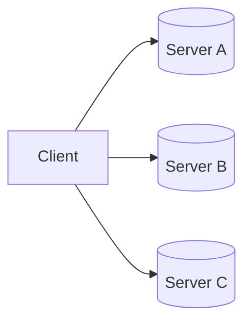
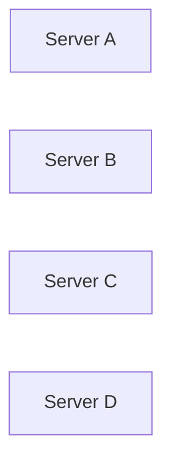
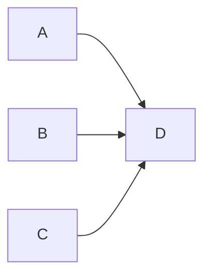
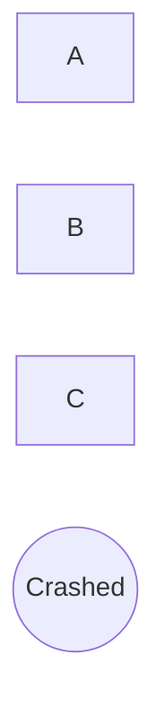
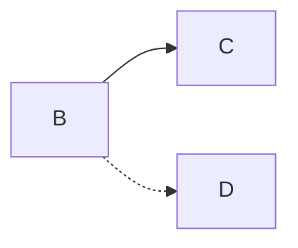
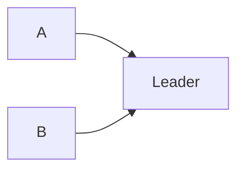
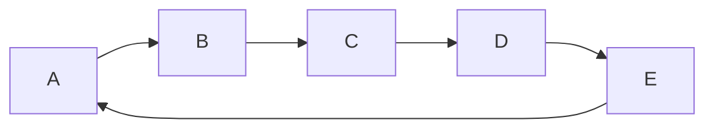
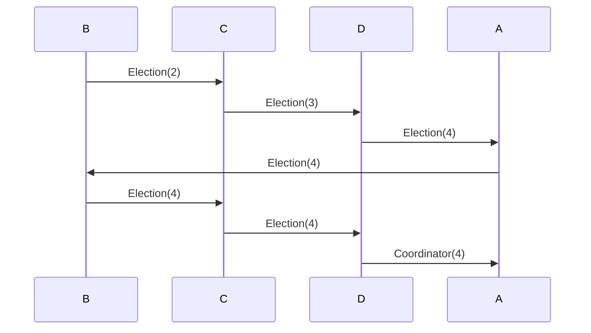
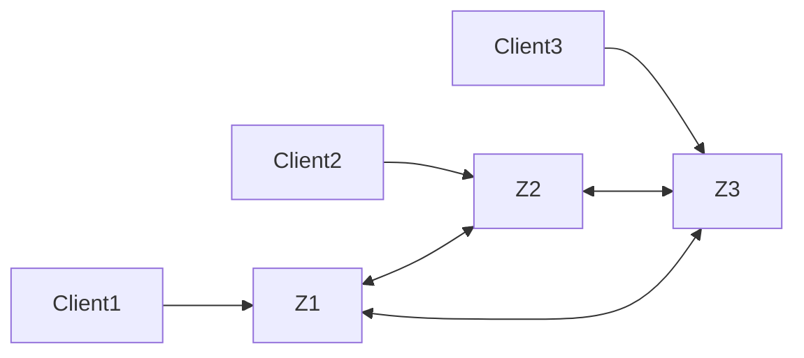
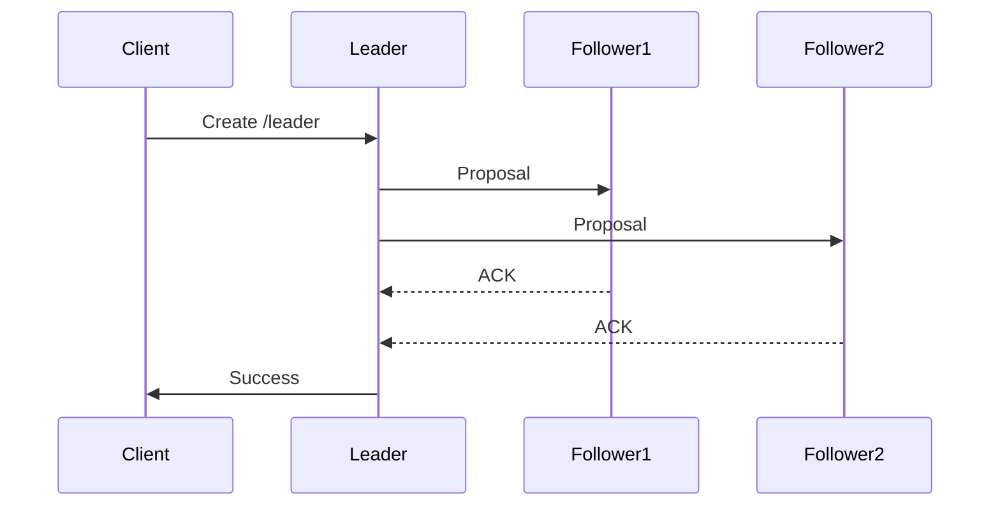

# Leader Election

> *"Leader Election is the process by which a distributed system chooses exactly one node to coordinate writes, make decisions, or manage shared state while preventing multiple leaders from existing simultaneously."*

---

# Table of Contents

1. Why Leader Election Exists
2. The Single Leader Problem
3. Leader Responsibilities
4. Failure Detection
5. Election Basics
6. Split Brain
7. Production Examples

---

# Learning Objectives

After completing this chapter you should be able to:

- Explain why leader election exists.
- Explain how distributed systems detect leader failure.
- Understand why multiple leaders are dangerous.
- Explain leader election in Raft, ZooKeeper, Kafka and Kubernetes.
- Answer Principal Engineer interview questions confidently.

---

# Why This Chapter Matters

Almost every distributed system elects a leader.

Examples

- Kafka
- ZooKeeper
- etcd
- Kubernetes
- CockroachDB
- MongoDB
- HDFS
- Elasticsearch

Without leader election,

distributed systems cannot safely coordinate writes.

---

# The Problem

Suppose three replicas exist.



Question

Who should accept writes?

Possible answers

- Everyone
- One Server
- Random Server

Only one choice is correct.

---

# Why Not Everyone?

Suppose

Server A receives

```
Balance = ₹1000
```

At exactly the same time,

Server B receives

```
Balance = ₹500
```

Both accept the write.

Now

two different truths exist.

Which balance is correct?

No one knows.

---

# Single Leader

Instead,

one node becomes

Leader.

```mermaid
flowchart LR

Client

-->

Leader

Leader

-->

Follower A

Leader

-->

Follower B
```

Every write

flows through

the leader.

Followers replicate

the committed changes.

---

# Benefits

Having one leader provides

- Single ordering of writes
- Simpler conflict resolution
- Easier replication
- Predictable failover
- Simpler client routing

---

# Leader Responsibilities

The leader is responsible for

- Accepting writes
- Ordering operations
- Replicating changes
- Coordinating commits
- Serving clients
- Monitoring followers

Followers primarily

replicate data

and participate in elections.

---

# What Happens If the Leader Fails?

Suppose

```mermaid
flowchart LR

Leader

Follower A

Follower B

Leader -. Crash .- X((X))
```

Clients can no longer perform writes.

The cluster must elect

a new leader.

---

# Requirements for Leader Election

A good election algorithm should provide

- Exactly one leader
- Fast failover
- No data corruption
- Tolerance to node failures
- Automatic recovery

---

# Detecting Failure

How do followers know

the leader has failed?

The answer is

Heartbeats.

---

# Heartbeats

The leader periodically sends

```
I'm Alive
```

messages.

Example

Every

```
100 ms
```

Followers expect

continuous heartbeats.

---

# Failure Detection

Suppose

Follower A

has not received

heartbeats

for

```
1 second
```

Follower concludes

Leader

may have failed.

Election begins.

---

# Heartbeat Timeline

```text
Leader

Heartbeat

↓

Heartbeat

↓

Heartbeat

↓

(No Heartbeat)

↓

Election
```

---

# Election Trigger

Leader crashes.

Followers independently notice

heartbeat timeout.

They begin

Leader Election.

---

# Important Observation

Heartbeat timeout

does **not**

prove

the leader crashed.

Possible explanations

- Network congestion
- GC pause
- Temporary overload

This is why

timeouts must be chosen carefully.

---

# Split Brain

The most dangerous failure.

Suppose

network partition occurs.

```mermaid
flowchart LR

subgraph Partition 1

Leader

Follower A

end

subgraph Partition 2

Follower B

end

Leader -. Network Partition .- FollowerB
```

Follower B

incorrectly assumes

Leader failed.

Follower B

elects itself.

Now

two leaders exist.

This is

Split Brain.

---

# Why Split Brain Is Dangerous

Suppose

Leader A processes

```
Withdraw ₹1000
```

Leader B processes

```
Withdraw ₹2000
```

Both succeed.

Later

network heals.

Which transaction is correct?

Financial corruption becomes possible.

---

# Preventing Split Brain

Modern systems use

Majority Quorums.

A node

cannot become leader

unless

it receives votes

from

a majority

of the cluster.

This guarantees

that only one leader

can exist at a time.

---

# Mental Model

Imagine

five directors

must elect

a CEO.

Rule

```
Need

3 Votes
```

If two candidates

each receive

only two votes,

neither becomes CEO.

Exactly the same rule

is used by

Raft

and

Paxos.

---

# Production Examples

| System | Leader Election |
|----------|-----------------|
| Kafka | Controller Election |
| ZooKeeper | Zab Protocol |
| etcd | Raft |
| CockroachDB | Raft |
| Kubernetes | etcd Leader |
| MongoDB | Replica Set Election |
| Elasticsearch | Master Election |

---

# Principal Engineer Insight

> [!IMPORTANT]
>
> Leader Election is not about choosing the fastest server.
>
> It is about ensuring that **exactly one node** coordinates the system while preserving correctness during failures.

---

# Interview Conversation

**Interviewer**

Why can't every replica accept writes?

---

**Weak Answer**

Because conflicts happen.

---

**Principal Engineer Answer**

Allowing every replica to accept writes introduces concurrent updates that require complex conflict resolution. Electing a single leader establishes a total ordering of writes, simplifies replication, reduces coordination overhead, and prevents conflicting histories. Consensus protocols then ensure that leader changes occur safely without violating correctness.

---

# Common Interview Mistakes

> [!WARNING]
> Assuming missing heartbeats always indicate node failure.

---

> [!WARNING]
> Thinking leader election guarantees zero downtime.

---

> [!WARNING]
> Believing leader election alone prevents Split Brain.

Majority voting and quorum are equally important.

---

# Key Takeaways

- Leader election selects exactly one coordinator.
- Heartbeats detect potential failures.
- Elections begin after heartbeat timeouts.
- Majority voting prevents multiple leaders.
- Leader election simplifies replication and ordering.

---

# Classic Leader Election Algorithms

Before modern consensus algorithms like Raft and Paxos became popular,

distributed systems relied on simpler election algorithms.

The two most well-known are:

- Bully Algorithm
- Ring Election Algorithm

Although these algorithms are rarely used in production today,

they introduce the core ideas behind leader election.

---

# Why Do We Need an Election Algorithm?

Suppose we have four servers.



Initially,

Server D is the leader.

```
Leader

↓

Server D
```

Suddenly,

Server D crashes.

Question

Who becomes the next leader?

Without an election algorithm,

multiple servers may promote themselves,

creating multiple leaders.

---

# Bully Algorithm

The Bully Algorithm was proposed by Hector Garcia-Molina in 1982.

Its basic idea is simple.

> The server with the highest priority (usually the highest server ID) becomes the leader.

---

# Assumptions

The Bully Algorithm assumes:

- Every server has a unique ID.
- Every server knows about every other server.
- Higher ID means higher priority.
- Servers can communicate directly with one another.

Example

| Server | ID |
|---------|----|
| A | 1 |
| B | 2 |
| C | 3 |
| D | 4 |

Leader

```
Server D

(ID = 4)
```

---

# Normal Operation



Everyone sends requests to

Server D.

---

# Leader Failure

Suppose

Server D crashes.



Server B notices

Leader timeout.

Election begins.

---

# Election Message

Server B sends

```
Election
```

to every server

with a higher ID.



---

# Possible Outcomes

## Case 1

No higher server responds.

Server B

becomes

Leader.

---

## Case 2

Server C responds.

```
OK
```

Server B

withdraws

from the election.

Now

Server C

starts

its own election.

---

# Final Election

Server C

tries

higher IDs.

```
Server D

↓

No Response
```

Server C

wins.



---

# Why Is It Called "Bully"?

Higher-ID servers

always defeat

lower-ID servers.

Lower-priority servers

never become leader

while a higher-priority server is alive.

The strongest node

"bullies"

the weaker nodes.

---

# Bully Algorithm Example

Servers

```
1

2

3

4

5
```

Leader

```
5
```

Server 5 crashes.

Server 2 detects failure.

Election flow

```
2

↓

3

↓

4

↓

5
```

Server 4 receives no reply from Server 5.

Server 4 becomes the new leader.

---

# Complexity

Suppose

```
N Servers
```

Worst-case

every server

starts an election.

Message complexity

```
O(N²)
```

Large clusters

generate many messages.

---

# Advantages

- Easy to understand
- Fast in small clusters
- Simple implementation

---

# Disadvantages

- Every server must know every other server.
- High message complexity.
- Not scalable.
- Assumes reliable communication.
- Network partitions can create multiple leaders.

Because of these limitations,

modern systems rarely use it.

---

# Ring Election Algorithm

Instead of every server

knowing

every other server,

servers form

a logical ring.

Example



Messages travel

only

around the ring.

---

# Assumptions

- Every server has a unique ID.
- Servers know only their successor.
- Messages move in one direction.

---

# Leader Failure

Suppose

Server E

crashes.

Server B

detects failure.

Server B

starts an election.

---

# Election Message

Server B sends

```
Election(ID=2)
```

to Server C.

Server C compares IDs.

Current

```
2
```

Own

```
3
```

Server C forwards

```
Election(ID=3)
```

---

Server D receives

```
3
```

Own ID

```
4
```

Forwards

```
Election(ID=4)
```

---

Server A receives

```
4
```

Own ID

```
1
```

Keeps

```
4
```

Message eventually returns

to Server D.

Since

Server D

sees

its own ID,

it knows

it has won.

---

# Announcement Phase

Server D sends

```
Coordinator(ID=4)
```

around the ring.

Every server

updates

its leader.

---

# Ring Election Example



---

# Complexity

Election message

travels

once

around the ring.

Coordinator message

travels

once

around the ring.

Total complexity

```
O(N)
```

Better than

Bully Algorithm.

---

# Bully vs Ring

| Property | Bully | Ring |
|----------|--------|------|
| Network Topology | Fully Connected | Logical Ring |
| Highest ID Wins | Yes | Yes |
| Message Complexity | O(N²) | O(N) |
| Scalability | Poor | Better |
| Failure Detection | Timeout | Timeout |
| Production Usage | Rare | Rare |

---

# Why Modern Systems Don't Use Them

Both algorithms assume

a relatively stable cluster.

Modern cloud systems experience

- Node failures
- Network partitions
- Packet loss
- VM migrations
- Kubernetes rescheduling
- Elastic scaling

These environments require stronger guarantees.

Modern systems therefore use

- Raft
- Paxos
- Zab

instead.

---

# Principal Engineer Insight

> [!IMPORTANT]
>
> Bully and Ring algorithms teach **leader election**.
>
> Raft and Paxos teach **safe leader election**.
>
> The difference is not simply choosing a leader.
>
> It is ensuring that leader changes never violate correctness or lose committed data.

---

# Interview Conversation

**Interviewer**

Why don't Kubernetes or etcd use the Bully Algorithm?

---

**Weak Answer**

Because Raft is newer.

---

**Principal Engineer Answer**

The Bully Algorithm assumes every node knows every other node, requires reliable communication, and generates O(N²) election traffic in the worst case. It also lacks mechanisms to safely handle network partitions and log consistency. Modern systems require consensus algorithms such as Raft that combine leader election with replicated logs, quorum voting, and safety guarantees.

---

# Common Interview Mistakes

> [!WARNING]
> Assuming the highest-ID server is always the best leader.

---

> [!WARNING]
> Confusing leader election with consensus.

---

> [!WARNING]
> Believing Bully Algorithm prevents Split Brain.

---

> [!WARNING]
> Assuming Ring Election provides fault-tolerant consensus.

---

# Key Takeaways

- Bully Algorithm elects the highest-priority node.
- Ring Election reduces message complexity by forwarding election messages around a logical ring.
- Both algorithms rely on timeout-based failure detection.
- Neither algorithm provides the safety guarantees required by modern distributed databases.
- Raft, Paxos, and Zab build upon these ideas while adding quorum, replicated logs, and formal safety guarantees.


---

# ZooKeeper Leader Election and Zab Protocol

The Bully Algorithm and Ring Election are useful for understanding the fundamentals of leader election.

Production systems, however, require much stronger guarantees.

They must tolerate:

- Process crashes
- Network partitions
- Slow machines
- Duplicate messages
- Out-of-order packets
- Split Brain
- Recovery after failures

ZooKeeper solves these problems using the **Zab (ZooKeeper Atomic Broadcast)** protocol.

---

# What is ZooKeeper?

ZooKeeper is a distributed coordination service.

Applications use it for

- Leader Election
- Distributed Locks
- Configuration Management
- Service Discovery
- Metadata Storage
- Cluster Membership

ZooKeeper is **not** a database.

It stores small amounts of highly consistent metadata.

---

# ZooKeeper Cluster

Typical deployment



Suppose

```
3 Nodes
```

One node becomes

Leader.

Remaining nodes become

Followers.

---

# Why Does ZooKeeper Need a Leader?

Every write must have

one global order.

Without a leader

two followers might process

different writes simultaneously.

Example

Follower A

```
Create Lock
```

Follower B

```
Delete Lock
```

Which operation happened first?

Nobody knows.

Leader solves this problem.

---

# ZooKeeper Roles

Each server can be

| Role | Responsibility |
|------|----------------|
| Leader | Orders all writes |
| Follower | Replicates writes and serves reads |
| Observer | Read-only replica that does not vote |

Observers improve scalability because they do not participate in elections.

---

# Zab Protocol

ZooKeeper uses

**ZooKeeper Atomic Broadcast (Zab)**

to replicate writes.

The protocol guarantees

- Total ordering
- Reliable delivery
- Crash recovery
- Exactly one leader

---

# Zab Write Flow

Suppose

Client wants to create

```
/leader
```

The request flows like this.



Notice

Leader waits for

a majority

before committing.

Exactly the same quorum principle

we learned earlier.

---

# Why Majority?

Suppose

```
5 ZooKeeper Servers
```

Majority

```
3
```

Leader proposes

Transaction

```
TX-100
```

Three servers

acknowledge.

Transaction becomes

Committed.

Later

Leader crashes.

Any future leader

must contain

Transaction

```
TX-100
```

Committed writes

cannot disappear.

---

# ZooKeeper Election Process

Suppose

Leader crashes.

Followers stop receiving heartbeats.

Each follower

enters

Election Mode.

Initially

every server

votes for itself.

Example

```
Server 1

Vote = 1
```

```
Server 2

Vote = 2
```

```
Server 3

Vote = 3
```

Servers exchange votes.

Eventually

one server

receives

a majority.

It becomes

Leader.

---

# What Does a Vote Contain?

A ZooKeeper vote is more than

just

Server ID.

Each vote contains

- Server ID
- Current Epoch
- Last Transaction ID (ZXID)

The

**ZXID**

is critical.

---

# What is ZXID?

ZXID means

```
ZooKeeper Transaction ID
```

Every committed transaction

receives

a monotonically increasing identifier.

Example

```
1

2

3

4

5
```

Higher ZXID

means

the server has observed

more committed transactions.

---

# Why ZXID Matters

Suppose

Server A

```
ZXID = 120
```

Server B

```
ZXID = 135
```

Which server

should become leader?

Server B.

Why?

Because it contains

more committed history.

Choosing Server A

could lose committed transactions.

---

# Election Rule

ZooKeeper prefers

1. Higher Epoch
2. Higher ZXID
3. Higher Server ID

This guarantees

the most up-to-date server

wins the election.

---

# Epoch

Epoch is similar to

Raft Term.

Every election

increments

the Epoch.

Example

```
Epoch 10

↓

Leader crashes

↓

Epoch 11

↓

New Leader
```

Old leaders

cannot continue

accepting writes.

---

# Synchronization Phase

Winning the election

is not enough.

Followers may still

have different logs.

Leader first synchronizes

all followers.

```mermaid
flowchart LR

Leader

-->

Follower A

Leader

-->

Follower B

Leader

-->

Follower C
```

Only after synchronization

does the leader

accept

new writes.

---

# Why Synchronization Matters?

Suppose

Follower A

missed

three transactions.

Without synchronization

Follower A

might return

stale metadata.

Synchronization ensures

all followers

share the same committed history.

---

# Ephemeral Nodes

One of ZooKeeper's most useful features.

Suppose

Application creates

```
/leader
```

as an

Ephemeral Node.

If the application crashes,

ZooKeeper

automatically deletes

the node.

No cleanup code required.

---

# Leader Election Using Ephemeral Sequential Nodes

This is the pattern used by many distributed applications.

Step 1

Every participant creates

an

Ephemeral Sequential Node.

Example

```
/election/node-0001

/election/node-0002

/election/node-0003
```

---

Step 2

The node with

the smallest sequence number

becomes leader.

```
node-0001

↓

Leader
```

---

Step 3

Suppose

Leader crashes.

ZooKeeper removes

```
node-0001
```

Automatically.

Remaining nodes

observe the change.

```
node-0002

↓

New Leader
```

No polling required.

---

# Watches

ZooKeeper clients

can register

Watches.

Example

```
Watch

/election
```

Whenever

the leader changes,

ZooKeeper

pushes

a notification.

Applications react immediately.

No continuous polling.

---

# Production Examples

Historically,

Kafka stored

its metadata

inside ZooKeeper.

Leader election

for partitions

used

Ephemeral Nodes.

Modern Kafka

replaced ZooKeeper

with

KRaft,

which embeds

Raft directly.

---

# Kubernetes

Kubernetes itself

does not use ZooKeeper.

Instead,

it stores cluster state

inside

etcd,

which performs

leader election

using

Raft.

Conceptually

the ideas remain similar.

---

# ZooKeeper vs Raft

| ZooKeeper (Zab) | Raft |
|-----------------|------|
| Epoch | Term |
| ZXID | Log Index |
| Leader | Leader |
| Followers | Followers |
| Majority Commit | Majority Commit |
| Atomic Broadcast | Log Replication |

Although the terminology differs,

the concepts are remarkably similar.

---

# Principal Engineer Insight

> [!IMPORTANT]
>
> ZooKeeper is fundamentally a distributed coordination system.
>
> It is optimized for correctness rather than throughput.
>
> Its job is not to store business data.
>
> Its job is to ensure that every node in the cluster agrees on critical metadata such as leadership, configuration and distributed locks.

---

# Interview Conversation

**Interviewer**

Why doesn't ZooKeeper simply elect the fastest server?

---

**Weak Answer**

Because it might fail.

---

**Principal Engineer Answer**

Leader election is based on correctness, not hardware performance. ZooKeeper elects the server with the most up-to-date committed history using Epoch and ZXID. Electing an older server could discard committed transactions and violate consistency. Performance is secondary to preserving a single, consistent history.

---

# Common Interview Mistakes

> [!WARNING]
> Thinking ZooKeeper is a distributed database.

---

> [!WARNING]
> Assuming followers can process writes independently.

---

> [!WARNING]
> Ignoring the importance of ZXID during elections.

---

> [!WARNING]
> Believing leader election completes immediately after voting.

The new leader must first synchronize followers before accepting new writes.

---

# Key Takeaways

- ZooKeeper is a distributed coordination service.
- Zab guarantees ordered replication.
- Leader election uses majority voting.
- Votes include Epoch and ZXID.
- The server with the most up-to-date committed history becomes leader.
- Ephemeral Sequential Nodes simplify distributed leader election.
- Watches eliminate unnecessary polling.
- ZooKeeper prioritizes correctness over throughput.

