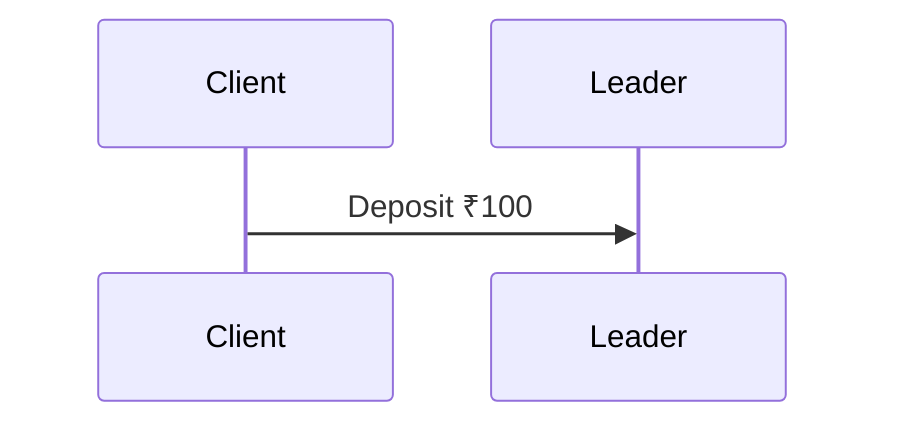
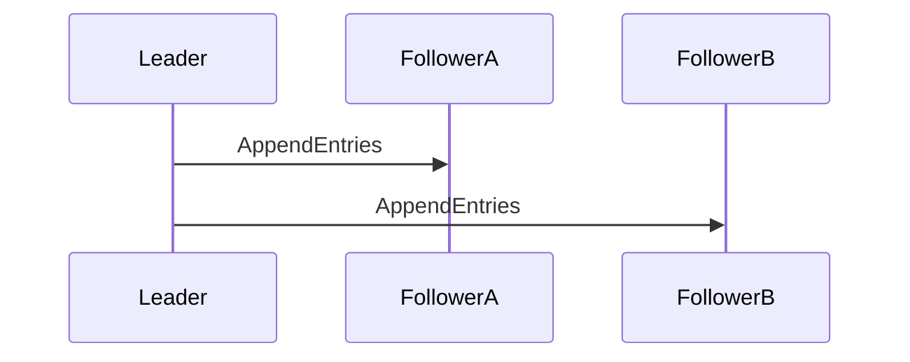
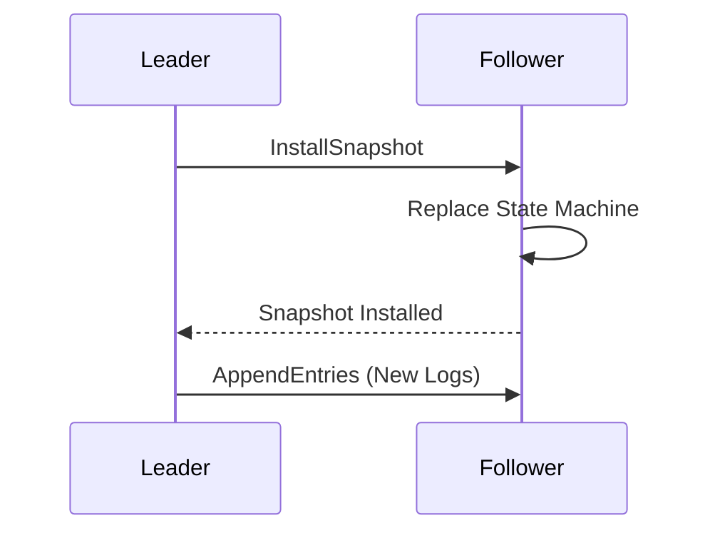

# Raft Consensus

> *"Leader Election chooses who is allowed to write. Raft Consensus ensures every replica eventually executes the exact same sequence of committed operations."*

---

# Table of Contents

1. Why Consensus Exists
2. Why Leader Election Alone Is Not Enough
3. Raft Architecture
4. Log Replication
5. Commit Process
6. Safety Guarantees
7. Production Examples

---

# Learning Objectives

After completing this chapter you should be able to:

- Explain consensus.
- Explain why leader election is insufficient.
- Explain Raft log replication.
- Explain committed vs replicated entries.
- Understand how production systems maintain identical state machines.

---

# Why Consensus Exists

Leader Election solves only one problem.

```
Who becomes Leader?
```

Consensus solves a different problem.

```
How does every replica agree on exactly the same history?
```

---

# Example

Suppose

Leader receives

```
Transfer ₹5000
```

Question

Should the Leader immediately reply

```
Success
```

No.

Followers may never receive the transaction.

If the Leader crashes,

the transaction disappears.

Consensus prevents this.

---

# Distributed State Machine

Raft models the cluster as

multiple copies

of

the same

State Machine.

Example

```text
Leader

Deposit ₹100

Withdraw ₹20

Transfer ₹50
```

Follower A

```text
Deposit ₹100

Withdraw ₹20

Transfer ₹50
```

Follower B

```text
Deposit ₹100

Withdraw ₹20

Transfer ₹50
```

Every replica

must execute

exactly

the same operations

in exactly

the same order.

---

# Why Order Matters

Suppose

Replica A executes

```
Deposit ₹100

Withdraw ₹50
```

Replica B executes

```
Withdraw ₹50

Deposit ₹100
```

Balances

may differ.

Ordering

is everything.

---

# Raft Architecture

Every node contains

```text
Persistent Storage

↓

Raft Log

↓

State Machine
```

Clients never modify

the State Machine directly.

Everything flows

through

the Raft Log.

---

# What Is the Raft Log?

Think of the log

as

an append-only journal.

Example

| Index | Term | Command |
|------:|-----:|---------|
| 1 | 1 | Create User |
| 2 | 1 | Deposit ₹100 |
| 3 | 2 | Withdraw ₹20 |
| 4 | 2 | Transfer ₹50 |

Every server

stores

this log.

---

# Log Entry

Each log entry contains

| Field | Purpose |
|---------|----------|
| Index | Position in log |
| Term | Election term when entry was created |
| Command | Client operation |

Example

```text
Index = 10

Term = 7

Command = Transfer ₹500
```

---

# Client Write Flow

Suppose

Client sends

```
Deposit ₹100
```



Leader

does **not**

immediately execute

the command.

Instead,

it first appends

the command

to its own log.

---

# Leader Log

Before

```text
1

2

3
```

After

```text
1

2

3

4 ← Deposit ₹100
```

Notice

the State Machine

has **not**

executed

the command yet.

---

# Why?

Appending

to the Leader's log

does not guarantee

followers

have received

the entry.

Leader crash

could still

lose

the operation.

---

# AppendEntries RPC

Leader now sends

AppendEntries

to followers.



Followers

append

the entry

to their own logs.

Still

not committed.

---

# Replicated ≠ Committed

This distinction is one of the most common interview questions.

Suppose

Leader

and

Follower A

contain

Entry 25.

Follower B

has not yet received it.

Question

Is Entry 25 committed?

Not necessarily.

Replication

only means

the entry exists.

Commitment

requires

additional conditions.

---

# Why This Distinction Matters

Suppose

Leader crashes

immediately

after replication.

If

the entry

was not committed,

the next Leader

may discard it.

Therefore

replication alone

is insufficient.

---

# Consensus Timeline

```text
Client Request

↓

Leader Log

↓

Follower Logs

↓

Majority Replication

↓

Commit

↓

Apply to State Machine

↓

Reply to Client
```

This ordering

is fundamental

to Raft.

---

# Mental Model

Imagine

five accountants.

A transaction

is written

into everyone's notebook.

Only after

most accountants

confirm

they recorded it

does

the company

officially process

the transaction.

Recording

is different

from

approving.

Exactly the same distinction exists between

Replication

and

Commitment.

---

# Principal Engineer Insight

> [!IMPORTANT]
>
> A replicated log entry is **not** necessarily a committed log entry.
>
> Many interview candidates confuse these concepts.
>
> Replication means "copied".
>
> Commitment means "guaranteed to survive future leader elections."

---

# Interview Conversation

**Interviewer**

The leader has replicated an entry to two followers.

Can it immediately apply the command?

---

**Weak Answer**

Yes.

---

**Principal Engineer Answer**

Not necessarily. Replication alone does not imply commitment. The leader must first determine whether the entry satisfies Raft's commit rules. Only committed entries are applied to the state machine. This distinction prevents commands from being executed and later rolled back if leadership changes.

---

# Common Interview Mistakes

> [!WARNING]
> Confusing replicated with committed.

---

> [!WARNING]
> Thinking followers execute commands immediately after replication.

---

> [!WARNING]
> Assuming client replies are sent immediately after appending to the leader log.

---

# Key Takeaways

- Leader Election selects a leader.
- Consensus ensures identical ordered history.
- All client operations enter the Raft log first.
- Replication copies entries.
- Commitment guarantees durability across future elections.
- Only committed entries are applied to the state machine.

---

# AppendEntries RPC Deep Dive

Leader Election decides **who** can accept writes.

AppendEntries determines **how those writes are safely replicated.**

This is the most frequently discussed RPC in Raft interviews.

---

# Two Responsibilities of AppendEntries

AppendEntries serves two purposes.

| Purpose | Description |
|----------|-------------|
| Heartbeats | Tell followers the leader is still alive |
| Log Replication | Copy log entries to followers |

Many engineers think AppendEntries is only for heartbeats.

That is incorrect.

Heartbeats are simply **AppendEntries with an empty list of log entries**.

---

# AppendEntries RPC Structure

Every AppendEntries request contains:

| Field | Purpose |
|---------|----------|
| Term | Leader's current term |
| LeaderId | Current leader |
| PrevLogIndex | Index immediately before new entries |
| PrevLogTerm | Term of PrevLogIndex |
| Entries | New log entries (may be empty) |
| LeaderCommit | Leader's current Commit Index |

Each field exists for a specific safety reason.

---

# Example Cluster

Suppose we have

```
Leader

Follower A

Follower B
```

Current Leader Log

| Index | Term | Command |
|------:|-----:|---------|
| 1 | 1 | Create User |
| 2 | 1 | Deposit ₹100 |
| 3 | 2 | Withdraw ₹20 |
| 4 | 3 | Transfer ₹500 |

Follower A

contains the same log.

Follower B

is missing

Entry 4.

---

# Client Issues New Request

Client sends

```
Deposit ₹200
```

Leader appends

```
Index = 5

Term = 3

Command = Deposit ₹200
```

Leader's log now becomes

| Index | Term | Command |
|------:|-----:|---------|
| 1 | 1 | Create User |
| 2 | 1 | Deposit ₹100 |
| 3 | 2 | Withdraw ₹20 |
| 4 | 3 | Transfer ₹500 |
| 5 | 3 | Deposit ₹200 |

Notice

Only the leader has Entry 5.

Followers do not.

---

# AppendEntries Request

Leader sends

```
Term = 3

PrevLogIndex = 4

PrevLogTerm = 3

Entries = [Index 5]

LeaderCommit = 3
```

to every follower.

---

# Why PrevLogIndex Exists

Question

Why doesn't the leader simply send

```
Entry 5
```

Because

followers

may already have

different histories.

The leader must verify

that both logs

match

before appending anything new.

---

# Log Matching Check

Follower receives

```
PrevLogIndex = 4

PrevLogTerm = 3
```

Follower checks

```
Do I also have

Index 4

with

Term 3?
```

If

Yes

↓

Append new entries.

If

No

↓

Reject request.

---

# Example Success

Leader

| Index | Term |
|------:|-----:|
| 1 | 1 |
| 2 | 1 |
| 3 | 2 |
| 4 | 3 |

Follower

| Index | Term |
|------:|-----:|
| 1 | 1 |
| 2 | 1 |
| 3 | 2 |
| 4 | 3 |

Logs match.

Follower appends

Entry 5.

---

# Example Failure

Leader

| Index | Term |
|------:|-----:|
| 1 | 1 |
| 2 | 1 |
| 3 | 2 |
| 4 | 3 |

Follower

| Index | Term |
|------:|-----:|
| 1 | 1 |
| 2 | 1 |
| 3 | 4 |

Leader expects

```
Index 3

↓

Term 2
```

Follower has

```
Index 3

↓

Term 4
```

Mismatch detected.

Follower rejects

AppendEntries.

---

# Why Reject?

If the follower accepted the new entry,

its log would contain

two incompatible histories.

Raft therefore refuses to append

until both logs share

the same prefix.

---

# AppendEntries Response

Follower replies

```
Success = true
```

or

```
Success = false
```

Leader uses this response

to determine

the follower's synchronization state.

---

# LeaderCommit

AppendEntries also carries

```
LeaderCommit
```

Example

```
LeaderCommit = 4
```

Follower compares

its own CommitIndex.

If

FollowerCommit

<

LeaderCommit

it advances

its CommitIndex

up to

the highest replicated entry.

This keeps committed history consistent across the cluster.

---

# Why Include LeaderCommit?

Imagine

Leader has already committed

Entry 4.

Follower

contains Entry 4

but does not know

it has been committed.

Without LeaderCommit,

Follower would never apply

the command

to its State Machine.

---

# AppendEntries Timeline

```text
Client Request

↓

Leader Appends Entry

↓

AppendEntries RPC

↓

Follower Validates PrevLogIndex

↓

Follower Appends Entry

↓

ACK
```

Notice

The entry is still

**not committed.**

Commitment happens only after

the leader determines

that a majority has replicated the entry.

---

# Principal Engineer Insight

> [!IMPORTANT]
>
> PrevLogIndex and PrevLogTerm are the foundation of Raft's Log Matching Property.
>
> They ensure that followers never append entries onto an inconsistent history.
>
> Without these fields, a cluster could silently diverge.

---

# Interview Conversation

**Interviewer**

Why does AppendEntries include both PrevLogIndex and PrevLogTerm?

---

**Weak Answer**

To compare logs.

---

**Principal Engineer Answer**

Raft must guarantee that all replicas share an identical log prefix before appending new entries. The follower therefore verifies that it contains the expected entry at PrevLogIndex with the matching term. If either check fails, the append is rejected. This preserves the Log Matching Property and prevents divergent histories.

---

# Common Interview Mistakes

> [!WARNING]
> Assuming AppendEntries always contains new log entries.

Heartbeats are AppendEntries with an empty Entries list.

---

> [!WARNING]
> Ignoring PrevLogTerm.

Both the index and term must match.

---

> [!WARNING]
> Confusing replication with commitment.

Appending an entry to followers does not immediately make it committed.

---

# Key Takeaways

- AppendEntries performs both heartbeats and log replication.
- Followers verify PrevLogIndex and PrevLogTerm before appending entries.
- Log mismatches are rejected to preserve a common history.
- LeaderCommit tells followers which entries are safe to apply.
- Successful replication is not the same as commitment.

---

# CommitIndex, MatchIndex and NextIndex

This section explains one of the most misunderstood parts of Raft.

Many engineers understand

- Leader Election
- AppendEntries
- Majority Voting

But cannot explain

- CommitIndex
- MatchIndex
- NextIndex

These three variables are the heart of Raft's replication algorithm.

Almost every Staff/Principal interview eventually reaches this topic.

---

# The Problem

Suppose

Leader has replicated

```
Entry 25
```

to some followers.

Question

**How does the Leader know it is now safe to commit Entry 25?**

The answer is

```
CommitIndex

MatchIndex

NextIndex
```

---

# Leader State

A Leader maintains additional information

for every follower.

```
Follower A

↓

NextIndex

MatchIndex
```

```
Follower B

↓

NextIndex

MatchIndex
```

```
Follower C

↓

NextIndex

MatchIndex
```

Followers

do NOT maintain these values.

Only the Leader does.

---

# CommitIndex

Definition

> The highest log entry known to be safely committed.

Think of it as

```
Everything before CommitIndex

↓

Guaranteed Durable
```

Example

```
CommitIndex = 42
```

Means

```
Entries

1...

42

↓

Committed
```

Entry

43

may still

be replicated

but

not committed.

---

# Why CommitIndex Exists

Suppose

Leader receives

```
Transfer ₹500
```

Leader appends

Entry

```
43
```

Followers receive it.

Question

Should Leader immediately execute

Transfer ₹500?

No.

Leader first waits

for

Majority Replication.

Only then

CommitIndex

moves

from

42

↓

43

---

# Visual Example

Initially

```
CommitIndex = 4
```

```
1

2

3

4

5
```

Only

```
1-4

Committed
```

Entry

5

is merely

replicated.

After

Majority ACK

```
CommitIndex

↓

5
```

Now

Entry

5

becomes committed.

---

# MatchIndex

Definition

> Highest log entry successfully replicated on a follower.

Example

Suppose

Leader has

```
100 Entries
```

Follower A

has replicated

```
95
```

Leader stores

```
MatchIndex[A]

=

95
```

Follower B

```
100
```

Leader stores

```
MatchIndex[B]

=

100
```

Follower C

```
92
```

Leader stores

```
MatchIndex[C]

=

92
```

---

# Why MatchIndex Exists

Leader must know

how far

every follower

has replicated.

Without MatchIndex

Leader cannot determine

whether

Majority

contains

Entry

100.

---

# Example

Five Servers

```
Leader

100
```

Follower A

```
100
```

Follower B

```
100
```

Follower C

```
95
```

Follower D

```
91
```

Leader computes

```
Entry 100

exists on

3 servers
```

Majority reached.

CommitIndex

becomes

100.

---

# NextIndex

Definition

> Next log entry the Leader should send to a follower.

Suppose

Leader

contains

```
100 Entries
```

Follower

contains

```
95 Entries
```

Leader stores

```
NextIndex

=

96
```

Meaning

Next AppendEntries

starts

from

Entry

96.

---

# Example

Leader Log

```
96

97

98

99

100
```

Follower

currently

```
95
```

Leader sends

```
96

97

98

99

100
```

Follower catches up.

---

# Why NextIndex Exists

Suppose

Follower crashes.

Later

it rejoins.

Leader

does NOT resend

entire log.

Leader starts

exactly

at

NextIndex.

Efficient.

---

# Relationship

These variables

are closely related.

```
MatchIndex

↓

Highest Replicated
```

```
NextIndex

↓

MatchIndex + 1
```

Normally

```
NextIndex

=

MatchIndex + 1
```

---

# Failure Example

Leader

contains

```
100 Entries
```

Follower

contains

```
80 Entries
```

Leader

initially assumes

```
NextIndex = 101
```

AppendEntries

fails.

Leader decreases

NextIndex.

```
100

↓

99

↓

98

↓

...

↓

81
```

Eventually

logs match.

Replication resumes.

---

# Why Not Binary Search?

Interview Question

Why does

Raft

decrement

NextIndex

instead of

binary searching?

Original Raft

prioritized

simplicity.

Many production implementations

optimize

this process

using conflict hints

or accelerated backtracking.

---

# Commit Rule

One of

the most important

Raft interview questions.

Question

When does

Leader

increase

CommitIndex?

Answer

Only when

both conditions

are true.

Condition 1

```
Majority

contains

Entry N
```

Condition 2

```
Entry N

belongs

to

Leader's Current Term.
```

Both

must hold.

---

# Why Current Term?

Suppose

Leader A

Term

```
5
```

replicated

Entry

50

to

only

two nodes.

Leader crashes.

Leader B

Term

```
6
```

wins.

Leader B

later

replicates

Entry

50

to

majority.

Question

Can Leader B

commit

Entry 50

immediately?

Surprisingly

No.

Raft waits

until

a current-term entry

is committed.

This guarantees

Leader Completeness.

---

# Why This Rule Exists

Without it

older

uncommitted entries

could become committed

incorrectly

after

leader changes.

The Current Term Rule

prevents

this subtle bug.

---

# State Machine Application

Once

CommitIndex

moves

forward

Leader

and

Followers

apply

all newly committed entries

to

their

State Machines.

Example

```
CommitIndex

40

↓

43
```

Entries

```
41

42

43
```

become

visible

to

applications.

---

# Timeline

```text
Client Request

↓

Leader Appends Entry

↓

AppendEntries

↓

Followers ACK

↓

MatchIndex Updated

↓

Majority Reached

↓

CommitIndex Updated

↓

Apply To State Machine

↓

Client Success
```

Notice

Client success

comes

AFTER

CommitIndex advances.

---

# Production Example

Suppose

Kubernetes creates

a Deployment.

```
API Server

↓

etcd Leader

↓

Followers

↓

Majority ACK

↓

CommitIndex Advances

↓

Deployment Visible
```

If

Leader crashes

before

CommitIndex advances,

the Deployment

may never appear.

Correctness

is preserved.

---

# Principal Engineer Insight

> [!IMPORTANT]
>
> The most important distinction in Raft is:
>
> - **NextIndex** answers *"What should I send next?"*
> - **MatchIndex** answers *"What has this follower already acknowledged?"*
> - **CommitIndex** answers *"What is now guaranteed to survive future leader elections?"*
>
> Confusing these three variables is one of the most common interview mistakes.

---

# Interview Conversation

**Interviewer**

Why can't the Leader simply commit an entry after one follower acknowledges it?

---

**Weak Answer**

Because majority is required.

---

**Principal Engineer Answer**

A single follower acknowledgement does not guarantee durability. If the leader and that follower both fail, the entry could be lost. The leader therefore tracks MatchIndex for every follower and advances CommitIndex only after confirming that a majority has replicated the entry. Additionally, Raft commits only current-term entries directly, ensuring Leader Completeness across elections.

---

# Common Interview Mistakes

> [!WARNING]
> Confusing MatchIndex with CommitIndex.

---

> [!WARNING]
> Thinking followers maintain NextIndex.

Only the Leader tracks NextIndex and MatchIndex.

---

> [!WARNING]
> Assuming replication automatically means commitment.

---

> [!WARNING]
> Forgetting the Current Term commit rule.

---

# Key Takeaways

- CommitIndex marks the highest committed log entry.
- MatchIndex records the highest replicated entry for each follower.
- NextIndex identifies the next log entry to send to a follower.
- The Leader advances CommitIndex only after a majority has replicated a current-term entry.
- Clients receive success only after the command is committed and applied to the state machine.

---

# Follower Catch-up, Log Repair and Snapshots

Leader Election ensures that only one node accepts writes.

Log Replication ensures followers receive new entries.

But production systems face a much harder problem.

> **What happens when a follower is offline for minutes, hours, or even days?**

Raft must safely bring that follower back into sync without corrupting the log.

This section explains how.

---

# The Problem

Suppose we have

```
Leader

Follower A

Follower B
```

Everything is healthy.

Leader contains

```
Entries

1 ... 100
```

Suddenly

Follower B crashes.

---

# Meanwhile...

Leader continues processing requests.

```
101

102

103

104

...

180
```

Follower B is offline.

When it returns,

its log looks like

```
1 ... 100
```

Question

How can it safely reach

```
180
```

without downloading the entire history?

---

# Leader's View

Leader maintains

```
NextIndex[B]

=

101
```

Meaning

Leader believes

Follower B

needs

Entry 101

next.

---

# First Attempt

Leader sends

```
AppendEntries

PrevLogIndex = 100

Entries

101...

180
```

Follower replies

```
Success
```

Follower catches up.

Easy case.

---

# Harder Problem

Suppose

Follower B

didn't simply miss entries.

Instead,

its log diverged.

Leader

```
98

99

100

101

102
```

Follower

```
98

99

100

150

151
```

Entries

150

and

151

came from

an old leader

that never committed them.

Now

histories differ.

---

# What Happens?

Leader sends

```
PrevLogIndex = 100

PrevLogTerm = 8
```

Follower checks

```
Index 100

↓

Matches
```

Leader sends

Entry

101.

Follower notices

it already has

Entry 101

but

with

a different Term.

Conflict detected.

---

# Conflict Resolution

Follower immediately rejects

AppendEntries.

Leader now knows

the logs

have diverged.

The Leader must repair

the follower.

---

# Log Repair Algorithm

Leader decreases

NextIndex.

Example

Initially

```
NextIndex

=

101
```

Failure.

Leader retries

```
100
```

Failure.

Retries

```
99
```

Eventually

Leader finds

the last matching entry.

Suppose

```
98
```

matches.

Replication resumes

from

99.

---

# Visual Example

Leader

```text
95

96

97

98

99

100

101

102
```

Follower

```text
95

96

97

98

150

151

152
```

Last common entry

```
98
```

Follower deletes

everything

after

98.

Leader sends

```
99

100

101

102
```

Follower becomes identical.

---

# Why Delete Entries?

Question

Why can't the follower keep

```
150

151

152
```

Answer

Those entries

were never committed.

Keeping them

would create

two different histories.

Raft guarantees

only one history.

---

# Fast Backtracking

The original Raft paper

decrements

NextIndex

one entry

at a time.

```
100

↓

99

↓

98

↓

97
```

Simple.

Correct.

But

slow.

---

# Production Optimization

Modern implementations

such as

etcd

optimize this process.

Follower returns

additional information

about the conflict.

Example

```
Conflict Term

=

7
```

```
First Index

of Term 7

=

45
```

Leader immediately jumps

to

Index

45

instead of

walking backwards

one entry

at a time.

This greatly reduces

network round trips.

---

# Why Snapshots Exist

Suppose

Leader has processed

```
20 Million Entries
```

A new follower joins.

Question

Should Leader send

20 million

log entries?

No.

That would take

hours.

Instead,

Raft creates

Snapshots.

---

# Snapshot

A Snapshot

represents

the current state

of the State Machine.

Instead of replaying

every operation,

Leader sends

the latest snapshot.

Example

Instead of

```text
Create User

Deposit

Withdraw

Transfer

...

20 Million Entries
```

Leader sends

```text
Current Account Balance

Current Users

Current Orders

Current Inventory
```

Follower starts

from

the latest state.

---

# Snapshot Timeline

```text
Millions of Log Entries

↓

Create Snapshot

↓

Delete Old Logs

↓

Keep Snapshot

↓

Continue Logging
```

---

# Log Compaction

Without snapshots,

the log grows forever.

```
1

2

3

...

100 Million
```

Storage

continues increasing.

Snapshots solve this.

Old committed entries

can safely

be discarded.

This process

is called

**Log Compaction**.

---

# InstallSnapshot RPC

Suppose

Follower

is extremely far behind.

Leader detects

```
NextIndex

<

Snapshot Index
```

Leader cannot

repair the follower

using

AppendEntries.

Instead,

Leader sends

```
InstallSnapshot
```

RPC.

---

# InstallSnapshot Flow



---

# Snapshot Metadata

Every snapshot stores

| Field | Purpose |
|---------|----------|
| Last Included Index | Highest log entry represented by the snapshot |
| Last Included Term | Term of that log entry |
| State Machine Data | Serialized application state |

This allows

normal log replication

to continue

after the snapshot.

---

# Example

Leader

```
Snapshot

↓

Index

5000
```

Follower

contains only

```
Index

1200
```

Leader sends

Snapshot.

Follower jumps

immediately

to

5000.

Only

entries

5001+

must now

be replicated.

---

# Production Example

Kubernetes

stores

cluster state

inside etcd.

Suppose

a new etcd node

joins

after being offline

for several hours.

Instead of replaying

millions of updates,

the Leader sends

a snapshot,

followed by

only the recent log entries.

Recovery

completes

within seconds.

---

# Snapshot vs Log Replay

| Technique | Best For |
|-----------|----------|
| AppendEntries | Followers slightly behind |
| Log Repair | Diverged logs |
| InstallSnapshot | Followers far behind |
| Log Compaction | Reducing storage usage |

---

# Principal Engineer Insight

> [!IMPORTANT]
>
> Snapshots are **not** a performance optimization.
>
> They are a scalability requirement.
>
> Without log compaction, every Raft cluster would eventually accumulate an unbounded log, making recovery slower and storage costs much higher.
>
> Production-grade Raft implementations therefore combine AppendEntries, conflict resolution, snapshots and log compaction to keep replication efficient over years of operation.

---

# Interview Conversation

**Interviewer**

Suppose a follower has been offline for three days.

How does Raft recover it?

---

**Weak Answer**

The leader sends the missing logs.

---

**Principal Engineer Answer**

The recovery strategy depends on how far behind the follower is. If the missing entries are still present in the leader's log, the leader repairs the follower using AppendEntries and the NextIndex mechanism. If the follower is so far behind that the required entries have already been compacted, the leader sends an InstallSnapshot RPC containing the latest state machine snapshot. After installing the snapshot, the follower receives only the remaining log entries beyond the snapshot index.

---

# Common Interview Mistakes

> [!WARNING]
> Assuming followers never delete log entries.

Followers delete conflicting, uncommitted entries during log repair.

---

> [!WARNING]
> Thinking snapshots replace consensus.

Snapshots optimize storage and recovery.

Consensus rules remain unchanged.

---

> [!WARNING]
> Assuming AppendEntries can always recover followers.

Very old followers require InstallSnapshot.

---

> [!WARNING]
> Believing log compaction changes committed history.

Only entries already represented in the snapshot are compacted.

---

# Key Takeaways

- Followers may fall behind because of crashes or network partitions.
- NextIndex helps leaders determine where replication should resume.
- Conflicting, uncommitted entries are deleted before new entries are appended.
- Modern Raft implementations optimize conflict resolution with fast backtracking.
- Snapshots capture the current state machine and prevent unbounded log growth.
- InstallSnapshot is used when a follower is too far behind for normal log replication.
- Log compaction is essential for long-running production clusters.

---

# Joint Consensus, Linearizable Reads and Production Optimizations

So far we have learned

- Leader Election
- Log Replication
- Commit Rules
- Follower Catch-up
- Snapshots

This section explains how production Raft implementations handle

- Cluster membership changes
- Read optimization
- Leader leases
- Multi-Raft
- Operational tuning

These topics are asked frequently in Staff and Principal Engineer interviews because they distinguish someone who has read the Raft paper from someone who has operated a distributed system in production.

---

# Problem 1

Suppose we have

```
5 Nodes

A

B

C

D

E
```

Now the cluster grows.

We want to add

```
Node F
```

Question

Can we simply update every server's configuration?

No.

---

# Why Not?

Suppose

Leader

updates

A

B

C

but crashes

before updating

D

E.

Now

different servers

believe

different cluster memberships exist.

One group believes

```
5 Nodes
```

Another believes

```
6 Nodes
```

Question

What is majority now?

Nobody agrees.

Consensus breaks.

---

# Membership Change

Changing cluster membership

is itself

a consensus problem.

Therefore

membership changes

must also

go through Raft.

---

# Joint Consensus

Raft solves this using

Joint Consensus.

Instead of switching

directly

from

Old Cluster

↓

New Cluster

Raft introduces

a temporary

Joint Configuration.

---

# Example

Old Configuration

```
A

B

C

D

E
```

New Configuration

```
A

B

C

D

E

F
```

Raft creates

```
Joint Configuration

A

B

C

D

E

F
```

Both

old

and

new

configurations

must agree.

---

# Why Joint Consensus Works

During the transition,

a log entry

must receive

a majority

from

both configurations.

Old Majority

```
3 of 5
```

New Majority

```
4 of 6
```

Only then

is the entry committed.

This guarantees

that every future leader

shares

at least one node

with every previous leader.

---

# Membership Timeline

```text
Old Configuration

↓

Joint Configuration

↓

New Configuration
```

There is never

a moment

where

two independent majorities

can exist.

---

# Why Is This Important?

Suppose

membership changed

without

Joint Consensus.

Old Leader

might continue

accepting writes.

New Leader

might also

accept writes.

Split Brain

becomes possible.

Joint Consensus

eliminates this risk.

---

# Read Requests

So far

we have focused

on writes.

Question

How should

reads

work?

Can followers

serve reads?

It depends.

---

# Option 1

Leader Reads

Every read

goes through

the Leader.

Advantages

- Linearizable
- Always latest data

Disadvantages

- Leader becomes bottleneck

---

# Option 2

Follower Reads

Followers

serve reads.

Advantages

- Excellent scalability

Disadvantages

- May return stale data

---

# The Challenge

Suppose

Leader

commits

```
Balance = ₹1000
```

Follower

has not yet

received

the latest entry.

Client reads

from follower.

Result

```
₹800
```

Incorrect.

---

# Linearizable Reads

Raft supports

Linearizable Reads.

Definition

> Every read behaves as if it occurred after all previously committed writes.

This is the strongest read guarantee.

---

# ReadIndex

Question

Must every read

append

a new log entry?

No.

That would be expensive.

Instead,

Raft introduces

ReadIndex.

---

# How ReadIndex Works

Leader first verifies

it is still

the Leader.

How?

By communicating

with

a majority

of followers.

Once confirmed,

Leader safely serves

the read

without

adding

a new log entry.

---

# ReadIndex Flow

```text
Client Read

↓

Leader

↓

Majority Confirmation

↓

ReadIndex

↓

Serve Read
```

No log entry

is created.

---

# Why ReadIndex Exists

Suppose

Leader

became isolated.

It still believes

it is Leader.

Meanwhile

another Leader

has already been elected.

Without verification,

the old Leader

could return

stale data.

ReadIndex

prevents this.

---

# Leader Lease

ReadIndex

still requires

network communication.

Question

Can we make reads faster?

Yes.

Leader Lease.

---

# Leader Lease

Suppose

Leader recently

communicated

with

a majority.

Leader assumes

for

a short period

that

no other Leader

can exist.

This period

is called

Leader Lease.

During the lease,

Leader serves

reads immediately.

No quorum round-trip.

---

# Leader Lease Example

```text
Heartbeat

↓

Lease Starts

↓

Client Read

↓

Immediate Response

↓

Lease Expires

↓

Need Majority Check
```

Leader Lease

significantly reduces

read latency.

---

# Trade-off

Leader Lease

depends on

reasonably accurate clocks.

If clocks

drift excessively,

leases become unsafe.

This is why

clock synchronization

remains operationally important,

even though

Raft correctness

does not rely

on perfectly synchronized clocks.

---

# Multi-Raft

Large systems

rarely run

a single

Raft group.

Imagine

CockroachDB.

Millions of keys.

Running

one global

Raft group

would create

one bottleneck.

Instead,

data is partitioned.

Each partition

has

its own

Raft group.

---

# Example

```text
Users Table

↓

Range 1

↓

Raft Group A
```

```text
Orders Table

↓

Range 2

↓

Raft Group B
```

```text
Payments

↓

Range 3

↓

Raft Group C
```

Thousands

of Raft groups

run independently.

---

# Benefits of Multi-Raft

- Horizontal scalability
- Independent leaders
- Parallel replication
- Better CPU utilization
- Better fault isolation

Almost every modern distributed SQL database

uses

Multi-Raft.

---

# Production Systems

| System | Uses Multi-Raft |
|---------|-----------------|
| CockroachDB | Yes |
| TiKV | Yes |
| YugabyteDB | Yes |
| etcd | No (Single Group) |
| Consul | Primarily Single Group |

---

# Operational Tuning

Principal Engineers

rarely modify

the Raft algorithm.

They tune

its operational parameters.

Important settings include

| Parameter | Effect |
|------------|--------|
| Heartbeat Interval | Failure detection speed |
| Election Timeout | Leader stability |
| Snapshot Interval | Storage usage |
| Maximum Log Size | Recovery time |
| Replication Batch Size | Network efficiency |
| Proposal Queue Size | Throughput |

---

# Common Production Problems

## Frequent Elections

Possible causes

- Network packet loss
- GC pauses
- CPU starvation
- Election timeout too low

---

## Large Replication Lag

Possible causes

- Slow disk
- Slow network
- Snapshot transfer
- Backpressure

---

## High Read Latency

Possible causes

- Excessive ReadIndex requests
- Cross-region quorum
- Leader overload

Leader Lease

may help.

---

# Architecture Review Exercise

Suppose

another team proposes

```
Followers

serve

all reads.
```

Questions

- Are stale reads acceptable?
- Is linearizability required?
- Should ReadIndex be used?
- Can Leader Lease reduce latency?
- What are the business requirements?

A Principal Engineer

starts

with business guarantees,

not implementation details.

---

# Principal Engineer Insight

> [!IMPORTANT]
>
> Production Raft is much more than leader election and log replication.
>
> Real systems must handle:
>
> - Dynamic membership
> - Efficient reads
> - Fast recovery
> - Partitioned data
> - Operational tuning
>
> Understanding these production concerns is what separates implementation knowledge from architectural expertise.

---

# Interview Conversation

**Interviewer**

How can Raft add a new server without risking Split Brain?

---

**Weak Answer**

It updates the configuration.

---

**Principal Engineer Answer**

Cluster membership changes are replicated through the Raft log using Joint Consensus. During the transition, entries must be acknowledged by majorities of both the old and new configurations. This guarantees quorum intersection across the configuration change and prevents multiple leaders from emerging due to inconsistent membership views.

---

# Common Interview Mistakes

> [!WARNING]
> Assuming cluster membership can be updated outside the Raft log.

---

> [!WARNING]
> Thinking ReadIndex creates log entries.

It only verifies leadership before serving a read.

---

> [!WARNING]
> Assuming Leader Lease is always safe.

Its correctness depends on bounded clock drift and timely communication.

---

> [!WARNING]
> Believing one Raft group manages an entire distributed SQL database.

Modern databases partition data into many independent Raft groups.

---

# Key Takeaways

- Joint Consensus safely changes cluster membership.
- Both old and new configurations participate during transitions.
- ReadIndex provides linearizable reads without creating log entries.
- Leader Lease reduces read latency by avoiding quorum checks for a short interval.
- Multi-Raft enables horizontal scalability by assigning independent Raft groups to partitions.
- Production tuning focuses on timeouts, batching, snapshots and replication efficiency.
