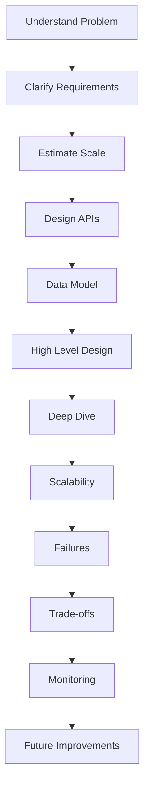
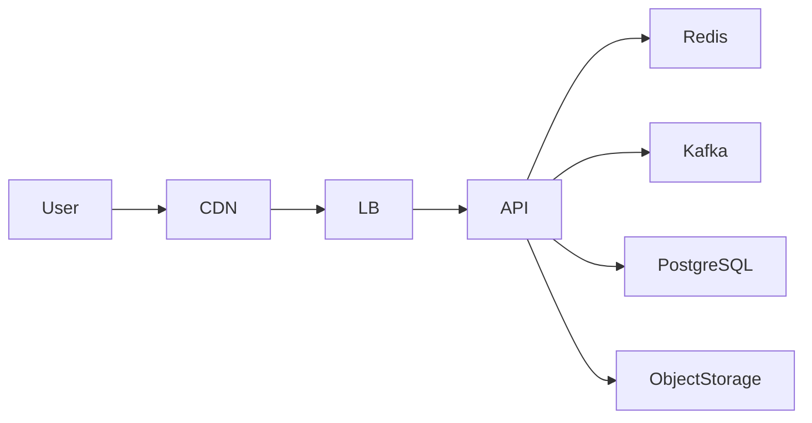

# Principal Engineer System Design Checklist

> "The difference between a Senior Engineer and a Principal Engineer is rarely technical knowledge. It is the ability to make sound engineering decisions, communicate clearly, and anticipate future challenges."

---

# Why This Checklist Matters

This chapter serves as a reusable checklist for every High-Level Design interview.

Before finishing any design, walk through every item in this document.

Doing so ensures that your solution is complete, well-reasoned, and production ready.

---

# Interview Flow

Use this sequence for every interview.



---

# 1. Requirements

Before discussing architecture verify:

- Functional requirements collected
- Non-functional requirements identified
- Scope defined
- Out-of-scope items clarified
- Assumptions documented

Never assume requirements.

Always ask.

---

# 2. Capacity Estimation

Estimate:

- Daily Active Users
- Peak Concurrent Users
- Read QPS
- Write QPS
- Storage Growth
- Bandwidth
- Cache Size
- Number of Servers

Always explain your assumptions.

---

# 3. API Design

Verify:

- Resource-oriented APIs
- Correct HTTP methods
- Authentication
- Authorization
- Idempotency
- Pagination
- Versioning
- Error handling

---

# 4. Data Model

Identify:

- Core entities
- Relationships
- Indexes
- Access patterns
- Hot partitions
- Data retention

---

# 5. High-Level Architecture

Ensure the design contains:

- Load Balancer
- API Gateway (if required)
- Application Layer
- Cache
- Database
- Message Broker
- Object Storage
- CDN (if applicable)

Example



---

# 6. Scalability

Verify:

- Stateless services
- Horizontal scaling
- Read replicas
- Cache
- Sharding
- Partitioning
- Auto scaling

Always identify the current bottleneck before proposing scaling strategies.

---

# 7. Reliability

Discuss:

- Retry
- Timeout
- Circuit Breaker
- Bulkhead
- Dead Letter Queue
- Disaster Recovery

Ask yourself:

> What happens if this component fails?

---

# 8. Consistency

Explain:

- Strong vs Eventual consistency
- Read-after-write
- Quorum (if applicable)
- Replication lag
- Conflict resolution

Choose the consistency model based on business requirements.

---

# 9. Security

Review:

- Authentication
- Authorization
- Encryption in transit
- Encryption at rest
- Secrets management
- Rate limiting
- Input validation
- Audit logging

---

# 10. Observability

Every production system should expose:

- Metrics
- Logs
- Traces
- Dashboards
- Alerts

Examples

Metrics

- QPS
- Latency
- Error Rate
- CPU
- Memory
- Cache Hit Ratio

---

# 11. Operations

Discuss:

- Deployment strategy
- Blue-Green Deployment
- Canary Release
- Rollback
- Feature Flags

---

# 12. Cost

Always ask:

Can we reduce infrastructure cost without violating requirements?

Examples

- Smaller cache
- Fewer replicas
- Reserved instances
- Tiered storage

---

# 13. Trade-offs

Every major decision should answer:

Why this solution?

What alternatives exist?

What are the disadvantages?

What assumptions are being made?

---

# 14. Future Evolution

How does the system evolve?

Example

```
Single Server

↓

Load Balancer

↓

Cache

↓

Read Replicas

↓

Sharding

↓

Multi Region
```

Show incremental evolution.

---

# Interview Communication

Weak

> I'll use Kafka.

Strong

> The notification workflow is asynchronous and does not require immediate user feedback. Kafka provides durable event storage, consumer scalability, and retry capabilities. The trade-off is eventual consistency and additional operational complexity, both of which are acceptable for this use case.

---

# Principal Engineer Mental Checklist

Before ending the interview ask yourself:

- Did I clarify requirements?
- Did I estimate scale?
- Did I explain assumptions?
- Did I justify every technology?
- Did I discuss failures?
- Did I explain trade-offs?
- Did I discuss observability?
- Did I consider operational complexity?
- Did I explain future evolution?

If the answer to all is **Yes**, you've covered the majority of what interviewers expect.

---

# One-Page Cheat Sheet

| Area | Verify |
|-------|--------|
| Requirements | ✅ |
| Capacity Estimation | ✅ |
| APIs | ✅ |
| Data Model | ✅ |
| Architecture | ✅ |
| Scalability | ✅ |
| Reliability | ✅ |
| Consistency | ✅ |
| Security | ✅ |
| Monitoring | ✅ |
| Deployment | ✅ |
| Cost | ✅ |
| Trade-offs | ✅ |
| Future Evolution | ✅ |

---

# Final Thoughts

A Principal Engineer interview is not about remembering architectures.

It is about demonstrating a repeatable engineering process.

Use this checklist before every mock interview and before every real interview.

Over time, it will become second nature.

---

# References

- Designing Data-Intensive Applications — Martin Kleppmann
- Building Microservices — Sam Newman
- Site Reliability Engineering — Google
- Release It! — Michael T. Nygard
